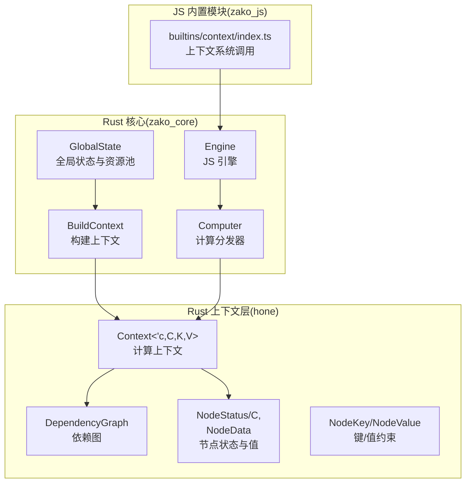
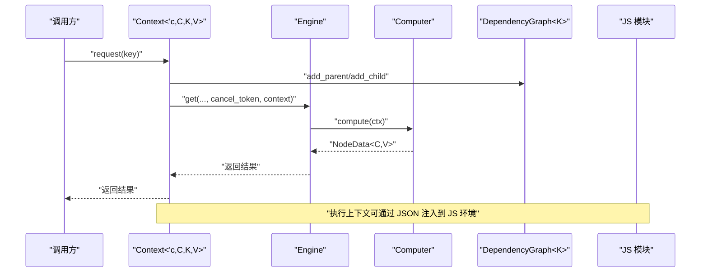
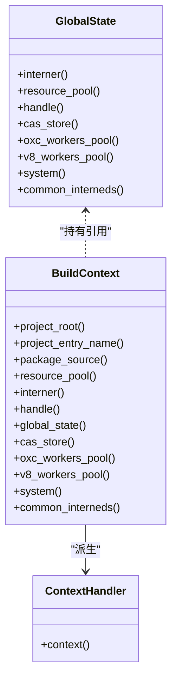
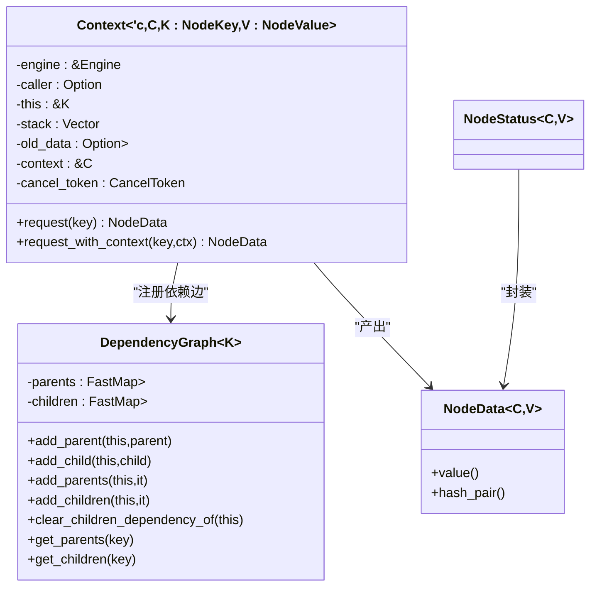
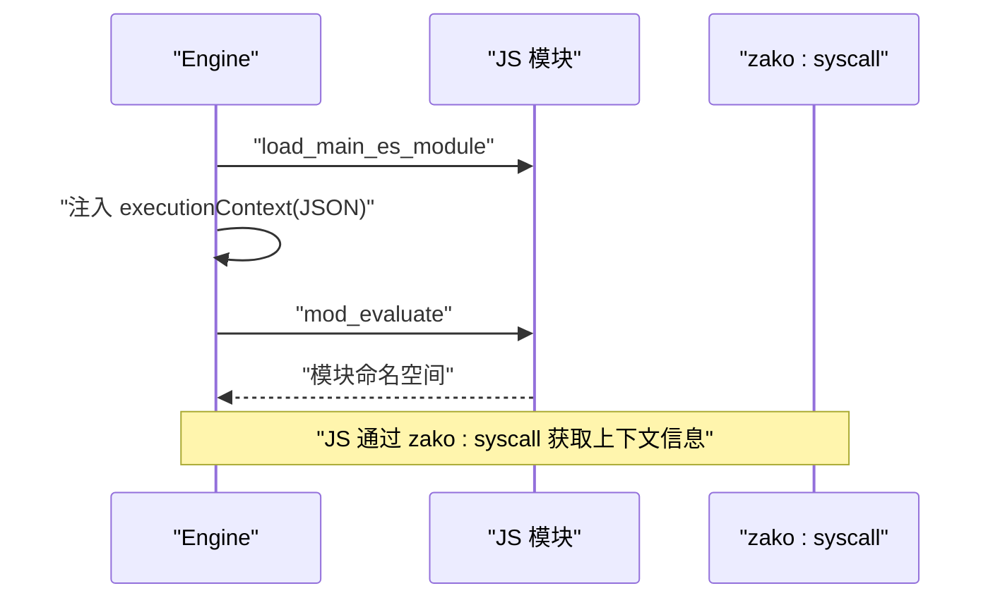
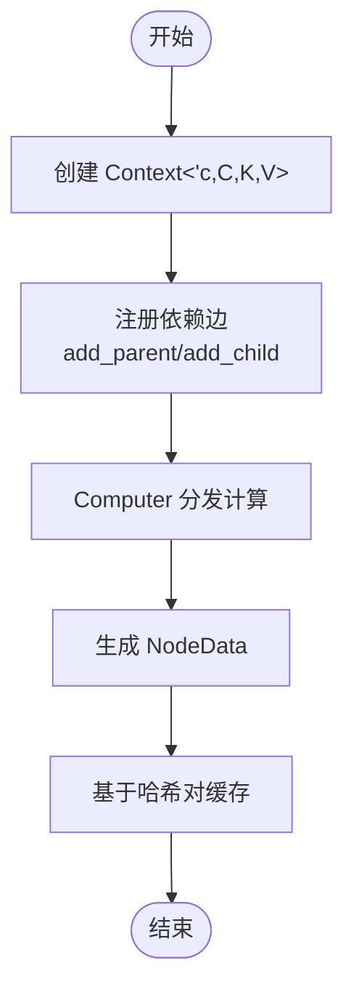
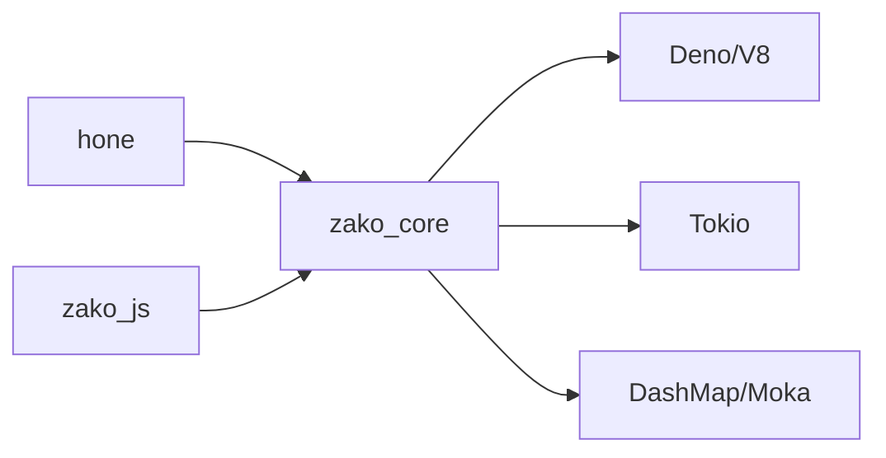

# 上下文管理

<cite>
**本文引用的文件**
- [hone/src/context.rs](file://hone/src/context.rs)
- [hone/src/dependency.rs](file://hone/src/dependency.rs)
- [hone/src/status.rs](file://hone/src/status.rs)
- [hone/src/node.rs](file://hone/src/node.rs)
- [zako_core/src/context.rs](file://zako_core/src/context.rs)
- [zako_core/src/global_state.rs](file://zako_core/src/global_state.rs)
- [zako_core/src/computer.rs](file://zako_core/src/computer.rs)
- [zako_core/src/engine.rs](file://zako_core/src/engine.rs)
- [zako_js/src/builtins/context/index.ts](file://zako_js/src/builtins/context/index.ts)
- [zako_core/src/lib.rs](file://zako_core/src/lib.rs)
</cite>

## 目录
1. [引言](#引言)
2. [项目结构](#项目结构)
3. [核心组件](#核心组件)
4. [架构总览](#架构总览)
5. [组件详解](#组件详解)
6. [依赖关系分析](#依赖关系分析)
7. [性能考量](#性能考量)
8. [故障排查指南](#故障排查指南)
9. [结论](#结论)
10. [附录](#附录)

## 引言
本文件系统性阐述 Zako 的上下文管理系统，聚焦以下主题：
- 上下文的创建、管理与销毁机制
- 全局状态协调、上下文隔离与资源共享策略
- 上下文生命周期管理、状态持久化与恢复机制
- 上下文间通信、数据传递与同步机制
- 安全边界、权限控制与访问限制
- 使用模式与最佳实践（以路径引用代替直接代码）

本说明面向初学者与资深开发者，既提供高层概览，也给出深入到代码级别的分析与可视化。

## 项目结构
Zako 的上下文体系横跨 Rust 核心库与 JS 执行引擎两部分：
- Rust 层：定义上下文类型、计算接口、依赖图与节点状态；提供全局状态与资源池；承载 JS 引擎初始化与执行。
- JS 层：通过内置模块暴露上下文相关系统调用，供构建脚本与规则使用。

图表来源
- [zako_core/src/global_state.rs](file://zako_core/src/global_state.rs#L41-L96)
- [zako_core/src/context.rs](file://zako_core/src/context.rs#L34-L183)
- [zako_core/src/engine.rs](file://zako_core/src/engine.rs#L34-L79)
- [zako_core/src/computer.rs](file://zako_core/src/computer.rs#L16-L76)
- [hone/src/context.rs](file://hone/src/context.rs#L24-L32)
- [hone/src/dependency.rs](file://hone/src/dependency.rs#L4-L28)
- [hone/src/status.rs](file://hone/src/status.rs#L16-L69)
- [hone/src/node.rs](file://hone/src/node.rs#L38-L60)
- [zako_js/src/builtins/context/index.ts](file://zako_js/src/builtins/context/index.ts#L1-L16)

章节来源
- [zako_core/src/lib.rs](file://zako_core/src/lib.rs#L14-L28)

## 核心组件
- 构建上下文 BuildContext：无状态、可克隆，封装项目根、入口名、包源与全局状态引用，提供资源池、CAS 存储、工作池等访问器。
- 上下文处理器 ContextHandler：对 BuildContext 的轻量包装，便于按需传递与比较。
- 全局状态 GlobalState：集中持有 Interner、资源池、Tokio 运行时、CAS 存储、V8/OXC 工作池与通用字符串常量。
- 计算上下文 Context<'c,C,K,V>：携带引擎引用、调用者、当前键、调用栈、旧数据、上下文对象与取消令牌，提供请求依赖的能力。
- 依赖图 DependencyGraph<K>：维护父子节点关系，支持添加边、清空子依赖、查询父子集合。
- 节点状态 NodeStatus 与节点数据 NodeData：抽象节点的计算状态（未可达/计算中/已验证/脏/失败）与带哈希对的值容器。
- 计算器 Computer：根据键类型分派到具体计算函数，产出 NodeData。
- JS 引擎 Engine：基于 Deno/V8 初始化扩展与模块加载器，支持模块执行与 JSON 输入注入。

章节来源
- [zako_core/src/context.rs](file://zako_core/src/context.rs#L34-L183)
- [zako_core/src/global_state.rs](file://zako_core/src/global_state.rs#L41-L96)
- [hone/src/context.rs](file://hone/src/context.rs#L24-L32)
- [hone/src/dependency.rs](file://hone/src/dependency.rs#L4-L28)
- [hone/src/status.rs](file://hone/src/status.rs#L16-L69)
- [zako_core/src/computer.rs](file://zako_core/src/computer.rs#L16-L76)
- [zako_core/src/engine.rs](file://zako_core/src/engine.rs#L34-L79)

## 架构总览
Zako 的上下文管理采用“Rust 核心 + JS 扩展”的双层架构：
- Rust 层负责全局状态、资源调度、计算分发与 JS 引擎生命周期管理。
- JS 层通过内置模块暴露系统调用，读取执行上下文并驱动构建流程。

图表来源
- [hone/src/context.rs](file://hone/src/context.rs#L93-L150)
- [zako_core/src/engine.rs](file://zako_core/src/engine.rs#L81-L166)
- [zako_core/src/computer.rs](file://zako_core/src/computer.rs#L24-L76)
- [hone/src/dependency.rs](file://hone/src/dependency.rs#L18-L28)

## 组件详解

### 构建上下文与全局状态
- BuildContext
  - 作用：封装项目级上下文信息（根路径、入口名、包源），并持有全局状态引用，提供统一的资源访问入口。
  - 关键能力：构造、克隆、派生 ContextHandler、访问 Tokio 句柄、CAS 存储、工作池、Interner、系统信息等。
- GlobalState
  - 作用：集中管理全局资源（Interner、资源池、Tokio 运行时、CAS 存储、V8/OXC 工作池），并提供公共字符串常量。
  - 生命周期：在系统启动时初始化，随进程存在；通过 Arc 共享，避免重复创建。
- ContextHandler
  - 作用：对 BuildContext 的轻量包装，便于在不同模块间传递与比较。

图表来源
- [zako_core/src/global_state.rs](file://zako_core/src/global_state.rs#L41-L151)
- [zako_core/src/context.rs](file://zako_core/src/context.rs#L34-L183)
- [zako_core/src/context.rs](file://zako_core/src/context.rs#L185-L198)

章节来源
- [zako_core/src/context.rs](file://zako_core/src/context.rs#L34-L183)
- [zako_core/src/global_state.rs](file://zako_core/src/global_state.rs#L41-L151)

### 计算上下文与依赖图
- Context<'c,C,K,V>
  - 作用：在一次计算中携带引擎、调用者、当前键、调用栈、旧数据、上下文对象与取消令牌。
  - 关键方法：request/request_with_context，用于动态注册依赖边并发起异步计算；包含环检测与取消检查。
- DependencyGraph<K>
  - 作用：维护节点的父子依赖关系，支持添加父子边、批量添加、清空子依赖、查询集合。
- NodeStatus 与 NodeData
  - 作用：抽象节点状态（未可达/计算中/已验证/脏/失败）与带输入输出哈希对的值容器，支撑缓存与增量计算。

图表来源
- [hone/src/context.rs](file://hone/src/context.rs#L24-L32)
- [hone/src/context.rs](file://hone/src/context.rs#L93-L150)
- [hone/src/dependency.rs](file://hone/src/dependency.rs#L4-L62)
- [hone/src/status.rs](file://hone/src/status.rs#L16-L69)

章节来源
- [hone/src/context.rs](file://hone/src/context.rs#L24-L32)
- [hone/src/context.rs](file://hone/src/context.rs#L93-L150)
- [hone/src/dependency.rs](file://hone/src/dependency.rs#L4-L62)
- [hone/src/status.rs](file://hone/src/status.rs#L16-L69)

### 计算分发与 JS 执行
- Computer
  - 作用：根据当前键类型分派到具体计算函数（如文件解析、包解析、TS 转译、标签解析等），产出对应 NodeData。
- Engine
  - 作用：初始化 V8 平台与扩展，配置模块加载器，支持模块加载、评估与事件循环；提供 JSON 输入注入到 JS 全局上下文的能力。
- JS 内置上下文
  - 作用：通过 zako:syscall 暴露系统调用，读取执行上下文名称等，供构建脚本使用。

图表来源
- [zako_core/src/engine.rs](file://zako_core/src/engine.rs#L81-L166)
- [zako_js/src/builtins/context/index.ts](file://zako_js/src/builtins/context/index.ts#L1-L16)

章节来源
- [zako_core/src/computer.rs](file://zako_core/src/computer.rs#L24-L76)
- [zako_core/src/engine.rs](file://zako_core/src/engine.rs#L81-L166)
- [zako_js/src/builtins/context/index.ts](file://zako_js/src/builtins/context/index.ts#L1-L16)

### 生命周期与状态持久化/恢复
- 生命周期
  - 创建：由 BuildContext 或其派生 ContextHandler 提供；GlobalState 在进程启动时初始化。
  - 管理：Context 在单次计算中短暂存在，依赖图与节点状态在内存中维护；Engine 作为单线程运行时持有 JSRuntime。
  - 销毁：Engine 与 GlobalState 随进程结束释放；Context 随任务结束自动失效。
- 状态持久化与恢复
  - 节点值通过 NodeData 包裹并携带输入/输出哈希对，可用于缓存与增量复用；依赖图记录父子关系，支持清理与重建。
  - 建议：在需要跨进程或跨会话保留时，结合 CAS 存储与序列化工具进行持久化；当前仓库未提供直接持久化 API，可参考 NodeData 的哈希对与 NodeKey 的持久化约束。

图表来源
- [hone/src/context.rs](file://hone/src/context.rs#L114-L139)
- [hone/src/dependency.rs](file://hone/src/dependency.rs#L18-L28)
- [hone/src/status.rs](file://hone/src/status.rs#L16-L52)
- [zako_core/src/computer.rs](file://zako_core/src/computer.rs#L24-L76)

章节来源
- [hone/src/status.rs](file://hone/src/status.rs#L16-L52)
- [hone/src/dependency.rs](file://hone/src/dependency.rs#L4-L62)
- [zako_core/src/computer.rs](file://zako_core/src/computer.rs#L24-L76)

### 上下文隔离与资源共享
- 隔离
  - Context 仅在单次计算中有效，避免跨调用共享状态；Engine 限定为单线程运行时，减少并发竞争。
- 共享资源
  - GlobalState 通过 Arc 共享给所有上下文；资源池、Tokio 运行时、CAS 存储、工作池均在全局可见。
- 访问控制
  - 通过 BuildContext 的只读访问器与 ContextHandler 的比较逻辑，确保资源访问受控且可追踪。

章节来源
- [zako_core/src/global_state.rs](file://zako_core/src/global_state.rs#L41-L151)
- [zako_core/src/context.rs](file://zako_core/src/context.rs#L185-L222)
- [zako_core/src/engine.rs](file://zako_core/src/engine.rs#L34-L45)

### 上下文间通信、数据传递与同步
- 通信方式
  - 通过依赖图建立节点间依赖关系，实现自顶向下的数据流；JS 层通过 zako:syscall 读取上下文信息。
- 数据传递
  - 计算结果以 NodeData 形式传递；JSON 输入可通过 Engine 注入到 JS 全局 executionContext。
- 同步机制
  - 计算状态通过 NodeStatus 表达；通知器 Notify 用于等待计算完成；取消令牌用于中断长耗时操作。

章节来源
- [hone/src/status.rs](file://hone/src/status.rs#L63-L113)
- [zako_core/src/engine.rs](file://zako_core/src/engine.rs#L111-L166)
- [zako_js/src/builtins/context/index.ts](file://zako_js/src/builtins/context/index.ts#L1-L16)

### 安全边界、权限控制与访问限制
- 安全边界
  - JS 执行在受限的 V8 环境中进行，扩展与模块加载器提供沙箱能力；Engine 初始化时设置平台与扩展。
- 权限控制
  - 通过内置模块与系统调用接口限制 JS 对系统资源的直接访问；JS 仅能通过受控接口读取上下文信息。
- 访问限制
  - Context 中的取消令牌与环检测防止恶意递归与长时间占用；依赖图的父子关系有助于避免循环依赖。

章节来源
- [zako_core/src/engine.rs](file://zako_core/src/engine.rs#L48-L79)
- [hone/src/context.rs](file://hone/src/context.rs#L98-L129)
- [hone/src/dependency.rs](file://hone/src/dependency.rs#L18-L28)

### 使用模式与最佳实践
- 创建上下文
  - 使用 BuildContext.new 或从 ConfiguredPackage 派生；通过 ContextHandler 管理上下文实例。
- 发起计算
  - 使用 Context.request 或 request_with_context 注册依赖并发起异步计算；注意取消令牌与环检测。
- 管理资源
  - 优先通过 GlobalState 提供的资源池与工作池；避免在上下文中自行创建昂贵资源。
- JS 集成
  - 在 JS 中通过 zako:syscall 读取上下文信息；必要时通过 Engine 的 JSON 注入功能传递数据。

章节来源
- [zako_core/src/context.rs](file://zako_core/src/context.rs#L59-L183)
- [hone/src/context.rs](file://hone/src/context.rs#L93-L150)
- [zako_core/src/engine.rs](file://zako_core/src/engine.rs#L111-L166)
- [zako_js/src/builtins/context/index.ts](file://zako_js/src/builtins/context/index.ts#L1-L16)

## 依赖关系分析
- 模块耦合
  - zako_core 依赖 hone 提供的上下文与状态抽象；Engine 依赖内置扩展与模块加载器；Computer 依赖 compute 子模块。
- 外部依赖
  - V8/Deno、Tokio、DashMap、Moka 等；通过 Cargo.toml 管理版本与特性。
- 循环依赖
  - 当前设计通过接口与泛型参数避免直接循环；Context 与 Engine 之间为单向依赖。

图表来源
- [zako_core/src/lib.rs](file://zako_core/src/lib.rs#L35-L80)
- [zako_core/src/engine.rs](file://zako_core/src/engine.rs#L48-L79)

章节来源
- [zako_core/src/lib.rs](file://zako_core/src/lib.rs#L35-L80)

## 性能考量
- 并发与调度
  - GlobalState 初始化多线程 Tokio 运行时，线程数与栈大小依据系统资源估算；建议在高并发场景下合理配置资源池。
- 缓存与增量
  - NodeData 携带输入/输出哈希对，适合做缓存键；依赖图支持快速查询父子关系，利于增量计算。
- I/O 与工作池
  - OXC/V8 工作池在 GlobalState 初始化时启动，建议根据 CPU 核心数与任务特征调整配置。

章节来源
- [zako_core/src/global_state.rs](file://zako_core/src/global_state.rs#L56-L96)
- [hone/src/status.rs](file://hone/src/status.rs#L16-L52)
- [zako_core/src/context.rs](file://zako_core/src/context.rs#L162-L170)

## 故障排查指南
- 取消与超时
  - 若计算被取消，Context 会在准备阶段检查取消令牌并返回错误；检查取消原因与触发条件。
- 环检测
  - 若出现循环依赖，Context 会在请求时检测调用栈并返回环检测错误；检查依赖图与调用链。
- JS 执行异常
  - Engine 在执行模块时可能抛出 V8 异常；通过错误转换与日志定位问题；确认模块加载与 JSON 注入是否正确。
- 资源不足
  - 若工作池或 Tokio 线程不足，可能导致阻塞；检查 GlobalState 的初始化参数与系统资源。

章节来源
- [hone/src/context.rs](file://hone/src/context.rs#L98-L129)
- [zako_core/src/engine.rs](file://zako_core/src/engine.rs#L24-L31)
- [zako_core/src/engine.rs](file://zako_core/src/engine.rs#L217-L227)

## 结论
Zako 的上下文管理体系通过“无状态的构建上下文 + 有状态的计算上下文 + 全局状态与资源池”的组合，实现了清晰的隔离与高效的资源共享。配合依赖图与节点状态，系统支持增量计算与缓存；通过 JS 引擎与内置模块，提供了可控的脚本执行环境。遵循本文的最佳实践与故障排查建议，可在保证安全的前提下高效地构建复杂工程。

## 附录
- 相关文件路径
  - 构建上下文与全局状态：[zako_core/src/context.rs](file://zako_core/src/context.rs#L34-L183)，[zako_core/src/global_state.rs](file://zako_core/src/global_state.rs#L41-L151)
  - 计算上下文与依赖图：[hone/src/context.rs](file://hone/src/context.rs#L24-L32)，[hone/src/dependency.rs](file://hone/src/dependency.rs#L4-L62)
  - 节点状态与值：[hone/src/status.rs](file://hone/src/status.rs#L16-L69)
  - 计算分发与 JS 执行：[zako_core/src/computer.rs](file://zako_core/src/computer.rs#L24-L76)，[zako_core/src/engine.rs](file://zako_core/src/engine.rs#L81-L166)
  - JS 内置上下文：[zako_js/src/builtins/context/index.ts](file://zako_js/src/builtins/context/index.ts#L1-L16)