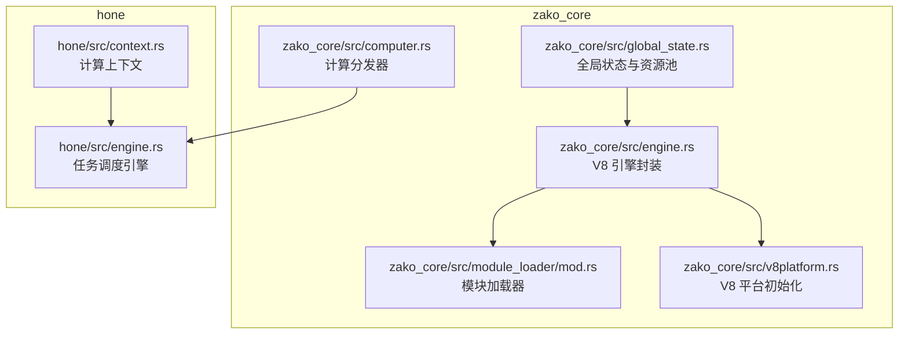
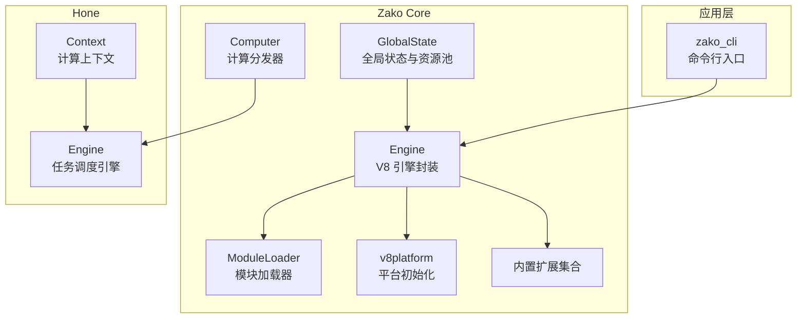
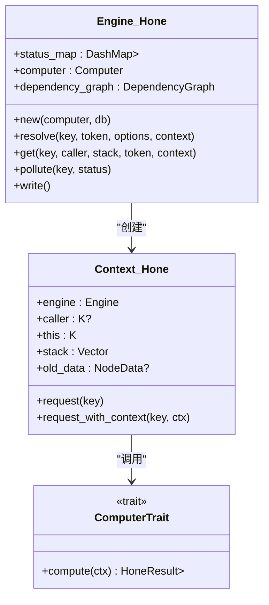
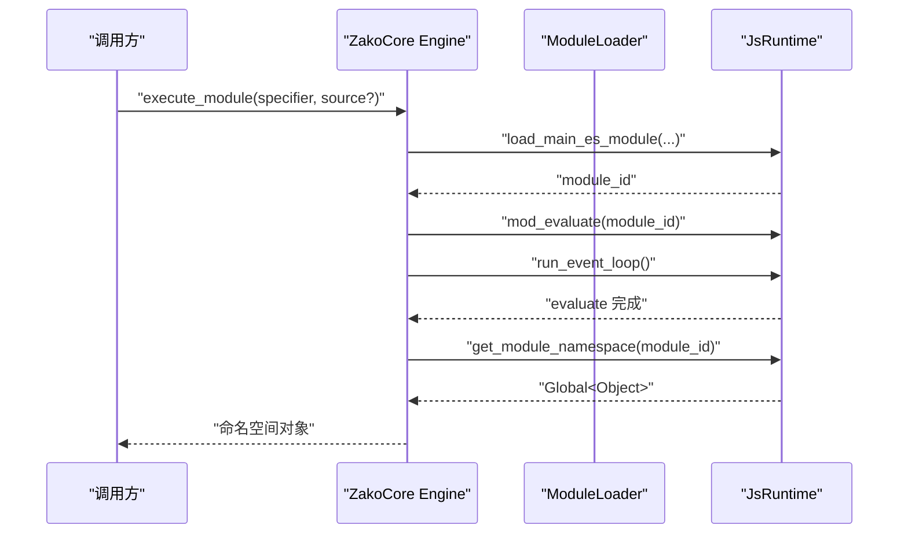
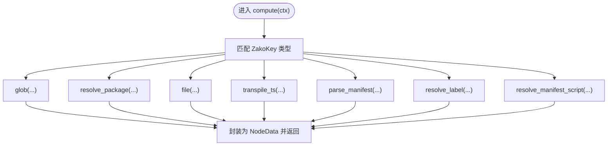
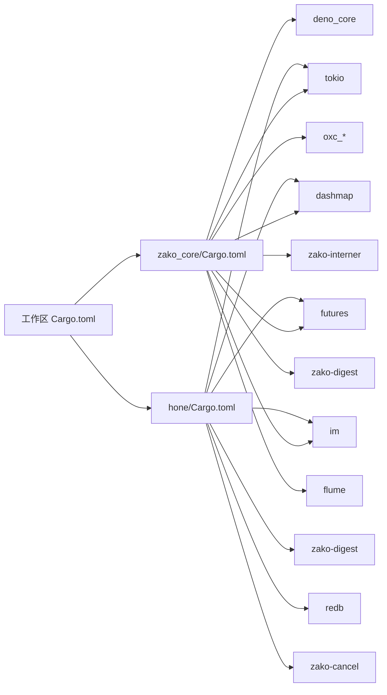

# 引擎架构设计

<cite>
**本文引用的文件**
- [ARCHITECTURE.md](file://ARCHITECTURE.md)
- [hone/src/engine.rs](file://hone/src/engine.rs)
- [hone/src/context.rs](file://hone/src/context.rs)
- [zako_core/src/engine.rs](file://zako_core/src/engine.rs)
- [zako_core/src/context.rs](file://zako_core/src/context.rs)
- [zako_core/src/module_loader/mod.rs](file://zako_core/src/module_loader/mod.rs)
- [zako_core/src/v8platform.rs](file://zako_core/src/v8platform.rs)
- [zako_core/src/global_state.rs](file://zako_core/src/global_state.rs)
- [zako_core/src/computer.rs](file://zako_core/src/computer.rs)
- [zako_core/src/lib.rs](file://zako_core/src/lib.rs)
- [hone/src/lib.rs](file://hone/src/lib.rs)
- [Cargo.toml](file://Cargo.toml)
- [zako_core/Cargo.toml](file://zako_core/Cargo.toml)
- [hone/Cargo.toml](file://hone/Cargo.toml)
</cite>

## 目录
1. [引言](#引言)
2. [项目结构](#项目结构)
3. [核心组件](#核心组件)
4. [架构总览](#架构总览)
5. [组件详细分析](#组件详细分析)
6. [依赖关系分析](#依赖关系分析)
7. [性能考量](#性能考量)
8. [故障排查指南](#故障排查指南)
9. [结论](#结论)
10. [附录](#附录)

## 引言
本文件面向希望深入理解 Zako 引擎架构的工程师与贡献者，系统阐述引擎的整体设计、核心组件关系、生命周期管理与线程安全机制，并重点覆盖以下主题：
- Hone 任务调度引擎的结构体设计、并发与缓存策略、取消与错误处理。
- Zako Core 的 V8 引擎封装、扩展系统集成、模块加载器与平台初始化。
- 引擎初始化流程、与 Deno Core 的集成方式、扩展机制的工作原理。
- 内存管理策略、资源清理机制与错误恢复能力。
- 提供可操作的“创建、配置与使用”示例路径，帮助快速上手。

## 项目结构
Zako 采用多 Crate 的分层架构，围绕“内核 + 调度引擎 + CLI + 工具库”的职责划分组织代码：
- zako_core：系统内核，负责 V8 运行时管理、模块加载、CAS 存储协议、沙盒执行与项目解析。
- hone：任务调度引擎，通用的递归式计算引擎，将构建任务建模为 DAG，支持增量计算与并行化。
- zako_cli：命令行界面，用户交互入口，负责初始化构建环境并触发引擎计算。
- zako_digest、zako_js、zako_interner 等：支撑模块，提供哈希与序列化、脚本内置库、字符串驻留等能力。

图表来源
- [zako_core/src/engine.rs](file://zako_core/src/engine.rs#L1-L306)
- [zako_core/src/module_loader/mod.rs](file://zako_core/src/module_loader/mod.rs#L1-L228)
- [zako_core/src/v8platform.rs](file://zako_core/src/v8platform.rs#L1-L30)
- [zako_core/src/computer.rs](file://zako_core/src/computer.rs#L1-L77)
- [zako_core/src/global_state.rs](file://zako_core/src/global_state.rs#L1-L153)
- [hone/src/engine.rs](file://hone/src/engine.rs#L1-L555)
- [hone/src/context.rs](file://hone/src/context.rs#L1-L152)

章节来源
- [ARCHITECTURE.md](file://ARCHITECTURE.md#L1-L152)
- [Cargo.toml](file://Cargo.toml#L11-L22)
- [zako_core/Cargo.toml](file://zako_core/Cargo.toml#L1-L141)
- [hone/Cargo.toml](file://hone/Cargo.toml#L1-L32)

## 核心组件
本节聚焦两个关键引擎：Hone 任务调度引擎与 Zako Core V8 引擎，并解释它们如何协同工作。

- Hone 引擎（任务调度）
  - 设计理念：将构建步骤抽象为 Key→Value 的映射，通过有向无环图（DAG）建模，支持并行与记忆化。
  - 关键结构：Engine、Context、Computer、NodeStatus、DependencyGraph。
  - 并发与缓存：使用 DashMap 保存节点状态；按需写入数据库（待实现）；支持 keep-going 与 fail-fast 的解析策略。
  - 生命周期：创建 → 注册依赖 → 计算 → 写回（可选）→ 返回结果；支持取消令牌中断。
  - 线程安全：状态共享通过 Arc 与并发容器；计算过程避免持有长时锁；通知机制用于等待同一计算任务完成。

- Zako Core 引擎（V8 运行时）
  - 设计理念：在 Rust 内核中集成 Deno Core 的 V8 运行时，提供确定性的 TypeScript 执行环境。
  - 关键结构：Engine（封装 JsRuntime）、EngineOptions、ModuleLoader、LoaderOptions、v8 平台。
  - 初始化流程：设置 V8 平台、构造 ModuleLoader、合并内置扩展、创建 JsRuntime。
  - 模块加载：支持 file:// URL 解析与异步加载，通过通道请求外部源码。
  - 扩展系统：内置扩展（rt、syscall、global、semver、core、console 等），可通过 EngineOptions 注入。

章节来源
- [hone/src/engine.rs](file://hone/src/engine.rs#L32-L555)
- [hone/src/context.rs](file://hone/src/context.rs#L14-L152)
- [zako_core/src/engine.rs](file://zako_core/src/engine.rs#L19-L306)
- [zako_core/src/module_loader/mod.rs](file://zako_core/src/module_loader/mod.rs#L47-L228)
- [zako_core/src/v8platform.rs](file://zako_core/src/v8platform.rs#L7-L29)

## 架构总览
下图展示了 Zako 的高层架构：Hone 作为任务调度引擎，Zako Core 作为 V8 运行时内核，二者通过 Computer 接口衔接，全局状态提供资源池与 CAS 存储。

图表来源
- [zako_core/src/engine.rs](file://zako_core/src/engine.rs#L48-L79)
- [zako_core/src/module_loader/mod.rs](file://zako_core/src/module_loader/mod.rs#L68-L84)
- [zako_core/src/v8platform.rs](file://zako_core/src/v8platform.rs#L7-L29)
- [zako_core/src/global_state.rs](file://zako_core/src/global_state.rs#L54-L97)
- [zako_core/src/computer.rs](file://zako_core/src/computer.rs#L24-L76)
- [hone/src/engine.rs](file://hone/src/engine.rs#L55-L68)
- [hone/src/context.rs](file://hone/src/context.rs#L24-L32)

## 组件详细分析

### Hone 引擎：结构体设计、生命周期与线程安全
- 结构体设计
  - Engine<C,K,V>：持有状态映射、Computer、依赖图与数据库句柄；泛型约束 K/V 实现节点键值接口。
  - ResolveOptions：控制并发缓冲与失败策略（keep-going/fail-fast）。
- 生命周期管理
  - 创建：new 接收 Computer 与 redb 数据库，初始化状态映射与依赖图。
  - 解析：resolve/resolve_inner 递归解析子节点，支持循环检测与取消。
  - 计算：get 在双检锁下协调并发，调用 Computer.compute 执行业务逻辑。
  - 写回：write 将 Verified/Dirt 节点持久化（注释中说明未来实现）。
- 线程安全机制
  - 使用 DashMap 保存 NodeStatus；通过 entry API 的 Occupied/Vacant 分支实现无锁竞争。
  - 使用 Notify 通知等待同一计算任务的协程；Tokio Handle 控制事件循环。
  - 取消令牌贯穿解析与计算，及时中断长时间运行的任务。

图表来源
- [hone/src/engine.rs](file://hone/src/engine.rs#L32-L555)
- [hone/src/context.rs](file://hone/src/context.rs#L24-L151)

章节来源
- [hone/src/engine.rs](file://hone/src/engine.rs#L55-L555)
- [hone/src/context.rs](file://hone/src/context.rs#L14-L152)

### Zako Core 引擎：V8 运行时封装与扩展系统
- 初始化流程
  - 设置 V8 平台（线程池大小、空闲任务支持），初始化 ModuleLoader。
  - 合并内置扩展（rt、syscall、global、semver、core、console），创建 JsRuntime。
- 模块加载
  - LoaderOptions 持有预读模块映射与导入通道；ModuleLoader 实现 Deno 的 ModuleLoader trait。
  - resolve/load 支持 file:// URL 与异步加载，通过通道请求外部源码。
- 执行接口
  - execute_module / execute_module_with_json：加载主 ES 模块并评估，返回命名空间对象。
  - execute_module_and_then / execute_module_with_json_and_then：在模块命名空间上执行回调，捕获异常并转换为错误类型。
- 扩展系统
  - 内置扩展统一命名规则：zako_$name 对应扩展名，JS 导出名为 zako:$name。
  - 通过 EngineOptions.extensions 注入扩展列表。

图表来源
- [zako_core/src/engine.rs](file://zako_core/src/engine.rs#L81-L109)
- [zako_core/src/module_loader/mod.rs](file://zako_core/src/module_loader/mod.rs#L152-L219)

章节来源
- [zako_core/src/engine.rs](file://zako_core/src/engine.rs#L19-L306)
- [zako_core/src/module_loader/mod.rs](file://zako_core/src/module_loader/mod.rs#L47-L228)
- [zako_core/src/v8platform.rs](file://zako_core/src/v8platform.rs#L7-L29)

### 计算分发器：Computer 与 Hone 引擎的衔接
- Computer 实现了对多种 ZakoKey 的分发逻辑，将 Hone 的抽象节点映射到具体计算函数（如 glob、resolve_package、transpile_ts 等）。
- 通过 Context 提供的 request/request_with_context 方法，Computer 可以动态注册依赖边并等待子任务完成，从而形成 DAG。

图表来源
- [zako_core/src/computer.rs](file://zako_core/src/computer.rs#L24-L76)

章节来源
- [zako_core/src/computer.rs](file://zako_core/src/computer.rs#L1-L77)
- [hone/src/context.rs](file://hone/src/context.rs#L93-L150)

### 全局状态与资源池：线程与 CAS
- GlobalState 统一管理 Interner、Tokio 运行时、CAS 存储、Worker 池（OXC/V8）与系统信息。
- 通过资源池与堆栈大小估算，为不同平台提供稳定的并发与内存占用。
- 与 Zako Core 引擎配合，为 V8 执行与模块加载提供统一的上下文与资源。

章节来源
- [zako_core/src/global_state.rs](file://zako_core/src/global_state.rs#L41-L153)

## 依赖关系分析
- 工作区与成员
  - 工作区包含 zako_core、zako_cli、zako_cancel、zako_digest、zako_interner、hone、zako_kgp 等成员。
  - zako_core 依赖 hone、deno_core、tokio、dashmap、futures、im、oxc_* 等。
  - hone 依赖 tokio、dashmap、futures、im、zako-digest、redb、zako-cancel 等。
- 关键依赖
  - V8/JsRuntime：通过 deno_core 提供的 API 封装。
  - 并发与容器：tokio、dashmap、futures、im。
  - 字符串驻留与哈希：zako-interner、zako-digest。
  - 模块加载与通道通信：flume、tokio-channel。

图表来源
- [Cargo.toml](file://Cargo.toml#L11-L22)
- [zako_core/Cargo.toml](file://zako_core/Cargo.toml#L16-L138)
- [hone/Cargo.toml](file://hone/Cargo.toml#L12-L28)

章节来源
- [Cargo.toml](file://Cargo.toml#L11-L312)
- [zako_core/Cargo.toml](file://zako_core/Cargo.toml#L1-L141)
- [hone/Cargo.toml](file://hone/Cargo.toml#L1-L32)

## 性能考量
- 并发与并行
  - Hone：使用 buffer_unordered 控制子任务并发度；使用 DashMap 降低锁竞争；Notify 通知等待计算完成。
  - Zako Core：Tokio 多线程运行时与 V8 平台线程池结合，提升模块加载与脚本执行吞吐。
- 缓存与记忆化
  - Hone：NodeStatus 支持 Verified/Dirty/Failure 状态，便于重复计算时直接命中。
  - Zako Core：内置扩展与模块命名空间复用，减少重复初始化成本。
- I/O 与序列化
  - 模块加载通过通道异步获取源码，避免阻塞主线程。
  - CAS 存储与内容寻址哈希减少重复传输与计算。
- 取消与超时
  - 取消令牌贯穿解析与执行，防止长时间阻塞；fail-fast 与 keep-going 策略平衡稳定性与速度。

## 故障排查指南
- V8 异常与错误转换
  - Zako Core 引擎在执行回调时捕获异常，转换为 V8Error 并返回；可通过日志定位具体模块与上下文。
- 模块加载错误
  - ModuleLoader 的 resolve/load 返回明确的错误类型，检查 file:// URL、导入关系与通道通信是否正常。
- Hone 解析错误
  - 循环依赖会抛出 CycleDetected；取消会返回 Canceled；数据库相关错误由 EngineError 包裹。
- 平台与致命错误
  - v8platform 设置了致命错误处理器，记录文件与行号，便于定位底层崩溃原因。

章节来源
- [zako_core/src/engine.rs](file://zako_core/src/engine.rs#L168-L300)
- [zako_core/src/module_loader/mod.rs](file://zako_core/src/module_loader/mod.rs#L86-L228)
- [hone/src/engine.rs](file://hone/src/engine.rs#L16-L30)

## 结论
Zako 的架构通过“内核 + 调度引擎”的清晰分工，实现了高性能、可扩展且可确定性的构建系统：
- Hone 以 DAG 为核心的数据流模型，结合并发容器与通知机制，提供可靠的增量计算与并行化能力。
- Zako Core 将 Deno Core 的 V8 运行时与模块加载器整合，提供可控的 TypeScript 执行环境，并通过内置扩展与全局状态实现一致的资源管理。
- 通过取消令牌、错误转换与平台级致命错误处理，系统具备良好的错误恢复与可观测性。

## 附录
- 创建、配置与使用示例（路径指引）
  - 创建 Hone 引擎：参考 [hone/src/engine.rs](file://hone/src/engine.rs#L56-L68)
  - 创建 Zako Core 引擎：参考 [zako_core/src/engine.rs](file://zako_core/src/engine.rs#L48-L79)
  - 注册内置扩展：参考 [zako_core/src/engine.rs](file://zako_core/src/engine.rs#L54-L62)
  - 加载并执行模块：参考 [zako_core/src/engine.rs](file://zako_core/src/engine.rs#L81-L109)
  - 自定义模块加载：参考 [zako_core/src/module_loader/mod.rs](file://zako_core/src/module_loader/mod.rs#L68-L84)
  - 初始化 V8 平台：参考 [zako_core/src/v8platform.rs](file://zako_core/src/v8platform.rs#L7-L29)
  - 全局状态与资源池：参考 [zako_core/src/global_state.rs](file://zako_core/src/global_state.rs#L54-L97)
  - 计算分发与依赖注册：参考 [zako_core/src/computer.rs](file://zako_core/src/computer.rs#L24-L76)、[hone/src/context.rs](file://hone/src/context.rs#L93-L150)