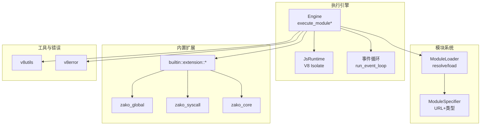
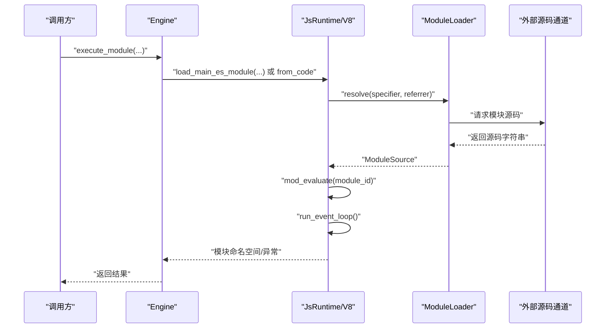
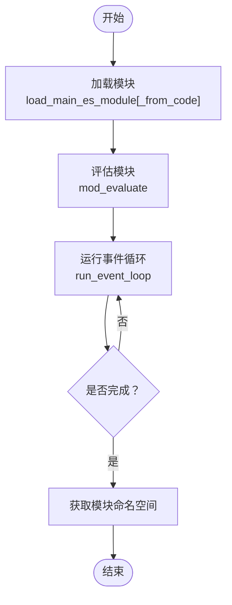
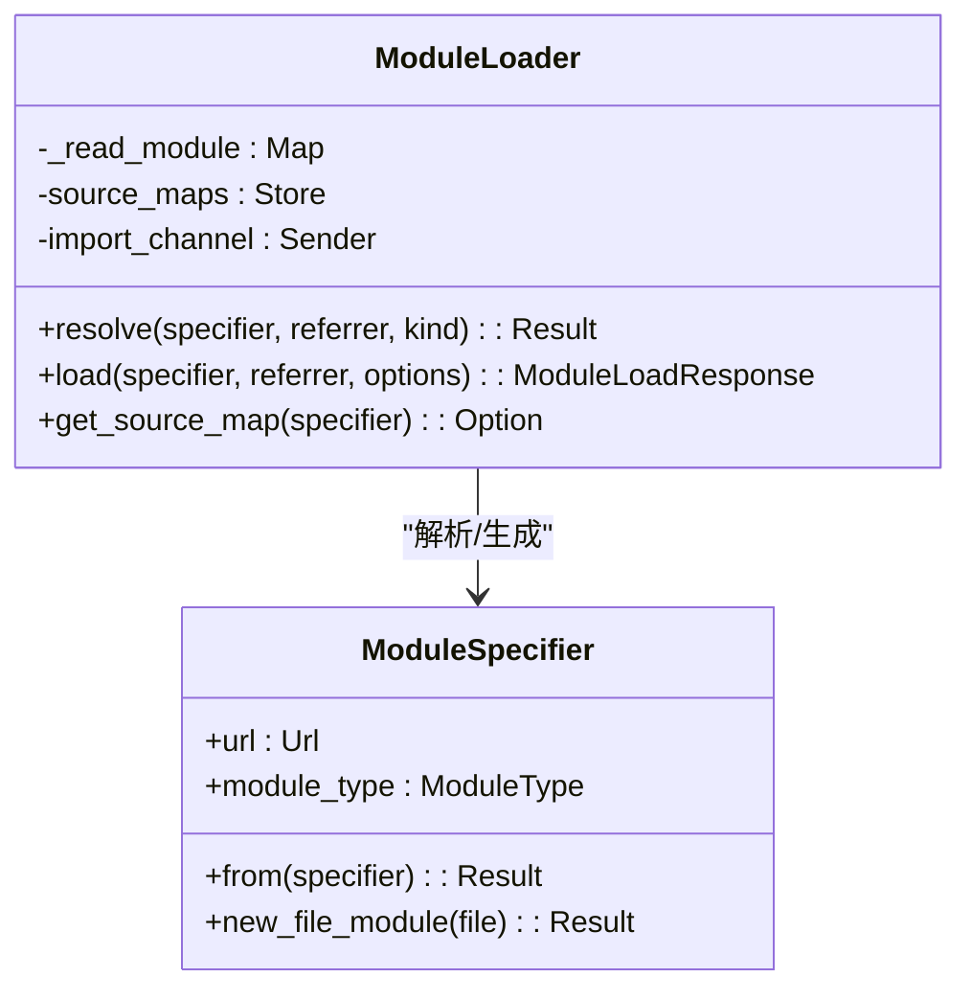
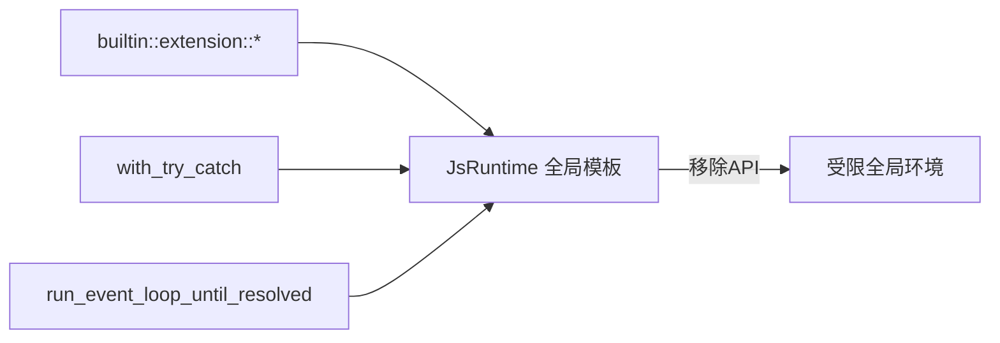
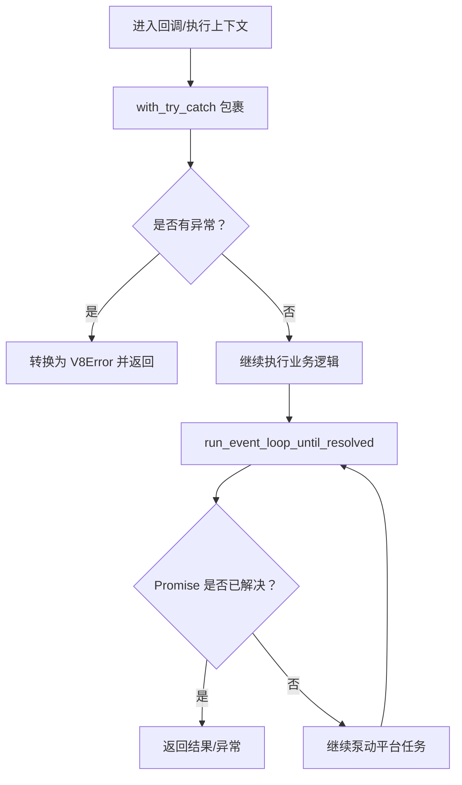
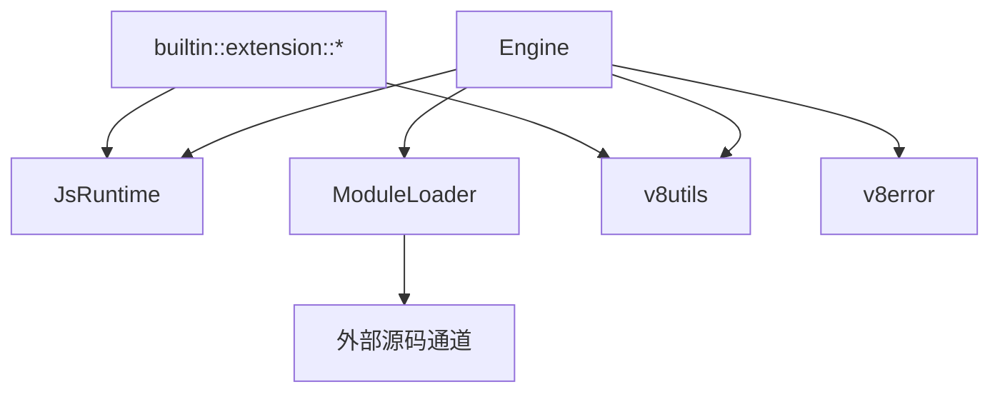

# 执行模型

<cite>
**本文引用的文件**
- [zako_core/src/engine.rs](file://zako_core/src/engine.rs)
- [zako_core/src/v8context.rs](file://zako_core/src/v8context.rs)
- [zako_core/src/module_loader/mod.rs](file://zako_core/src/module_loader/mod.rs)
- [zako_core/src/module_loader/specifier.rs](file://zako_core/src/module_loader/specifier.rs)
- [zako_core/src/v8utils.rs](file://zako_core/src/v8utils.rs)
- [zako_core/src/v8error.rs](file://zako_core/src/v8error.rs)
- [zako_core/src/builtin/extension/mod.rs](file://zako_core/src/builtin/extension/mod.rs)
- [zako_core/src/builtin/extension/global.rs](file://zako_core/src/builtin/extension/global.rs)
- [zako_core/src/builtin/extension/syscall.rs](file://zako_core/src/builtin/extension/syscall.rs)
- [zako_core/src/builtin/extension/core.rs](file://zako_core/src/builtin/extension/core.rs)
- [zako_core/src/context.rs](file://zako_core/src/context.rs)
- [zako_core/src/sandbox.rs](file://zako_core/src/sandbox.rs)
</cite>

## 目录
1. [简介](#简介)
2. [项目结构](#项目结构)
3. [核心组件](#核心组件)
4. [架构总览](#架构总览)
5. [组件详解](#组件详解)
6. [依赖关系分析](#依赖关系分析)
7. [性能与并发特性](#性能与并发特性)
8. [故障排查指南](#故障排查指南)
9. [结论](#结论)
10. [附录：使用示例与最佳实践](#附录使用示例与最佳实践)

## 简介
本文件系统性阐述 Zako 的 JavaScript 执行模型，重点覆盖以下方面：
- JavaScript 模块加载与执行机制：从模块解析、动态加载到 ES Module 评估与事件循环驱动。
- V8 上下文管理与安全沙箱策略：如何限定可用 API、注入全局执行上下文、隔离资源访问。
- execute_module 系列方法的实现原理：同步/异步执行、JSON 输入注入、then 回调链式处理。
- 异步执行模型与 Promise 处理：微任务推进、平台消息循环泵动、死锁检测与错误传播。
- 安全性保障、超时控制与资源限制：内置 API 限制、工作池与取消令牌、路径访问沙箱。
- 使用示例与最佳实践：不同执行模式的适用场景与注意事项。

## 项目结构
围绕“执行模型”的关键模块组织如下：
- 引擎与执行入口：Engine 提供 execute_module 系列方法，封装 V8/JsRuntime 生命周期与事件循环。
- 模块加载器：ModuleLoader 实现 Deno Core ModuleLoader 接口，负责模块解析与动态加载。
- V8 工具与错误：v8utils 提供 TryCatch、上下文作用域、Promise 等工具；v8error 定义执行结果与错误类型。
- 内置扩展：builtin/extension 下的多个扩展（如 global、syscall、core）向 JS 注入能力或限制 API。
- 上下文与沙箱：v8context 描述执行上下文类型；sandbox 提供文件访问边界保护。

图表来源
- [zako_core/src/engine.rs](file://zako_core/src/engine.rs#L81-L304)
- [zako_core/src/module_loader/mod.rs](file://zako_core/src/module_loader/mod.rs#L86-L227)
- [zako_core/src/module_loader/specifier.rs](file://zako_core/src/module_loader/specifier.rs#L35-L108)
- [zako_core/src/v8utils.rs](file://zako_core/src/v8utils.rs#L92-L145)
- [zako_core/src/v8error.rs](file://zako_core/src/v8error.rs#L12-L31)
- [zako_core/src/builtin/extension/mod.rs](file://zako_core/src/builtin/extension/mod.rs#L1-L17)

章节来源
- [zako_core/src/engine.rs](file://zako_core/src/engine.rs#L1-L306)
- [zako_core/src/module_loader/mod.rs](file://zako_core/src/module_loader/mod.rs#L1-L228)
- [zako_core/src/module_loader/specifier.rs](file://zako_core/src/module_loader/specifier.rs#L1-L121)
- [zako_core/src/v8utils.rs](file://zako_core/src/v8utils.rs#L1-L188)
- [zako_core/src/v8error.rs](file://zako_core/src/v8error.rs#L1-L31)
- [zako_core/src/builtin/extension/mod.rs](file://zako_core/src/builtin/extension/mod.rs#L1-L17)

## 核心组件
- Engine：封装 JsRuntime 初始化、模块加载、事件循环与模块评估，提供 execute_module、execute_module_with_json、execute_module_and_then 等方法族。
- ModuleLoader：实现 Deno Core ModuleLoader，负责模块解析与动态加载，支持通过通道请求外部源码。
- ModuleSpecifier：统一表示模块 URL 与类型（File/Builtin/Memory/ImportMap），用于解析与加载决策。
- v8utils：提供上下文作用域、TryCatch 包装、Promise 状态轮询与平台泵动、异常对象转换等工具。
- v8error：定义 ExecutionResult（值/异常）与 V8Error（致命错误）类型，统一错误传播。
- builtin/extension：注册内置扩展，限制或开放部分全局 API，并提供系统调用桥接。

章节来源
- [zako_core/src/engine.rs](file://zako_core/src/engine.rs#L34-L304)
- [zako_core/src/module_loader/mod.rs](file://zako_core/src/module_loader/mod.rs#L60-L227)
- [zako_core/src/module_loader/specifier.rs](file://zako_core/src/module_loader/specifier.rs#L27-L108)
- [zako_core/src/v8utils.rs](file://zako_core/src/v8utils.rs#L1-L188)
- [zako_core/src/v8error.rs](file://zako_core/src/v8error.rs#L12-L31)
- [zako_core/src/builtin/extension/mod.rs](file://zako_core/src/builtin/extension/mod.rs#L1-L17)

## 架构总览
下图展示了从 Rust 调用到 V8 执行的关键交互：Engine 创建 JsRuntime 并注入内置扩展，ModuleLoader 解析与加载模块，事件循环驱动微任务与平台任务，最终返回模块命名空间或异常。

图表来源
- [zako_core/src/engine.rs](file://zako_core/src/engine.rs#L81-L109)
- [zako_core/src/module_loader/mod.rs](file://zako_core/src/module_loader/mod.rs#L152-L219)

章节来源
- [zako_core/src/engine.rs](file://zako_core/src/engine.rs#L81-L109)
- [zako_core/src/module_loader/mod.rs](file://zako_core/src/module_loader/mod.rs#L152-L219)

## 组件详解

### Engine：execute_module 系列方法
Engine 提供多形态的模块执行入口，统一管理 V8 上下文、事件循环与错误传播。

- execute_module
  - 功能：加载主 ES 模块并评估，驱动事件循环直至完成，返回模块命名空间。
  - 关键点：支持从代码直接加载或从文件加载；内部使用 Tokio Handle 阻塞等待异步流程完成。
- execute_module_with_json
  - 功能：在执行前向 globalThis 注入 executionContext（JSON 值），便于脚本读取输入。
  - 关键点：通过 serde_v8 将 serde_json::Value 转换为 V8 对象并设置到全局。
- execute_module_and_then / execute_module_with_json_and_then
  - 功能：在模块评估完成后，进入回调链，允许在 V8 上下文中进一步操作模块导出对象。
  - 关键点：使用 v8utils::with_try_catch 包裹回调，捕获 JS 抛出的异常并转换为 V8Error。

图表来源
- [zako_core/src/engine.rs](file://zako_core/src/engine.rs#L81-L109)

章节来源
- [zako_core/src/engine.rs](file://zako_core/src/engine.rs#L81-L304)

### 模块加载与解析：ModuleLoader 与 ModuleSpecifier
- ModuleSpecifier
  - 支持多种模块类型：File、Builtin、Memory、ImportMap。
  - 提供 from/new_file_module 等构造方法，自动识别 scheme 并映射类型。
- ModuleLoader
  - resolve：根据 referrer 与 specifier 判断导入合法性（如 File 不可导入 Memory）。
  - load：将模块请求通过通道发送给外部工作者，接收源码后包装为 ModuleSource。
  - get_source_map：提供 SourceMap 存储与查询。

图表来源
- [zako_core/src/module_loader/specifier.rs](file://zako_core/src/module_loader/specifier.rs#L27-L108)
- [zako_core/src/module_loader/mod.rs](file://zako_core/src/module_loader/mod.rs#L60-L227)

章节来源
- [zako_core/src/module_loader/specifier.rs](file://zako_core/src/module_loader/specifier.rs#L1-L121)
- [zako_core/src/module_loader/mod.rs](file://zako_core/src/module_loader/mod.rs#L1-L228)

### V8 上下文与安全：builtin/extension 与 v8utils
- builtin/extension
  - zako_global：通过 global_template_middleware 移除一组高风险或不必要 API（如 Date、Intl、setTimeout 等），降低攻击面。
  - zako_syscall：提供版本查询与日志桥接等系统调用能力。
  - zako_core：作为核心扩展，声明依赖其他扩展并提供入口。
- v8utils
  - with_context_scope / with_try_catch：封装上下文作用域与 TryCatch，简化 JS 执行与异常捕获。
  - run_event_loop_until_resolved：轮询 Promise 状态，驱动微任务与平台泵动，检测死锁。
  - convert_object_to_error：将 JS 异常对象转换为 V8Error，保留消息与堆栈。

图表来源
- [zako_core/src/builtin/extension/global.rs](file://zako_core/src/builtin/extension/global.rs#L12-L39)
- [zako_core/src/builtin/extension/syscall.rs](file://zako_core/src/builtin/extension/syscall.rs#L18-L61)
- [zako_core/src/builtin/extension/core.rs](file://zako_core/src/builtin/extension/core.rs#L1-L8)
- [zako_core/src/v8utils.rs](file://zako_core/src/v8utils.rs#L92-L145)

章节来源
- [zako_core/src/builtin/extension/mod.rs](file://zako_core/src/builtin/extension/mod.rs#L1-L17)
- [zako_core/src/builtin/extension/global.rs](file://zako_core/src/builtin/extension/global.rs#L1-L40)
- [zako_core/src/builtin/extension/syscall.rs](file://zako_core/src/builtin/extension/syscall.rs#L1-L62)
- [zako_core/src/builtin/extension/core.rs](file://zako_core/src/builtin/extension/core.rs#L1-L8)
- [zako_core/src/v8utils.rs](file://zako_core/src/v8utils.rs#L1-L188)

### 异步执行模型与 Promise 处理
- Promise 状态轮询：通过 run_event_loop_until_resolved 在 V8 层驱动微任务与平台泵动，直到 Promise 被解决或检测到死锁。
- 错误传播：JS 抛出的异常被捕获并转换为 V8Error；Engine 的 execute_module_and_then 等方法将异常转换为 Rust 层错误，便于上层处理。

图表来源
- [zako_core/src/v8utils.rs](file://zako_core/src/v8utils.rs#L39-L90)
- [zako_core/src/engine.rs](file://zako_core/src/engine.rs#L168-L300)

章节来源
- [zako_core/src/v8utils.rs](file://zako_core/src/v8utils.rs#L1-L188)
- [zako_core/src/engine.rs](file://zako_core/src/engine.rs#L168-L304)

### JSON 输入处理与全局上下文注入
- JSON 注入：execute_module_with_json 在进入模块评估前，将 serde_json::Value 转换为 V8 对象并设置到 globalThis.executionContext。
- 类型约束：v8context 定义了 V8ContextInput/V8ContextOutput 的枚举，用于区分不同构建阶段的上下文能力。

章节来源
- [zako_core/src/engine.rs](file://zako_core/src/engine.rs#L111-L166)
- [zako_core/src/v8context.rs](file://zako_core/src/v8context.rs#L12-L62)

### 异常处理机制
- ExecutionResult：区分 JS 正常返回值与抛出异常。
- V8Error：携带模块定位、消息、堆栈与异常对象，便于诊断。
- 传播路径：JS 异常经 v8utils::check_try_catch 与 convert_object_to_error 转换为 V8Error，再由 Engine 方法返回为 Rust 层错误。

章节来源
- [zako_core/src/v8error.rs](file://zako_core/src/v8error.rs#L12-L31)
- [zako_core/src/v8utils.rs](file://zako_core/src/v8utils.rs#L8-L37)
- [zako_core/src/engine.rs](file://zako_core/src/engine.rs#L168-L304)

### 安全性保障、超时控制与资源限制
- API 限制：zako_global 通过移除高风险 API（如 Date、setTimeout 等）降低攻击面。
- 路径访问沙箱：sandbox 提供 get_path_safe/join_path_for 等方法，确保文件访问在指定根目录内。
- 工作池与取消：context 中持有 WorkerPool 与 CancelToken，可在执行中进行资源回收与取消控制（具体使用见上下文与工作池模块）。

章节来源
- [zako_core/src/builtin/extension/global.rs](file://zako_core/src/builtin/extension/global.rs#L12-L39)
- [zako_core/src/sandbox.rs](file://zako_core/src/sandbox.rs#L27-L81)
- [zako_core/src/context.rs](file://zako_core/src/context.rs#L136-L183)

## 依赖关系分析
- Engine 依赖 JsRuntime、ModuleLoader、v8utils、v8error 以及若干 builtin 扩展。
- ModuleLoader 依赖通道与外部工作者以获取模块源码。
- builtin 扩展之间存在依赖关系（如 zako_core 依赖 zako_rt、zako_global 等）。
- v8utils 为 Engine 与扩展提供通用的 V8 操作工具。

图表来源
- [zako_core/src/engine.rs](file://zako_core/src/engine.rs#L47-L79)
- [zako_core/src/module_loader/mod.rs](file://zako_core/src/module_loader/mod.rs#L47-L83)
- [zako_core/src/builtin/extension/core.rs](file://zako_core/src/builtin/extension/core.rs#L1-L8)

章节来源
- [zako_core/src/engine.rs](file://zako_core/src/engine.rs#L1-L306)
- [zako_core/src/module_loader/mod.rs](file://zako_core/src/module_loader/mod.rs#L1-L228)
- [zako_core/src/builtin/extension/core.rs](file://zako_core/src/builtin/extension/core.rs#L1-L8)

## 性能与并发特性
- 事件循环驱动：Engine 在模块评估后运行事件循环，确保微任务与平台任务及时处理，避免阻塞。
- 平台泵动：v8utils::run_event_loop_until_resolved 在等待 Promise 解决时泵动平台任务，防止空转。
- 并发与线程：Engine 通过 Tokio Handle 驱动异步流程，适合在单线程上下文中复用一个 JsRuntime。
- 资源回收：WorkerPool 与 GC 回收接口可用于释放资源，减少内存占用。

[本节为通用性能讨论，不直接分析特定文件]

## 故障排查指南
- 模块解析失败
  - 检查 ModuleSpecifier 的类型与 scheme 是否匹配（File/Builtin/Memory/ImportMap）。
  - 确认 ModuleLoader 的 resolve 规则与 referrer/specifier 的组合是否合法。
- 模块加载失败
  - 确认外部源码通道通信正常，请求/响应未超时。
  - 检查 ModuleSource 的构造与 URL 映射。
- JS 异常
  - 使用 v8utils::with_try_catch 包裹回调，捕获异常并转换为 V8Error。
  - 查看 V8Error 的 message、stack 与 module_specifier 字段定位问题。
- 死锁与事件循环
  - run_event_loop_until_resolved 会在平台无任务可泵且 Promise 仍 Pending 时报告死锁，需检查异步链路。

章节来源
- [zako_core/src/module_loader/specifier.rs](file://zako_core/src/module_loader/specifier.rs#L57-L108)
- [zako_core/src/module_loader/mod.rs](file://zako_core/src/module_loader/mod.rs#L87-L219)
- [zako_core/src/v8utils.rs](file://zako_core/src/v8utils.rs#L39-L90)
- [zako_core/src/v8error.rs](file://zako_core/src/v8error.rs#L12-L31)

## 结论
Zako 的执行模型以 Engine 为核心，结合内置扩展、模块加载器与 V8 工具库，实现了安全可控的 JavaScript 执行环境。通过 execute_module 系列方法，用户可以在不同上下文中注入输入、处理异步与错误，并借助沙箱与 API 限制提升安全性。该设计既满足初学者快速上手，也为高级用户提供足够的扩展与优化空间。

[本节为总结性内容，不直接分析特定文件]

## 附录：使用示例与最佳实践
- 同步执行（无输入）
  - 使用 execute_module 加载主模块并评估，适用于一次性脚本。
  - 注意：若模块内含异步操作，需确保事件循环被正确驱动。
- 注入 JSON 输入
  - 使用 execute_module_with_json 注入 executionContext，便于脚本读取配置或输入数据。
  - 输入应为 serde_json::Value，内部通过 serde_v8 转换为 V8 对象。
- 回调链式处理
  - 使用 execute_module_and_then / execute_module_with_json_and_then 在模块导出对象上执行后续逻辑。
  - 回调内部建议使用 with_try_catch 包裹，避免异常穿透。
- 安全与资源
  - 依赖 zako_global 的 API 限制策略，避免暴露高风险 API。
  - 使用 sandbox 限制文件访问范围，防止越权读写。
  - 在长任务中考虑取消令牌与资源池回收，避免资源泄漏。

章节来源
- [zako_core/src/engine.rs](file://zako_core/src/engine.rs#L81-L304)
- [zako_core/src/builtin/extension/global.rs](file://zako_core/src/builtin/extension/global.rs#L12-L39)
- [zako_core/src/sandbox.rs](file://zako_core/src/sandbox.rs#L27-L81)
- [zako_core/src/context.rs](file://zako_core/src/context.rs#L136-L183)