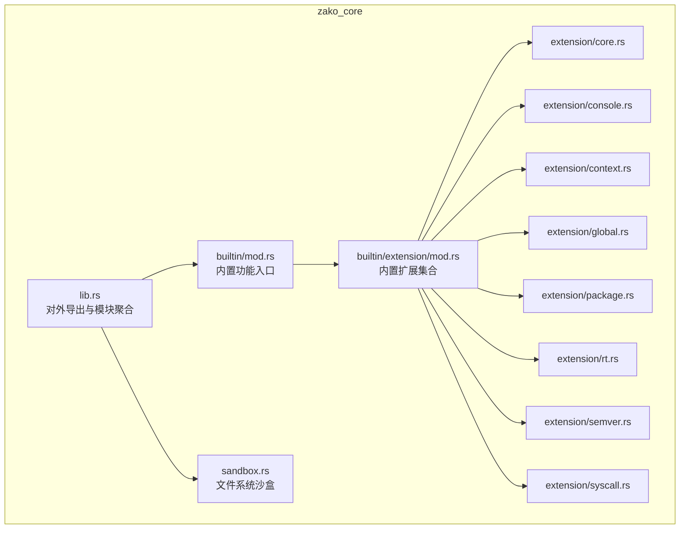
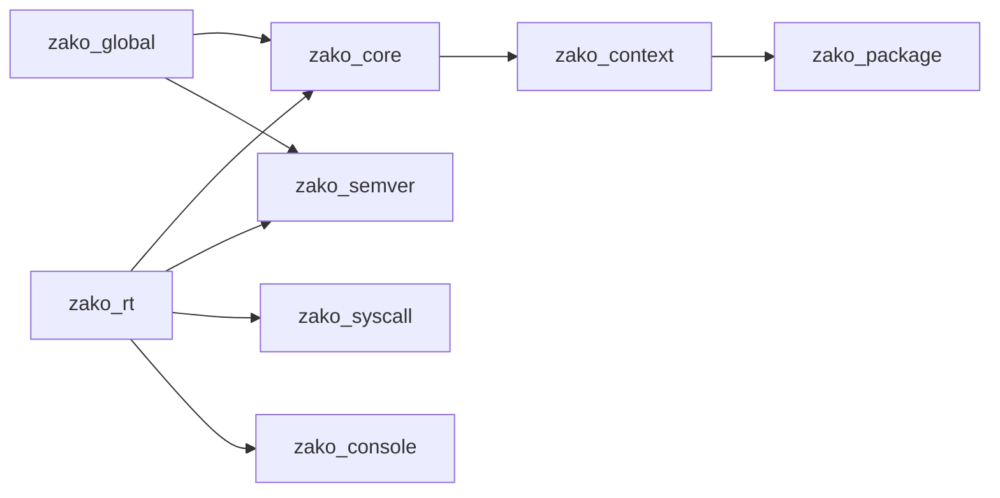
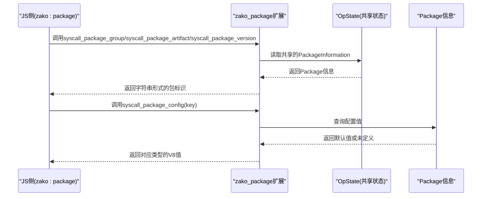
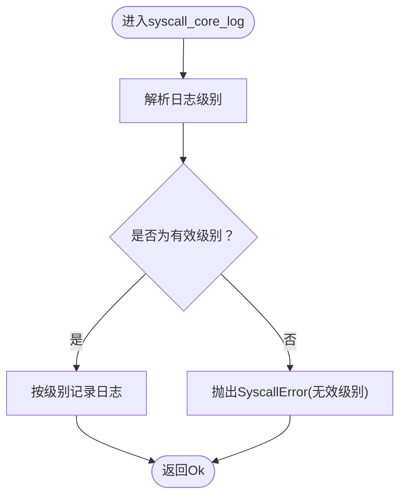
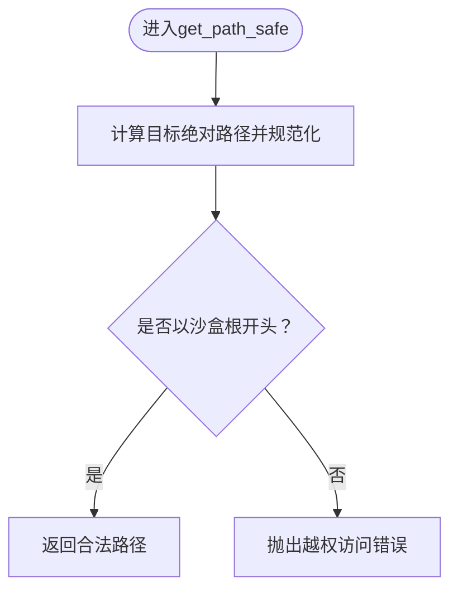
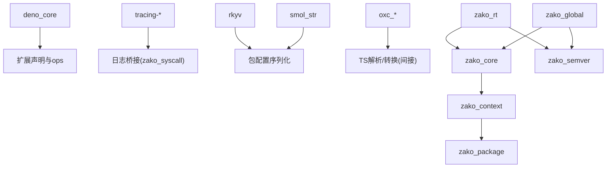

# 扩展系统

<cite>
**本文引用的文件**
- [zako_core/src/lib.rs](file://zako_core/src/lib.rs)
- [zako_core/src/builtin/mod.rs](file://zako_core/src/builtin/mod.rs)
- [zako_core/src/builtin/extension/mod.rs](file://zako_core/src/builtin/extension/mod.rs)
- [zako_core/src/builtin/extension/core.rs](file://zako_core/src/builtin/extension/core.rs)
- [zako_core/src/builtin/extension/console.rs](file://zako_core/src/builtin/extension/console.rs)
- [zako_core/src/builtin/extension/context.rs](file://zako_core/src/builtin/extension/context.rs)
- [zako_core/src/builtin/extension/global.rs](file://zako_core/src/builtin/extension/global.rs)
- [zako_core/src/builtin/extension/package.rs](file://zako_core/src/builtin/extension/package.rs)
- [zako_core/src/builtin/extension/rt.rs](file://zako_core/src/builtin/extension/rt.rs)
- [zako_core/src/builtin/extension/semver.rs](file://zako_core/src/builtin/extension/semver.rs)
- [zako_core/src/builtin/extension/syscall.rs](file://zako_core/src/builtin/extension/syscall.rs)
- [zako_core/src/sandbox.rs](file://zako_core/src/sandbox.rs)
- [zako_core/Cargo.toml](file://zako_core/Cargo.toml)
</cite>

## 目录
1. [简介](#简介)
2. [项目结构](#项目结构)
3. [核心组件](#核心组件)
4. [架构总览](#架构总览)
5. [详细组件分析](#详细组件分析)
6. [依赖分析](#依赖分析)
7. [性能考虑](#性能考虑)
8. [故障排查指南](#故障排查指南)
9. [结论](#结论)
10. [附录](#附录)

## 简介
本文件面向Zako扩展系统的使用者与贡献者，系统性阐述扩展机制的设计原理、加载流程与生命周期管理；详解内置扩展的注册过程、依赖关系与初始化顺序；说明扩展接口定义、钩子与回调机制；解释扩展间通信、资源共享与冲突处理策略；并提供可直接参考的代码片段路径以帮助开发与集成自定义扩展。同时，文档覆盖安全限制、权限控制与沙盒机制，兼顾初学者易读性与资深开发者所需的技术深度。

## 项目结构
Zako扩展系统主要位于zako_core crate内，采用“内置扩展模块”+“V8/Deno运行时桥接”的设计。扩展通过deno_core::extension!宏进行声明，并以ESM入口点暴露到JS侧，形成从Rust到JS的双向调用通道（op2）。

- 核心入口与导出
  - zako_core/src/lib.rs：对外导出模块，包含扩展相关子模块与类型别名等。
  - zako_core/Cargo.toml：声明对deno_core等运行时与工具库的依赖。

- 内置扩展组织
  - zako_core/src/builtin/mod.rs：内置功能分组入口。
  - zako_core/src/builtin/extension/mod.rs：内置扩展子模块集合（如core、console、context、global、package、rt、semver、syscall）。

- 关键扩展文件
  - core.rs、console.rs、context.rs、global.rs、package.rs、rt.rs、semver.rs、syscall.rs：每个扩展均以独立模块实现，统一通过deno_core::extension!声明，设置依赖、ESM入口与导出操作（ops）。

- 安全与沙盒
  - zako_core/src/sandbox.rs：提供基于根目录的文件访问沙盒，用于限制脚本对宿主文件系统的越权访问。

图表来源
- [zako_core/src/lib.rs](file://zako_core/src/lib.rs#L35-L80)
- [zako_core/src/builtin/mod.rs](file://zako_core/src/builtin/mod.rs#L1-L3)
- [zako_core/src/builtin/extension/mod.rs](file://zako_core/src/builtin/extension/mod.rs#L1-L17)
- [zako_core/src/builtin/extension/core.rs](file://zako_core/src/builtin/extension/core.rs#L1-L8)
- [zako_core/src/builtin/extension/console.rs](file://zako_core/src/builtin/extension/console.rs#L1-L8)
- [zako_core/src/builtin/extension/context.rs](file://zako_core/src/builtin/extension/context.rs#L1-L41)
- [zako_core/src/builtin/extension/global.rs](file://zako_core/src/builtin/extension/global.rs#L1-L40)
- [zako_core/src/builtin/extension/package.rs](file://zako_core/src/builtin/extension/package.rs#L1-L92)
- [zako_core/src/builtin/extension/rt.rs](file://zako_core/src/builtin/extension/rt.rs#L1-L7)
- [zako_core/src/builtin/extension/semver.rs](file://zako_core/src/builtin/extension/semver.rs#L1-L8)
- [zako_core/src/builtin/extension/syscall.rs](file://zako_core/src/builtin/extension/syscall.rs#L1-L62)
- [zako_core/src/sandbox.rs](file://zako_core/src/sandbox.rs#L1-L82)

章节来源
- [zako_core/src/lib.rs](file://zako_core/src/lib.rs#L35-L80)
- [zako_core/src/builtin/mod.rs](file://zako_core/src/builtin/mod.rs#L1-L3)
- [zako_core/src/builtin/extension/mod.rs](file://zako_core/src/builtin/extension/mod.rs#L1-L17)
- [zako_core/Cargo.toml](file://zako_core/Cargo.toml#L59-L69)

## 核心组件
- 扩展声明与生命周期
  - 每个扩展通过deno_core::extension!宏声明，包含：
    - 扩展名称（如zako_core、zako_rt等）
    - 依赖列表（deps）
    - ESM入口点（esm_entry_point）
    - ESM资源映射（esm）
    - 可选：options/state钩子（用于注入运行时状态）
    - 可选：ops（op2声明的操作，供JS侧调用）
    - 可选：global_template_middleware（全局模板中间件，用于裁剪或限制V8 API）

- 运行时与上下文
  - zako_rt：提供基础运行时环境。
  - zako_global：在V8全局模板上移除部分API，实施安全限制。
  - zako_core：作为其他扩展的基础依赖。
  - zako_context：提供执行上下文信息（如当前包），并通过op2向JS暴露。
  - zako_package：基于上下文信息，向JS暴露包元数据与配置查询能力。
  - zako_syscall：提供版本查询与日志桥接等系统调用能力。
  - zako_semver：提供语义化版本解析能力。
  - zako_console：提供控制台输出能力。

- 沙盒与安全
  - zako_core/src/sandbox.rs：通过根目录约束与路径规范化，防止脚本越权访问宿主文件系统。

章节来源
- [zako_core/src/builtin/extension/core.rs](file://zako_core/src/builtin/extension/core.rs#L1-L8)
- [zako_core/src/builtin/extension/console.rs](file://zako_core/src/builtin/extension/console.rs#L1-L8)
- [zako_core/src/builtin/extension/context.rs](file://zako_core/src/builtin/extension/context.rs#L1-L41)
- [zako_core/src/builtin/extension/global.rs](file://zako_core/src/builtin/extension/global.rs#L1-L40)
- [zako_core/src/builtin/extension/package.rs](file://zako_core/src/builtin/extension/package.rs#L1-L92)
- [zako_core/src/builtin/extension/rt.rs](file://zako_core/src/builtin/extension/rt.rs#L1-L7)
- [zako_core/src/builtin/extension/semver.rs](file://zako_core/src/builtin/extension/semver.rs#L1-L8)
- [zako_core/src/builtin/extension/syscall.rs](file://zako_core/src/builtin/extension/syscall.rs#L1-L62)
- [zako_core/src/sandbox.rs](file://zako_core/src/sandbox.rs#L1-L82)

## 架构总览
下图展示了扩展之间的依赖关系与初始化顺序。扩展以树形依赖构建，顶层为zako_rt与zako_global，随后是zako_core与zako_semver，再由具体业务扩展（如zako_context、zako_package、zako_syscall）按需组合。

图表来源
- [zako_core/src/builtin/extension/core.rs](file://zako_core/src/builtin/extension/core.rs#L1-L8)
- [zako_core/src/builtin/extension/console.rs](file://zako_core/src/builtin/extension/console.rs#L1-L8)
- [zako_core/src/builtin/extension/context.rs](file://zako_core/src/builtin/extension/context.rs#L1-L41)
- [zako_core/src/builtin/extension/global.rs](file://zako_core/src/builtin/extension/global.rs#L1-L40)
- [zako_core/src/builtin/extension/package.rs](file://zako_core/src/builtin/extension/package.rs#L1-L92)
- [zako_core/src/builtin/extension/rt.rs](file://zako_core/src/builtin/extension/rt.rs#L1-L7)
- [zako_core/src/builtin/extension/semver.rs](file://zako_core/src/builtin/extension/semver.rs#L1-L8)
- [zako_core/src/builtin/extension/syscall.rs](file://zako_core/src/builtin/extension/syscall.rs#L1-L62)

## 详细组件分析

### 组件A：扩展声明与生命周期（deno_core::extension!）
- 设计要点
  - 通过宏统一声明扩展：名称、依赖、ESM入口、资源映射、状态注入与操作导出。
  - 依赖链决定初始化顺序：先初始化无依赖的zako_rt与zako_global，再依次向上游扩展传递。
  - state钩子允许在V8运行时中注入共享状态（如上下文信息、包信息）。

- 生命周期阶段
  1) 初始化：加载ESM资源，建立V8上下文。
  2) 注入：根据options/state钩子写入运行时状态。
  3) 就绪：ops可用，JS侧可通过import("zako:*")调用。
  4) 清理：随运行时销毁释放。

- 代码片段路径
  - [扩展声明示例：core](file://zako_core/src/builtin/extension/core.rs#L1-L8)
  - [扩展声明示例：rt](file://zako_core/src/builtin/extension/rt.rs#L1-L7)
  - [扩展声明示例：global](file://zako_core/src/builtin/extension/global.rs#L1-L40)

章节来源
- [zako_core/src/builtin/extension/core.rs](file://zako_core/src/builtin/extension/core.rs#L1-L8)
- [zako_core/src/builtin/extension/rt.rs](file://zako_core/src/builtin/extension/rt.rs#L1-L7)
- [zako_core/src/builtin/extension/global.rs](file://zako_core/src/builtin/extension/global.rs#L1-L40)

### 组件B：上下文与包信息（zako_context、zako_package）
- 上下文（zako_context）
  - 提供执行上下文枚举与信息结构体，通过op2向JS暴露当前上下文名称。
  - 代码片段路径：[上下文扩展声明与op](file://zako_core/src/builtin/extension/context.rs#L1-L41)

- 包信息（zako_package）
  - 基于上下文信息，向JS暴露包的group/artifact/version以及配置项查询。
  - 代码片段路径：[包扩展声明与ops](file://zako_core/src/builtin/extension/package.rs#L1-L92)

图表来源
- [zako_core/src/builtin/extension/package.rs](file://zako_core/src/builtin/extension/package.rs#L39-L92)

章节来源
- [zako_core/src/builtin/extension/context.rs](file://zako_core/src/builtin/extension/context.rs#L1-L41)
- [zako_core/src/builtin/extension/package.rs](file://zako_core/src/builtin/extension/package.rs#L1-L92)

### 组件C：系统调用与日志（zako_syscall）
- 功能
  - 向JS暴露版本查询与日志桥接，日志级别受控，非法级别会返回错误。
- 错误模型
  - 使用自定义错误类型封装错误种类，便于JS侧识别与处理。
- 代码片段路径
  - [系统调用扩展声明与ops](file://zako_core/src/builtin/extension/syscall.rs#L1-L62)

图表来源
- [zako_core/src/builtin/extension/syscall.rs](file://zako_core/src/builtin/extension/syscall.rs#L33-L62)

章节来源
- [zako_core/src/builtin/extension/syscall.rs](file://zako_core/src/builtin/extension/syscall.rs#L1-L62)

### 组件D：全局裁剪与安全（zako_global）
- 设计
  - 通过global_template_middleware在V8全局模板上移除一组API，降低攻击面。
- 适用场景
  - 在构建环境中限制脚本对系统时间、定时器、加密等敏感API的直接访问。
- 代码片段路径
  - [全局裁剪实现](file://zako_core/src/builtin/extension/global.rs#L1-L40)

章节来源
- [zako_core/src/builtin/extension/global.rs](file://zako_core/src/builtin/extension/global.rs#L1-L40)

### 组件E：文件系统沙盒（Sandbox）
- 能力
  - 以根目录为边界，对相对路径进行规范化与校验，拒绝越界访问。
  - 提供join_path_for与get_path_safe两类路径拼接与校验方法。
- 错误
  - 越权访问返回明确错误，便于上层捕获与处理。
- 代码片段路径
  - [沙盒结构与方法](file://zako_core/src/sandbox.rs#L1-L82)

图表来源
- [zako_core/src/sandbox.rs](file://zako_core/src/sandbox.rs#L34-L54)

章节来源
- [zako_core/src/sandbox.rs](file://zako_core/src/sandbox.rs#L1-L82)

### 组件F：扩展间通信与资源共享
- 通信方式
  - JS侧通过import("zako:*")调用各扩展提供的API。
  - Rust侧通过op2声明的操作与JS交互，共享状态通过OpState注入。
- 资源共享
  - 全局状态（如包信息、上下文信息）通过options/state注入，避免重复计算与跨模块耦合。
- 冲突解决
  - 依赖声明显式化，避免循环依赖；通过模块命名空间隔离（zako:*）减少命名冲突。

章节来源
- [zako_core/src/builtin/extension/context.rs](file://zako_core/src/builtin/extension/context.rs#L24-L31)
- [zako_core/src/builtin/extension/package.rs](file://zako_core/src/builtin/extension/package.rs#L30-L37)

### 组件G：开发与集成自定义扩展（实践指南）
- 步骤
  1) 在zako_core/src/builtin/extension下新增模块（如myext.rs），使用deno_core::extension!声明扩展。
  2) 在zako_core/src/builtin/extension/mod.rs中导出新模块。
  3) 如需JS侧入口，配置esm_entry_point与esm资源映射。
  4) 如需共享状态，定义options与state钩子，注入到OpState。
  5) 如需JS调用，使用#[op2]声明ops，确保参数与返回值类型兼容。
  6) 在Cargo.toml中添加必要的运行时依赖（如deno_core、tracing等）。
- 示例路径
  - [新增扩展声明模板](file://zako_core/src/builtin/extension/core.rs#L1-L8)
  - [op2声明模板](file://zako_core/src/builtin/extension/syscall.rs#L27-L31)
  - [全局裁剪模板](file://zako_core/src/builtin/extension/global.rs#L12-L39)

章节来源
- [zako_core/src/builtin/extension/core.rs](file://zako_core/src/builtin/extension/core.rs#L1-L8)
- [zako_core/src/builtin/extension/syscall.rs](file://zako_core/src/builtin/extension/syscall.rs#L27-L31)
- [zako_core/src/builtin/extension/global.rs](file://zako_core/src/builtin/extension/global.rs#L12-L39)
- [zako_core/Cargo.toml](file://zako_core/Cargo.toml#L59-L69)

## 依赖分析
- 外部依赖
  - deno_core：扩展声明、V8运行时、op2操作导出。
  - tracing/tracing-*：日志系统，配合zako_syscall的日志桥接。
  - rkyv、smol_str：高性能序列化与字符串处理。
  - oxc_*：TS/JS解析与转换工具链（间接支持）。
- 内部依赖
  - zako_rt → zako_core → zako_context → zako_package
  - zako_rt → zako_semver
  - zako_global → zako_core, zako_semver

图表来源
- [zako_core/Cargo.toml](file://zako_core/Cargo.toml#L59-L69)
- [zako_core/src/builtin/extension/core.rs](file://zako_core/src/builtin/extension/core.rs#L1-L8)
- [zako_core/src/builtin/extension/package.rs](file://zako_core/src/builtin/extension/package.rs#L1-L92)
- [zako_core/src/builtin/extension/syscall.rs](file://zako_core/src/builtin/extension/syscall.rs#L1-L62)

章节来源
- [zako_core/Cargo.toml](file://zako_core/Cargo.toml#L59-L69)

## 性能考虑
- 并发与缓存
  - zako_core/src/lib.rs中提供了并发容器类型别名（DashMap、DashSet、Moka Cache），可用于扩展间共享状态或结果缓存，提升性能。
- 日志与追踪
  - 通过tracing子系统与zako_syscall的日志桥接，可在不阻塞主线程的情况下输出多级别日志。
- 字符串与序列化
  - 使用smol_str与rkyv优化字符串与配置对象的内存占用与序列化开销。

章节来源
- [zako_core/src/lib.rs](file://zako_core/src/lib.rs#L82-L96)
- [zako_core/src/builtin/extension/syscall.rs](file://zako_core/src/builtin/extension/syscall.rs#L33-L62)

## 故障排查指南
- 常见问题
  - JS侧无法导入zako:*模块：检查扩展的esm_entry_point与esm资源映射是否正确。
  - op2调用失败：确认参数类型与返回值类型匹配，必要时在Rust侧增加错误包装。
  - 越权访问文件系统：检查Sandbox的根路径与目标路径，确保路径规范化后仍处于沙盒内。
- 排查步骤
  - 启用更细粒度的日志（trace/debug/info/warn/error），定位问题发生阶段。
  - 使用Sandbox的is_in_sandbox快速判断路径是否越界。
  - 在全局裁剪中确认被移除的API是否影响脚本行为。

章节来源
- [zako_core/src/builtin/extension/syscall.rs](file://zako_core/src/builtin/extension/syscall.rs#L33-L62)
- [zako_core/src/sandbox.rs](file://zako_core/src/sandbox.rs#L74-L81)

## 结论
Zako扩展系统以deno_core为基础，结合V8运行时与Rust生态，实现了从声明式扩展到JS侧API的完整闭环。通过清晰的依赖链、状态注入与op2桥接，扩展既能高效复用底层能力，又能保持安全与可控。内置扩展覆盖运行时、全局裁剪、上下文、包信息、系统调用与语义化版本等关键领域，为构建复杂构建与脚本场景提供了坚实基础。对于自定义扩展，遵循现有模式即可快速集成并融入整体体系。

## 附录
- 快速参考
  - 扩展声明：[core](file://zako_core/src/builtin/extension/core.rs#L1-L8)、[rt](file://zako_core/src/builtin/extension/rt.rs#L1-L7)、[global](file://zako_core/src/builtin/extension/global.rs#L1-L40)
  - op2示例：[syscall_core_version](file://zako_core/src/builtin/extension/syscall.rs#L27-L31)、[syscall_core_log](file://zako_core/src/builtin/extension/syscall.rs#L33-L62)
  - 上下文与包：[context](file://zako_core/src/builtin/extension/context.rs#L1-L41)、[package](file://zako_core/src/builtin/extension/package.rs#L1-L92)
  - 沙盒：[sandbox](file://zako_core/src/sandbox.rs#L1-L82)