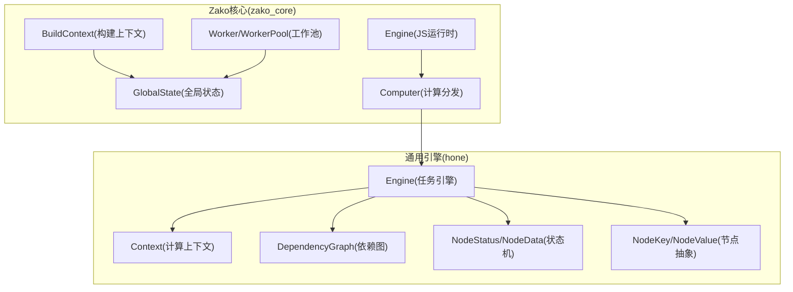
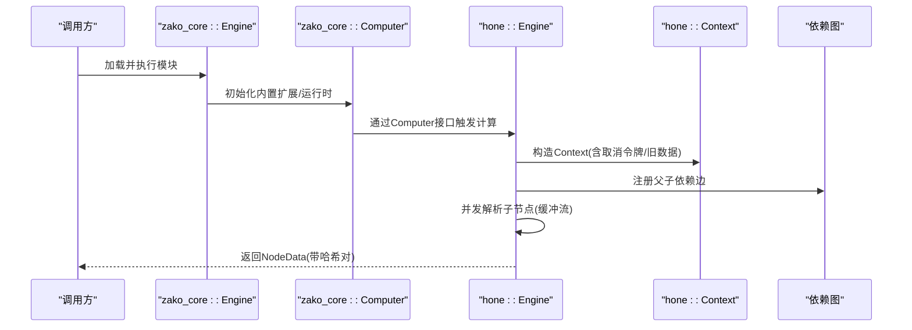
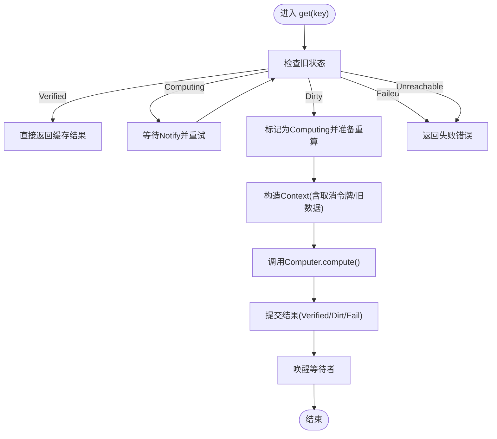
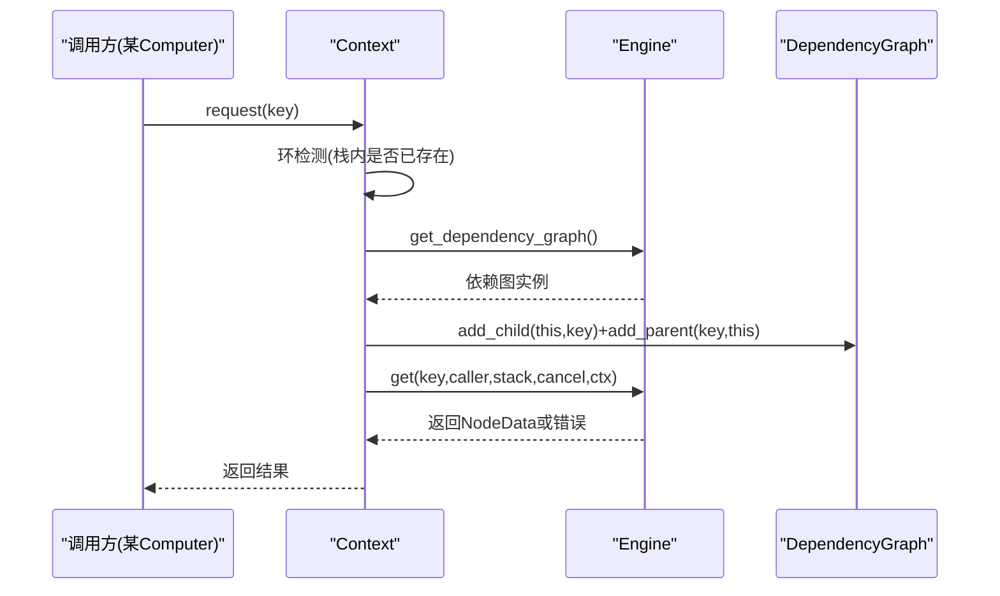
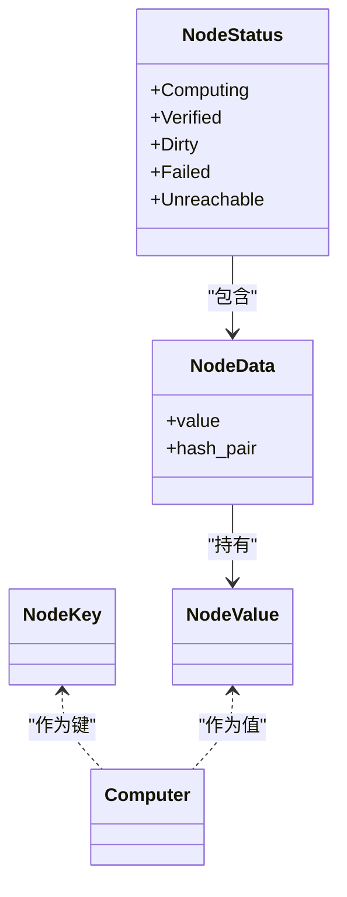
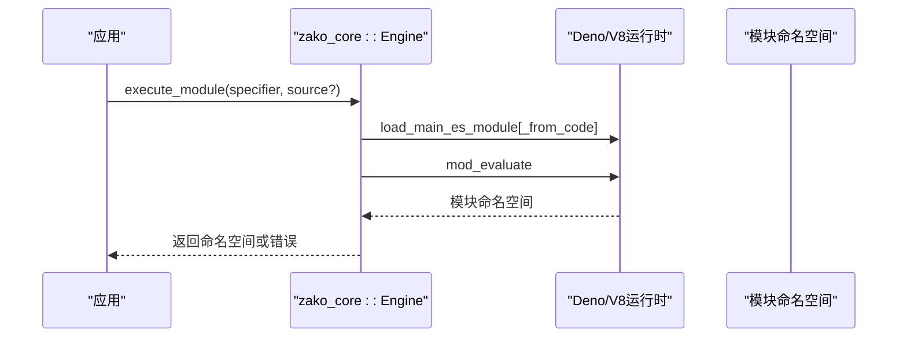
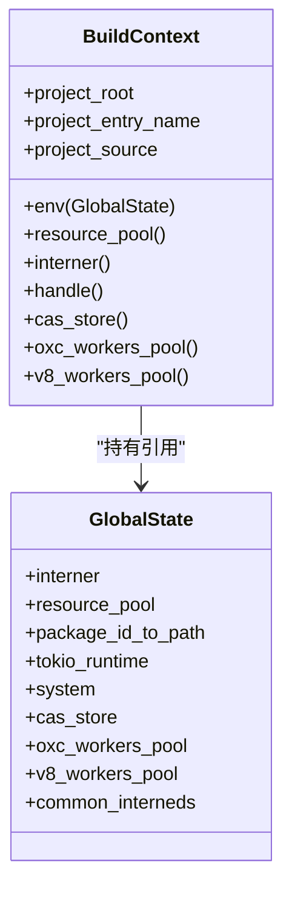
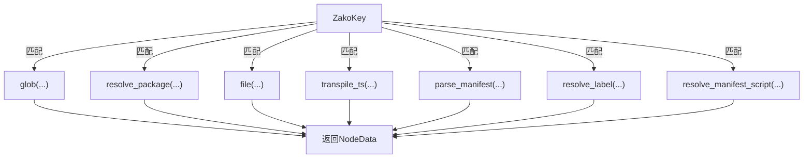
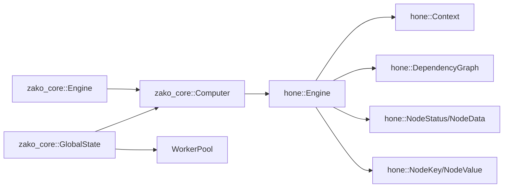

# 核心引擎

<cite>
**本文引用的文件**
- [hone/src/lib.rs](file://hone/src/lib.rs)
- [hone/src/engine.rs](file://hone/src/engine.rs)
- [hone/src/context.rs](file://hone/src/context.rs)
- [hone/src/node.rs](file://hone/src/node.rs)
- [hone/src/status.rs](file://hone/src/status.rs)
- [hone/src/dependency.rs](file://hone/src/dependency.rs)
- [hone/src/error.rs](file://hone/src/error.rs)
- [hone/tests/engine_tests.rs](file://hone/tests/engine_tests.rs)
- [zako_core/src/lib.rs](file://zako_core/src/lib.rs)
- [zako_core/src/engine.rs](file://zako_core/src/engine.rs)
- [zako_core/src/context.rs](file://zako_core/src/context.rs)
- [zako_core/src/global_state.rs](file://zako_core/src/global_state.rs)
- [zako_core/src/computer.rs](file://zako_core/src/computer.rs)
- [zako_core/src/worker/mod.rs](file://zako_core/src/worker/mod.rs)
</cite>

## 目录
1. [简介](#简介)
2. [项目结构](#项目结构)
3. [核心组件](#核心组件)
4. [架构总览](#架构总览)
5. [详细组件分析](#详细组件分析)
6. [依赖分析](#依赖分析)
7. [性能考虑](#性能考虑)
8. [故障排查指南](#故障排查指南)
9. [结论](#结论)
10. [附录](#附录)

## 简介
本文件面向Zako核心引擎，系统性阐述其架构、计算模型、任务调度与错误处理机制；详解计算机组件实现、上下文管理与全局状态协调；并给出接口定义、调用关系与典型流程图示。内容兼顾初学者可读性与资深工程师所需的技术深度，覆盖引擎启动流程、任务执行循环、资源管理等核心能力。

## 项目结构
Zako采用多crate分层组织：核心逻辑集中在zako_core，通用调度与数据结构在hone，二者协同工作。zako_core负责构建时的JS运行时、内置扩展、全局状态与资源池；hone提供通用的任务引擎、节点键值抽象、依赖图与状态机。

图表来源
- [zako_core/src/engine.rs](file://zako_core/src/engine.rs#L34-L79)
- [zako_core/src/context.rs](file://zako_core/src/context.rs#L34-L86)
- [zako_core/src/global_state.rs](file://zako_core/src/global_state.rs#L41-L97)
- [zako_core/src/computer.rs](file://zako_core/src/computer.rs#L16-L77)
- [hone/src/engine.rs](file://hone/src/engine.rs#L32-L68)
- [hone/src/context.rs](file://hone/src/context.rs#L24-L32)
- [hone/src/dependency.rs](file://hone/src/dependency.rs#L4-L16)
- [hone/src/status.rs](file://hone/src/status.rs#L62-L69)
- [hone/src/node.rs](file://hone/src/node.rs#L38-L50)

章节来源
- [zako_core/src/lib.rs](file://zako_core/src/lib.rs#L30-L80)
- [hone/src/lib.rs](file://hone/src/lib.rs#L5-L10)

## 核心组件
- 通用任务引擎（hone::Engine）：提供节点状态管理、并发调度、依赖解析、取消支持与可选持久化框架。
- 计算上下文（hone::Context）：封装请求依赖、栈追踪、取消令牌与旧数据回退。
- 依赖图（hone::DependencyGraph）：无锁并发映射，维护父子节点边，支持动态注册与清理。
- 节点抽象（hone::NodeKey/NodeValue）：通过归档序列化实现可持久化与跨进程传输。
- 状态机（hone::NodeStatus/NodeData）：统一表示计算中、已验证、脏、失败、不可达五种状态。
- JS引擎（zako_core::Engine）：基于Deno/V8的模块化JS运行时，注入内置扩展，支持事件循环与异常转换。
- 构建上下文（zako_core::BuildContext）：携带项目根、入口名、包源与全局状态句柄，提供资源池访问。
- 全局状态（zako_core::GlobalState）：集中管理Interner、Tokio运行时、CAS存储、工作池与系统信息。
- 计算器（zako_core::Computer）：根据节点键类型分发到具体计算函数（如文件、打包、TS转译等）。

章节来源
- [hone/src/engine.rs](file://hone/src/engine.rs#L32-L68)
- [hone/src/context.rs](file://hone/src/context.rs#L24-L32)
- [hone/src/dependency.rs](file://hone/src/dependency.rs#L4-L16)
- [hone/src/node.rs](file://hone/src/node.rs#L38-L50)
- [hone/src/status.rs](file://hone/src/status.rs#L62-L69)
- [zako_core/src/engine.rs](file://zako_core/src/engine.rs#L34-L79)
- [zako_core/src/context.rs](file://zako_core/src/context.rs#L34-L86)
- [zako_core/src/global_state.rs](file://zako_core/src/global_state.rs#L41-L97)
- [zako_core/src/computer.rs](file://zako_core/src/computer.rs#L16-L77)

## 架构总览
Zako核心引擎由“JS引擎层”和“通用任务引擎层”组成。JS引擎层负责脚本执行与模块加载，通用任务引擎层负责以节点为中心的依赖驱动计算与缓存/去重。两者通过Computer接口衔接，将JS侧的构建规则转化为可缓存、可并行的任务图。

图表来源
- [zako_core/src/engine.rs](file://zako_core/src/engine.rs#L48-L79)
- [zako_core/src/computer.rs](file://zako_core/src/computer.rs#L24-L77)
- [hone/src/engine.rs](file://hone/src/engine.rs#L411-L553)
- [hone/src/context.rs](file://hone/src/context.rs#L93-L150)
- [hone/src/dependency.rs](file://hone/src/dependency.rs#L18-L28)

## 详细组件分析

### 通用任务引擎（hone::Engine）
- 职责
  - 维护节点状态表（并发安全），按需创建/更新状态。
  - 通过Computer执行计算，支持取消、环检测与失败聚合。
  - 支持子节点并发解析（缓冲流），可配置“继续执行其他任务”策略。
  - 提供可扩展的持久化框架（注释说明）。
- 关键流程
  - get：双检锁+状态机切换，避免重复计算；并发等待同一计算任务。
  - resolve_inner：拓扑式并发解析子节点，支持keep-going与fail-fast。
  - pollute：仅允许将“脏”状态写回，用于失效缓存后重算。
- 并发与一致性
  - 使用DashMap作为状态表，Notify实现等待通知。
  - 依赖图采用无锁并发集合，动态注册父子边。
- 错误处理
  - 统一返回Arc<HoneError>，便于跨任务传播。
  - 支持取消、环检测、断言失败、IO错误等。

图表来源
- [hone/src/engine.rs](file://hone/src/engine.rs#L306-L409)

章节来源
- [hone/src/engine.rs](file://hone/src/engine.rs#L32-L68)
- [hone/src/engine.rs](file://hone/src/engine.rs#L306-L409)
- [hone/src/engine.rs](file://hone/src/engine.rs#L411-L553)
- [hone/src/engine.rs](file://hone/src/engine.rs#L212-L226)

### 计算上下文（hone::Context）
- 职责
  - 封装一次计算所需的引擎引用、调用者、当前键、搜索栈、旧数据与取消令牌。
  - 提供request/request_with_context，动态注册依赖边并发起异步解析。
  - 在请求前进行环检测，防止递归死循环。
- 设计要点
  - 通过引擎的依赖图在请求时即时登记父子关系。
  - 支持在准备阶段检查取消令牌，避免无效开销。

图表来源
- [hone/src/context.rs](file://hone/src/context.rs#L93-L150)
- [hone/src/dependency.rs](file://hone/src/dependency.rs#L18-L28)
- [hone/src/engine.rs](file://hone/src/engine.rs#L306-L409)

章节来源
- [hone/src/context.rs](file://hone/src/context.rs#L24-L32)
- [hone/src/context.rs](file://hone/src/context.rs#L93-L150)
- [hone/src/dependency.rs](file://hone/src/dependency.rs#L18-L28)

### 依赖图（hone::DependencyGraph）
- 数据结构
  - 使用并发映射保存每个节点的父/子集合。
- 操作语义
  - add_parent/add_child：成对注册，保证双向一致。
  - add_parents/add_children：批量注册。
  - clear_children_dependency_of：失效时清理子边，避免悬挂依赖。
- 并发特性
  - 基于DashMap，读写分离，降低锁竞争。

章节来源
- [hone/src/dependency.rs](file://hone/src/dependency.rs#L4-L16)
- [hone/src/dependency.rs](file://hone/src/dependency.rs#L18-L53)

### 节点抽象与状态机（hone::NodeKey/NodeValue/NodeStatus/NodeData）
- NodeKey/NodeValue
  - 通过归档序列化实现可持久化与跨进程传输。
  - 安全约束通过Archived校验确保反序列化安全。
- NodeStatus
  - Computing/Verified/Dirty/Failed/Unreachable五态，配合Notify实现等待。
- NodeData
  - 包含值与输入/输出哈希对，便于缓存命中与变更检测。

图表来源
- [hone/src/node.rs](file://hone/src/node.rs#L38-L60)
- [hone/src/status.rs](file://hone/src/status.rs#L62-L69)
- [hone/src/status.rs](file://hone/src/status.rs#L16-L52)

章节来源
- [hone/src/node.rs](file://hone/src/node.rs#L38-L60)
- [hone/src/status.rs](file://hone/src/status.rs#L62-L69)
- [hone/src/status.rs](file://hone/src/status.rs#L16-L52)

### JS引擎（zako_core::Engine）
- 职责
  - 初始化V8平台与Deno运行时，注入内置扩展（rt、syscall、global、semver、core、console）。
  - 提供模块加载与执行，支持设置executionContext并捕获异常。
- 关键方法
  - execute_module / execute_module_with_json：加载主ES模块并求值。
  - execute_module_and_then / execute_module_with_json_and_then：在模块对象上执行回调并转换异常。
- 与任务引擎协作
  - 通过Computer接口将JS侧规则转化为节点计算，实现“JS规则 + Rust缓存”的混合执行模型。

图表来源
- [zako_core/src/engine.rs](file://zako_core/src/engine.rs#L81-L109)
- [zako_core/src/engine.rs](file://zako_core/src/engine.rs#L111-L166)
- [zako_core/src/engine.rs](file://zako_core/src/engine.rs#L168-L300)

章节来源
- [zako_core/src/engine.rs](file://zako_core/src/engine.rs#L34-L79)
- [zako_core/src/engine.rs](file://zako_core/src/engine.rs#L81-L109)
- [zako_core/src/engine.rs](file://zako_core/src/engine.rs#L111-L166)
- [zako_core/src/engine.rs](file://zako_core/src/engine.rs#L168-L300)

### 构建上下文与全局状态（zako_core::BuildContext / zako_core::GlobalState）
- BuildContext
  - 保存项目根路径、入口名、包源与全局状态引用。
  - 提供资源池、Interner、Tokio句柄、CAS存储与工作池访问器。
- GlobalState
  - 集中管理Interner、Tokio运行时、CAS存储、工作池与系统信息。
  - 根据CPU核数与系统堆栈大小配置Tokio线程数与栈深。
  - 启动工作池，供后续任务复用。

图表来源
- [zako_core/src/global_state.rs](file://zako_core/src/global_state.rs#L41-L97)
- [zako_core/src/context.rs](file://zako_core/src/context.rs#L34-L86)
- [zako_core/src/context.rs](file://zako_core/src/context.rs#L106-L183)

章节来源
- [zako_core/src/context.rs](file://zako_core/src/context.rs#L34-L86)
- [zako_core/src/context.rs](file://zako_core/src/context.rs#L106-L183)
- [zako_core/src/global_state.rs](file://zako_core/src/global_state.rs#L41-L97)
- [zako_core/src/global_state.rs](file://zako_core/src/global_state.rs#L99-L152)

### 计算器（zako_core::Computer）
- 职责
  - 实现hone::context::Computer<BuildContext, ZakoKey, ZakoValue>。
  - 根据ZakoKey分发到具体计算函数：glob、resolve_package、file、transpile_ts、parse_manifest、resolve_label、resolve_manifest_script。
- 与JS引擎协作
  - 通过BuildContext访问全局状态与资源池，间接调用JS规则或底层工具。

图表来源
- [zako_core/src/computer.rs](file://zako_core/src/computer.rs#L24-L77)

章节来源
- [zako_core/src/computer.rs](file://zako_core/src/computer.rs#L16-L77)

### 工作池与取消（zako_core::worker/mod.rs / zako_cancel）
- WorkerBehavior
  - 定义工作池中任务的上下文、输入、输出与生命周期方法（init/process/gc）。
  - 通过CancelToken实现可取消的长耗时任务。
- 与全局状态集成
  - GlobalState启动OXC与V8工作池，供Computer等组件复用。

章节来源
- [zako_core/src/worker/mod.rs](file://zako_core/src/worker/mod.rs#L10-L37)
- [zako_core/src/global_state.rs](file://zako_core/src/global_state.rs#L93-L96)

## 依赖分析
- 层间耦合
  - zako_core::Engine与Computer通过接口解耦，Computer仅依赖通用的Context与NodeData。
  - Computer依赖hone的节点抽象与状态机，实现可缓存的计算。
- 外部依赖
  - redb用于可选持久化（注释说明）。
  - DashMap、im::Vector、Tokio、Futures用于并发与流式控制。
  - rkyv用于高性能序列化与安全反序列化。
- 循环依赖规避
  - 通过Context.search_stack在请求阶段检测环，避免死循环。
  - 依赖图在请求时动态登记，解析完成后可清理失效子边。

图表来源
- [zako_core/src/engine.rs](file://zako_core/src/engine.rs#L34-L79)
- [zako_core/src/computer.rs](file://zako_core/src/computer.rs#L16-L77)
- [hone/src/engine.rs](file://hone/src/engine.rs#L32-L68)
- [hone/src/context.rs](file://hone/src/context.rs#L24-L32)
- [hone/src/dependency.rs](file://hone/src/dependency.rs#L4-L16)
- [hone/src/status.rs](file://hone/src/status.rs#L62-L69)
- [hone/src/node.rs](file://hone/src/node.rs#L38-L60)
- [zako_core/src/global_state.rs](file://zako_core/src/global_state.rs#L41-L97)

章节来源
- [hone/src/lib.rs](file://hone/src/lib.rs#L1-L34)
- [zako_core/src/lib.rs](file://zako_core/src/lib.rs#L82-L96)

## 性能考虑
- 并发与背压
  - resolve_inner使用buffer_unordered控制并发度，默认缓冲数量可配置，避免过度并发导致资源争用。
- 去重与缓存
  - get采用双检锁与Notify，避免重复计算；Verified/Dirty状态可持久化（待实现）。
- 序列化与内存
  - rkyv零拷贝归档减少GC压力；NodeData持有Arc<V>，共享计算结果。
- 运行时与线程
  - GlobalState依据CPU核数与系统信息配置Tokio线程数与栈深，提升吞吐。
- 工作池
  - OXC/V8工作池复用VM实例，降低冷启动成本。

## 故障排查指南
- 常见错误类型
  - 环检测：当搜索栈包含当前键时抛出，提示调用链。
  - 取消：若外部触发取消，计算提前返回Canceled错误。
  - 断言失败：调试断言失败会返回AssertionFailed，指示条件表达式。
  - IO错误：包装底层IO错误与访问路径。
- 排查步骤
  - 检查Context.search_stack是否出现重复键，定位环路来源。
  - 确认取消令牌状态，避免长时间阻塞。
  - 查看Computer实现中各分支的输入合法性与依赖是否存在。
  - 若启用持久化，检查数据库事务与表定义一致性。

章节来源
- [hone/src/error.rs](file://hone/src/error.rs#L4-L30)
- [hone/src/context.rs](file://hone/src/context.rs#L98-L109)
- [hone/src/engine.rs](file://hone/src/engine.rs#L420-L425)
- [hone/src/engine.rs](file://hone/src/engine.rs#L491-L495)

## 结论
Zako核心引擎通过“JS规则 + Rust缓存”的组合，实现了高并发、可取消、可扩展的构建执行框架。通用任务引擎提供稳定的节点调度与状态管理，JS引擎承载规则与生态，全局状态与工作池保障资源高效利用。该设计既满足大规模工程的性能需求，又保持了良好的可维护性与可扩展性。

## 附录
- 测试参考
  - 基础解析、环检测与取消行为均有单元测试覆盖，可作为集成测试的参考模板。

章节来源
- [hone/tests/engine_tests.rs](file://hone/tests/engine_tests.rs#L56-L156)