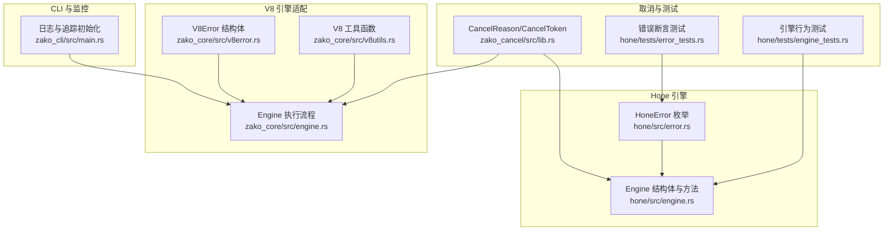
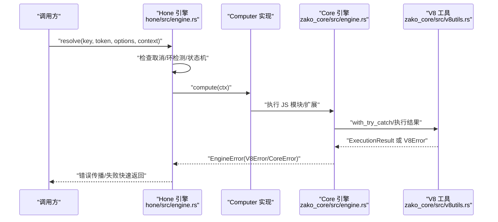
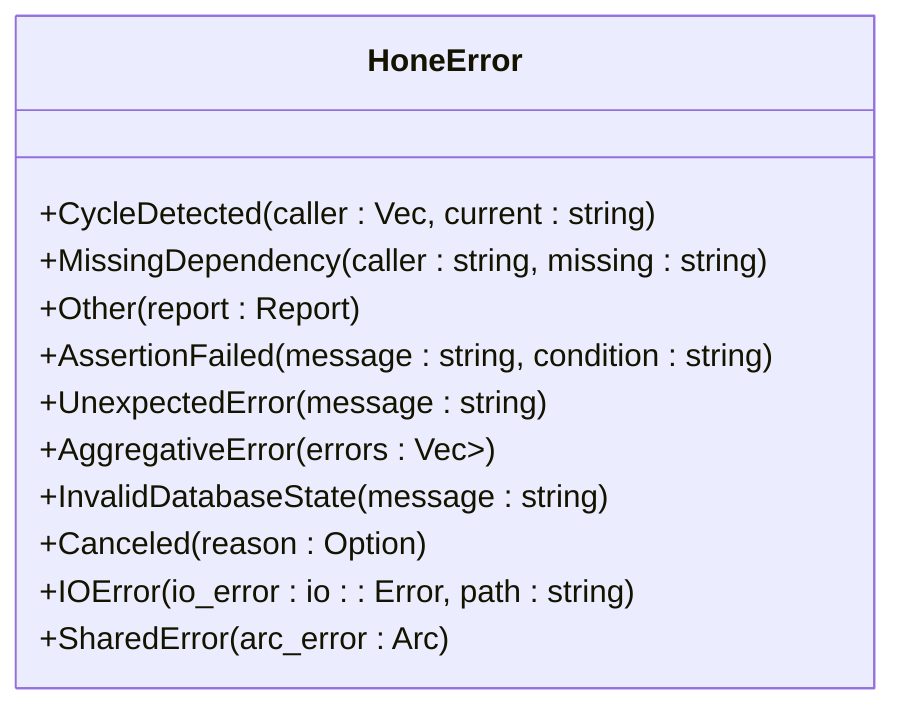
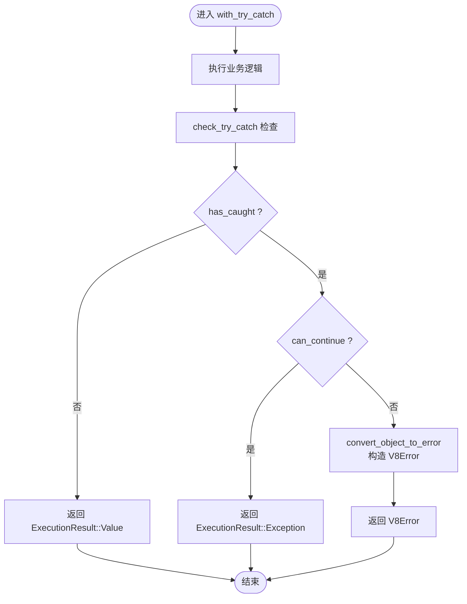
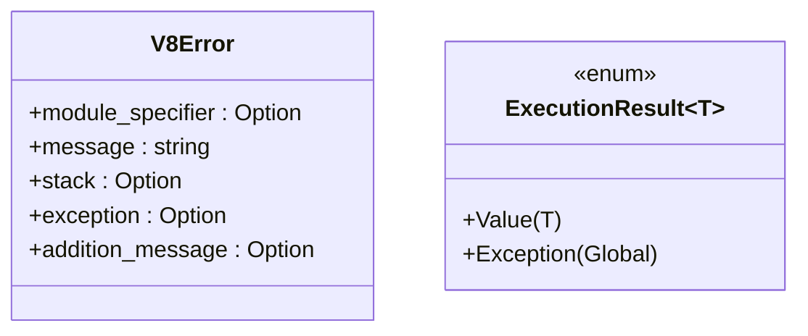
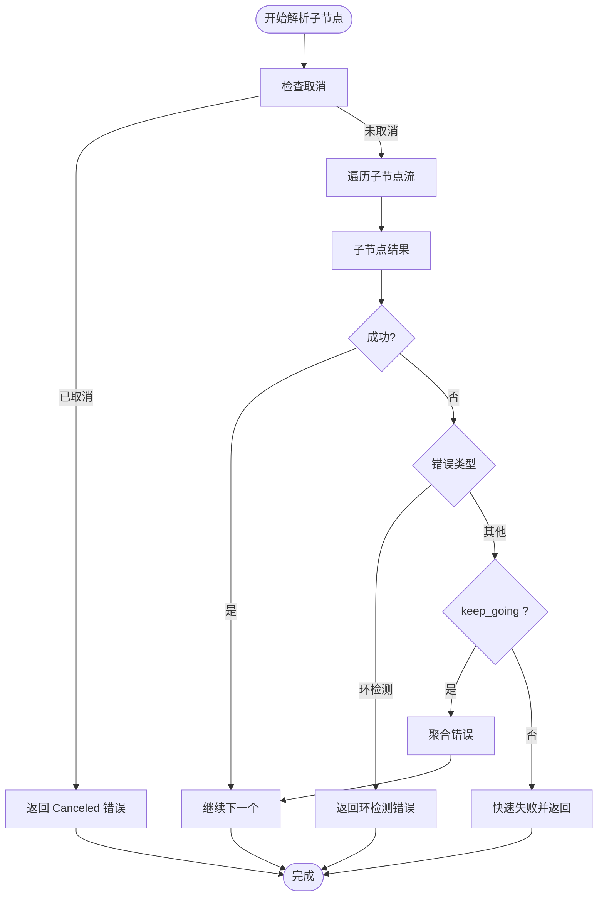
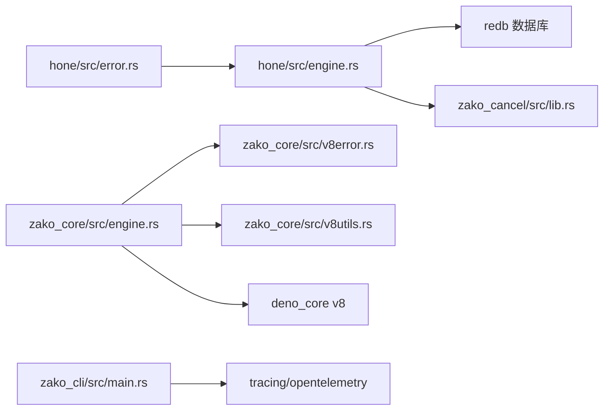

# 错误处理机制

<cite>
**本文引用的文件**
- [hone/src/error.rs](file://hone/src/error.rs)
- [hone/src/engine.rs](file://hone/src/engine.rs)
- [zako_core/src/engine.rs](file://zako_core/src/engine.rs)
- [zako_core/src/v8error.rs](file://zako_core/src/v8error.rs)
- [zako_core/src/v8utils.rs](file://zako_core/src/v8utils.rs)
- [zako_cancel/src/lib.rs](file://zako_cancel/src/lib.rs)
- [hone/tests/error_tests.rs](file://hone/tests/error_tests.rs)
- [hone/tests/engine_tests.rs](file://hone/tests/engine_tests.rs)
- [zako_cli/src/main.rs](file://zako_cli/src/main.rs)
</cite>

## 目录
1. [引言](#引言)
2. [项目结构](#项目结构)
3. [核心组件](#核心组件)
4. [架构总览](#架构总览)
5. [详细组件分析](#详细组件分析)
6. [依赖关系分析](#依赖关系分析)
7. [性能考量](#性能考量)
8. [故障排查指南](#故障排查指南)
9. [结论](#结论)
10. [附录](#附录)

## 引言
本文件系统性阐述 Zako 在引擎层的错误处理机制，覆盖错误分类、传播路径、异常恢复与降级策略。重点包括：
- 引擎层面的错误类型与语义边界
- V8 引擎错误转换与上下文信息采集
- 错误捕获策略、堆栈跟踪生成与调试信息提取
- 不同类型错误的处理方式、重试与失败快速返回策略
- 错误日志记录、监控集成与故障诊断工具
- 面向初学者的循序讲解与面向资深开发者的深度剖析

## 项目结构
围绕错误处理的关键模块分布如下：
- Hone 引擎错误模型与断言宏：hone/src/error.rs、hone/src/engine.rs
- V8 引擎错误数据结构与工具：zako_core/src/v8error.rs、zako_core/src/v8utils.rs
- 引擎桥接与执行流程：zako_core/src/engine.rs
- 取消令牌与取消原因：zako_cancel/src/lib.rs
- 测试用例：hone/tests/error_tests.rs、hone/tests/engine_tests.rs
- CLI 日志与监控集成：zako_cli/src/main.rs

图表来源
- [hone/src/error.rs](file://hone/src/error.rs#L1-L56)
- [hone/src/engine.rs](file://hone/src/engine.rs#L1-L555)
- [zako_core/src/v8error.rs](file://zako_core/src/v8error.rs#L1-L31)
- [zako_core/src/v8utils.rs](file://zako_core/src/v8utils.rs#L1-L188)
- [zako_core/src/engine.rs](file://zako_core/src/engine.rs#L1-L306)
- [zako_cancel/src/lib.rs](file://zako_cancel/src/lib.rs#L1-L158)
- [hone/tests/error_tests.rs](file://hone/tests/error_tests.rs#L1-L21)
- [hone/tests/engine_tests.rs](file://hone/tests/engine_tests.rs#L1-L156)
- [zako_cli/src/main.rs](file://zako_cli/src/main.rs#L470-L670)

章节来源
- [hone/src/error.rs](file://hone/src/error.rs#L1-L56)
- [hone/src/engine.rs](file://hone/src/engine.rs#L1-L555)
- [zako_core/src/v8error.rs](file://zako_core/src/v8error.rs#L1-L31)
- [zako_core/src/v8utils.rs](file://zako_core/src/v8utils.rs#L1-L188)
- [zako_core/src/engine.rs](file://zako_core/src/engine.rs#L1-L306)
- [zako_cancel/src/lib.rs](file://zako_cancel/src/lib.rs#L1-L158)
- [hone/tests/error_tests.rs](file://hone/tests/error_tests.rs#L1-L21)
- [hone/tests/engine_tests.rs](file://hone/tests/engine_tests.rs#L1-L156)
- [zako_cli/src/main.rs](file://zako_cli/src/main.rs#L470-L670)

## 核心组件
- HoneError：定义 Hone 引擎的错误域，涵盖环检测、缺失依赖、断言失败、未预期错误、聚合错误、数据库状态异常、取消、IO 错误以及共享错误等。
- EngineError：定义引擎层错误域，统一承载 CoreError 与 V8Error，作为引擎对外的错误抽象。
- V8Error：承载 V8 异常的模块定位、消息、堆栈、异常对象与附加信息；ExecutionResult 表征 JS 执行结果（返回值或抛出异常）。
- V8 工具：封装 TryCatch、上下文作用域、Promise 状态轮询、异常对象到错误结构的转换、堆栈字符串提取等。
- 取消机制：CancelReason 定义取消原因，CancelToken 提供轻量克隆、级联取消与等待取消信号的能力。

章节来源
- [hone/src/error.rs](file://hone/src/error.rs#L3-L30)
- [zako_core/src/engine.rs](file://zako_core/src/engine.rs#L24-L31)
- [zako_core/src/v8error.rs](file://zako_core/src/v8error.rs#L12-L30)
- [zako_core/src/v8utils.rs](file://zako_core/src/v8utils.rs#L8-L187)
- [zako_cancel/src/lib.rs](file://zako_cancel/src/lib.rs#L8-L32)

## 架构总览
Zako 的错误处理贯穿两层：
- Hone 层：负责节点解析、依赖环检测、并发流式求解、取消传播与失败快速返回策略。
- V8 层：负责 JS 执行上下文、异常捕获、Promise 驱动、异常对象转换与堆栈采集。

图表来源
- [hone/src/engine.rs](file://hone/src/engine.rs#L411-L553)
- [zako_core/src/engine.rs](file://zako_core/src/engine.rs#L81-L300)
- [zako_core/src/v8utils.rs](file://zako_core/src/v8utils.rs#L115-L145)

## 详细组件分析

### Hone 错误模型与断言宏
- 错误分类要点
  - 环检测：携带调用链与当前节点，便于定位环路。
  - 缺失依赖：指示上游依赖缺失。
  - 断言失败：用于暴露程序内部不变量破坏，提示为程序缺陷。
  - 未预期错误：兜底错误，指示引擎内部异常。
  - 聚合错误：多子任务失败时聚合为列表。
  - 数据库状态异常：数据库事务/表/提交/存储错误。
  - 取消：携带取消原因，支持用户中断、超时、失效、饥饿等。
  - IO 错误：访问资源时的底层 IO 失败。
  - 共享错误：Arc<HoneError> 的转换。
- 断言宏
  - assert! 与 debug_assert!：在条件不满足时返回断言失败错误，便于早期暴露问题。

图表来源
- [hone/src/error.rs](file://hone/src/error.rs#L3-L30)

章节来源
- [hone/src/error.rs](file://hone/src/error.rs#L1-L56)
- [hone/tests/error_tests.rs](file://hone/tests/error_tests.rs#L1-L21)

### 引擎错误传播与异常恢复
- 引擎层错误
  - EngineError 统一包装 CoreError 与 V8Error，保证上层以一致的错误类型进行分支处理。
- 执行流程中的错误捕获
  - 使用 with_try_catch 包裹 JS 执行，自动捕获异常并转换为 V8Error。
  - 使用 check_try_catch 检测 TryCatch 状态，区分可继续与不可继续的异常。
  - 使用 convert_object_to_error 将 JS 异常对象转换为 V8Error，保留消息与堆栈。
- 异常恢复策略
  - 对于可继续的异常（如可恢复的 Promise 拒绝），通过 ExecutionResult.Exception 传递给上层决定如何继续。
  - 对于致命异常（不可继续），直接返回 V8Error，由上层转换为 EngineError 并向上抛出。

图表来源
- [zako_core/src/v8utils.rs](file://zako_core/src/v8utils.rs#L8-L37)
- [zako_core/src/v8utils.rs](file://zako_core/src/v8utils.rs#L115-L145)
- [zako_core/src/v8utils.rs](file://zako_core/src/v8utils.rs#L176-L187)

章节来源
- [zako_core/src/engine.rs](file://zako_core/src/engine.rs#L24-L31)
- [zako_core/src/v8utils.rs](file://zako_core/src/v8utils.rs#L8-L187)

### V8 错误转换与上下文信息采集
- V8Error 字段
  - module_specifier：JS 模块定位，便于溯源。
  - message：异常消息。
  - stack：堆栈跟踪（若存在）。
  - exception：异常对象字符串化表示。
  - addition_message：附加信息。
- 转换流程
  - 通过 convert_object_to_error 从 JS 异常对象提取消息与堆栈。
  - 通过 get_stack_trace_string 从异常对象中读取 stack 字段。
  - 通过 convert_rejected_promise_to_error 将被拒绝的 Promise 转换为 V8Error。

图表来源
- [zako_core/src/v8error.rs](file://zako_core/src/v8error.rs#L12-L30)

章节来源
- [zako_core/src/v8error.rs](file://zako_core/src/v8error.rs#L1-L31)
- [zako_core/src/v8utils.rs](file://zako_core/src/v8utils.rs#L147-L187)

### 错误捕获策略、堆栈跟踪与调试信息
- 捕获策略
  - 在引擎执行模块与回调时使用 with_try_catch 包裹，确保任何 JS 抛出的异常被捕获。
  - 对于 Promise，使用 run_event_loop_until_resolved 驱动事件循环直至其变为已决状态，并在死锁场景下返回 V8Error。
- 堆栈跟踪
  - 通过 TryCatch 的 stack_trace 获取堆栈字符串；若异常对象含 stack 字段则优先提取。
- 调试信息
  - 记录模块定位、异常消息、堆栈与附加信息，便于定位问题根因。

章节来源
- [zako_core/src/v8utils.rs](file://zako_core/src/v8utils.rs#L39-L90)
- [zako_core/src/v8utils.rs](file://zako_core/src/v8utils.rs#L147-L187)

### 不同类型错误的处理方式、重试与降级策略
- 环检测（CycleDetected）
  - 在解析子节点时检测到环立即返回错误，调用链会回传完整的调用序列，便于定位。
- 缺失依赖（MissingDependency）
  - 当请求的依赖不存在时返回该错误，提示上游补全依赖。
- 断言失败（AssertionFailed）
  - 指示程序内部不变量被破坏，应视为程序缺陷并上报。
- 未预期错误（UnexpectedError）
  - 引擎内部状态异常时返回，用于兜底。
- 聚合错误（AggregativeError）
  - 多子任务失败时聚合为列表，便于批量处理或统计。
- 数据库状态异常（InvalidDatabaseState）
  - redb 相关错误统一映射为该类错误。
- 取消（Canceled）
  - 支持用户中断、超时、失效、饥饿等场景，携带取消原因。
- IO 错误（IOError）
  - 访问资源失败时返回，包含路径信息。
- 失败快速返回与保持继续
  - Hone 引擎在并行解析子节点时，遇到非环错误默认快速失败，避免资源泄漏；可通过选项控制“继续执行”模式，将错误聚合后统一返回。

图表来源
- [hone/src/engine.rs](file://hone/src/engine.rs#L486-L519)

章节来源
- [hone/src/engine.rs](file://hone/src/engine.rs#L411-L553)

### 重试机制与降级策略
- 重试
  - Hone 引擎未内置自动重试逻辑，建议在上层业务中基于错误类型与上下文进行策略化重试（例如指数退避、幂等性保障）。
- 降级
  - 对于非关键路径的节点，可在失败时返回默认值或缓存值，保证主流程可用。
- 取消传播
  - 通过 CancelToken 将取消信号级联传播至子任务，避免无效计算与资源浪费。

章节来源
- [zako_cancel/src/lib.rs](file://zako_cancel/src/lib.rs#L89-L157)
- [hone/src/engine.rs](file://hone/src/engine.rs#L420-L425)

### 代码示例与最佳实践（路径指引）
- 断言宏使用与断言失败验证
  - 参考：[断言测试](file://hone/tests/error_tests.rs#L4-L20)
- 引擎解析与取消行为
  - 参考：[引擎解析测试](file://hone/tests/engine_tests.rs#L56-L101)、[取消测试](file://hone/tests/engine_tests.rs#L103-L155)
- V8 异常捕获与错误转换
  - 参考：[V8 工具函数](file://zako_core/src/v8utils.rs#L8-L37)、[上下文作用域](file://zako_core/src/v8utils.rs#L95-L109)、[带 TryCatch 版本](file://zako_core/src/v8utils.rs#L115-L145)
- 引擎执行模块与 JSON 输入
  - 参考：[执行模块](file://zako_core/src/engine.rs#L81-L166)、[执行模块并回调](file://zako_core/src/engine.rs#L168-L300)

章节来源
- [hone/tests/error_tests.rs](file://hone/tests/error_tests.rs#L1-L21)
- [hone/tests/engine_tests.rs](file://hone/tests/engine_tests.rs#L1-L156)
- [zako_core/src/v8utils.rs](file://zako_core/src/v8utils.rs#L8-L145)
- [zako_core/src/engine.rs](file://zako_core/src/engine.rs#L81-L300)

## 依赖关系分析
- Hone 引擎依赖 redb 进行持久化，错误通过 EngineError 统一映射。
- V8 工具依赖 deno_core 的 v8 接口，提供异常捕获与转换能力。
- 取消机制通过 tokio_util 的 CancellationToken 提供跨任务取消能力。
- CLI 初始化时配置 OpenTelemetry 与 tracing，形成统一的日志与监控入口。

图表来源
- [hone/src/error.rs](file://hone/src/error.rs#L1-L56)
- [hone/src/engine.rs](file://hone/src/engine.rs#L1-L555)
- [zako_core/src/engine.rs](file://zako_core/src/engine.rs#L1-L306)
- [zako_core/src/v8error.rs](file://zako_core/src/v8error.rs#L1-L31)
- [zako_core/src/v8utils.rs](file://zako_core/src/v8utils.rs#L1-L188)
- [zako_cancel/src/lib.rs](file://zako_cancel/src/lib.rs#L1-L158)
- [zako_cli/src/main.rs](file://zako_cli/src/main.rs#L501-L517)

章节来源
- [hone/src/error.rs](file://hone/src/error.rs#L1-L56)
- [hone/src/engine.rs](file://hone/src/engine.rs#L1-L555)
- [zako_core/src/engine.rs](file://zako_core/src/engine.rs#L1-L306)
- [zako_core/src/v8error.rs](file://zako_core/src/v8error.rs#L1-L31)
- [zako_core/src/v8utils.rs](file://zako_core/src/v8utils.rs#L1-L188)
- [zako_cancel/src/lib.rs](file://zako_cancel/src/lib.rs#L1-L158)
- [zako_cli/src/main.rs](file://zako_cli/src/main.rs#L501-L517)

## 性能考量
- 事件循环驱动：run_event_loop_until_resolved 中通过平台泵消息循环避免忙等，提升 CPU 利用率。
- 并发控制：resolve_inner 使用 buffer_unordered 控制子任务并发度，防止资源争用与过载。
- 快速失败：在 keep_going=false 时快速失败，减少无效计算与内存占用。
- 取消早停：在检查取消处尽早返回，避免无意义的计算与 IO。

章节来源
- [zako_core/src/v8utils.rs](file://zako_core/src/v8utils.rs#L39-L90)
- [hone/src/engine.rs](file://hone/src/engine.rs#L484-L484)

## 故障排查指南
- 常见错误定位
  - 环检测：查看调用链，确认是否存在自依赖或相互依赖。
  - 取消：检查取消原因与触发时机，确认是否为用户中断、超时或失效。
  - V8 异常：关注 V8Error 的 message 与 stack 字段，结合模块定位快速定位脚本位置。
- 日志与监控
  - CLI 初始化时启用 OpenTelemetry 与 tracing，输出结构化日志与追踪信息，便于问题复盘。
  - 可通过环境变量控制回溯级别与颜色输出，提升可观测性。
- 诊断工具
  - 使用断言宏暴露程序不变量，提前发现潜在问题。
  - 在 CI 中开启 keep_going=true 聚合错误，便于批量修复。

章节来源
- [zako_cli/src/main.rs](file://zako_cli/src/main.rs#L470-L517)
- [hone/src/error.rs](file://hone/src/error.rs#L32-L55)
- [zako_core/src/v8error.rs](file://zako_core/src/v8error.rs#L12-L19)

## 结论
Zako 的错误处理机制以清晰的错误域划分与严格的上下文信息采集为基础，结合 V8 异常捕获与引擎层快速失败策略，实现了高可靠与高可诊断性的执行体系。通过取消机制与并发控制，系统在复杂依赖图与异步执行场景下仍能保持稳定与高效。建议在上层业务中配合重试与降级策略，进一步增强鲁棒性。

## 附录
- 错误类型速查
  - HoneError：环检测、缺失依赖、断言失败、未预期错误、聚合错误、数据库状态异常、取消、IO 错误、共享错误。
  - EngineError：CoreError、V8Error。
  - CancelReason：用户中断、兄弟节点失败、超时、失效、资源饥饿、其他。
- 相关实现路径
  - [Hone 错误定义](file://hone/src/error.rs#L3-L30)
  - [引擎错误定义](file://zako_core/src/engine.rs#L24-L31)
  - [V8 错误结构](file://zako_core/src/v8error.rs#L12-L19)
  - [V8 工具函数](file://zako_core/src/v8utils.rs#L8-L187)
  - [取消机制](file://zako_cancel/src/lib.rs#L8-L32)
  - [引擎解析与取消测试](file://hone/tests/engine_tests.rs#L103-L155)