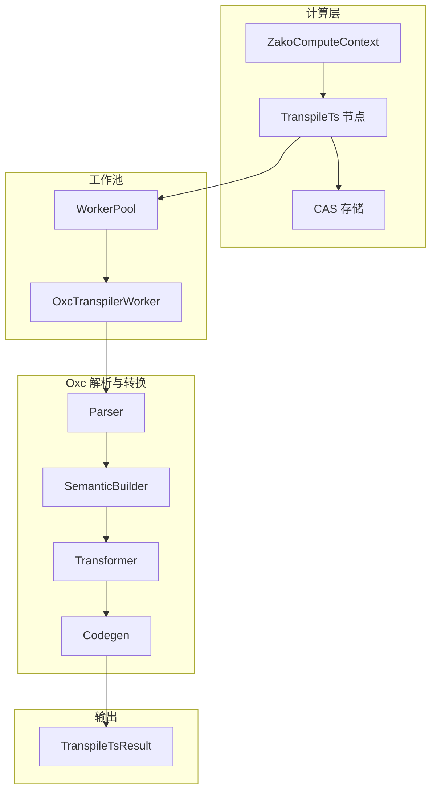
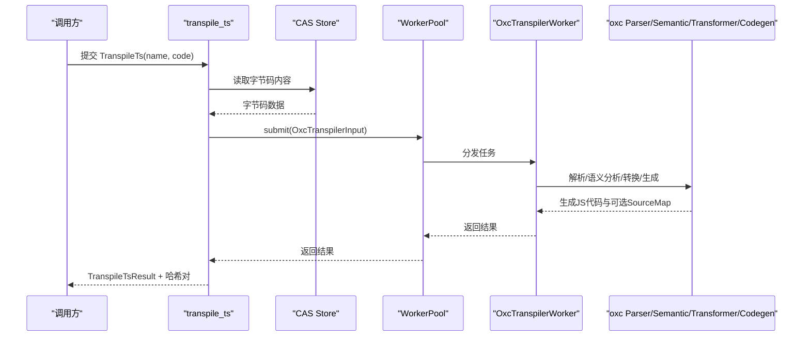
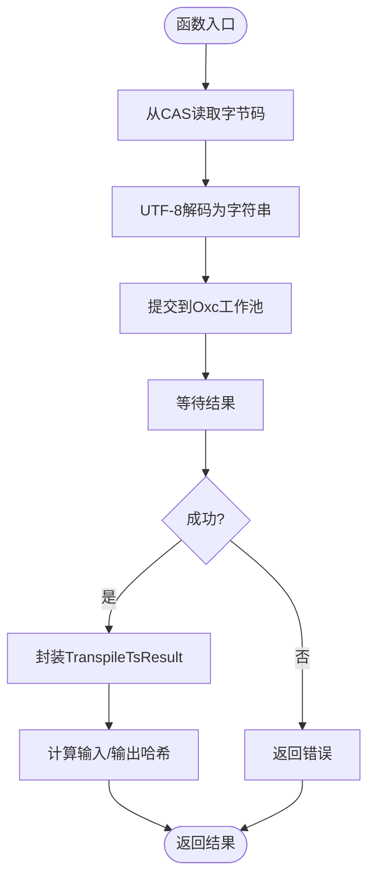
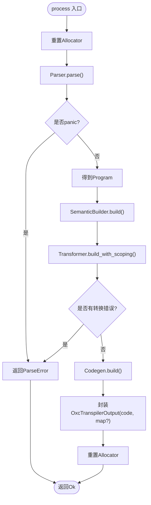
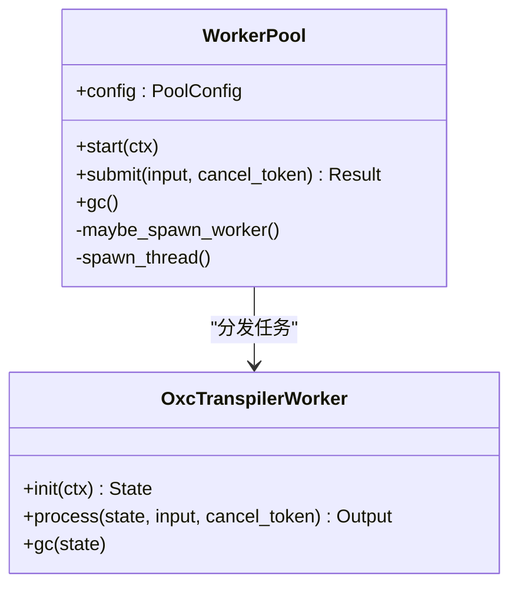
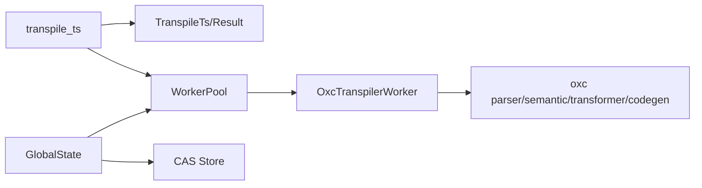

# TypeScript转译器

<cite>
**本文档引用的文件**
- [zako_core/src/compute/transpile_ts.rs](file://zako_core/src/compute/transpile_ts.rs)
- [zako_core/src/node/transpile_ts.rs](file://zako_core/src/node/transpile_ts.rs)
- [zako_core/src/worker/oxc_worker.rs](file://zako_core/src/worker/oxc_worker.rs)
- [zako_core/src/transformer.rs](file://zako_core/src/transformer.rs)
- [zako_core/src/consts.rs](file://zako_core/src/consts.rs)
- [zako_core/src/worker/worker_pool.rs](file://zako_core/src/worker/worker_pool.rs)
- [zako_core/src/global_state.rs](file://zako_core/src/global_state.rs)
- [zako_core/src/v8context.rs](file://zako_core/src/v8context.rs)
- [Cargo.lock](file://Cargo.lock)
- [tests/tsconfig.json](file://tests/tsconfig.json)
- [tests/tsconfig.build.json](file://tests/tsconfig.build.json)
- [tests/tsconfig.library.json](file://tests/tsconfig.library.json)
</cite>

## 目录
1. [简介](#简介)
2. [项目结构](#项目结构)
3. [核心组件](#核心组件)
4. [架构总览](#架构总览)
5. [详细组件分析](#详细组件分析)
6. [依赖关系分析](#依赖关系分析)
7. [性能考量](#性能考量)
8. [故障排查指南](#故障排查指南)
9. [结论](#结论)
10. [附录](#附录)

## 简介
本文件面向Zako的TypeScript转译器，系统性阐述从TypeScript到JavaScript的转译流程（语法解析、语义分析、代码生成），转译器的配置项与编译目标设置，与oxc解析器的集成方式，以及在V8执行环境中的使用路径。文档同时提供性能优化策略、错误诊断方法与常见问题解决方案，并通过图示帮助读者理解关键数据流与调用序列。

## 项目结构
Zako的TypeScript转译器主要由以下模块构成：
- 计算入口与节点定义：负责接收输入、读取CAS存储、提交任务至工作池，并封装转译结果。
- 工作池与工作行为：统一的任务调度与并发执行框架，支持动态扩容与GC回收。
- Oxc转译器工作单元：基于oxc的解析、语义分析与代码生成流水线。
- 常量与目标：定义默认转译目标版本（如es2026）等全局配置。
- V8上下文：定义在不同构建场景下可启用的V8上下文类型与权限边界。

图表来源
- [zako_core/src/compute/transpile_ts.rs](file://zako_core/src/compute/transpile_ts.rs#L17-L85)
- [zako_core/src/node/transpile_ts.rs](file://zako_core/src/node/transpile_ts.rs#L5-L30)
- [zako_core/src/worker/worker_pool.rs](file://zako_core/src/worker/worker_pool.rs#L56-L184)
- [zako_core/src/worker/oxc_worker.rs](file://zako_core/src/worker/oxc_worker.rs#L57-L149)

章节来源
- [zako_core/src/compute/transpile_ts.rs](file://zako_core/src/compute/transpile_ts.rs#L1-L113)
- [zako_core/src/node/transpile_ts.rs](file://zako_core/src/node/transpile_ts.rs#L1-L31)
- [zako_core/src/worker/worker_pool.rs](file://zako_core/src/worker/worker_pool.rs#L1-L185)
- [zako_core/src/worker/oxc_worker.rs](file://zako_core/src/worker/oxc_worker.rs#L1-L150)

## 核心组件
- TranspileTs/TranspileTsResult：转译任务输入与输出的数据结构，包含源码与可选SourceMap。
- OxcTranspilerWorker：实现WorkerBehavior，封装Parser/SemanticBuilder/Transformer/Codegen的完整流水线。
- WorkerPool：通用工作池，支持动态扩容、空闲回收与取消令牌。
- GlobalState：全局状态持有CAS存储、工作池实例与资源池，初始化时启动各工作池。
- 转译目标：通过consts::TRANSPILE_TARGET统一管理，默认目标为es2026。

章节来源
- [zako_core/src/node/transpile_ts.rs](file://zako_core/src/node/transpile_ts.rs#L5-L30)
- [zako_core/src/worker/oxc_worker.rs](file://zako_core/src/worker/oxc_worker.rs#L48-L149)
- [zako_core/src/worker/worker_pool.rs](file://zako_core/src/worker/worker_pool.rs#L56-L184)
- [zako_core/src/global_state.rs](file://zako_core/src/global_state.rs#L41-L97)
- [zako_core/src/consts.rs](file://zako_core/src/consts.rs#L25-L28)

## 架构总览
下图展示了从计算入口到Oxc工作单元的端到端调用链路，以及与CAS存储、工作池的交互。

图表来源
- [zako_core/src/compute/transpile_ts.rs](file://zako_core/src/compute/transpile_ts.rs#L17-L85)
- [zako_core/src/worker/worker_pool.rs](file://zako_core/src/worker/worker_pool.rs#L156-L178)
- [zako_core/src/worker/oxc_worker.rs](file://zako_core/src/worker/oxc_worker.rs#L69-L144)

## 详细组件分析

### 组件A：转译计算入口（transpile_ts）
职责
- 从CAS读取原始字节码，构造OxcTranspilerInput并提交给工作池。
- 将Oxc输出封装为TranspileTsResult，并计算输入/输出哈希对用于缓存与去重。

关键流程
- 读取字节码并校验UTF-8转换。
- 提交任务并等待结果，处理提交/执行阶段的错误。
- 封装输出并计算哈希。

图表来源
- [zako_core/src/compute/transpile_ts.rs](file://zako_core/src/compute/transpile_ts.rs#L17-L85)

章节来源
- [zako_core/src/compute/transpile_ts.rs](file://zako_core/src/compute/transpile_ts.rs#L17-L113)

### 组件B：Oxc工作单元（OxcTranspilerWorker）
职责
- 实现WorkerBehavior，完成Parser/SemanticBuilder/Transformer/Codegen的完整流水线。
- 使用TransformOptions::from_target(consts::TRANSPILE_TARGET)应用默认转译目标。
- 支持错误收集与SourceMap生成。

关键流程
- 解析：Parser::new(...).parse()，若panicked则返回ParseError。
- 语义分析：SemanticBuilder构建作用域信息。
- 转换：Transformer::new(...) + build_with_scoping。
- 代码生成：Codegen::new().build(...)，并将SourceMap序列化为JSON字符串。

图表来源
- [zako_core/src/worker/oxc_worker.rs](file://zako_core/src/worker/oxc_worker.rs#L69-L144)

章节来源
- [zako_core/src/worker/oxc_worker.rs](file://zako_core/src/worker/oxc_worker.rs#L48-L149)
- [zako_core/src/consts.rs](file://zako_core/src/consts.rs#L25-L28)

### 组件C：工作池（WorkerPool）
职责
- 统一的任务分发与并发执行框架。
- 动态扩容：根据队列积压与当前活跃线程数决定是否新建工作线程。
- GC回收：周期性触发Worker的gc以重置内部状态（如Allocator）。
- 取消支持：通过CancelToken中断长时间运行的任务。

图表来源
- [zako_core/src/worker/worker_pool.rs](file://zako_core/src/worker/worker_pool.rs#L56-L184)
- [zako_core/src/worker/oxc_worker.rs](file://zako_core/src/worker/oxc_worker.rs#L57-L149)

章节来源
- [zako_core/src/worker/worker_pool.rs](file://zako_core/src/worker/worker_pool.rs#L1-L185)
- [zako_core/src/worker/oxc_worker.rs](file://zako_core/src/worker/oxc_worker.rs#L1-L150)

### 组件D：全局状态与工作池初始化（GlobalState）
职责
- 初始化Tokio运行时、CAS存储、工作池。
- 启动Oxc与V8工作池，供后续计算上下文使用。

章节来源
- [zako_core/src/global_state.rs](file://zako_core/src/global_state.rs#L41-L97)

### 组件E：V8上下文类型（V8ContextInput/Output）
职责
- 定义不同构建场景下的V8上下文类型（包脚本、构建文件、规则、工具链、配置）。
- 明确各上下文的权限与能力边界。

章节来源
- [zako_core/src/v8context.rs](file://zako_core/src/v8context.rs#L12-L61)

## 依赖关系分析
- 外部依赖：oxc系列（parser、semantic、transformer、codegen、allocator、span等）。
- 内部依赖：compute层依赖node层的TranspileTs/Result、worker层的WorkerPool与OxcTranspilerWorker；GlobalState持有CAS与工作池实例。

图表来源
- [zako_core/src/compute/transpile_ts.rs](file://zako_core/src/compute/transpile_ts.rs#L1-L15)
- [zako_core/src/worker/worker_pool.rs](file://zako_core/src/worker/worker_pool.rs#L1-L15)
- [zako_core/src/global_state.rs](file://zako_core/src/global_state.rs#L41-L51)
- [Cargo.lock](file://Cargo.lock#L3815-L3880)

章节来源
- [Cargo.lock](file://Cargo.lock#L3815-L3880)
- [zako_core/src/compute/transpile_ts.rs](file://zako_core/src/compute/transpile_ts.rs#L1-L15)
- [zako_core/src/global_state.rs](file://zako_core/src/global_state.rs#L41-L51)

## 性能考量
- 并发模型：工作池根据CPU核数初始化Tokio运行时，工作线程数与队列长度按配置动态调整，避免过载与饥饿。
- 内存复用：OxcTranspilerWorker内部维护Allocator，每次任务开始前重置，结束时可选择性重置，降低分配开销。
- GC策略：通过周期性广播触发Worker的gc，重建Allocator以回收内存。
- 取消与超时：支持CancelToken中断任务，避免长时间阻塞。
- 缓存与哈希：计算输入/输出哈希对，便于上层进行缓存命中与增量构建。

章节来源
- [zako_core/src/global_state.rs](file://zako_core/src/global_state.rs#L75-L89)
- [zako_core/src/worker/worker_pool.rs](file://zako_core/src/worker/worker_pool.rs#L121-L178)
- [zako_core/src/worker/oxc_worker.rs](file://zako_core/src/worker/oxc_worker.rs#L63-L67)
- [zako_core/src/compute/transpile_ts.rs](file://zako_core/src/compute/transpile_ts.rs#L78-L84)

## 故障排查指南
常见错误类型
- 解析失败：Parser返回panic或错误列表，封装为TransformerError::ParseError。
- 目标版本解析失败：TransformOptions::from_target失败，返回TransformerError::ESTargetError。
- 提交/执行失败：工作池未启动、任务被取消或工作线程异常，返回WorkerPoolError或任务取消错误。

诊断步骤
- 检查输入源码是否为有效UTF-8，确认TranspileTs.name与源文件一致以便定位。
- 查看工作池状态与队列长度，确认是否存在大量积压导致延迟。
- 开启日志追踪（trace_span），观察“oxc transpile”跨度内的错误堆栈。
- 若出现目标版本不兼容，检查consts::TRANSPILE_TARGET与实际环境兼容性。

章节来源
- [zako_core/src/worker/oxc_worker.rs](file://zako_core/src/worker/oxc_worker.rs#L18-L24)
- [zako_core/src/worker/worker_pool.rs](file://zako_core/src/worker/worker_pool.rs#L17-L25)
- [zako_core/src/compute/transpile_ts.rs](file://zako_core/src/compute/transpile_ts.rs#L44-L69)

## 结论
Zako的TypeScript转译器以Oxc为核心，结合自研工作池与CAS存储，实现了高性能、可扩展的TypeScript到JavaScript转译能力。通过统一的目标版本配置、完善的错误处理与内存回收策略，系统在保证正确性的同时兼顾了吞吐与稳定性。配合V8上下文类型定义，转译产物可在不同构建场景中安全执行。

## 附录

### 配置与编译目标
- 默认转译目标：es2026（可通过consts::TRANSPILE_TARGET修改）。
- 相关配置参考：tests目录下的多份tsconfig文件，展示不同场景（build、library、package、rule、toolchain、config、script）的编译选项与引用关系。

章节来源
- [zako_core/src/consts.rs](file://zako_core/src/consts.rs#L25-L28)
- [tests/tsconfig.json](file://tests/tsconfig.json#L1-L26)
- [tests/tsconfig.build.json](file://tests/tsconfig.build.json#L1-L34)
- [tests/tsconfig.library.json](file://tests/tsconfig.library.json#L1-L31)

### 与V8执行环境的集成
- V8上下文类型：通过V8ContextInput/Output枚举区分包脚本、构建文件、规则、工具链、配置等场景，赋予相应权限。
- 执行路径：转译后的JavaScript代码可由V8Worker承载的V8上下文加载与执行，具体细节由V8Worker实现。

章节来源
- [zako_core/src/v8context.rs](file://zako_core/src/v8context.rs#L12-L61)
- [zako_core/src/global_state.rs](file://zako_core/src/global_state.rs#L48-L50)