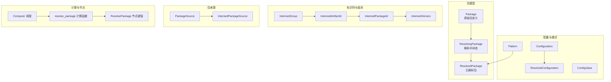
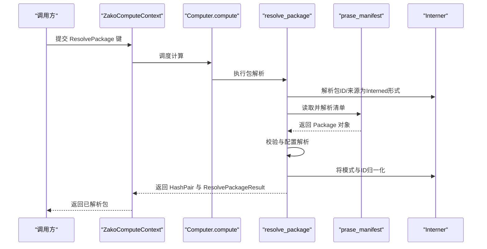
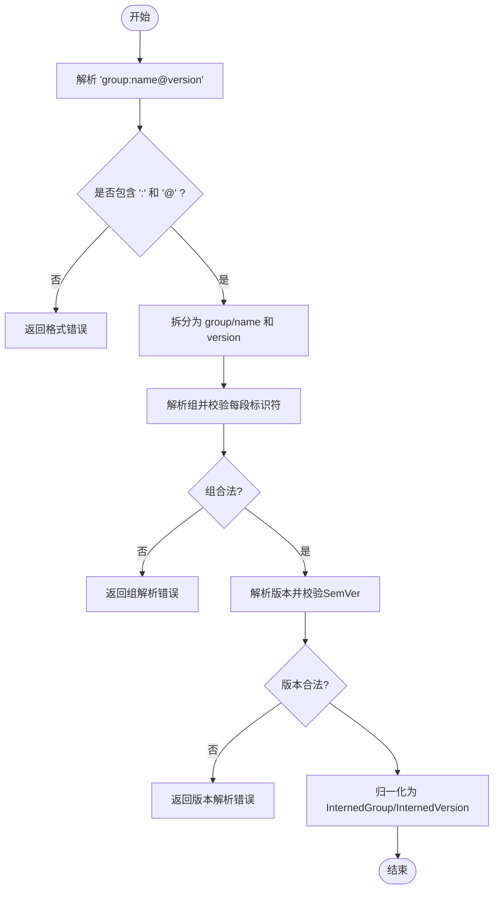
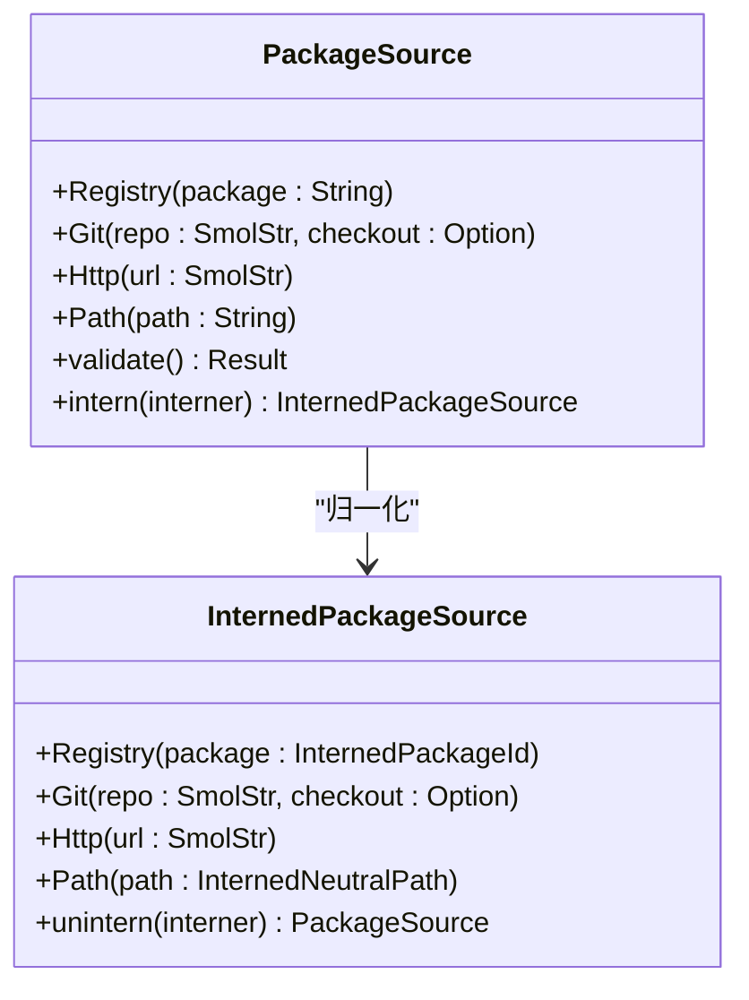
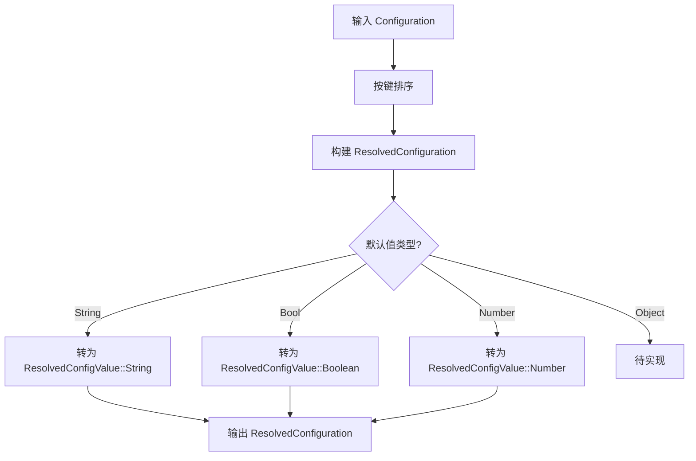
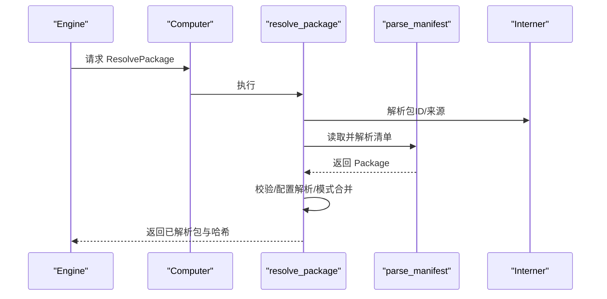
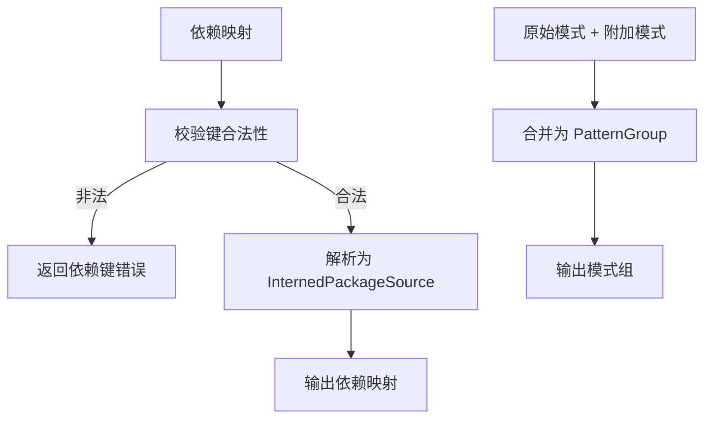
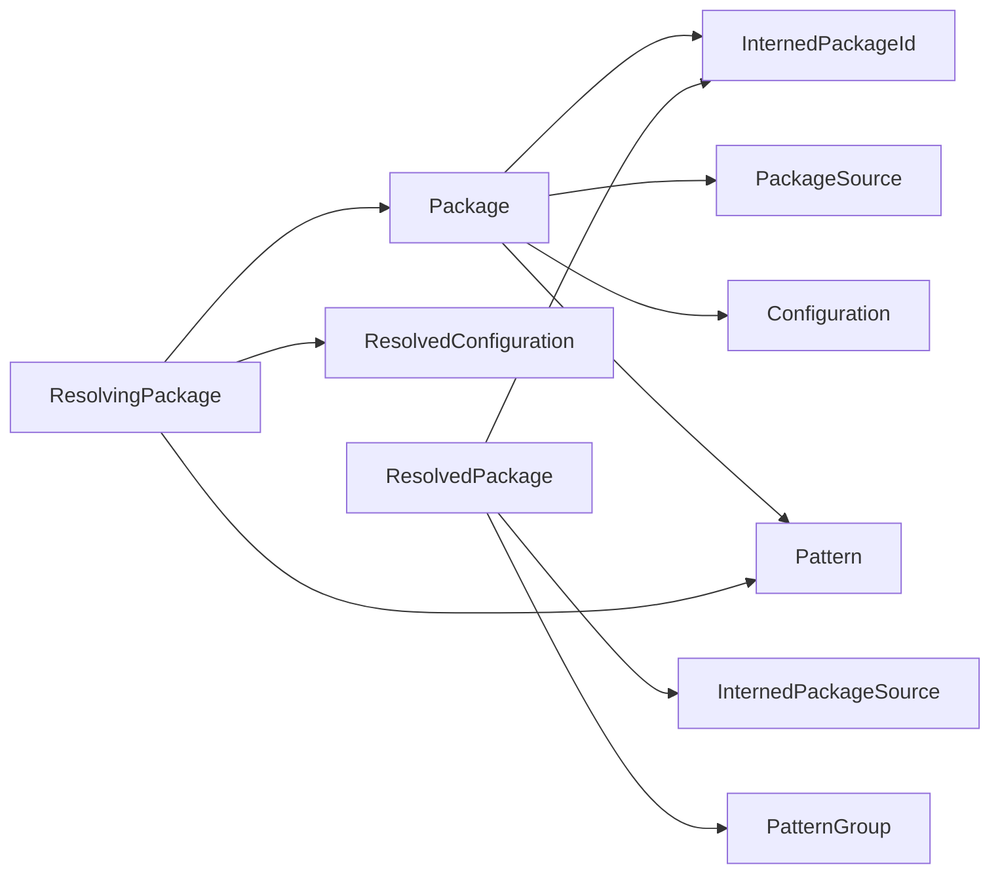

# 包解析器

<cite>
**本文引用的文件**
- [zako_core/src/package.rs](file://zako_core/src/package.rs)
- [zako_core/src/package_id.rs](file://zako_core/src/package_id.rs)
- [zako_core/src/package_source.rs](file://zako_core/src/package_source.rs)
- [zako_core/src/compute/resolve_package.rs](file://zako_core/src/compute/resolve_package.rs)
- [zako_core/src/node/resolve_package.rs](file://zako_core/src/node/resolve_package.rs)
- [zako_core/src/compute/parse_manifest.rs](file://zako_core/src/compute/parse_manifest.rs)
- [zako_core/src/config.rs](file://zako_core/src/config.rs)
- [zako_core/src/config_value.rs](file://zako_core/src/config_value.rs)
- [zako_core/src/pattern.rs](file://zako_core/src/pattern.rs)
- [zako_core/src/id.rs](file://zako_core/src/id.rs)
- [zako_core/src/computer.rs](file://zako_core/src/computer.rs)
- [zako_core/src/node/parse_manifest.rs](file://zako_core/src/node/parse_manifest.rs)
- [zako_core/src/tests/package_tests.rs](file://zako_core/src/tests/package_tests.rs)
</cite>

## 目录
1. [简介](#简介)
2. [项目结构](#项目结构)
3. [核心组件](#核心组件)
4. [架构总览](#架构总览)
5. [组件详解](#组件详解)
6. [依赖关系分析](#依赖关系分析)
7. [性能考量](#性能考量)
8. [故障排除指南](#故障排除指南)
9. [结论](#结论)
10. [附录](#附录)

## 简介
本文件面向Zako的包解析器，系统性阐述其算法与实现机制，覆盖包标识符解析、版本管理、依赖查找、包来源解析策略、模块加载流程中的关键作用以及性能优化要点。文档同时提供可定位到源码的示例路径，帮助读者快速对照实现细节，并给出配置项与扩展建议。

## 项目结构
围绕包解析的关键代码主要位于zako_core模块，涉及以下子系统：
- 包模型与解析：Package、ResolvingPackage、ResolvedPackage
- 标识符与版本：InternedGroup、InternedArtifactId、InternedPackageId、InternedVersion
- 包来源：PackageSource、InternedPackageSource
- 计算与节点：resolve_package计算函数、ResolvePackage节点键值
- 配置与模式：Configuration、ResolvedConfiguration、ConfigValue、Pattern
- 计算机与调度：Computer、ZakoComputeContext

**图表来源**
- [zako_core/src/package.rs](file://zako_core/src/package.rs#L68-L239)
- [zako_core/src/package_id.rs](file://zako_core/src/package_id.rs#L21-L205)
- [zako_core/src/package_source.rs](file://zako_core/src/package_source.rs#L25-L173)
- [zako_core/src/config.rs](file://zako_core/src/config.rs#L14-L118)
- [zako_core/src/config_value.rs](file://zako_core/src/config_value.rs#L8-L166)
- [zako_core/src/pattern.rs](file://zako_core/src/pattern.rs#L16-L200)
- [zako_core/src/compute/resolve_package.rs](file://zako_core/src/compute/resolve_package.rs#L26-L140)
- [zako_core/src/node/resolve_package.rs](file://zako_core/src/node/resolve_package.rs#L6-L17)
- [zako_core/src/computer.rs](file://zako_core/src/computer.rs#L23-L77)

**章节来源**
- [zako_core/src/package.rs](file://zako_core/src/package.rs#L1-L316)
- [zako_core/src/package_id.rs](file://zako_core/src/package_id.rs#L1-L206)
- [zako_core/src/package_source.rs](file://zako_core/src/package_source.rs#L1-L173)
- [zako_core/src/computer.rs](file://zako_core/src/computer.rs#L1-L77)

## 核心组件
- Package：原始包定义，包含组、构件、版本、脚本、描述、作者、许可证、构建/规则/工具链/同伴模式、依赖映射、挂载配置、配置字典等字段。
- ResolvingPackage：解析中间态，持有原始Package与已解析配置，支持附加模式（peers/builds/rules/toolchains）。
- ResolvedPackage：最终解析产物，所有字符串均以Interned形式存储，便于哈希与缓存；包含构建/规则/工具链/同伴的模式组。
- InternedPackageId/InternedArtifactId/InternedGroup/InternedVersion：包标识符与版本的强类型、不可变、可哈希表示。
- PackageSource/InternedPackageSource：包来源抽象，支持Registry/Git/Http/Path四种来源，Path来源需相对项目根且不越界。
- Configuration/ResolvedConfiguration/ConfigValue：配置模型，支持类型与默认值，解析为可索引的内部配置。
- Pattern：文件匹配模式，支持忽略文件与隐藏文件控制，用于构建/规则/工具链/同伴的文件选择。

**章节来源**
- [zako_core/src/package.rs](file://zako_core/src/package.rs#L68-L239)
- [zako_core/src/package_id.rs](file://zako_core/src/package_id.rs#L21-L205)
- [zako_core/src/package_source.rs](file://zako_core/src/package_source.rs#L25-L173)
- [zako_core/src/config.rs](file://zako_core/src/config.rs#L14-L118)
- [zako_core/src/config_value.rs](file://zako_core/src/config_value.rs#L8-L166)
- [zako_core/src/pattern.rs](file://zako_core/src/pattern.rs#L16-L200)

## 架构总览
包解析在构建图中的调用序列如下：

**图表来源**
- [zako_core/src/computer.rs](file://zako_core/src/computer.rs#L23-L77)
- [zako_core/src/compute/resolve_package.rs](file://zako_core/src/compute/resolve_package.rs#L26-L140)
- [zako_core/src/compute/parse_manifest.rs](file://zako_core/src/compute/parse_manifest.rs#L11-L31)
- [zako_core/src/node/resolve_package.rs](file://zako_core/src/node/resolve_package.rs#L6-L17)
- [zako_core/src/node/parse_manifest.rs](file://zako_core/src/node/parse_manifest.rs#L3-L11)

## 组件详解

### 包标识符解析与版本管理
- 组（Group）：域名反写，段间以点分隔，每段需满足宽松标识符规则。
- 构件（Artifact）：名称需满足宽松标识符规则。
- 版本（Version）：遵循SemVer 2.0.0规范。
- 完整包ID：格式为“group:name@version”，解析时分别校验各部分合法性并归一化为Interned类型。

**图表来源**
- [zako_core/src/package_id.rs](file://zako_core/src/package_id.rs#L132-L196)

**章节来源**
- [zako_core/src/package_id.rs](file://zako_core/src/package_id.rs#L1-L206)
- [zako_core/src/tests/package_tests.rs](file://zako_core/src/tests/package_tests.rs#L4-L42)

### 包来源解析策略
- Registry：以“group:name@version”字符串形式传入，解析为InternedPackageId。
- Git：仓库URL与可选checkout分支/提交。
- Http：直接下载URL。
- Path：相对项目根目录的路径，必须相对且不越界，解析为InternedNeutralPath。

**图表来源**
- [zako_core/src/package_source.rs](file://zako_core/src/package_source.rs#L25-L173)

**章节来源**
- [zako_core/src/package_source.rs](file://zako_core/src/package_source.rs#L1-L173)

### 配置与模式解析
- Configuration：从原始配置字典生成，键需满足标识符规则，值支持字符串/布尔/数字/对象（对象待实现）。
- ResolvedConfiguration：排序后生成键值对，便于稳定哈希与查询。
- ConfigValue：携带类型与默认值，支持对象型操作（当前未完全实现）。
- Pattern：多模式匹配，支持忽略标准忽略文件与隐藏文件，Interned后可并行遍历。

**图表来源**
- [zako_core/src/config.rs](file://zako_core/src/config.rs#L41-L72)
- [zako_core/src/config_value.rs](file://zako_core/src/config_value.rs#L23-L166)
- [zako_core/src/pattern.rs](file://zako_core/src/pattern.rs#L132-L177)

**章节来源**
- [zako_core/src/config.rs](file://zako_core/src/config.rs#L1-L118)
- [zako_core/src/config_value.rs](file://zako_core/src/config_value.rs#L1-L166)
- [zako_core/src/pattern.rs](file://zako_core/src/pattern.rs#L1-L200)

### 包解析主流程与模块加载
- 计算入口：Computer根据ZakoKey分发到对应计算函数。
- resolve_package：解析包ID与来源，定位清单文件，读取并解析为Package，随后进行验证、配置解析、模式合并与归一化，最终产出ResolvedPackage并记录哈希。
- parse_manifest：从BlobHandle读取清单内容，反序列化为Package并计算哈希。

**图表来源**
- [zako_core/src/computer.rs](file://zako_core/src/computer.rs#L23-L77)
- [zako_core/src/compute/resolve_package.rs](file://zako_core/src/compute/resolve_package.rs#L26-L140)
- [zako_core/src/compute/parse_manifest.rs](file://zako_core/src/compute/parse_manifest.rs#L11-L31)
- [zako_core/src/node/resolve_package.rs](file://zako_core/src/node/resolve_package.rs#L6-L17)

**章节来源**
- [zako_core/src/computer.rs](file://zako_core/src/computer.rs#L1-L77)
- [zako_core/src/compute/resolve_package.rs](file://zako_core/src/compute/resolve_package.rs#L1-L140)
- [zako_core/src/compute/parse_manifest.rs](file://zako_core/src/compute/parse_manifest.rs#L1-L31)
- [zako_core/src/node/resolve_package.rs](file://zako_core/src/node/resolve_package.rs#L1-L17)

### 依赖查找与模式合并
- 依赖映射：键需满足宽松标识符规则，值为PackageSource，解析后统一为InternedPackageSource。
- 模式合并：每个模式组（builds/rules/toolchains/peers）支持原始模式与附加模式的合并，形成PatternGroup，便于后续并行遍历与匹配。

**图表来源**
- [zako_core/src/package.rs](file://zako_core/src/package.rs#L88-L115)
- [zako_core/src/package.rs](file://zako_core/src/package.rs#L158-L221)
- [zako_core/src/pattern.rs](file://zako_core/src/pattern.rs#L197-L200)

**章节来源**
- [zako_core/src/package.rs](file://zako_core/src/package.rs#L88-L221)
- [zako_core/src/pattern.rs](file://zako_core/src/pattern.rs#L197-L200)

## 依赖关系分析
- 包模型依赖于标识符与版本模块，确保ID与版本的强约束与可哈希性。
- 包来源依赖于路径与中立路径模块，确保Path来源的安全性与可归一化。
- 配置与模式模块为包解析提供稳定的配置与文件匹配能力。
- 计算模块通过Computer统一调度，将解析流程嵌入构建图，实现缓存与增量。

**图表来源**
- [zako_core/src/package.rs](file://zako_core/src/package.rs#L68-L239)
- [zako_core/src/package_id.rs](file://zako_core/src/package_id.rs#L114-L205)
- [zako_core/src/package_source.rs](file://zako_core/src/package_source.rs#L100-L173)
- [zako_core/src/config.rs](file://zako_core/src/config.rs#L14-L118)
- [zako_core/src/pattern.rs](file://zako_core/src/pattern.rs#L197-L200)

**章节来源**
- [zako_core/src/package.rs](file://zako_core/src/package.rs#L1-L316)
- [zako_core/src/package_id.rs](file://zako_core/src/package_id.rs#L1-L206)
- [zako_core/src/package_source.rs](file://zako_core/src/package_source.rs#L1-L173)
- [zako_core/src/config.rs](file://zako_core/src/config.rs#L1-L118)
- [zako_core/src/pattern.rs](file://zako_core/src/pattern.rs#L1-L200)

## 性能考量
- 归一化与哈希：所有字符串与标识符采用Interned形式，显著降低重复存储与比较成本；Blake3哈希用于构建图缓存与去重。
- 并行模式遍历：PatternGroup支持并行遍历，提升大规模文件匹配效率。
- 清单解析：parse_manifest直接从BlobHandle读取，避免重复内存拷贝；后续可进一步优化为流式解析。
- 增量与缓存：resolve_package返回输入/输出哈希，便于构建图缓存命中与增量执行。

[本节为通用性能讨论，无需列出具体文件来源]

## 故障排除指南
- 包ID格式错误：检查“group:name@version”格式是否正确，组与版本是否满足解析规则。
- 依赖键非法：确认依赖映射的键满足宽松标识符规则。
- Path来源越界：确保Path相对项目根且不访问根外路径。
- 配置键非法：确认配置字典的键满足标识符规则。
- 版本不符合SemVer：确保版本字符串符合SemVer 2.0.0规范。
- 模式解析错误：检查Pattern语法与忽略文件设置。

**章节来源**
- [zako_core/src/package.rs](file://zako_core/src/package.rs#L88-L115)
- [zako_core/src/package_source.rs](file://zako_core/src/package_source.rs#L68-L84)
- [zako_core/src/package_id.rs](file://zako_core/src/package_id.rs#L9-L19)
- [zako_core/src/config.rs](file://zako_core/src/config.rs#L91-L99)
- [zako_core/src/pattern.rs](file://zako_core/src/pattern.rs#L90-L98)

## 结论
Zako的包解析器通过强约束的标识符与版本模型、安全的包来源解析、稳定的配置与模式系统，以及基于构建图的计算调度，实现了可缓存、可扩展、可并行的包解析流程。其设计兼顾了正确性与性能，适合在大型工程中作为模块加载与依赖管理的核心组件。

[本节为总结性内容，无需列出具体文件来源]

## 附录

### 关键流程与示例路径
- 包解析主流程：[zako_core/src/compute/resolve_package.rs](file://zako_core/src/compute/resolve_package.rs#L26-L140)
- 清单解析：[zako_core/src/compute/parse_manifest.rs](file://zako_core/src/compute/parse_manifest.rs#L11-L31)
- 计算分发：[zako_core/src/computer.rs](file://zako_core/src/computer.rs#L23-L77)
- 包模型与解析：[zako_core/src/package.rs](file://zako_core/src/package.rs#L68-L239)
- 标识符与版本：[zako_core/src/package_id.rs](file://zako_core/src/package_id.rs#L1-L206)
- 包来源：[zako_core/src/package_source.rs](file://zako_core/src/package_source.rs#L1-L173)
- 配置与模式：[zako_core/src/config.rs](file://zako_core/src/config.rs#L1-L118), [zako_core/src/config_value.rs](file://zako_core/src/config_value.rs#L1-L166), [zako_core/src/pattern.rs](file://zako_core/src/pattern.rs#L1-L200)
- 节点键值：[zako_core/src/node/resolve_package.rs](file://zako_core/src/node/resolve_package.rs#L6-L17), [zako_core/src/node/parse_manifest.rs](file://zako_core/src/node/parse_manifest.rs#L3-L11)

### 配置选项与扩展建议
- 模式忽略行为：可通过Pattern的following_ignore_files与ignore_hidden_files控制。
- 配置类型扩展：ConfigValue支持字符串/布尔/数字，默认保留对象类型占位以便后续扩展。
- 包来源扩展：可在PackageSource新增枚举变体，并在Internable实现中添加对应归一化逻辑。
- 依赖键校验：保持对宽松标识符规则的严格校验，确保跨平台一致性。

[本节为通用指导，无需列出具体文件来源]