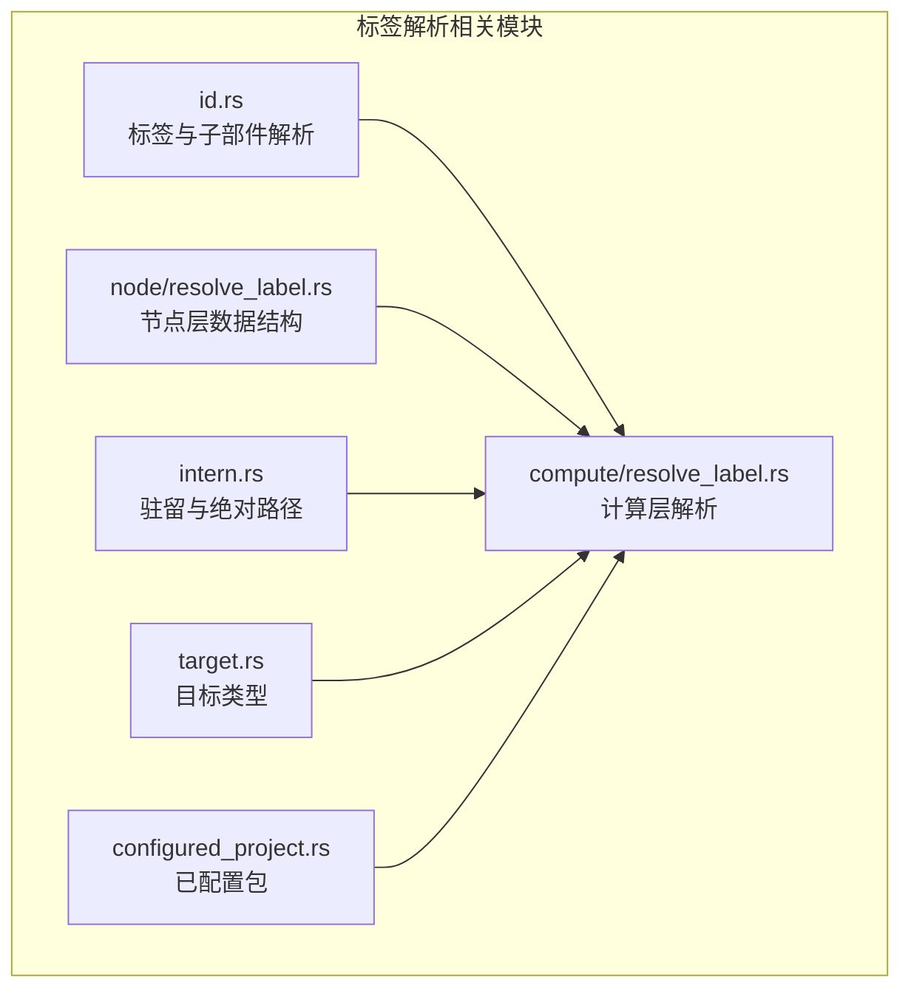
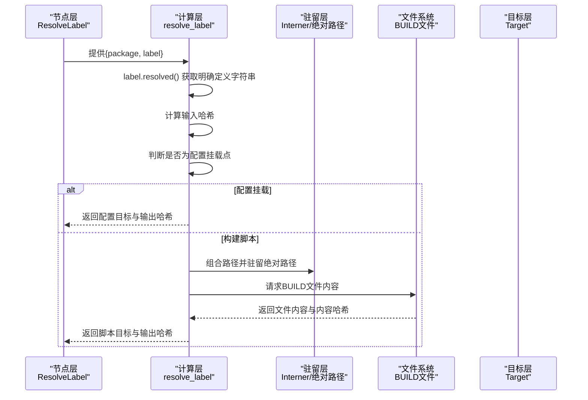
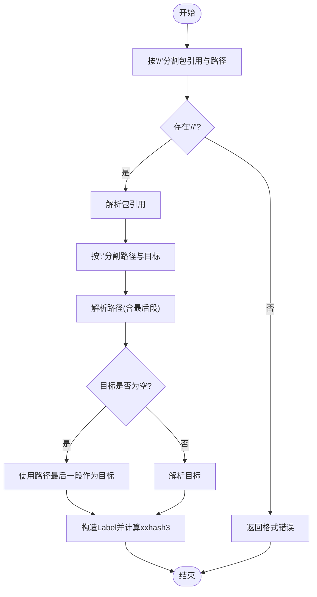
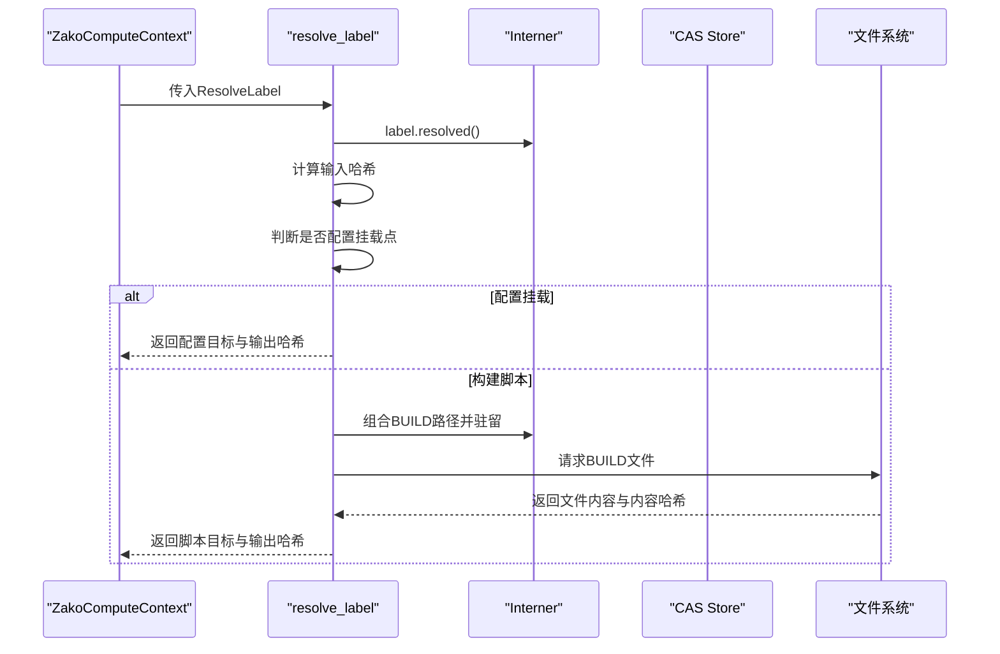
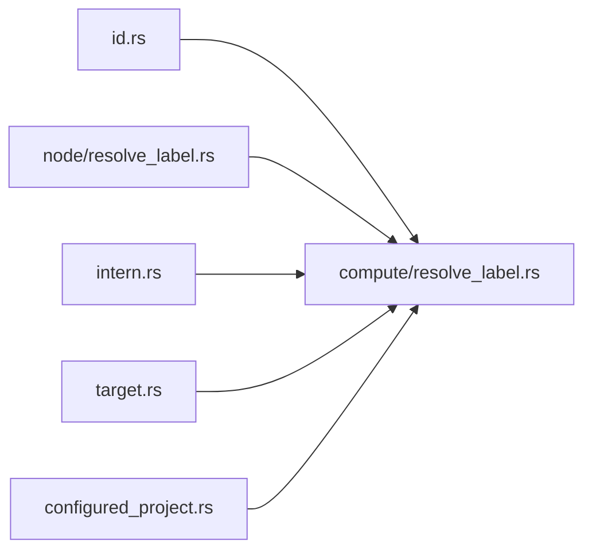

# 标签解析器

<cite>
**本文档引用的文件**
- [zako_core/src/id.rs](file://zako_core/src/id.rs)
- [zako_core/src/compute/resolve_label.rs](file://zako_core/src/compute/resolve_label.rs)
- [zako_core/src/node/resolve_label.rs](file://zako_core/src/node/resolve_label.rs)
- [zako_core/src/intern.rs](file://zako_core/src/intern.rs)
- [zako_core/src/target.rs](file://zako_core/src/target.rs)
- [zako_core/src/configured_project.rs](file://zako_core/src/configured_project.rs)
- [zako_core/src/tests/id_tests.rs](file://zako_core/src/tests/id_tests.rs)
</cite>

## 目录
1. [简介](#简介)
2. [项目结构](#项目结构)
3. [核心组件](#核心组件)
4. [架构总览](#架构总览)
5. [组件详解](#组件详解)
6. [依赖关系分析](#依赖关系分析)
7. [性能考量](#性能考量)
8. [故障排查指南](#故障排查指南)
9. [结论](#结论)
10. [附录](#附录)

## 简介
本文件面向Zako构建系统的标签解析器，系统性阐述标签格式、解析算法、路径与依赖关系处理、以及在构建系统中的作用与协作方式。文档从代码级视角拆解标签解析器的实现，给出流程图、类图与序列图，并提供性能优化建议、常见问题与调试技巧。

## 项目结构
与标签解析器直接相关的核心模块位于zako_core中：
- id.rs：定义标签(Label)及其组成部分（包引用、路径、目标）的解析与规则
- compute/resolve_label.rs：计算层的标签解析逻辑，负责根据标签定位并读取构建脚本
- node/resolve_label.rs：节点层数据结构，承载解析键与结果
- intern.rs：字符串驻留与绝对路径驻留的基础设施
- target.rs：目标类型抽象（构建脚本或配置）
- configured_project.rs：已配置包信息，用于解析上下文
- tests/id_tests.rs：覆盖标签解析与各子部件的单元测试

图表来源
- [zako_core/src/id.rs](file://zako_core/src/id.rs#L271-L387)
- [zako_core/src/compute/resolve_label.rs](file://zako_core/src/compute/resolve_label.rs#L1-L114)
- [zako_core/src/node/resolve_label.rs](file://zako_core/src/node/resolve_label.rs#L1-L23)
- [zako_core/src/intern.rs](file://zako_core/src/intern.rs#L1-L153)
- [zako_core/src/target.rs](file://zako_core/src/target.rs#L1-L10)
- [zako_core/src/configured_project.rs](file://zako_core/src/configured_project.rs#L1-L21)

章节来源
- [zako_core/src/id.rs](file://zako_core/src/id.rs#L1-L388)
- [zako_core/src/compute/resolve_label.rs](file://zako_core/src/compute/resolve_label.rs#L1-L114)
- [zako_core/src/node/resolve_label.rs](file://zako_core/src/node/resolve_label.rs#L1-L23)
- [zako_core/src/intern.rs](file://zako_core/src/intern.rs#L1-L153)
- [zako_core/src/target.rs](file://zako_core/src/target.rs#L1-L10)
- [zako_core/src/configured_project.rs](file://zako_core/src/configured_project.rs#L1-L21)

## 核心组件
- 标签(Label)：由“包引用”“路径”“目标”三段构成，格式为“@<package>//<path>:<target>”，其中“//”分隔包引用与路径，“:”分隔路径与目标；当省略目标时默认为目标名等于路径最后一段；当省略包引用时代表当前包；当路径为空时代表包根路径。
- 子部件解析：
  - 包引用(InternedPackageRef)：以@开头的非空标识符，空串表示当前包
  - 路径(InternedPath)：由“/”分隔的若干段，每段需满足更宽松的标识符规则；允许前导/与尾随/；不允许“.”或“..”
  - 目标(InternedTarget)：原子标识符，作为最终目标名
- 解析入口：Label::try_parse，按上述规则进行拆分与校验，并生成唯一哈希xxhash3用于排序与去重
- 计算层解析(resolve_label)：将标签解析为具体目标（构建脚本内容或配置），并产出输入/输出哈希对

章节来源
- [zako_core/src/id.rs](file://zako_core/src/id.rs#L271-L387)
- [zako_core/src/tests/id_tests.rs](file://zako_core/src/tests/id_tests.rs#L97-L125)

## 架构总览
标签解析器贯穿“节点层”“计算层”“驻留层”“目标层”，形成从字符串到可执行构建脚本的闭环。

图表来源
- [zako_core/src/node/resolve_label.rs](file://zako_core/src/node/resolve_label.rs#L1-L23)
- [zako_core/src/compute/resolve_label.rs](file://zako_core/src/compute/resolve_label.rs#L1-L114)
- [zako_core/src/intern.rs](file://zako_core/src/intern.rs#L55-L121)
- [zako_core/src/target.rs](file://zako_core/src/target.rs#L1-L10)

## 组件详解

### 标签与子部件解析（id.rs）
- 标签格式与默认规则
  - “@<package>//<path>:<target>”
  - 省略包引用：当前包
  - 省略路径：包根
  - 省略目标：默认为目标名为路径最后一段
- 子部件规则
  - 包引用：以@开头且剩余部分为合法标识符；空串表示当前包
  - 路径：多段以“/”分隔，每段为更宽松标识符；允许前导/与尾随/；不允许“.”或“..”
  - 目标：原子标识符
- 解析流程
  - 按“//”切分为包引用与路径
  - 按“:”切分为路径与目标（若无冒号则目标为空）
  - 对路径调用InternedPath::try_parse，得到路径与最后一段
  - 若目标为空，回退到最后一段；否则解析为目标
  - 最终构造Label并计算xxhash3
- 错误类型
  - 格式错误、组件非法、空输入、驻留错误等

图表来源
- [zako_core/src/id.rs](file://zako_core/src/id.rs#L357-L386)

章节来源
- [zako_core/src/id.rs](file://zako_core/src/id.rs#L106-L387)
- [zako_core/src/tests/id_tests.rs](file://zako_core/src/tests/id_tests.rs#L97-L125)

### 计算层解析（compute/resolve_label.rs）
- 输入：ResolveLabel（包含ConfiguredPackage与Label）
- 主要步骤
  - 将Label解析为明确字符串并计算输入哈希
  - 判断路径是否为配置挂载点
    - 是：解析配置并返回配置目标与输出哈希
    - 否：拼接BUILD文件名，驻留绝对路径，请求文件内容
  - 读取文件内容并计算内容哈希，返回脚本目标与输出哈希
- 错误处理
  - 驻留/解析失败统一包装为HoneError
  - 文件内容非UTF-8时报错
  - 预期类型不符时返回错误

图表来源
- [zako_core/src/compute/resolve_label.rs](file://zako_core/src/compute/resolve_label.rs#L19-L113)

章节来源
- [zako_core/src/compute/resolve_label.rs](file://zako_core/src/compute/resolve_label.rs#L1-L114)

### 节点层数据结构（node/resolve_label.rs）
- ResolveLabel：封装解析键（ConfiguredPackage + Label）
- ResolveLabelResult：封装解析结果（Target）

章节来源
- [zako_core/src/node/resolve_label.rs](file://zako_core/src/node/resolve_label.rs#L1-L23)

### 驻留与绝对路径（intern.rs）
- InternedString：驻留键类型
- InternedAbsolutePath：绝对路径驻留，确保路径绝对性
- 提供Resolvable/Uninternable/Internable接口，支撑标签解析与路径组合

章节来源
- [zako_core/src/intern.rs](file://zako_core/src/intern.rs#L1-L153)

### 目标类型（target.rs）
- Target枚举：Target（脚本内容）或Configuration（已解析配置）

章节来源
- [zako_core/src/target.rs](file://zako_core/src/target.rs#L1-L10)

### 已配置包（configured_project.rs）
- ConfiguredPackage：包含包来源与已解析包信息，用于解析上下文

章节来源
- [zako_core/src/configured_project.rs](file://zako_core/src/configured_project.rs#L1-L21)

## 依赖关系分析
- 耦合与内聚
  - id.rs高度内聚于标签解析规则，职责单一
  - compute/resolve_label.rs依赖驻留层与文件系统，承担解析与IO
  - node/resolve_label.rs仅承载数据结构，耦合度低
- 外部依赖
  - 驻留库（Interner）、哈希库（xxhash3、blake3）、构建上下文（BuildContext）
- 循环依赖
  - 未见循环依赖迹象，解析链路自上而下清晰

图表来源
- [zako_core/src/id.rs](file://zako_core/src/id.rs#L271-L387)
- [zako_core/src/compute/resolve_label.rs](file://zako_core/src/compute/resolve_label.rs#L1-L114)
- [zako_core/src/node/resolve_label.rs](file://zako_core/src/node/resolve_label.rs#L1-L23)
- [zako_core/src/intern.rs](file://zako_core/src/intern.rs#L1-L153)
- [zako_core/src/target.rs](file://zako_core/src/target.rs#L1-L10)
- [zako_core/src/configured_project.rs](file://zako_core/src/configured_project.rs#L1-L21)

## 性能考量
- 驻留策略
  - 使用Interner减少重复字符串内存占用，提升比较与哈希效率
  - 绝对路径驻留避免相对路径拼接开销
- 哈希选择
  - 输入哈希（Blake3）用于缓存键；xxhash3用于Label排序与去重
- I/O最小化
  - 仅在非配置挂载点时读取BUILD文件，避免不必要的IO
- 并发与缓存
  - 结合构建系统的缓存与并发执行，减少重复解析
- 建议
  - 对热点标签建立预解析缓存
  - 在路径解析阶段尽早失败，减少无效工作
  - 控制标签长度与层级，避免过深路径导致哈希与驻留成本上升

## 故障排查指南
- 常见错误与定位
  - 格式错误：检查“//”与“:”的数量与位置
  - 路径非法：确认路径段不含“.”或“..”，且满足更宽松标识符规则
  - 包引用非法：确认以“@”开头且剩余部分为合法标识符
  - 驻留错误：检查Interner状态与字符串有效性
  - 文件非UTF-8：检查BUILD文件编码
- 调试技巧
  - 使用单元测试覆盖不同标签变体，验证解析结果
  - 打印输入标签、解析后字符串与哈希，便于比对
  - 分段断言：先断言包引用与路径，再断言目标
- 单元测试参考
  - 标签解析与默认行为、路径与包引用规则、解析后字符串一致性

章节来源
- [zako_core/src/tests/id_tests.rs](file://zako_core/src/tests/id_tests.rs#L97-L125)
- [zako_core/src/id.rs](file://zako_core/src/id.rs#L92-L104)

## 结论
Zako的标签解析器以严谨的格式规范与高效的驻留/哈希策略为基础，将字符串形式的标签稳定地映射到构建脚本或配置目标。其设计清晰、职责分明，便于扩展与维护。遵循本文档的性能建议与排障方法，可在大规模工程中保持解析的稳定性与高效性。

## 附录
- 标签示例与预期行为（来自测试）
  - “//:main”：当前包根路径下的main目标
  - “//src”：src路径下的src目标
  - “@curl//:main”：curl包根路径下的main目标
  - “@curl//src:lib”：curl包src路径下的lib目标
  - “@curl//crypto”：curl包crypto路径下的crypto目标

章节来源
- [zako_core/src/tests/id_tests.rs](file://zako_core/src/tests/id_tests.rs#L97-L125)