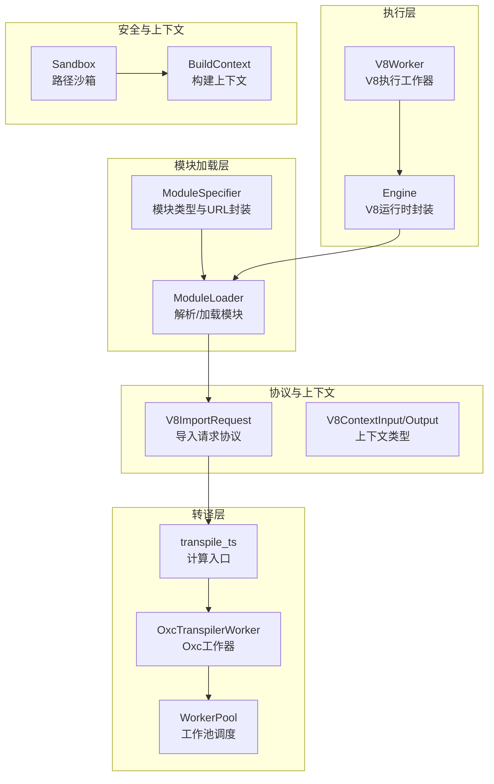
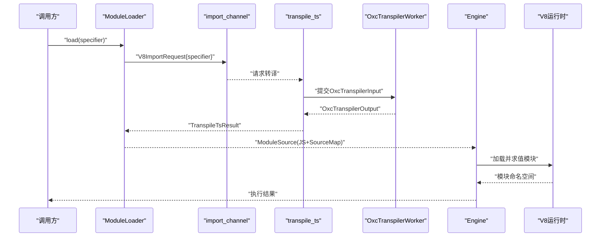
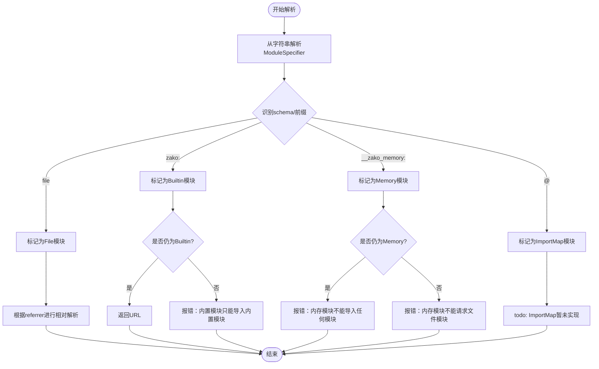
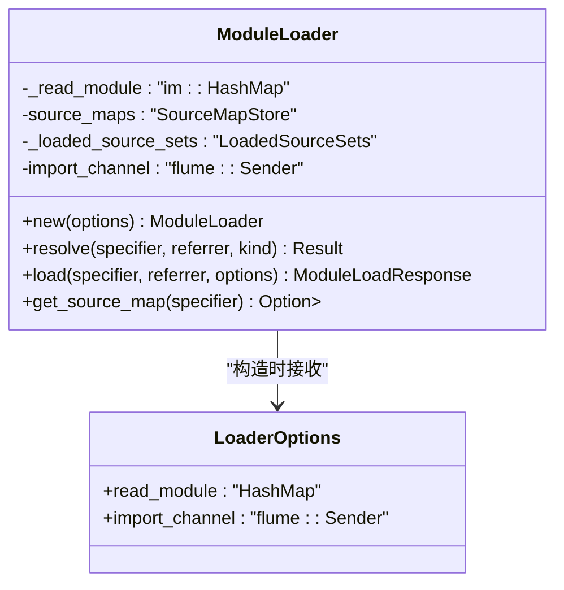
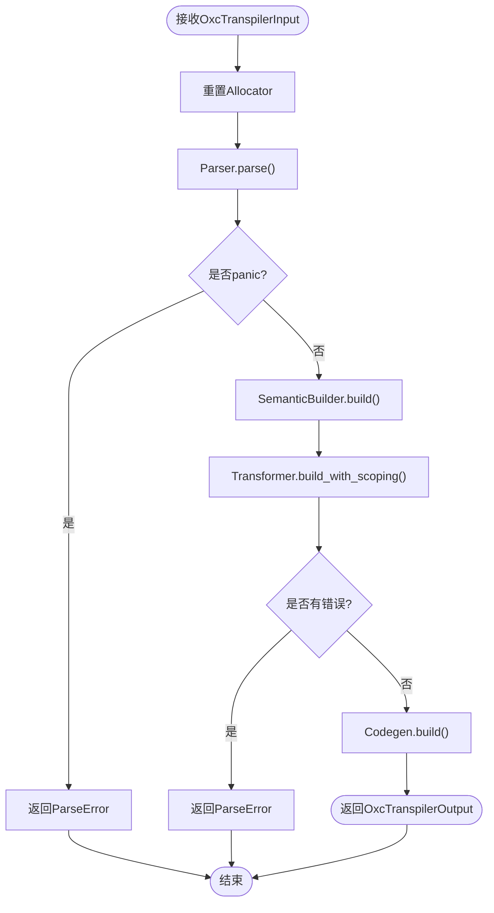
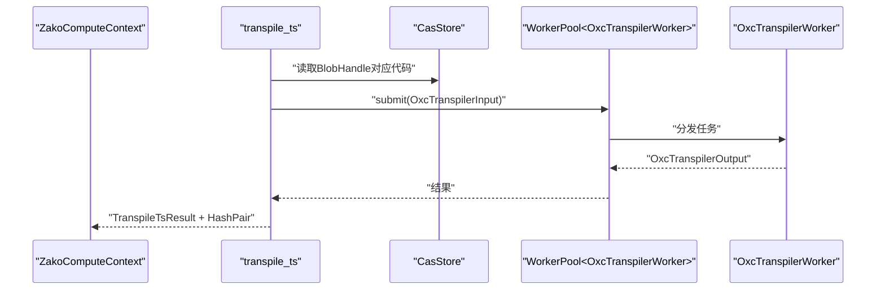
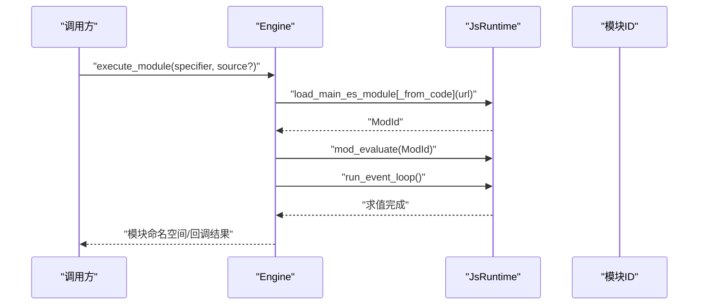
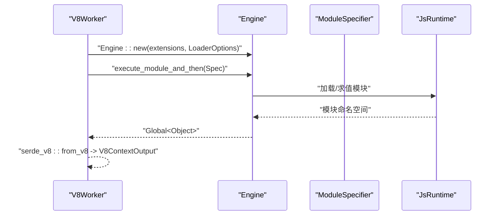
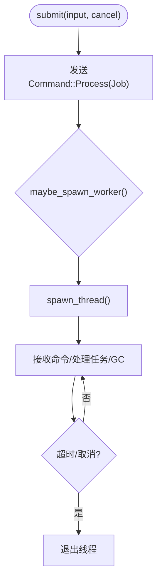
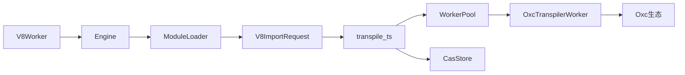

# 模块加载系统

<cite>
**本文引用的文件**
- [zako_core/src/module_loader/mod.rs](file://zako_core/src/module_loader/mod.rs)
- [zako_core/src/module_loader/specifier.rs](file://zako_core/src/module_loader/specifier.rs)
- [zako_core/src/compute/transpile_ts.rs](file://zako_core/src/compute/transpile_ts.rs)
- [zako_core/src/node/transpile_ts.rs](file://zako_core/src/node/transpile_ts.rs)
- [zako_core/src/engine.rs](file://zako_core/src/engine.rs)
- [zako_core/src/sandbox.rs](file://zako_core/src/sandbox.rs)
- [zako_core/src/context.rs](file://zako_core/src/context.rs)
- [zako_core/src/worker/oxc_worker.rs](file://zako_core/src/worker/oxc_worker.rs)
- [zako_core/src/worker/v8worker.rs](file://zako_core/src/worker/v8worker.rs)
- [zako_core/src/worker/worker_pool.rs](file://zako_core/src/worker/worker_pool.rs)
- [zako_core/src/worker/protocol.rs](file://zako_core/src/worker/protocol.rs)
- [zako_core/src/v8context.rs](file://zako_core/src/v8context.rs)
</cite>

## 目录
1. [简介](#简介)
2. [项目结构](#项目结构)
3. [核心组件](#核心组件)
4. [架构总览](#架构总览)
5. [详细组件分析](#详细组件分析)
6. [依赖关系分析](#依赖关系分析)
7. [性能考量](#性能考量)
8. [故障排查指南](#故障排查指南)
9. [结论](#结论)
10. [附录](#附录)

## 简介
本文件面向 TypeScript 开发者与系统架构师，系统性阐述 Zako 的模块加载系统：从模块解析、TypeScript 转译到 V8 执行与沙盒隔离。重点覆盖以下方面：
- 模块解析机制与模块类型体系（文件、内置、内存、导入映射）
- 标签解析与包解析逻辑
- 模块规范器（ModuleLoader）工作原理与错误处理
- 转译器（OxcTranspilerWorker）实现细节与输入输出协议
- 解析器算法与与 V8 执行环境的集成、沙盒执行机制
- 最佳实践与性能优化建议
- 常见模块解析问题与转译错误的定位与修复

## 项目结构
Zako 将模块加载系统拆分为多层协作组件：
- 模块加载层：负责模块解析与按需加载
- 转译层：基于 Oxc 的 TypeScript 转译工作池
- 执行层：基于 deno_core/V8 的引擎封装
- 协议层：跨线程/异步通信的请求响应模型
- 安全层：路径沙箱限制访问范围

图表来源
- [zako_core/src/module_loader/mod.rs](file://zako_core/src/module_loader/mod.rs#L60-L84)
- [zako_core/src/module_loader/specifier.rs](file://zako_core/src/module_loader/specifier.rs#L27-L39)
- [zako_core/src/compute/transpile_ts.rs](file://zako_core/src/compute/transpile_ts.rs#L17-L85)
- [zako_core/src/worker/oxc_worker.rs](file://zako_core/src/worker/oxc_worker.rs#L48-L149)
- [zako_core/src/worker/worker_pool.rs](file://zako_core/src/worker/worker_pool.rs#L34-L184)
- [zako_core/src/worker/v8worker.rs](file://zako_core/src/worker/v8worker.rs#L54-L146)
- [zako_core/src/engine.rs](file://zako_core/src/engine.rs#L33-L79)
- [zako_core/src/worker/protocol.rs](file://zako_core/src/worker/protocol.rs#L6-L10)
- [zako_core/src/v8context.rs](file://zako_core/src/v8context.rs#L12-L61)
- [zako_core/src/sandbox.rs](file://zako_core/src/sandbox.rs#L27-L81)
- [zako_core/src/context.rs](file://zako_core/src/context.rs#L34-L183)

章节来源
- [zako_core/src/module_loader/mod.rs](file://zako_core/src/module_loader/mod.rs#L1-L228)
- [zako_core/src/module_loader/specifier.rs](file://zako_core/src/module_loader/specifier.rs#L1-L121)
- [zako_core/src/compute/transpile_ts.rs](file://zako_core/src/compute/transpile_ts.rs#L1-L113)
- [zako_core/src/node/transpile_ts.rs](file://zako_core/src/node/transpile_ts.rs#L1-L31)
- [zako_core/src/engine.rs](file://zako_core/src/engine.rs#L1-L306)
- [zako_core/src/sandbox.rs](file://zako_core/src/sandbox.rs#L1-L82)
- [zako_core/src/context.rs](file://zako_core/src/context.rs#L1-L229)
- [zako_core/src/worker/oxc_worker.rs](file://zako_core/src/worker/oxc_worker.rs#L1-L150)
- [zako_core/src/worker/v8worker.rs](file://zako_core/src/worker/v8worker.rs#L1-L147)
- [zako_core/src/worker/worker_pool.rs](file://zako_core/src/worker/worker_pool.rs#L1-L185)
- [zako_core/src/worker/protocol.rs](file://zako_core/src/worker/protocol.rs#L1-L11)
- [zako_core/src/v8context.rs](file://zako_core/src/v8context.rs#L1-L62)

## 核心组件
- 模块规范器（ModuleLoader）：实现 deno_core 的 ModuleLoader 接口，负责模块解析与按需加载，支持文件、内置、内存、导入映射四种模块类型，并通过通道向 V8 请求源码。
- 模块说明符（ModuleSpecifier）：统一模块 URL 表达与类型识别，支持从字符串解析并自动判定类型。
- 转译器（OxcTranspilerWorker）：使用 Oxc 进行 TypeScript 解析、语义分析、转换与代码生成，产出 JS 代码与可选 SourceMap。
- 计算入口（transpile_ts）：在构建上下文中提交转译任务，读取 CAS 中的 TypeScript 源码，调用工作池并返回哈希与结果。
- 引擎（Engine）：封装 JsRuntime，注入扩展与模块加载器，提供模块执行与事件循环管理。
- 工作池（WorkerPool）：通用工作池，支持动态扩容、空闲回收与取消令牌。
- 协议（V8ImportRequest）：用于 V8 导入请求的 oneshot 响应通道。
- 上下文（V8ContextInput/Output）：定义不同脚本上下文类型及其返回值。
- 沙箱（Sandbox）：限制文件系统访问范围，避免越权访问。
- 构建上下文（BuildContext）：提供全局状态、CAS 存储、工作池等资源。

章节来源
- [zako_core/src/module_loader/mod.rs](file://zako_core/src/module_loader/mod.rs#L60-L84)
- [zako_core/src/module_loader/specifier.rs](file://zako_core/src/module_loader/specifier.rs#L27-L107)
- [zako_core/src/worker/oxc_worker.rs](file://zako_core/src/worker/oxc_worker.rs#L48-L149)
- [zako_core/src/compute/transpile_ts.rs](file://zako_core/src/compute/transpile_ts.rs#L17-L85)
- [zako_core/src/engine.rs](file://zako_core/src/engine.rs#L33-L79)
- [zako_core/src/worker/worker_pool.rs](file://zako_core/src/worker/worker_pool.rs#L34-L184)
- [zako_core/src/worker/protocol.rs](file://zako_core/src/worker/protocol.rs#L6-L10)
- [zako_core/src/v8context.rs](file://zako_core/src/v8context.rs#L12-L61)
- [zako_core/src/sandbox.rs](file://zako_core/src/sandbox.rs#L27-L81)
- [zako_core/src/context.rs](file://zako_core/src/context.rs#L34-L183)

## 架构总览
Zako 的模块加载系统以“解析—转译—执行—反馈”为主线，结合工作池与 V8 引擎完成高性能、可扩展的模块加载与执行。

图表来源
- [zako_core/src/module_loader/mod.rs](file://zako_core/src/module_loader/mod.rs#L152-L219)
- [zako_core/src/worker/protocol.rs](file://zako_core/src/worker/protocol.rs#L6-L10)
- [zako_core/src/compute/transpile_ts.rs](file://zako_core/src/compute/transpile_ts.rs#L17-L85)
- [zako_core/src/worker/oxc_worker.rs](file://zako_core/src/worker/oxc_worker.rs#L69-L144)
- [zako_core/src/engine.rs](file://zako_core/src/engine.rs#L81-L109)

## 详细组件分析

### 模块解析与模块类型
- 模块类型
  - 文件模块：file://schema，支持相对路径解析与错误约束
  - 内置模块：zako: 前缀，仅允许内置模块相互导入
  - 内存模块：zako-memory: 前缀，禁止加载其他模块
  - 导入映射模块：zako-import-map: 前缀（当前未实现）
- 解析规则
  - 同类型互斥与跨类型约束：如文件模块不可导入内存模块；内置模块仅能导入内置模块
  - 相对路径解析：基于 referrer 与 specifier 使用标准解析函数
- 错误处理
  - URL 解析失败、非法导入组合、不支持的 URL schema 等均转化为统一错误类型

图表来源
- [zako_core/src/module_loader/specifier.rs](file://zako_core/src/module_loader/specifier.rs#L57-L107)
- [zako_core/src/module_loader/mod.rs](file://zako_core/src/module_loader/mod.rs#L87-L150)

章节来源
- [zako_core/src/module_loader/specifier.rs](file://zako_core/src/module_loader/specifier.rs#L1-L121)
- [zako_core/src/module_loader/mod.rs](file://zako_core/src/module_loader/mod.rs#L87-L150)

### 模块加载器（ModuleLoader）
- 职责
  - 实现 deno_core 的 ModuleLoader 接口：resolve/load/get_source_map
  - 通过 import_channel 发送 V8ImportRequest，等待 oneshot 响应
  - 统一返回 JavaScript 类型的 ModuleSource，支持可选 SourceMap
- 关键点
  - 只支持 file:// URL；非 file URL 将被拒绝
  - 加载流程采用异步 Future 包装，便于与 tokio 事件循环协同
  - SourceMap 存储于共享 HashMap，供调试使用

图表来源
- [zako_core/src/module_loader/mod.rs](file://zako_core/src/module_loader/mod.rs#L47-L84)
- [zako_core/src/module_loader/mod.rs](file://zako_core/src/module_loader/mod.rs#L86-L227)

章节来源
- [zako_core/src/module_loader/mod.rs](file://zako_core/src/module_loader/mod.rs#L60-L227)

### TypeScript 转译器（OxcTranspilerWorker）
- 输入输出
  - 输入：OxcTranspilerInput（源文本、源名、SourceType）
  - 输出：OxcTranspilerOutput（代码、可选 SourceMap）
- 处理流程
  - 重置分配器缓存
  - Parser 解析 + 语义分析
  - Transformer 应用目标转换（基于常量目标）
  - Codegen 生成最终代码与 SourceMap
  - 清理分配器缓存
- 错误处理
  - 解析错误与转换错误收集为统一错误类型
  - 目标 ES 版本解析失败时返回特定错误

图表来源
- [zako_core/src/worker/oxc_worker.rs](file://zako_core/src/worker/oxc_worker.rs#L69-L144)

章节来源
- [zako_core/src/worker/oxc_worker.rs](file://zako_core/src/worker/oxc_worker.rs#L18-L149)

### 计算入口（transpile_ts）
- 功能
  - 从 CAS 读取 TypeScript 源码
  - 提交到 Oxc 工作池进行转译
  - 返回输出哈希与结果
- 关键点
  - 使用 ZakoComputeContext 的 request 接口与节点值类型匹配
  - 对 CAS 读取、UTF-8 转换、工作池提交、错误包装进行统一处理

图表来源
- [zako_core/src/compute/transpile_ts.rs](file://zako_core/src/compute/transpile_ts.rs#L17-L85)
- [zako_core/src/worker/worker_pool.rs](file://zako_core/src/worker/worker_pool.rs#L156-L178)
- [zako_core/src/worker/oxc_worker.rs](file://zako_core/src/worker/oxc_worker.rs#L69-L144)

章节来源
- [zako_core/src/compute/transpile_ts.rs](file://zako_core/src/compute/transpile_ts.rs#L17-L113)
- [zako_core/src/node/transpile_ts.rs](file://zako_core/src/node/transpile_ts.rs#L5-L31)

### 引擎与 V8 执行（Engine）
- 初始化
  - 注入扩展与模块加载器
  - 创建 JsRuntime 并绑定 V8 平台
- 执行流程
  - 支持从代码或文件加载主 ES 模块
  - 求值模块并运行事件循环
  - 获取模块命名空间或回调处理结果
- 错误处理
  - 将 V8 异常转换为统一错误类型
  - 提供带 JSON 输入的执行变体

图表来源
- [zako_core/src/engine.rs](file://zako_core/src/engine.rs#L81-L109)
- [zako_core/src/engine.rs](file://zako_core/src/engine.rs#L111-L166)
- [zako_core/src/engine.rs](file://zako_core/src/engine.rs#L168-L300)

章节来源
- [zako_core/src/engine.rs](file://zako_core/src/engine.rs#L33-L306)

### V8 执行工作器（V8Worker）
- 输入
  - 指定要执行的模块路径、请求通道、可选缓存字节码、上下文类型
- 流程
  - 基于上下文类型初始化扩展
  - 新建 Engine 并执行模块
  - 将模块命名空间反序列化为 V8ContextOutput
- 错误处理
  - 统一封装引擎错误与序列化错误

图表来源
- [zako_core/src/worker/v8worker.rs](file://zako_core/src/worker/v8worker.rs#L83-L145)
- [zako_core/src/engine.rs](file://zako_core/src/engine.rs#L168-L300)
- [zako_core/src/v8context.rs](file://zako_core/src/v8context.rs#L12-L61)

章节来源
- [zako_core/src/worker/v8worker.rs](file://zako_core/src/worker/v8worker.rs#L20-L146)
- [zako_core/src/v8context.rs](file://zako_core/src/v8context.rs#L12-L61)

### 工作池（WorkerPool）
- 设计
  - 基于 flume 的无界通道与广播 GC 信号
  - 动态扩容：队列积压或无活跃线程时按需启动新线程
  - 空闲回收：超时未活动则退出工作线程
- 提交
  - 使用 oneshot 通道回传结果
  - 支持取消令牌中断处理

图表来源
- [zako_core/src/worker/worker_pool.rs](file://zako_core/src/worker/worker_pool.rs#L56-L138)
- [zako_core/src/worker/worker_pool.rs](file://zako_core/src/worker/worker_pool.rs#L156-L178)

章节来源
- [zako_core/src/worker/worker_pool.rs](file://zako_core/src/worker/worker_pool.rs#L17-L185)

### 协议与上下文
- V8ImportRequest：模块加载器通过通道请求源码，返回字符串形式的 JavaScript 代码
- V8ContextInput/Output：定义不同脚本上下文类型与其返回值，用于区分包脚本、构建脚本、规则脚本等

章节来源
- [zako_core/src/worker/protocol.rs](file://zako_core/src/worker/protocol.rs#L6-L10)
- [zako_core/src/v8context.rs](file://zako_core/src/v8context.rs#L12-L61)

### 沙箱与构建上下文
- Sandbox：通过 canonicalize 与 starts_with 限制路径访问，防止越权读写
- BuildContext：提供项目根、入口名、包源、全局状态、CAS 存储、工作池等资源，贯穿构建生命周期

章节来源
- [zako_core/src/sandbox.rs](file://zako_core/src/sandbox.rs#L27-L81)
- [zako_core/src/context.rs](file://zako_core/src/context.rs#L34-L183)

## 依赖关系分析
- 模块加载器依赖
  - deno_core 的 ModuleLoader 接口与 URL 解析工具
  - flume 通道与 tokio oneshot 用于异步通信
  - 共享 SourceMap 存储
- 转译链路
  - transpile_ts 依赖 CAS 存储与 WorkerPool
  - OxcTranspilerWorker 依赖 Oxc 生态（Parser/Semantic/Transformer/Codegen）
- 执行链路
  - Engine 依赖 deno_core/V8 平台与扩展
  - V8Worker 依赖 Engine 与 V8ContextInput

图表来源
- [zako_core/src/module_loader/mod.rs](file://zako_core/src/module_loader/mod.rs#L152-L219)
- [zako_core/src/worker/protocol.rs](file://zako_core/src/worker/protocol.rs#L6-L10)
- [zako_core/src/compute/transpile_ts.rs](file://zako_core/src/compute/transpile_ts.rs#L17-L85)
- [zako_core/src/worker/worker_pool.rs](file://zako_core/src/worker/worker_pool.rs#L156-L178)
- [zako_core/src/worker/oxc_worker.rs](file://zako_core/src/worker/oxc_worker.rs#L69-L144)
- [zako_core/src/worker/v8worker.rs](file://zako_core/src/worker/v8worker.rs#L83-L145)
- [zako_core/src/engine.rs](file://zako_core/src/engine.rs#L33-L79)

章节来源
- [zako_core/src/module_loader/mod.rs](file://zako_core/src/module_loader/mod.rs#L1-L228)
- [zako_core/src/compute/transpile_ts.rs](file://zako_core/src/compute/transpile_ts.rs#L1-L113)
- [zako_core/src/worker/oxc_worker.rs](file://zako_core/src/worker/oxc_worker.rs#L1-L150)
- [zako_core/src/worker/v8worker.rs](file://zako_core/src/worker/v8worker.rs#L1-L147)
- [zako_core/src/engine.rs](file://zako_core/src/engine.rs#L1-L306)

## 性能考量
- 并发与弹性
  - WorkerPool 动态扩容与空闲回收，避免过度占用资源
  - Oxc 分配器复用与重置，减少内存抖动
- 缓存与去重
  - SourceMap 与输入输出哈希可用于缓存命中判断（在上层逻辑中可利用）
- I/O 与网络
  - CAS 读取与通道通信为异步，避免阻塞主线程
- 调试与可观测性
  - 使用 tracing span 标注 resolve/load/execute 等关键阶段，便于性能分析

[本节为通用指导，无需列出具体文件来源]

## 故障排查指南
- 模块解析错误
  - “文件模块不可导入内存模块”：检查导入链中是否存在 __zako_memory: 前缀模块
  - “内置模块只能导入内置模块”：确认导入目标是否为 zako: 前缀
  - “仅支持 file:// URL”：确保模块 URL schema 正确
- 转译错误
  - 解析错误：查看 Oxc 的 ParseError 列表，定位语法问题
  - 目标版本错误：检查目标 ES 版本配置
- 执行错误
  - V8 异常：通过 Engine 的异常转换获取详细信息
  - JSON 序列化错误：检查 V8ContextInput/Output 的结构一致性
- 路径越权
  - Sandbox 报错：确认访问路径是否位于沙箱根目录内

章节来源
- [zako_core/src/module_loader/mod.rs](file://zako_core/src/module_loader/mod.rs#L106-L149)
- [zako_core/src/worker/oxc_worker.rs](file://zako_core/src/worker/oxc_worker.rs#L18-L24)
- [zako_core/src/engine.rs](file://zako_core/src/engine.rs#L24-L31)
- [zako_core/src/sandbox.rs](file://zako_core/src/sandbox.rs#L19-L25)

## 结论
Zako 的模块加载系统通过清晰的模块类型划分、可靠的解析与加载流程、高效的转译与执行链路，以及严格的沙箱与上下文控制，实现了对 TypeScript 模块的高性能、可扩展与安全的加载与执行。建议在实际工程中遵循本文最佳实践，结合工作池与缓存策略，持续优化模块加载性能与稳定性。

[本节为总结性内容，无需列出具体文件来源]

## 附录
- 最佳实践
  - 明确模块类型：优先使用 file:// 与 zako: 前缀，避免混合使用
  - 合理组织导入：避免跨类型非法导入，减少循环依赖
  - 使用工作池：合理设置 WorkerPool 的并发参数，平衡吞吐与资源
  - 启用 SourceMap：便于调试与定位问题
  - 沙箱策略：严格限制文件系统访问范围，避免越权
- 常见问题定位
  - 解析失败：检查 URL schema 与相对路径
  - 转译失败：检查 TypeScript 语法与目标 ES 版本
  - 执行失败：检查 V8 上下文类型与输入数据结构

[本节为通用指导，无需列出具体文件来源]