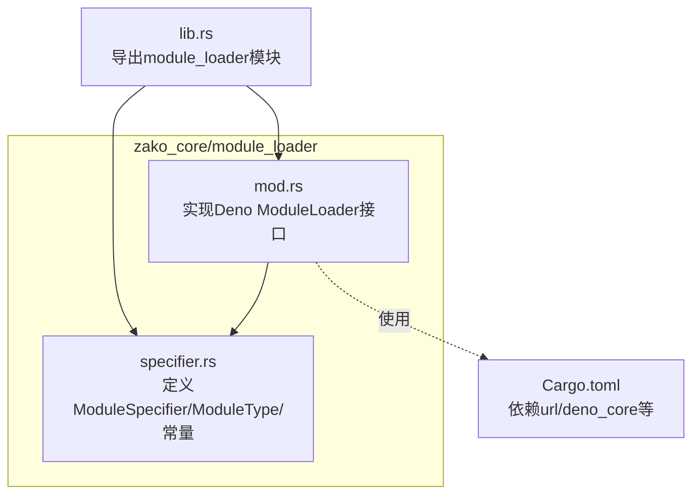
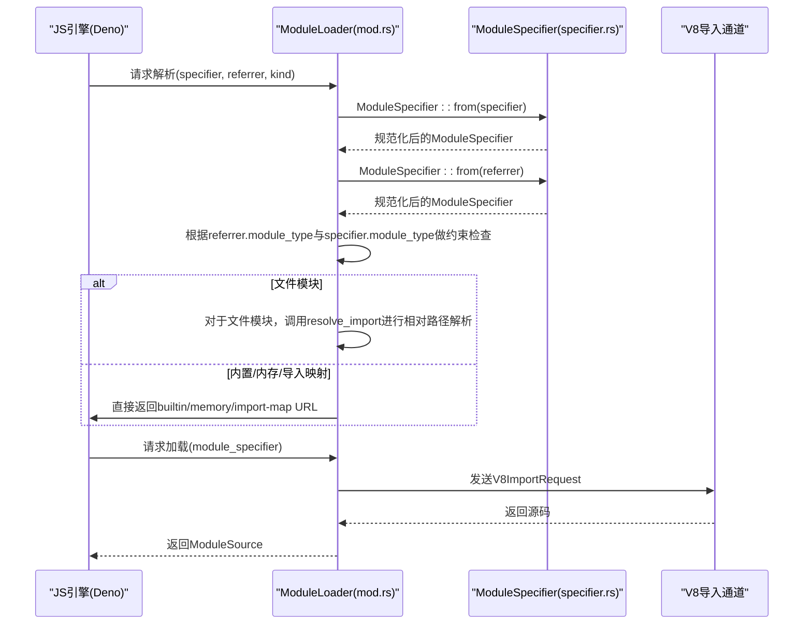
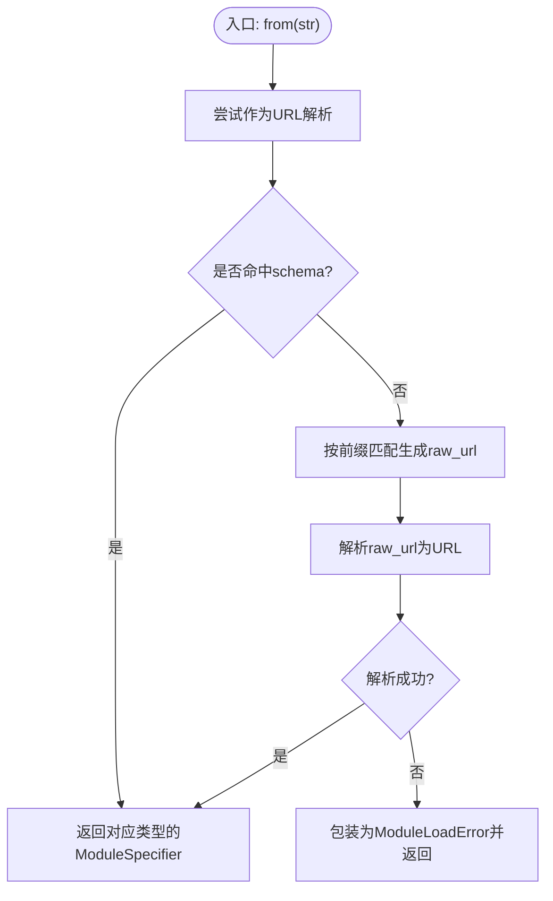
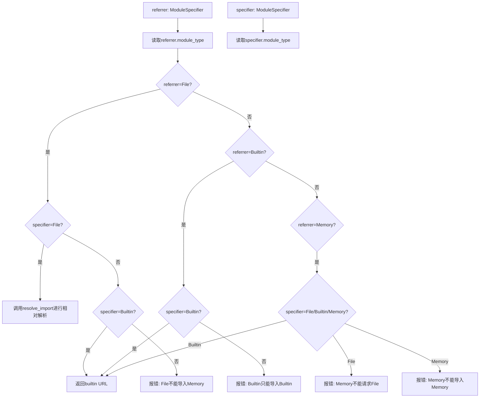
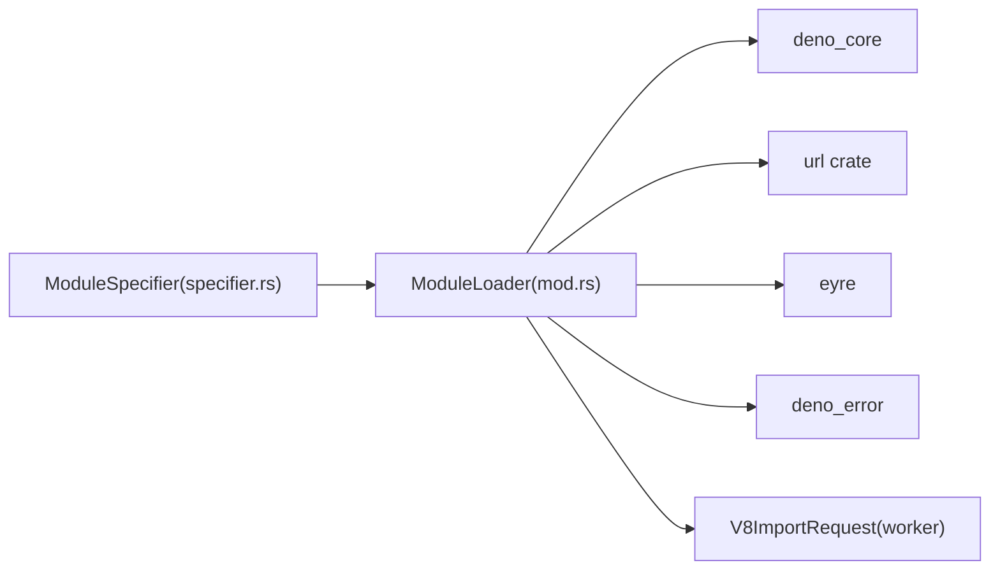

# 模块规范器

<cite>
**本文档引用的文件**
- [specifier.rs](file://zako_core/src/module_loader/specifier.rs)
- [mod.rs](file://zako_core/src/module_loader/mod.rs)
- [lib.rs](file://zako_core/src/lib.rs)
- [Cargo.toml](file://zako_core/Cargo.toml)
</cite>

## 目录
1. [简介](#简介)
2. [项目结构](#项目结构)
3. [核心组件](#核心组件)
4. [架构总览](#架构总览)
5. [详细组件分析](#详细组件分析)
6. [依赖关系分析](#依赖关系分析)
7. [性能考量](#性能考量)
8. [故障排查指南](#故障排查指南)
9. [结论](#结论)

## 简介
本文件面向Zako的模块规范器（ModuleSpecifier），系统性阐述其设计与实现：如何将字符串解析为标准化模块引用、如何识别模块类型（文件、内置、内存、导入映射）、以及与URL schema的对应关系；同时说明错误处理机制、在模块加载流程中的作用，以及与V8/Deno等运行时的交互方式。

## 项目结构
模块规范器位于zako_core的module_loader子模块中，核心文件为specifier.rs与mod.rs。前者定义了ModuleSpecifier与ModuleType，后者实现了基于Deno Core的ModuleLoader，并在解析阶段委托ModuleSpecifier进行规范化。

图表来源
- [lib.rs](file://zako_core/src/lib.rs#L57-L57)
- [specifier.rs](file://zako_core/src/module_loader/specifier.rs#L1-L121)
- [mod.rs](file://zako_core/src/module_loader/mod.rs#L1-L228)
- [Cargo.toml](file://zako_core/Cargo.toml#L59-L81)

章节来源
- [lib.rs](file://zako_core/src/lib.rs#L57-L57)
- [specifier.rs](file://zako_core/src/module_loader/specifier.rs#L1-L121)
- [mod.rs](file://zako_core/src/module_loader/mod.rs#L1-L228)
- [Cargo.toml](file://zako_core/Cargo.toml#L59-L81)

## 核心组件
- ModuleType：枚举表示模块类型，包含File、Builtin、Memory、ImportMap四种。
- ModuleSpecifier：封装URL与模块类型，提供from静态方法完成字符串到标准化引用的转换。
- 常量定义：各类模块的前缀与schema（如zako:、__zako_memory:、zako-import-map、file）。
- ModuleLoader：实现Deno Core的ModuleLoader trait，在resolve/load阶段使用ModuleSpecifier进行规范化与约束校验。

章节来源
- [specifier.rs](file://zako_core/src/module_loader/specifier.rs#L27-L39)
- [specifier.rs](file://zako_core/src/module_loader/specifier.rs#L57-L107)
- [mod.rs](file://zako_core/src/module_loader/mod.rs#L28-L35)
- [mod.rs](file://zako_core/src/module_loader/mod.rs#L86-L150)

## 架构总览
模块规范器在模块加载流程中的位置如下：

图表来源
- [mod.rs](file://zako_core/src/module_loader/mod.rs#L86-L150)
- [mod.rs](file://zako_core/src/module_loader/mod.rs#L152-L219)
- [specifier.rs](file://zako_core/src/module_loader/specifier.rs#L57-L107)

## 详细组件分析

### ModuleSpecifier：URL解析与模块类型识别
- URL优先策略：先尝试作为标准URL解析，若scheme匹配内置/内存/导入映射/文件schema，则直接判定类型并返回。
- 字符串前缀策略：若非合法URL或未命中schema，则按前缀匹配规则生成对应schema的URL再解析。
- 错误处理：解析失败时包装为ModuleLoadError，便于上层统一处理。

图表来源
- [specifier.rs](file://zako_core/src/module_loader/specifier.rs#L57-L107)

章节来源
- [specifier.rs](file://zako_core/src/module_loader/specifier.rs#L57-L107)

### 模块类型与schema/前缀对照
- 内置模块
  - 前缀: zako:
  - schema: zako
  - 语义: Zako提供的内存内置模块
- 内存模块
  - 前缀: __zako_memory:
  - schema: zako-memory
  - 语义: 仅能在内存中存在，不可再加载其他模块
- 导入映射模块
  - 前缀: @
  - schema: zako-import-map
  - 语义: 通过导入映射解析的模块标识
- 文件模块
  - schema: file
  - 语义: 文件系统中的模块，通常由file://URL表示

章节来源
- [specifier.rs](file://zako_core/src/module_loader/specifier.rs#L8-L25)

### ModuleLoader：解析与加载阶段的协作
- 解析阶段(resolve)
  - 将referrer与specifier均转为ModuleSpecifier
  - 根据referrer.module_type对specifier.module_type施加约束：
    - 文件模块：允许文件模块相对解析；禁止导入内存模块；导入映射模块待实现
    - 内置模块：仅允许导入内置模块
    - 内存模块：禁止请求任何外部模块（文件/内存/导入映射）
    - 导入映射模块：待实现
- 加载阶段(load)
  - 仅支持file:// URL
  - 通过通道向V8发送导入请求，接收源码后构造ModuleSource返回

图表来源
- [mod.rs](file://zako_core/src/module_loader/mod.rs#L86-L150)

章节来源
- [mod.rs](file://zako_core/src/module_loader/mod.rs#L86-L150)
- [mod.rs](file://zako_core/src/module_loader/mod.rs#L152-L219)

### 错误处理机制
- 解析错误：URL解析失败时包装为ModuleLoadError，附带检测到的模块类型信息，便于定位问题。
- 运行时错误：在resolve阶段根据模块类型约束抛出JsErrorBox错误，明确禁止的行为（如File导入Memory）。
- 加载错误：当module_specifier不是file://时，直接返回错误；向V8发送/接收失败或解析失败时也统一包装为JsErrorBox。

章节来源
- [specifier.rs](file://zako_core/src/module_loader/specifier.rs#L99-L104)
- [mod.rs](file://zako_core/src/module_loader/mod.rs#L114-L117)
- [mod.rs](file://zako_core/src/module_loader/mod.rs#L133-L141)
- [mod.rs](file://zako_core/src/module_loader/mod.rs#L176-L178)
- [mod.rs](file://zako_core/src/module_loader/mod.rs#L188-L208)

### 具体用法示例（以路径引用代替代码片段）
以下示例展示不同模块类型的创建与解析过程，请参考相应路径获取实现细节：

- 创建文件模块
  - 路径: [new_file_module](file://zako_core/src/module_loader/specifier.rs#L46-L55)
- 从字符串解析模块
  - 路径: [from](file://zako_core/src/module_loader/specifier.rs#L57-L107)
- 在解析阶段使用ModuleSpecifier
  - 路径: [resolve](file://zako_core/src/module_loader/mod.rs#L86-L150)
- 在加载阶段使用ModuleSpecifier
  - 路径: [load](file://zako_core/src/module_loader/mod.rs#L152-L219)

## 依赖关系分析
- 外部依赖
  - url crate：用于URL解析与schema识别
  - deno_core：实现ModuleLoader接口、resolve_import函数、ModuleSource等
  - eyre：错误包装
  - deno_error：JsErrorBox错误类型
- 内部依赖
  - module_loader::specifier：提供ModuleSpecifier/ModuleType
  - worker::protocol::V8ImportRequest：与V8导入通道通信

图表来源
- [mod.rs](file://zako_core/src/module_loader/mod.rs#L3-L26)
- [specifier.rs](file://zako_core/src/module_loader/specifier.rs#L1-L3)
- [Cargo.toml](file://zako_core/Cargo.toml#L59-L81)

章节来源
- [mod.rs](file://zako_core/src/module_loader/mod.rs#L3-L26)
- [specifier.rs](file://zako_core/src/module_loader/specifier.rs#L1-L3)
- [Cargo.toml](file://zako_core/Cargo.toml#L59-L81)

## 性能考量
- URL解析成本：ModuleSpecifier::from会尝试URL解析与前缀匹配，建议在高频场景下缓存已解析结果。
- 类型约束检查：resolve阶段的分支判断开销极低，主要为常量比较与错误分支。
- 加载阶段：file:// URL到V8的通道通信为异步，避免阻塞主线程。

## 故障排查指南
- 解析失败
  - 现象：from返回ModuleLoadError
  - 排查：确认输入字符串是否符合预期schema或前缀；检查URL合法性
  - 参考路径: [from错误包装](file://zako_core/src/module_loader/specifier.rs#L99-L104)
- 不被允许的导入
  - 现象：resolve阶段抛出JsErrorBox错误
  - 排查：确认referrer与specifier的模块类型组合是否满足约束
  - 参考路径: [File导入Memory错误](file://zako_core/src/module_loader/mod.rs#L114-L117), [Memory请求File错误](file://zako_core/src/module_loader/mod.rs#L133-L136), [Memory导入Memory错误](file://zako_core/src/module_loader/mod.rs#L138-L141)
- 加载失败
  - 现象：load阶段返回错误或V8通道通信异常
  - 排查：确认module_specifier为file://；检查V8通道发送/接收逻辑
  - 参考路径: [URL非file错误](file://zako_core/src/module_loader/mod.rs#L176-L178), [发送失败](file://zako_core/src/module_loader/mod.rs#L188-L193), [接收失败](file://zako_core/src/module_loader/mod.rs#L195-L202), [解析失败](file://zako_core/src/module_loader/mod.rs#L203-L208)

## 结论
ModuleSpecifier通过“URL优先+前缀回退”的策略，将多样化的模块标识统一为标准化的URL与类型，为后续的解析与加载提供了清晰的契约。ModuleLoader在resolve阶段严格约束模块间的依赖关系，确保系统安全与一致性；在load阶段通过V8通道完成实际的源码获取。整体设计简洁、边界清晰，易于扩展新的模块类型与schema。