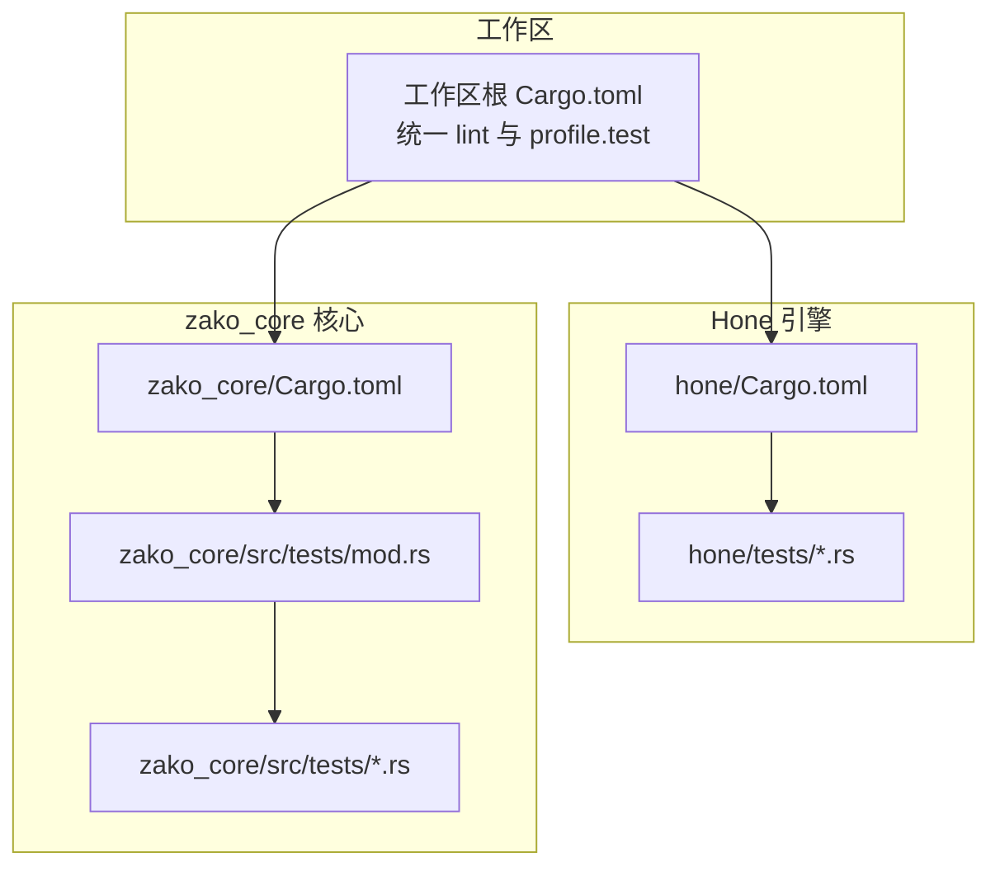
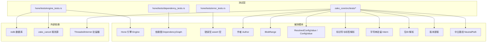
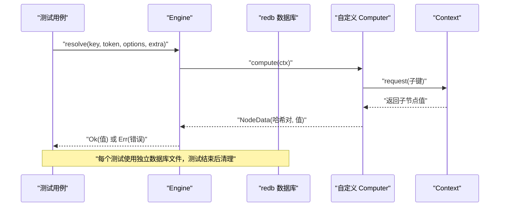
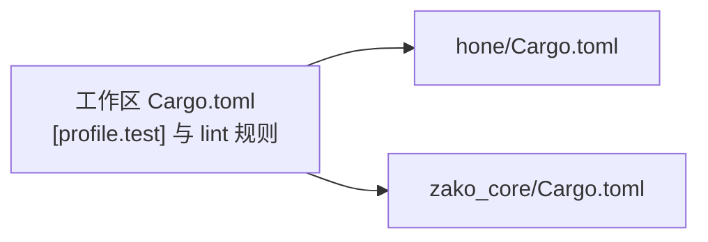

# 单元测试

<cite>
**本文引用的文件**
- [hone/tests/engine_tests.rs](file://hone/tests/engine_tests.rs)
- [hone/tests/dependency_tests.rs](file://hone/tests/dependency_tests.rs)
- [hone/tests/error_tests.rs](file://hone/tests/error_tests.rs)
- [zako_core/src/tests/mod.rs](file://zako_core/src/tests/mod.rs)
- [zako_core/src/tests/author_tests.rs](file://zako_core/src/tests/author_tests.rs)
- [zako_core/src/tests/blob_range_tests.rs](file://zako_core/src/tests/blob_range_tests.rs)
- [zako_core/src/tests/config_value_tests.rs](file://zako_core/src/tests/config_value_tests.rs)
- [zako_core/src/tests/id_tests.rs](file://zako_core/src/tests/id_tests.rs)
- [zako_core/src/tests/intern_tests.rs](file://zako_core/src/tests/intern_tests.rs)
- [zako_core/src/tests/package_tests.rs](file://zako_core/src/tests/package_tests.rs)
- [zako_core/src/tests/version_extractor_tests.rs](file://zako_core/src/tests/version_extractor_tests.rs)
- [zako_core/src/tests/neutral_path_tests.rs](file://zako_core/src/tests/neutral_path_tests.rs)
- [Cargo.toml（工作区）](file://Cargo.toml)
- [hone/Cargo.toml](file://hone/Cargo.toml)
- [zako_core/Cargo.toml](file://zako_core/Cargo.toml)
</cite>

## 目录
1. [引言](#引言)
2. [项目结构](#项目结构)
3. [核心组件](#核心组件)
4. [架构总览](#架构总览)
5. [详细组件分析](#详细组件分析)
6. [依赖分析](#依赖分析)
7. [性能考虑](#性能考虑)
8. [故障排查指南](#故障排查指南)
9. [结论](#结论)
10. [附录](#附录)

## 引言
本文件面向Zako项目的单元测试实践，系统性梳理Rust单元测试的编写方法与最佳实践，并结合Hone引擎与zako_core模块的实际测试用例，给出可操作的测试策略、断言技巧、测试数据准备、模拟与隔离技术、覆盖率与报告生成建议。目标是帮助开发者在不牺牲可维护性的前提下，构建稳定可靠的测试体系。

## 项目结构
Zako采用多crate工作区组织，其中与单元测试直接相关的关键位置如下：
- Hone引擎：提供依赖图、节点解析、计算与取消等能力，配套tests目录下的单元测试。
- zako_core：核心逻辑所在，包含大量领域模型与工具函数，tests目录下覆盖作者信息、blob范围、配置值、ID、字符串驻留、包ID、版本提取、中立路径等子模块测试。
- 工作区根Cargo.toml定义了统一的lint规则与测试配置，确保各crate测试一致性。

图表来源
- [Cargo.toml（工作区）](file://Cargo.toml#L1-L312)
- [hone/Cargo.toml](file://hone/Cargo.toml#L1-L32)
- [zako_core/Cargo.toml](file://zako_core/Cargo.toml#L1-L141)
- [zako_core/src/tests/mod.rs](file://zako_core/src/tests/mod.rs#L1-L16)

章节来源
- [Cargo.toml（工作区）](file://Cargo.toml#L1-L312)
- [hone/Cargo.toml](file://hone/Cargo.toml#L1-L32)
- [zako_core/Cargo.toml](file://zako_core/Cargo.toml#L1-L141)
- [zako_core/src/tests/mod.rs](file://zako_core/src/tests/mod.rs#L1-L16)

## 核心组件
- Hone引擎测试：验证依赖图、循环检测、异步取消、数据库持久化等行为。
- zako_core测试：覆盖作者信息、blob范围、配置值解析、标识符与标签、字符串驻留、包ID、版本提取、中立路径等。
- 测试基础设施：通过静态初始化的线程内驻留器共享跨测试使用的驻留池，减少重复开销并保证一致性。

章节来源
- [hone/tests/engine_tests.rs](file://hone/tests/engine_tests.rs#L1-L156)
- [hone/tests/dependency_tests.rs](file://hone/tests/dependency_tests.rs#L1-L62)
- [hone/tests/error_tests.rs](file://hone/tests/error_tests.rs#L1-L21)
- [zako_core/src/tests/mod.rs](file://zako_core/src/tests/mod.rs#L1-L16)
- [zako_core/src/tests/author_tests.rs](file://zako_core/src/tests/author_tests.rs#L1-L36)
- [zako_core/src/tests/blob_range_tests.rs](file://zako_core/src/tests/blob_range_tests.rs#L1-L42)
- [zako_core/src/tests/config_value_tests.rs](file://zako_core/src/tests/config_value_tests.rs#L1-L33)
- [zako_core/src/tests/id_tests.rs](file://zako_core/src/tests/id_tests.rs#L1-L126)
- [zako_core/src/tests/intern_tests.rs](file://zako_core/src/tests/intern_tests.rs#L1-L30)
- [zako_core/src/tests/package_tests.rs](file://zako_core/src/tests/package_tests.rs#L1-L42)
- [zako_core/src/tests/version_extractor_tests.rs](file://zako_core/src/tests/version_extractor_tests.rs#L1-L63)
- [zako_core/src/tests/neutral_path_tests.rs](file://zako_core/src/tests/neutral_path_tests.rs#L1-L146)

## 架构总览
下图展示测试与被测模块的关系，以及测试中使用的外部依赖（如数据库、取消令牌、驻留器）：

图表来源
- [hone/tests/engine_tests.rs](file://hone/tests/engine_tests.rs#L1-L156)
- [hone/tests/dependency_tests.rs](file://hone/tests/dependency_tests.rs#L1-L62)
- [hone/tests/error_tests.rs](file://hone/tests/error_tests.rs#L1-L21)
- [zako_core/src/tests/mod.rs](file://zako_core/src/tests/mod.rs#L1-L16)
- [zako_core/src/tests/author_tests.rs](file://zako_core/src/tests/author_tests.rs#L1-L36)
- [zako_core/src/tests/blob_range_tests.rs](file://zako_core/src/tests/blob_range_tests.rs#L1-L42)
- [zako_core/src/tests/config_value_tests.rs](file://zako_core/src/tests/config_value_tests.rs#L1-L33)
- [zako_core/src/tests/id_tests.rs](file://zako_core/src/tests/id_tests.rs#L1-L126)
- [zako_core/src/tests/intern_tests.rs](file://zako_core/src/tests/intern_tests.rs#L1-L30)
- [zako_core/src/tests/package_tests.rs](file://zako_core/src/tests/package_tests.rs#L1-L42)
- [zako_core/src/tests/version_extractor_tests.rs](file://zako_core/src/tests/version_extractor_tests.rs#L1-L63)
- [zako_core/src/tests/neutral_path_tests.rs](file://zako_core/src/tests/neutral_path_tests.rs#L1-L146)

## 详细组件分析

### Hone 引擎单元测试
- 依赖关系测试：验证父子节点添加与清理后关系是否正确，确保依赖图在增删场景下保持一致。
- 引擎功能测试：构造自定义计算机，按键请求子节点，验证结果聚合与哈希对齐。
- 错误处理测试：覆盖循环依赖检测与异步取消，确保引擎在异常情况下返回预期错误类型。
- 测试隔离与持久化：每个测试独立创建临时数据库文件，避免状态污染；使用取消令牌验证取消语义。

图表来源
- [hone/tests/engine_tests.rs](file://hone/tests/engine_tests.rs#L56-L80)
- [hone/tests/engine_tests.rs](file://hone/tests/engine_tests.rs#L82-L101)
- [hone/tests/engine_tests.rs](file://hone/tests/engine_tests.rs#L103-L155)

章节来源
- [hone/tests/dependency_tests.rs](file://hone/tests/dependency_tests.rs#L1-L62)
- [hone/tests/engine_tests.rs](file://hone/tests/engine_tests.rs#L1-L156)

### zako_core 模块单元测试

#### 作者信息测试
- 覆盖点：构造作者、解析字符串形式、比较排序顺序、非法名称校验。
- 断言要点：输出格式、字段取值、有序性、错误分支。

章节来源
- [zako_core/src/tests/author_tests.rs](file://zako_core/src/tests/author_tests.rs#L1-L36)

#### Blob 范围测试
- 覆盖点：起始/长度/结束边界、全范围、越界判断、区间构造。
- 断言要点：边界值、None/Some分支、与全范围的交互。

章节来源
- [zako_core/src/tests/blob_range_tests.rs](file://zako_core/src/tests/blob_range_tests.rs#L1-L42)

#### 配置值测试
- 覆盖点：字符串/布尔/数字三类默认值解析为配置类型与默认值。
- 断言要点：类型匹配、默认值相等性。

章节来源
- [zako_core/src/tests/config_value_tests.rs](file://zako_core/src/tests/config_value_tests.rs#L1-L33)

#### ID 与标签测试
- 覆盖点：严格/宽松标识符判定、原子与路径驻留、包引用驻留、标签解析与规范化。
- 断言要点：合法/非法输入、解析结果、驻留一致性。

章节来源
- [zako_core/src/tests/id_tests.rs](file://zako_core/src/tests/id_tests.rs#L1-L126)

#### 字符串驻留测试
- 覆盖点：绝对路径驻留、错误与成功路径。
- 断言要点：绝对路径允许、相对路径拒绝、从驻留句柄重建。

章节来源
- [zako_core/src/tests/intern_tests.rs](file://zako_core/src/tests/intern_tests.rs#L1-L30)

#### 包测试
- 覆盖点：版本号、组名、构件ID、包ID解析与规范化。
- 断言要点：合法/非法输入、解析结果、规范化字符串。

章节来源
- [zako_core/src/tests/package_tests.rs](file://zako_core/src/tests/package_tests.rs#L1-L42)

#### 版本提取测试
- 覆盖点：常见前缀/后缀、带预发布与构建元数据、多种工具版本格式。
- 断言要点：主/次/补丁、预发布、构建元数据、无匹配返回None。

章节来源
- [zako_core/src/tests/version_extractor_tests.rs](file://zako_core/src/tests/version_extractor_tests.rs#L1-L63)

#### 中立路径测试
- 覆盖点：标准化、Windows分隔符、绝对路径拒绝、无效命名与字符、连接、父目录/文件名/扩展名、相对路径、目录包含判断。
- 断言要点：跨平台兼容、错误与成功分支、相对路径计算。

章节来源
- [zako_core/src/tests/neutral_path_tests.rs](file://zako_core/src/tests/neutral_path_tests.rs#L1-L146)

### 测试组织与断言策略
- 测试函数组织：每个模块一个独立文件，按功能分组；公共测试辅助（如驻留器）集中于tests/mod.rs导出。
- 断言使用：优先使用明确的匹配与相等断言；对错误类型断言时，解构并断言消息与条件表达式。
- 测试数据准备：针对边界与异常输入构造典型样例；对需要外部状态（如数据库）的测试，确保每个测试独立创建与清理资源。
- 异步与并发：对异步测试使用#[tokio::test]，对取消语义使用取消令牌与任务句柄组合验证。

章节来源
- [zako_core/src/tests/mod.rs](file://zako_core/src/tests/mod.rs#L1-L16)
- [hone/tests/engine_tests.rs](file://hone/tests/engine_tests.rs#L56-L80)

### 模拟对象与测试隔离
- 模拟对象：在Hone引擎测试中，通过实现Computer trait的结构体模拟计算逻辑，控制输入与输出以验证引擎行为。
- 测试隔离：使用独立数据库文件与取消令牌；通过静态驻留器在多测试间共享驻留池，避免重复初始化成本。
- 外部依赖：对数据库、网络、文件系统等外部依赖，采用最小化注入与可控清理策略，确保测试可重复。

章节来源
- [hone/tests/engine_tests.rs](file://hone/tests/engine_tests.rs#L11-L54)
- [zako_core/src/tests/mod.rs](file://zako_core/src/tests/mod.rs#L4-L6)

## 依赖分析
- 工作区统一配置：工作区根Cargo.toml定义了测试配置与统一lint规则，确保各crate测试一致性与质量门槛。
- Hone依赖：异步运行时、错误处理、哈希、并发容器、序列化、数据库等，测试围绕这些依赖进行集成验证。
- zako_core依赖：广泛使用标准库与第三方工具（如semver、tokio、dashmap、rkyv、camino等），测试覆盖其解析与转换逻辑。

图表来源
- [Cargo.toml（工作区）](file://Cargo.toml#L298-L300)
- [Cargo.toml（工作区）](file://Cargo.toml#L24-L37)
- [hone/Cargo.toml](file://hone/Cargo.toml#L1-L32)
- [zako_core/Cargo.toml](file://zako_core/Cargo.toml#L1-L141)

章节来源
- [Cargo.toml（工作区）](file://Cargo.toml#L298-L300)
- [Cargo.toml（工作区）](file://Cargo.toml#L24-L37)
- [hone/Cargo.toml](file://hone/Cargo.toml#L1-L32)
- [zako_core/Cargo.toml](file://zako_core/Cargo.toml#L1-L141)

## 性能考虑
- 测试并行：Rust测试默认串行，可通过cargo test -- --test-threads=N提升并行度（需确保测试无共享状态）。
- 驻留器复用：通过静态驻留器减少驻留初始化开销，提高ID/路径相关测试的执行效率。
- 数据库隔离：每个测试独立创建临时数据库文件，避免锁争用与状态耦合。
- 异步测试：合理使用tokio::time::sleep与取消令牌，避免长阻塞导致测试超时。

## 故障排查指南
- 循环依赖：若出现循环依赖错误，检查依赖图构建与节点请求链路，确保无环。
- 取消失败：确认取消令牌在计算开始前已触发，且计算逻辑正确响应取消信号。
- 数据库冲突：确保每个测试使用独立数据库文件并在结束后删除。
- 错误断言：对错误类型断言时，解构并断言消息与条件表达式，避免宽泛的is_err。

章节来源
- [hone/tests/engine_tests.rs](file://hone/tests/engine_tests.rs#L82-L101)
- [hone/tests/engine_tests.rs](file://hone/tests/engine_tests.rs#L103-L155)
- [hone/tests/error_tests.rs](file://hone/tests/error_tests.rs#L1-L21)

## 结论
通过对Hone引擎与zako_core模块的单元测试实践总结，可以形成一套覆盖依赖关系、功能行为与错误处理的测试体系。配合静态驻留器、独立数据库与取消令牌等隔离手段，能够在保证测试稳定性的同时提升执行效率。建议持续完善边界与异常场景覆盖，并结合工作区统一的lint与测试配置，维持高质量的测试基线。

## 附录

### 测试覆盖率与报告生成
- 覆盖率工具：推荐使用cargo-llvm-cov或tarpaulin生成覆盖率报告，支持HTML与LCOV格式。
- 生成步骤：在工作区根执行覆盖率收集命令，按模块分别生成报告，汇总分析热点与缺失路径。
- 报告解读：关注关键路径（如解析、序列化、错误分支）的覆盖率，逐步补齐低覆盖率区域。

[本节为通用指导，无需特定文件引用]

### 测试策略清单
- 组织：按模块拆分测试文件，公共辅助集中管理。
- 断言：优先精确断言，错误类型解构断言消息与条件。
- 数据：边界值、异常输入、跨平台差异（如路径分隔符）。
- 隔离：独立数据库、取消令牌、静态驻留器复用。
- 并发：异步测试使用tokio::test与任务句柄，合理设置超时。

[本节为通用指导，无需特定文件引用]