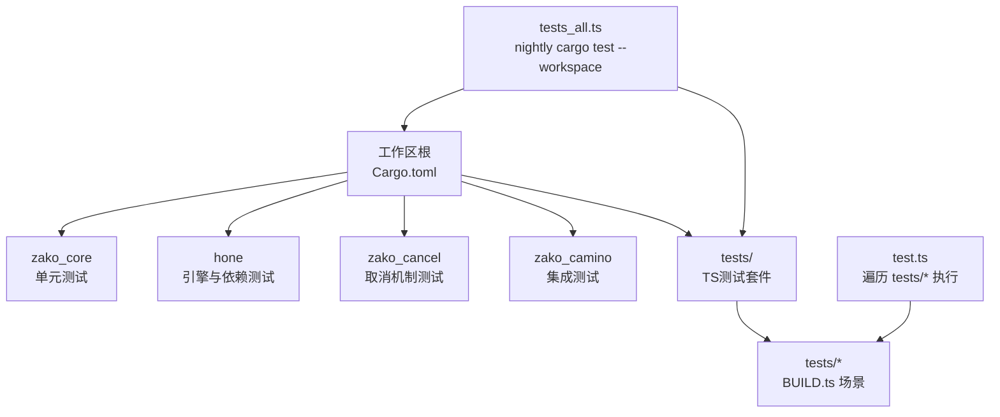
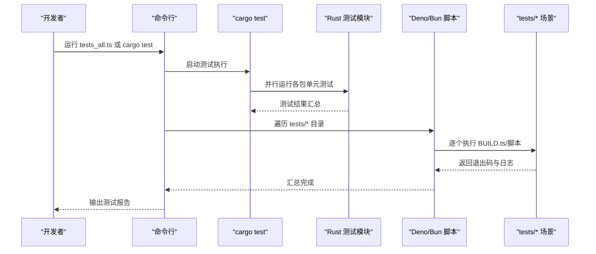
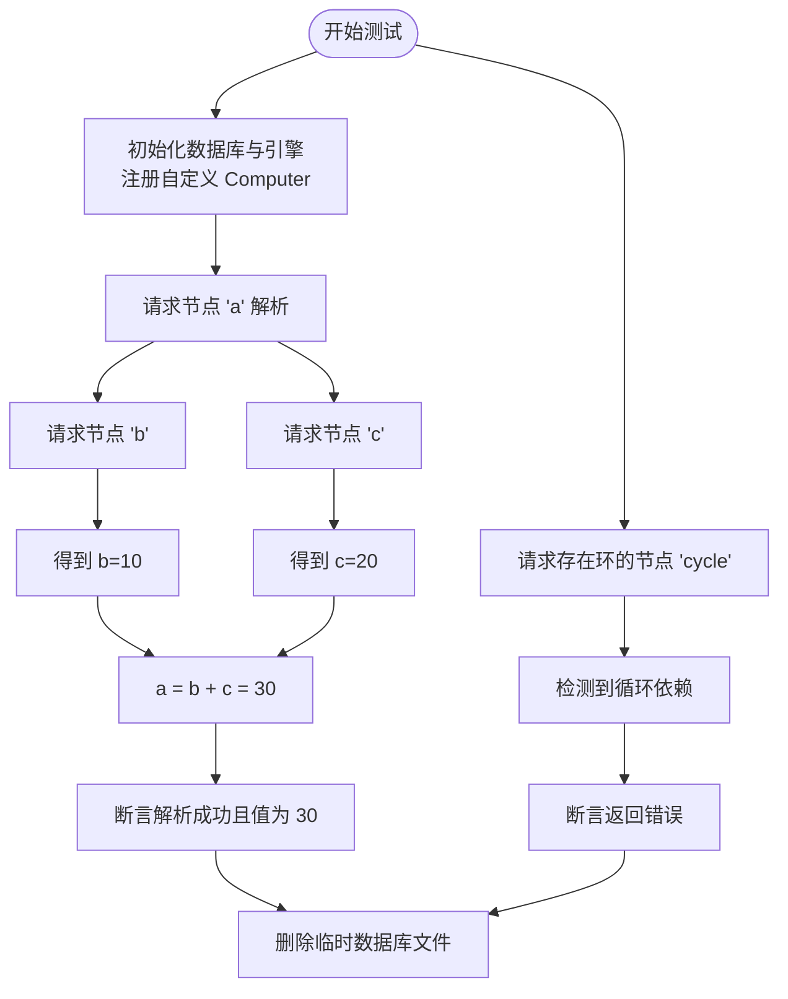
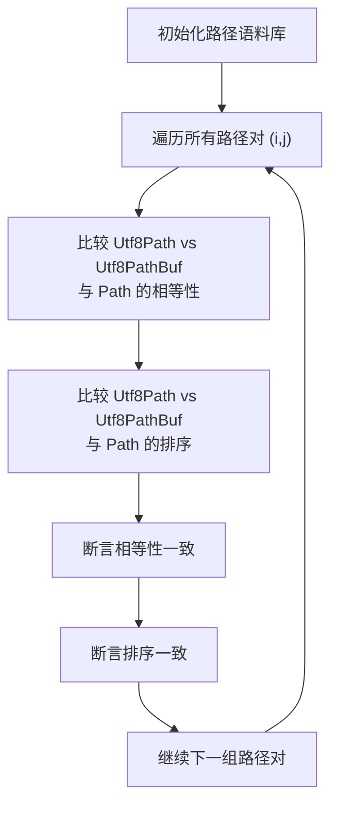
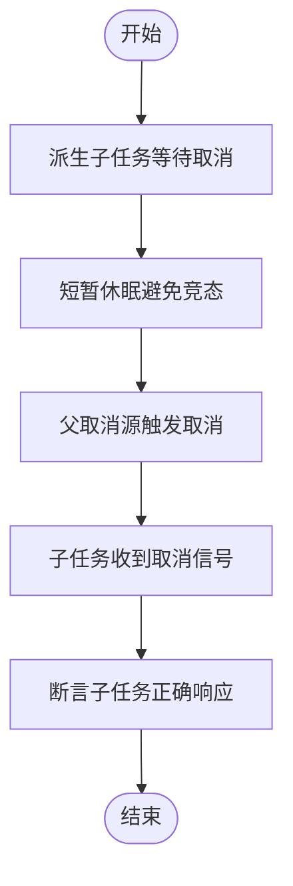
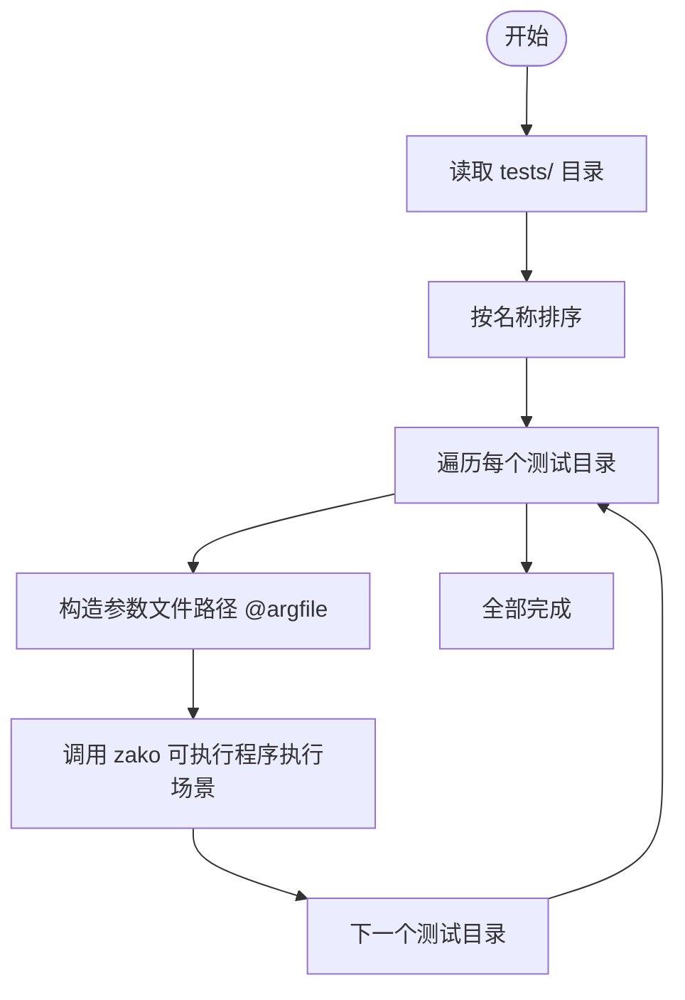
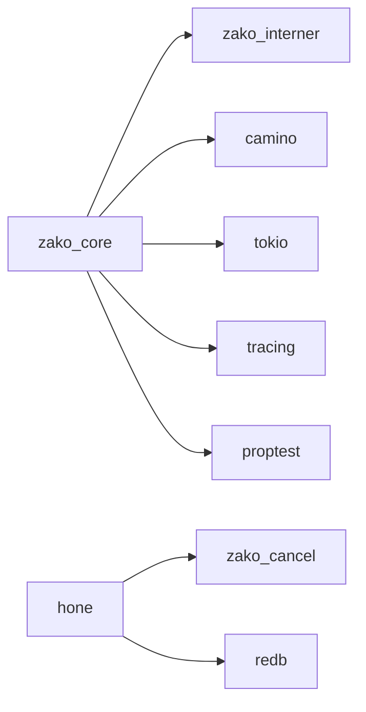

# 测试与调试

<cite>
**本文引用的文件**
- [Cargo.toml](file://Cargo.toml)
- [tests_all.ts](file://tests_all.ts)
- [test.ts](file://test.ts)
- [tsconfig.json](file://tests/tsconfig.json)
- [hone/tests/engine_tests.rs](file://hone/tests/engine_tests.rs)
- [zako_camino/tests/integration_tests.rs](file://zako_camino/tests/integration_tests.rs)
- [zako_cancel/tests/cancel_tests.rs](file://zako_cancel/tests/cancel_tests.rs)
- [zako_core/src/tests/mod.rs](file://zako_core/src/tests/mod.rs)
- [zako_core/src/tests/config_value_tests.rs](file://zako_core/src/tests/config_value_tests.rs)
- [zako_core/src/tests/package_tests.rs](file://zako_core/src/tests/package_tests.rs)
- [zako_core/src/tests/id_tests.rs](file://zako_core/src/tests/id_tests.rs)
- [zako_core/src/tests/intern_tests.rs](file://zako_core/src/tests/intern_tests.rs)
- [zako_core/Cargo.toml](file://zako_core/Cargo.toml)
- [tests/log_version/BUILD.ts](file://tests/log_version/BUILD.ts)
</cite>

## 目录
1. [简介](#简介)
2. [项目结构](#项目结构)
3. [核心组件](#核心组件)
4. [架构总览](#架构总览)
5. [详细组件分析](#详细组件分析)
6. [依赖分析](#依赖分析)
7. [性能考虑](#性能考虑)
8. [故障排查指南](#故障排查指南)
9. [结论](#结论)
10. [附录](#附录)

## 简介
本文件面向测试工程师与质量保证人员，系统性梳理 Zako 的测试与调试实践，覆盖测试框架、单元测试、集成测试、模拟对象与断言策略、测试配置与运行方式、覆盖率与持续集成建议、性能分析方法以及常见问题诊断。内容基于仓库中现有的 Rust 单元测试、Camino 集成测试、取消机制测试、TS 构建脚本测试等实际实现进行总结，并提供可操作的步骤与图示。

## 项目结构
Zako 采用多包工作区（Cargo workspace）组织，核心模块包括 zako_core、hone、zako_cancel、zako_camino 等；同时在根目录提供 TypeScript 测试脚本与 TS 配置，用于驱动构建与验证场景。

- 工作区与成员包：通过工作区配置统一版本与 lint 规则，成员包涵盖核心逻辑、CLI、取消机制、路径库等。
- 测试分布：
  - Rust 单元测试：各包内 tests 目录，如 hone、zako_camino、zako_cancel、zako_core。
  - 集成测试：zako_camino 提供跨平台路径行为一致性测试。
  - TS 测试：tests 目录下包含多个测试上下文，配合 Deno/Bun 脚本批量执行。
- 运行入口：
  - tests_all.ts：一键在 nightly 工具链下运行工作区所有测试。
  - test.ts：遍历 tests 下的子目录，按顺序调用目标可执行程序进行验证。

图表来源
- [Cargo.toml](file://Cargo.toml#L11-L22)
- [tests_all.ts](file://tests_all.ts#L5-L11)
- [test.ts](file://test.ts#L40-L51)

章节来源
- [Cargo.toml](file://Cargo.toml#L11-L22)
- [tests_all.ts](file://tests_all.ts#L1-L13)
- [test.ts](file://test.ts#L21-L64)
- [tsconfig.json](file://tests/tsconfig.json#L1-L26)

## 核心组件
- 测试框架与运行
  - Rust 使用标准测试运行器与 tokio 异步测试注解，支持并发与取消。
  - TS 使用 Deno/Bun 脚本驱动，按目录顺序执行。
- 断言与错误处理
  - 大量使用断言检查返回值、错误类型与状态传播。
  - 取消机制测试覆盖父/子令牌、等待取消、原因保留等。
- 模拟与隔离
  - 通过自定义 Computer 实现模拟计算图节点，隔离外部依赖。
  - 使用 redb 数据库存储引擎状态，便于重复与清理。

章节来源
- [hone/tests/engine_tests.rs](file://hone/tests/engine_tests.rs#L56-L80)
- [zako_cancel/tests/cancel_tests.rs](file://zako_cancel/tests/cancel_tests.rs#L4-L18)
- [zako_camino/tests/integration_tests.rs](file://zako_camino/tests/integration_tests.rs#L43-L93)

## 架构总览
下图展示测试执行的关键路径：Rust 单元测试由 cargo test 驱动；TS 测试由 Deno/Bun 脚本遍历执行；TS 场景通过 BUILD.ts 定义规则与依赖。

图表来源
- [tests_all.ts](file://tests_all.ts#L5-L11)
- [test.ts](file://test.ts#L40-L51)

## 详细组件分析

### Hone 引擎测试（异步计算图）
- 目标：验证引擎解析、循环检测、取消传播。
- 关键点：
  - 自定义 Computer 实现，根据节点键返回值或请求其他节点。
  - 使用 redb 创建数据库作为持久化存储，测试后清理文件。
  - 断言解析成功/失败、循环检测、取消触发后的错误类型。
- 流程图（解析与取消）：

图表来源
- [hone/tests/engine_tests.rs](file://hone/tests/engine_tests.rs#L56-L80)
- [hone/tests/engine_tests.rs](file://hone/tests/engine_tests.rs#L82-L101)
- [hone/tests/engine_tests.rs](file://hone/tests/engine_tests.rs#L103-L155)

章节来源
- [hone/tests/engine_tests.rs](file://hone/tests/engine_tests.rs#L1-L156)

### Camino 集成测试（路径库）
- 目标：验证 Utf8Path/Utf8PathBuf 在相等性、排序、哈希方面与标准 Path 的一致性，覆盖跨平台路径。
- 关键点：
  - 使用静态路径语料库，覆盖空串、相对路径、Windows 特殊路径等。
  - 断言借用与拥有者在比较与哈希上的一致性。
- 流程图（相等性与排序一致性）：

图表来源
- [zako_camino/tests/integration_tests.rs](file://zako_camino/tests/integration_tests.rs#L43-L93)

章节来源
- [zako_camino/tests/integration_tests.rs](file://zako_camino/tests/integration_tests.rs#L1-L116)

### 取消机制测试（Tokio 任务取消）
- 目标：验证取消源、令牌父子关系、等待取消、原因保留。
- 关键点：
  - 基础取消：令牌初始未取消，设置原因后变为已取消。
  - 等待取消：子任务等待 cancelled()，父取消后应被唤醒。
  - 父子传播：父取消应传播至子令牌；子源取消不应影响父令牌。
- 流程图（等待取消）：

图表来源
- [zako_cancel/tests/cancel_tests.rs](file://zako_cancel/tests/cancel_tests.rs#L20-L35)

章节来源
- [zako_cancel/tests/cancel_tests.rs](file://zako_cancel/tests/cancel_tests.rs#L1-L97)

### Zako Core 单元测试（配置、标识符、国际化）
- 目标：验证配置默认值解析、包标识符解析、标签解析、路径国际化等。
- 关键点：
  - 使用共享线程本地 Interner，减少重复分配。
  - 断言解析成功/失败与默认值类型匹配。
- 示例断言策略：
  - 类型匹配：断言解析后的配置类型与期望一致。
  - 默认值断言：断言默认值字段等于输入值。
  - 错误断言：断言非法输入返回错误。

章节来源
- [zako_core/src/tests/config_value_tests.rs](file://zako_core/src/tests/config_value_tests.rs#L1-L33)
- [zako_core/src/tests/package_tests.rs](file://zako_core/src/tests/package_tests.rs#L1-L42)
- [zako_core/src/tests/id_tests.rs](file://zako_core/src/tests/id_tests.rs#L1-L126)
- [zako_core/src/tests/intern_tests.rs](file://zako_core/src/tests/intern_tests.rs#L1-L30)
- [zako_core/src/tests/mod.rs](file://zako_core/src/tests/mod.rs#L1-L16)

### TS 测试场景与运行
- 目标：通过 BUILD.ts 定义规则与依赖，结合 Deno/Bun 脚本批量执行。
- 关键点：
  - test.ts 遍历 tests/* 子目录，按顺序执行对应场景。
  - tests/tsconfig.json 通过 references 组织多个 tsconfig，便于分层管理。
- 流程图（TS 测试执行）：

图表来源
- [test.ts](file://test.ts#L32-L52)
- [tsconfig.json](file://tests/tsconfig.json#L1-L26)

章节来源
- [test.ts](file://test.ts#L1-L65)
- [tsconfig.json](file://tests/tsconfig.json#L1-L26)
- [tests/log_version/BUILD.ts](file://tests/log_version/BUILD.ts#L1-L21)

## 依赖分析
- 工作区依赖与测试相关的关键库：
  - tokio：异步测试与任务取消。
  - redb：持久化存储，用于引擎状态缓存。
  - camino：路径库，提供 Utf8Path/Utf8PathBuf。
  - tracing/tracing-subscriber：可观测性与日志。
  - proptest：属性测试（部分包使用）。
- 包间耦合：
  - zako_core 依赖 zako_interner、camino、tokio 等，测试中通过共享 Interner 降低内存占用。
  - hone 依赖 zako_cancel 与 redb，测试中通过自定义 Computer 隔离外部依赖。
- 外部集成点：
  - TS 构建脚本通过 zako:rule 与 zako:project 导入规则与项目配置。

图表来源
- [Cargo.toml](file://Cargo.toml#L38-L280)
- [zako_core/Cargo.toml](file://zako_core/Cargo.toml#L16-L138)

章节来源
- [Cargo.toml](file://Cargo.toml#L38-L280)
- [zako_core/Cargo.toml](file://zako_core/Cargo.toml#L16-L138)

## 性能考虑
- 测试并发与资源
  - 使用 tokio::test 并发运行测试，注意 redb 文件句柄与锁竞争。
  - 对于大型测试场景，建议拆分测试集，避免长时间持有数据库连接。
- 内存与缓存
  - 共享线程本地 Interner 可显著降低字符串分配开销，适用于大量标识符测试。
- 日志与追踪
  - 在 dev profile 下启用详细日志，有助于定位异步任务与取消路径问题。
- 性能分析建议
  - 使用火焰图或 perf 等工具对阻塞点进行采样，关注 tokio 任务调度与磁盘 IO。
  - 对于路径解析密集的场景，优先使用 Utf8PathBuf 的就地规范化能力。

## 故障排查指南
- 常见问题与定位
  - 循环依赖导致解析失败：检查 Computer 中的请求链路，确认是否存在自引用或相互依赖。
  - 取消不生效：确认取消源与令牌是否来自同一生命周期，避免跨任务误用令牌。
  - 路径比较不一致：核对语料库中的特殊路径（Windows 分隔符、UNC 路径等），确保在不同平台下的行为一致。
  - TS 场景失败：检查 BUILD.ts 中的规则与依赖声明，确认 argfile 与项目配置路径正确。
- 排查步骤
  - 启用详细日志：在 dev profile 下运行，观察 tracing 输出。
  - 缩小范围：将单个测试独立运行，逐步排除干扰因素。
  - 清理状态：删除 redb 临时文件，避免历史状态影响新测试。
- 相关断言与错误类型
  - 引擎测试：断言 Ok/Err 与具体错误类型（如循环依赖）。
  - 取消测试：断言令牌状态、取消原因、等待取消的唤醒时机。
  - Camino 测试：断言 Eq/Ord/Hash 一致性与平台差异。

章节来源
- [hone/tests/engine_tests.rs](file://hone/tests/engine_tests.rs#L82-L101)
- [zako_cancel/tests/cancel_tests.rs](file://zako_cancel/tests/cancel_tests.rs#L70-L82)
- [zako_camino/tests/integration_tests.rs](file://zako_camino/tests/integration_tests.rs#L43-L93)

## 结论
Zako 的测试体系以 Rust 单元测试为主，辅以 Camino 集成测试与 TS 场景脚本，形成从核心逻辑到路径与构建规则的完整验证闭环。通过共享 Interner、异步测试与取消机制，测试具备良好的可维护性与可扩展性。建议在持续集成中引入覆盖率统计与性能回归基线，进一步提升质量保障水平。

## 附录
- 测试运行
  - Rust：使用 tests_all.ts 在 nightly 工具链下运行工作区测试。
  - TS：使用 test.ts 遍历 tests/* 目录，按顺序执行场景。
- 配置参考
  - tests/tsconfig.json：通过 references 组织多份 tsconfig，便于分层管理。
- 示例场景
  - tests/log_version/BUILD.ts：演示规则导入、项目二进制与库的组合、条件链接与标准配置。

章节来源
- [tests_all.ts](file://tests_all.ts#L1-L13)
- [test.ts](file://test.ts#L21-L64)
- [tsconfig.json](file://tests/tsconfig.json#L1-L26)
- [tests/log_version/BUILD.ts](file://tests/log_version/BUILD.ts#L1-L21)