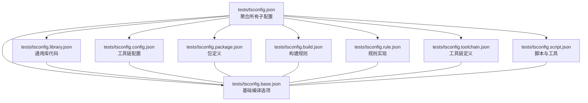
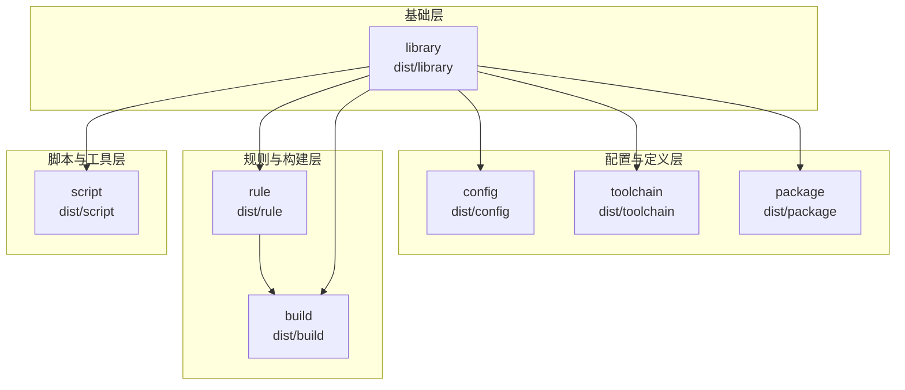
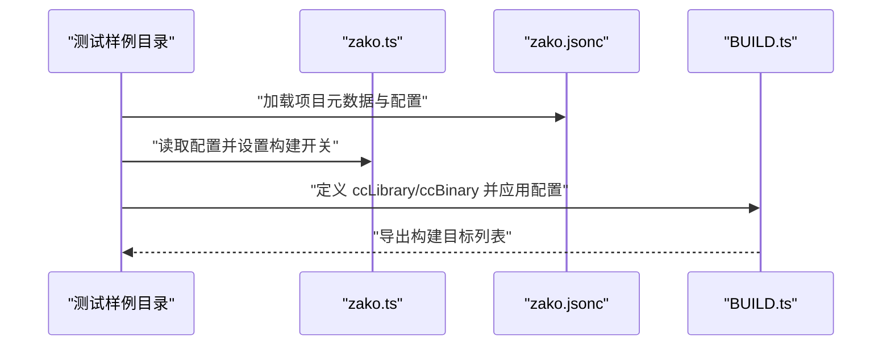
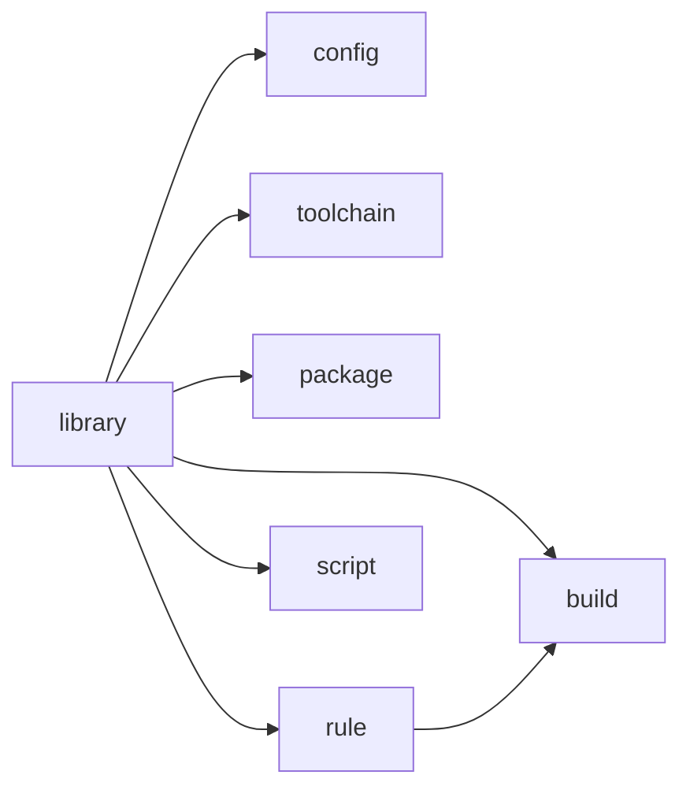

# 测试框架

<cite>
**本文引用的文件**
- [tests/tsconfig.base.json](file://tests/tsconfig.base.json)
- [tests/tsconfig.json](file://tests/tsconfig.json)
- [tests/tsconfig.library.json](file://tests/tsconfig.library.json)
- [tests/tsconfig.config.json](file://tests/tsconfig.config.json)
- [tests/tsconfig.package.json](file://tests/tsconfig.package.json)
- [tests/tsconfig.build.json](file://tests/tsconfig.build.json)
- [tests/tsconfig.rule.json](file://tests/tsconfig.rule.json)
- [tests/tsconfig.toolchain.json](file://tests/tsconfig.toolchain.json)
- [tests/tsconfig.script.json](file://tests/tsconfig.script.json)
- [tests/log_version/zako.ts](file://tests/log_version/zako.ts)
- [tests/log_version/BUILD.ts](file://tests/log_version/BUILD.ts)
- [tests/log_version/zako.jsonc](file://tests/log_version/zako.jsonc)
- [tests/new_project/zako.ts](file://tests/new_project/zako.ts)
- [tests/new_project/zako.json](file://tests/new_project/zako.json)
- [cli.ts](file://cli.ts)
- [core.ts](file://core.ts)
- [tests.ts](file://tests.ts)
- [tests_all.ts](file://tests_all.ts)
- [test.ts](file://test.ts)
</cite>

## 目录
1. [简介](#简介)
2. [项目结构](#项目结构)
3. [核心组件](#核心组件)
4. [架构总览](#架构总览)
5. [详细组件分析](#详细组件分析)
6. [依赖分析](#依赖分析)
7. [性能考虑](#性能考虑)
8. [故障排查指南](#故障排查指南)
9. [结论](#结论)
10. [附录](#附录)

## 简介
本文件面向 Zako 测试框架，系统性阐述多项目 TypeScript 测试配置的组织与分层架构，覆盖以下主题：
- 各 tsconfig 文件的作用与配置要点
- 分层架构：config、library、package、build、rule、toolchain、script 等类型测试配置
- 测试环境搭建：依赖安装、编译配置与运行脚本
- 编译顺序与依赖关系
- 实际示例与最佳实践

目标是帮助开发者快速理解并正确使用整个测试框架。

## 项目结构
Zako 的测试配置位于 tests 目录下，采用“根配置 + 多子配置”的复合结构：
- 根配置 tests/tsconfig.json 通过 references 聚合多个子配置
- 子配置按功能域划分（如 library、config、package、build、rule、toolchain、script），每个子配置继承基础配置 tests/tsconfig.base.json，并限定各自的 include/exclude 与 outDir
- 每个测试样例目录包含对应的 zako.ts 或 BUILD.ts 等源文件，用于演示不同配置域的用法

图表来源
- [tests/tsconfig.json](file://tests/tsconfig.json#L1-L26)
- [tests/tsconfig.base.json](file://tests/tsconfig.base.json#L1-L41)
- [tests/tsconfig.library.json](file://tests/tsconfig.library.json#L1-L31)
- [tests/tsconfig.config.json](file://tests/tsconfig.config.json#L1-L31)
- [tests/tsconfig.package.json](file://tests/tsconfig.package.json#L1-L31)
- [tests/tsconfig.build.json](file://tests/tsconfig.build.json#L1-L34)
- [tests/tsconfig.rule.json](file://tests/tsconfig.rule.json#L1-L31)
- [tests/tsconfig.toolchain.json](file://tests/tsconfig.toolchain.json#L1-L31)
- [tests/tsconfig.script.json](file://tests/tsconfig.script.json#L1-L27)

章节来源
- [tests/tsconfig.json](file://tests/tsconfig.json#L1-L26)
- [tests/tsconfig.base.json](file://tests/tsconfig.base.json#L1-L41)

## 核心组件
本节聚焦各 tsconfig 配置文件的职责与关键选项，帮助理解分层架构的设计意图。

- 基础配置 tests/tsconfig.base.json
  - 统一启用 composite、严格模式、声明生成、内联 SourceMap 等选项，确保多项目增量编译与类型安全
  - 使用 ESNext 目标与模块系统，配合 bundler 的模块解析策略
  - 关键点：declaration、declarationMap、isolatedModules、isolatedDeclarations、emitDeclarationOnly 等，保证仅生成类型声明且可被其他项目引用

- 聚合配置 tests/tsconfig.json
  - 通过 references 将 config、library、package、build、rule、toolchain、script 等子配置纳入同一编译图
  - 便于一次性编译/检查全部测试配置域

- 子配置分层
  - library：通用库代码，排除非库文件模式匹配，输出到 dist/library
  - config：工具链配置文件（.toolchain.ts），输出到 dist/config
  - package：包定义文件（zako.ts），输出到 dist/package
  - build：构建规则入口（BUILD.ts），输出到 dist/build
  - rule：规则实现（*.rule.ts），输出到 dist/rule
  - toolchain：工具链定义（*.toolchain.ts），输出到 dist/toolchain
  - script：脚本与工具（*.script.ts 与 scripts/**/*.ts），输出到 dist/script

章节来源
- [tests/tsconfig.base.json](file://tests/tsconfig.base.json#L1-L41)
- [tests/tsconfig.json](file://tests/tsconfig.json#L1-L26)
- [tests/tsconfig.library.json](file://tests/tsconfig.library.json#L1-L31)
- [tests/tsconfig.config.json](file://tests/tsconfig.config.json#L1-L31)
- [tests/tsconfig.package.json](file://tests/tsconfig.package.json#L1-L31)
- [tests/tsconfig.build.json](file://tests/tsconfig.build.json#L1-L34)
- [tests/tsconfig.rule.json](file://tests/tsconfig.rule.json#L1-L31)
- [tests/tsconfig.toolchain.json](file://tests/tsconfig.toolchain.json#L1-L31)
- [tests/tsconfig.script.json](file://tests/tsconfig.script.json#L1-L27)

## 架构总览
下图展示测试配置的分层与依赖关系：library 作为基础层被其他配置域引用；config、toolchain、rule、script 等各自独立编译，build 依赖 library 与 rule；package 依赖 library。

图表来源
- [tests/tsconfig.library.json](file://tests/tsconfig.library.json#L26-L30)
- [tests/tsconfig.config.json](file://tests/tsconfig.config.json#L26-L30)
- [tests/tsconfig.toolchain.json](file://tests/tsconfig.toolchain.json#L26-L30)
- [tests/tsconfig.rule.json](file://tests/tsconfig.rule.json#L26-L30)
- [tests/tsconfig.build.json](file://tests/tsconfig.build.json#L26-L33)
- [tests/tsconfig.script.json](file://tests/tsconfig.script.json#L22-L26)
- [tests/tsconfig.package.json](file://tests/tsconfig.package.json#L26-L30)

## 详细组件分析

### 基础配置：tsconfig.base.json
- 设计要点
  - 开启 composite 以支持多项目增量编译
  - 严格模式与严格的类型检查选项，提升质量
  - 仅生成声明文件（declaration、emitDeclarationOnly），避免运行时产物污染
  - 内联 SourceMap 与 declarationMap，便于调试与类型映射
- 影响范围
  - 所有子配置均继承该基础配置，统一行为与质量标准

章节来源
- [tests/tsconfig.base.json](file://tests/tsconfig.base.json#L1-L41)

### 聚合配置：tsconfig.json
- 设计要点
  - 通过 references 聚合所有子配置，形成单一编译入口
  - 便于一次性执行 tsc --build 或 IDE 的工作区编译
- 影响范围
  - 顶层编译器会按引用顺序处理子配置

章节来源
- [tests/tsconfig.json](file://tests/tsconfig.json#L1-L26)

### 库配置：tsconfig.library.json
- 作用
  - 编译通用库代码，排除非库文件模式匹配
  - 作为其他配置域的基础依赖
- 关键点
  - include 排除 BUILD.ts、*.rule.ts、*.toolchain.ts、*.script.ts、scripts/**/*.ts、*.config.ts 等
  - references 为空，表示不依赖其他配置域

章节来源
- [tests/tsconfig.library.json](file://tests/tsconfig.library.json#L1-L31)

### 工具链配置：tsconfig.config.json
- 作用
  - 编译工具链配置文件（*.toolchain.ts）
- 关键点
  - 引用 library 配置域，确保类型可用
  - outDir 为 dist/config

章节来源
- [tests/tsconfig.config.json](file://tests/tsconfig.config.json#L1-L31)

### 包定义配置：tsconfig.package.json
- 作用
  - 编译包定义文件（zako.ts）
- 关键点
  - include 限定 zako.ts
  - 引用 library 配置域

章节来源
- [tests/tsconfig.package.json](file://tests/tsconfig.package.json#L1-L31)

### 构建配置：tsconfig.build.json
- 作用
  - 编译构建规则入口（BUILD.ts）
- 关键点
  - include 限定 BUILD.ts
  - 引用 library 与 rule 配置域

章节来源
- [tests/tsconfig.build.json](file://tests/tsconfig.build.json#L1-L34)

### 规则配置：tsconfig.rule.json
- 作用
  - 编译规则实现（*.rule.ts）
- 关键点
  - 引用 library 配置域

章节来源
- [tests/tsconfig.rule.json](file://tests/tsconfig.rule.json#L1-L31)

### 工具链定义配置：tsconfig.toolchain.json
- 作用
  - 编译工具链定义（*.toolchain.ts）
- 关键点
  - 引用 library 配置域

章节来源
- [tests/tsconfig.toolchain.json](file://tests/tsconfig.toolchain.json#L1-L31)

### 脚本配置：tsconfig.script.json
- 作用
  - 编译脚本与工具（*.script.ts 与 scripts/**/*.ts）
- 关键点
  - 引用 library 配置域
  - 类型包含 node，适配 Node.js 环境

章节来源
- [tests/tsconfig.script.json](file://tests/tsconfig.script.json#L1-L27)

### 示例：日志版本测试（log_version）
- zako.ts 展示了如何导入 zako:core 与 zako:project 并读取项目配置
- zako.jsonc 定义了 group/artifact/version、依赖与 config 选项（如 log、debug、guava-cpp20）
- BUILD.ts 展示了如何使用 zako:rule 与 zako:project 的 API 来定义 ccLibrary/ccBinary，并根据配置动态调整

图表来源
- [tests/log_version/zako.ts](file://tests/log_version/zako.ts#L1-L13)
- [tests/log_version/zako.jsonc](file://tests/log_version/zako.jsonc#L1-L32)
- [tests/log_version/BUILD.ts](file://tests/log_version/BUILD.ts#L1-L21)

章节来源
- [tests/log_version/zako.ts](file://tests/log_version/zako.ts#L1-L13)
- [tests/log_version/zako.jsonc](file://tests/log_version/zako.jsonc#L1-L32)
- [tests/log_version/BUILD.ts](file://tests/log_version/BUILD.ts#L1-L21)

### 示例：新项目测试（new_project）
- zako.ts 展示了如何从 JSON 导入并初始化项目，随后定义工作空间与规则
- zako.json 定义了 group/artifact/version/description/license/authors/workspaces 以及 options

章节来源
- [tests/new_project/zako.ts](file://tests/new_project/zako.ts#L1-L22)
- [tests/new_project/zako.json](file://tests/new_project/zako.json#L1-L18)

## 依赖分析
- 依赖关系
  - library 是基础层，被 config、toolchain、package、rule、build、script 等配置域引用
  - build 依赖 library 与 rule
- 编译顺序建议
  - 先编译 library
  - 再编译 config、toolchain、package、rule、script
  - 最后编译 build
- 参考路径
  - library 的 references 为空，其他配置域在 references 中声明对 library 的依赖

图表来源
- [tests/tsconfig.library.json](file://tests/tsconfig.library.json#L26-L30)
- [tests/tsconfig.config.json](file://tests/tsconfig.config.json#L26-L30)
- [tests/tsconfig.toolchain.json](file://tests/tsconfig.toolchain.json#L26-L30)
- [tests/tsconfig.package.json](file://tests/tsconfig.package.json#L26-L30)
- [tests/tsconfig.rule.json](file://tests/tsconfig.rule.json#L26-L30)
- [tests/tsconfig.build.json](file://tests/tsconfig.build.json#L26-L33)
- [tests/tsconfig.script.json](file://tests/tsconfig.script.json#L22-L26)

章节来源
- [tests/tsconfig.library.json](file://tests/tsconfig.library.json#L26-L30)
- [tests/tsconfig.build.json](file://tests/tsconfig.build.json#L26-L33)

## 性能考虑
- 使用 composite 与声明生成，减少重复类型检查与增量编译成本
- 仅生成声明文件（declaration、emitDeclarationOnly），降低 I/O 与打包负担
- 合理划分配置域，避免不必要的 include/exclude 匹配开销
- 利用 references 的分层依赖，按需编译，缩短开发周期

## 故障排查指南
- 常见问题与定位
  - 类型找不到：确认是否正确引用 library 或对应域的类型根（typeRoots）与路径映射（paths）
  - 编译顺序错误：先编译 library，再编译其他配置域
  - 输出目录冲突：确保各配置域的 outDir 不同，避免互相覆盖
  - 依赖未生效：检查 references 是否正确指向被依赖的配置域
- 运行脚本参考
  - Rust/Cargo 相关脚本：cli.ts、core.ts、tests.ts、tests_all.ts
  - 测试驱动脚本：test.ts（遍历 tests 目录下的样例并逐一执行）

章节来源
- [cli.ts](file://cli.ts#L1-L15)
- [core.ts](file://core.ts#L1-L15)
- [tests.ts](file://tests.ts#L1-L13)
- [tests_all.ts](file://tests_all.ts#L1-L13)
- [test.ts](file://test.ts#L1-L65)

## 结论
Zako 的测试框架通过“基础配置 + 多子配置 + 聚合配置”的分层设计，实现了清晰的职责分离与可维护的编译体系。开发者应遵循以下实践：
- 在 tests 目录下新增测试样例时，优先复用现有配置域或按需扩展
- 明确各配置域的 include/exclude 与 outDir，避免交叉污染
- 保持 references 的依赖关系简洁明确，遵循 library → 其他域的单向依赖
- 使用脚本自动化编译与测试流程，提高效率与一致性

## 附录
- 测试环境搭建步骤（概要）
  - 安装依赖：确保已安装 Rust nightly、Cargo、Bun/Deno 等运行时
  - 构建核心：使用 cli.ts 或 core.ts 构建 zako-cli 或 zako-core
  - 运行测试：使用 test.ts 遍历 tests 目录下的样例并执行
  - 全量测试：使用 tests.ts 或 tests_all.ts 运行特定包或工作区的测试
- 最佳实践
  - 保持 base 配置稳定，避免频繁变更严格选项
  - 为每个配置域编写最小化的 include/exclude，提升编译速度
  - 使用 paths 与 typeRoots 管理类型可见性，避免全局污染
  - 在 BUILD.ts 与 zako.ts 中尽量使用显式导入与类型约束，增强可读性与可维护性