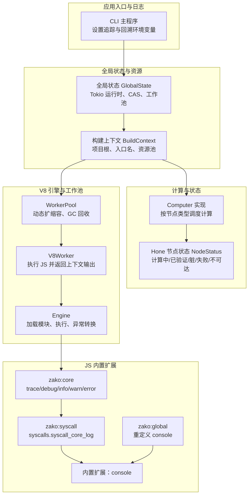
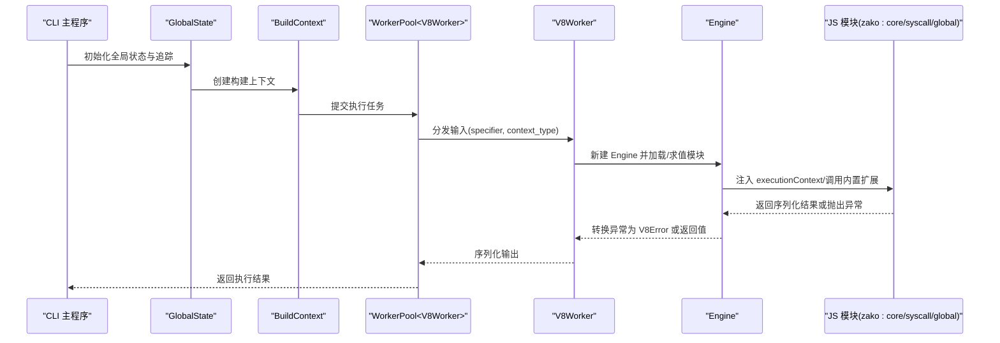
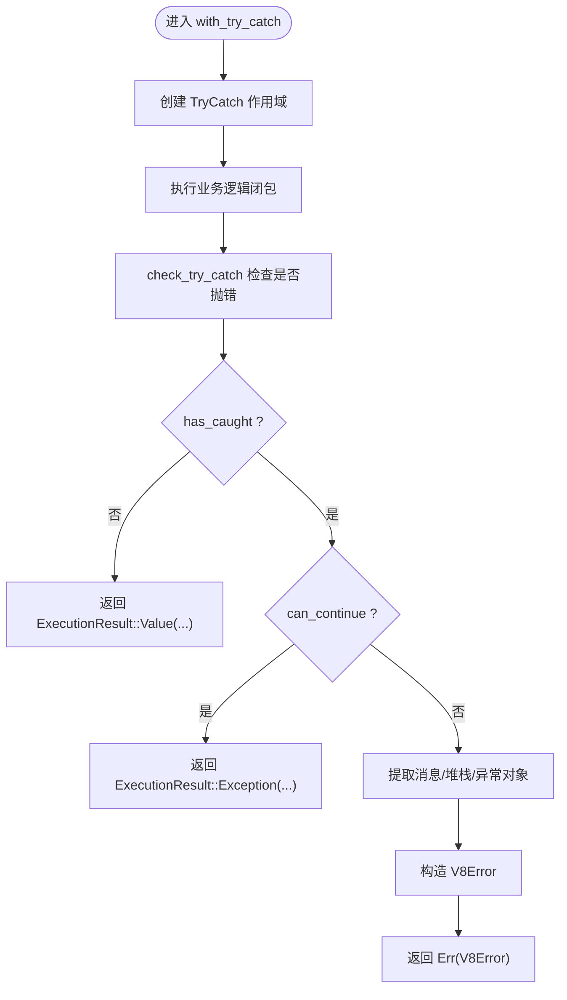
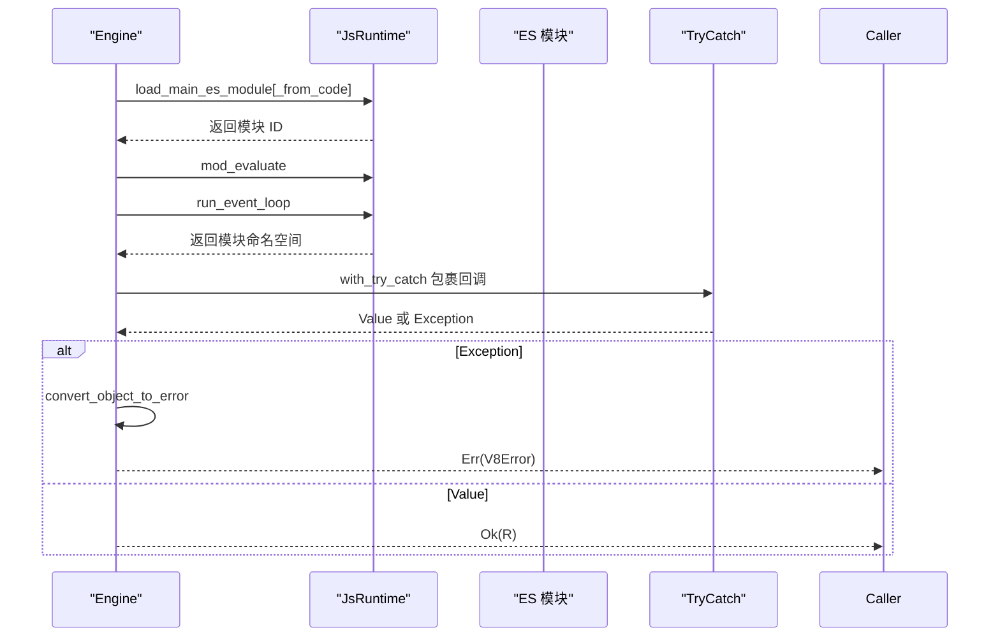
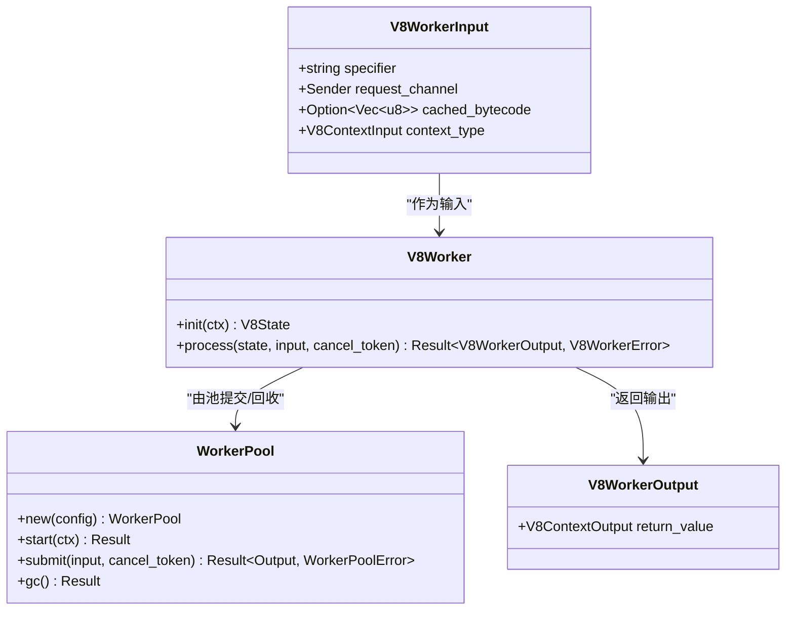
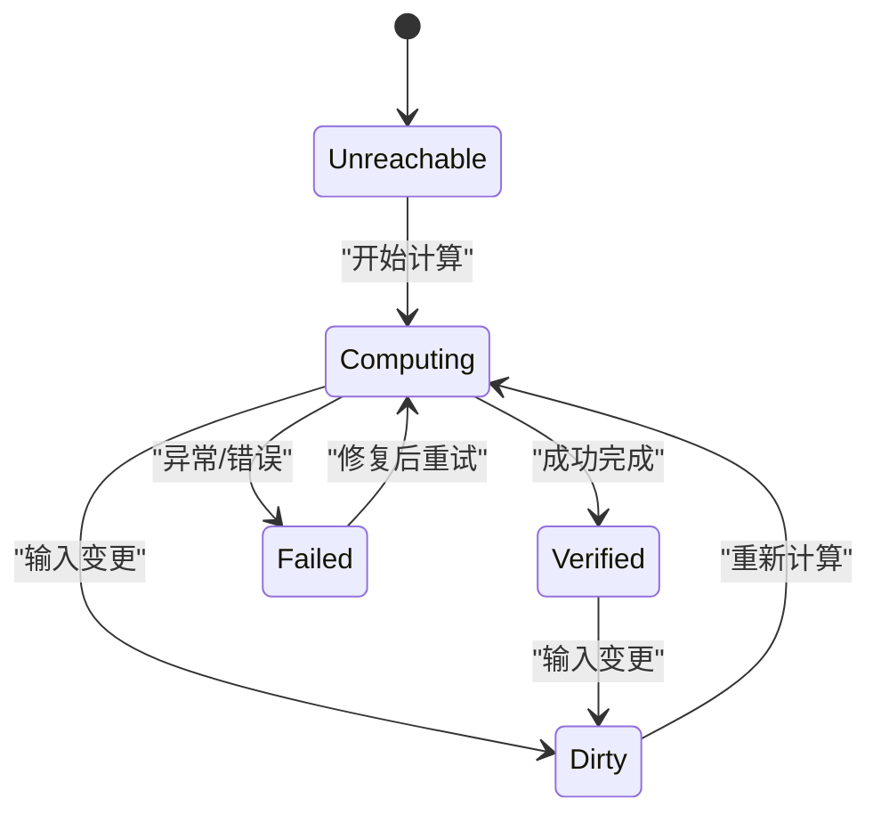
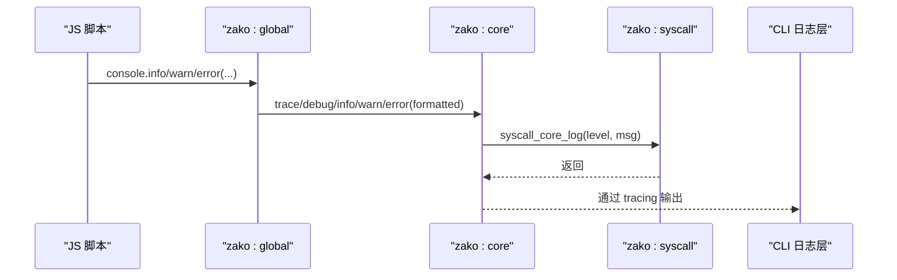
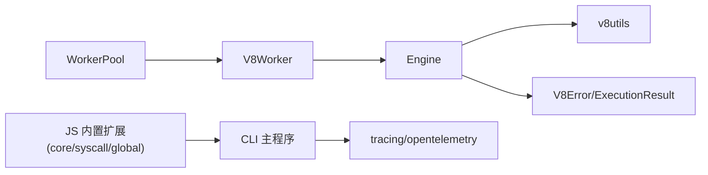

# 调试工具

<cite>
**本文引用的文件**
- [zako_core/src/v8error.rs](file://zako_core/src/v8error.rs)
- [zako_core/src/v8utils.rs](file://zako_core/src/v8utils.rs)
- [zako_core/src/engine.rs](file://zako_core/src/engine.rs)
- [zako_core/src/v8context.rs](file://zako_core/src/v8context.rs)
- [zako_core/src/worker/v8worker.rs](file://zako_core/src/worker/v8worker.rs)
- [zako_core/src/worker/worker_pool.rs](file://zako_core/src/worker/worker_pool.rs)
- [zako_core/src/context.rs](file://zako_core/src/context.rs)
- [zako_core/src/global_state.rs](file://zako_core/src/global_state.rs)
- [hone/src/status.rs](file://hone/src/status.rs)
- [zako_core/src/builtin/extension/console.rs](file://zako_core/src/builtin/extension/console.rs)
- [zako_js/src/builtins/core/index.ts](file://zako_js/src/builtins/core/index.ts)
- [zako_js/src/builtins/syscall/index.ts](file://zako_js/src/builtins/syscall/index.ts)
- [zako_js/src/builtins/global/index.ts](file://zako_js/src/builtins/global/index.ts)
- [zako_cli/src/main.rs](file://zako_cli/src/main.rs)
</cite>

## 目录
1. [简介](#简介)
2. [项目结构](#项目结构)
3. [核心组件](#核心组件)
4. [架构总览](#架构总览)
5. [组件详解](#组件详解)
6. [依赖关系分析](#依赖关系分析)
7. [性能与资源监控](#性能与资源监控)
8. [调试脚本与配置](#调试脚本与配置)
9. [常见场景与排障](#常见场景与排障)
10. [结论](#结论)

## 简介
本指南面向使用 Zako 构建系统进行开发与调试的工程师，聚焦于 V8 引擎级调试能力与工具链集成，涵盖以下主题：
- V8 错误处理机制与错误信息解析
- 堆栈跟踪分析与调试会话管理
- 计算过程跟踪、状态监控与性能分析
- V8 工具集成：内存分析、执行时间测量、资源使用监控
- 调试脚本编写与调试器配置
- 日志系统使用与调试信息解读
- 常见调试场景的解决方案与故障排除

## 项目结构
Zako 将“构建上下文”“计算图”“V8 引擎”“工作池”“日志与追踪”等模块分层组织，形成从高层配置到底层执行的完整链路。

图表来源
- [zako_cli/src/main.rs](file://zako_cli/src/main.rs#L500-L518)
- [zako_core/src/global_state.rs](file://zako_core/src/global_state.rs#L54-L97)
- [zako_core/src/context.rs](file://zako_core/src/context.rs#L46-L86)
- [zako_core/src/computer.rs](file://zako_core/src/computer.rs#L24-L76)
- [hone/src/status.rs](file://hone/src/status.rs#L62-L114)
- [zako_core/src/worker/worker_pool.rs](file://zako_core/src/worker/worker_pool.rs#L56-L119)
- [zako_core/src/worker/v8worker.rs](file://zako_core/src/worker/v8worker.rs#L71-L146)
- [zako_core/src/engine.rs](file://zako_core/src/engine.rs#L47-L79)
- [zako_core/src/builtin/extension/console.rs](file://zako_core/src/builtin/extension/console.rs#L1-L8)
- [zako_js/src/builtins/core/index.ts](file://zako_js/src/builtins/core/index.ts#L121-L138)
- [zako_js/src/builtins/syscall/index.ts](file://zako_js/src/builtins/syscall/index.ts#L1-L24)
- [zako_js/src/builtins/global/index.ts](file://zako_js/src/builtins/global/index.ts#L30-L44)

章节来源
- [zako_cli/src/main.rs](file://zako_cli/src/main.rs#L500-L518)
- [zako_core/src/global_state.rs](file://zako_core/src/global_state.rs#L54-L97)
- [zako_core/src/context.rs](file://zako_core/src/context.rs#L46-L86)
- [zako_core/src/computer.rs](file://zako_core/src/computer.rs#L24-L76)
- [hone/src/status.rs](file://hone/src/status.rs#L62-L114)
- [zako_core/src/worker/worker_pool.rs](file://zako_core/src/worker/worker_pool.rs#L56-L119)
- [zako_core/src/worker/v8worker.rs](file://zako_core/src/worker/v8worker.rs#L71-L146)
- [zako_core/src/engine.rs](file://zako_core/src/engine.rs#L47-L79)
- [zako_core/src/builtin/extension/console.rs](file://zako_core/src/builtin/extension/console.rs#L1-L8)
- [zako_js/src/builtins/core/index.ts](file://zako_js/src/builtins/core/index.ts#L121-L138)
- [zako_js/src/builtins/syscall/index.ts](file://zako_js/src/builtins/syscall/index.ts#L1-L24)
- [zako_js/src/builtins/global/index.ts](file://zako_js/src/builtins/global/index.ts#L30-L44)

## 核心组件
- V8 错误模型与执行结果
  - V8Error：承载模块标识、消息、堆栈、异常对象与附加信息
  - ExecutionResult：区分正常返回与异常抛出
- V8 工具集
  - TryCatch 包装、事件循环推进、Promise 结果转换、堆栈字符串提取
- 引擎与执行流程
  - Engine：初始化平台、注册扩展、加载并求值 ES 模块、异常转换
- V8 工人与工作池
  - V8Worker：基于 Engine 执行 JS，序列化返回值
  - WorkerPool：动态扩容、空闲回收、广播 GC、取消令牌
- 日志与追踪
  - CLI 设置追踪与回溯；JS 侧通过 zako:core 与 zako:syscall 输出日志

章节来源
- [zako_core/src/v8error.rs](file://zako_core/src/v8error.rs#L12-L31)
- [zako_core/src/v8utils.rs](file://zako_core/src/v8utils.rs#L8-L37)
- [zako_core/src/engine.rs](file://zako_core/src/engine.rs#L47-L79)
- [zako_core/src/worker/v8worker.rs](file://zako_core/src/worker/v8worker.rs#L71-L146)
- [zako_core/src/worker/worker_pool.rs](file://zako_core/src/worker/worker_pool.rs#L56-L119)
- [zako_cli/src/main.rs](file://zako_cli/src/main.rs#L500-L518)

## 架构总览
下图展示从 CLI 到 V8 执行、再到日志输出的端到端路径，以及计算状态与工作池的交互。

图表来源
- [zako_cli/src/main.rs](file://zako_cli/src/main.rs#L500-L518)
- [zako_core/src/global_state.rs](file://zako_core/src/global_state.rs#L54-L97)
- [zako_core/src/context.rs](file://zako_core/src/context.rs#L46-L86)
- [zako_core/src/worker/worker_pool.rs](file://zako_core/src/worker/worker_pool.rs#L156-L178)
- [zako_core/src/worker/v8worker.rs](file://zako_core/src/worker/v8worker.rs#L83-L146)
- [zako_core/src/engine.rs](file://zako_core/src/engine.rs#L81-L109)
- [zako_js/src/builtins/core/index.ts](file://zako_js/src/builtins/core/index.ts#L121-L138)
- [zako_js/src/builtins/syscall/index.ts](file://zako_js/src/builtins/syscall/index.ts#L17-L22)
- [zako_js/src/builtins/global/index.ts](file://zako_js/src/builtins/global/index.ts#L30-L44)

## 组件详解

### V8 错误处理与堆栈解析
- 错误模型
  - V8Error 字段：模块标识、消息、堆栈、异常对象、附加信息
  - ExecutionResult：Value/Exception 两种分支，用于区分正常返回与异常
- 异常捕获与转换
  - with_try_catch：封装 TryCatch 生命周期，统一返回 ExecutionResult
  - check_try_catch：区分可继续与致命异常，提取消息与堆栈
  - convert_object_to_error / convert_rejected_promise_to_error：将 JS 异常对象转换为 V8Error
  - get_stack_trace_string：从异常对象读取 stack 字符串
- 事件循环与死锁检测
  - run_event_loop_until_resolved：推进微任务与平台消息循环，检测 Promise 死锁

图表来源
- [zako_core/src/v8utils.rs](file://zako_core/src/v8utils.rs#L116-L145)
- [zako_core/src/v8utils.rs](file://zako_core/src/v8utils.rs#L8-L37)
- [zako_core/src/v8utils.rs](file://zako_core/src/v8utils.rs#L176-L187)
- [zako_core/src/v8error.rs](file://zako_core/src/v8error.rs#L12-L31)

章节来源
- [zako_core/src/v8error.rs](file://zako_core/src/v8error.rs#L12-L31)
- [zako_core/src/v8utils.rs](file://zako_core/src/v8utils.rs#L8-L37)
- [zako_core/src/v8utils.rs](file://zako_core/src/v8utils.rs#L116-L145)
- [zako_core/src/v8utils.rs](file://zako_core/src/v8utils.rs#L176-L187)

### 引擎执行流程与调试会话
- 初始化与扩展
  - 初始化 V8 平台，注册 zako 内置扩展（rt、syscall、global、semver、core、console）
- 模块加载与求值
  - 支持从代码或文件加载主 ES 模块，随后执行模块评估与事件循环
- 异常传播
  - 在回调中再次使用 with_try_catch 包裹，将 JS 异常转换为 V8Error 并上抛
- 执行上下文注入
  - execute_module_with_json：向 JS 全局注入 executionContext，便于脚本读取输入

图表来源
- [zako_core/src/engine.rs](file://zako_core/src/engine.rs#L81-L109)
- [zako_core/src/engine.rs](file://zako_core/src/engine.rs#L168-L232)
- [zako_core/src/engine.rs](file://zako_core/src/engine.rs#L234-L299)
- [zako_core/src/engine.rs](file://zako_core/src/engine.rs#L111-L166)
- [zako_core/src/v8utils.rs](file://zako_core/src/v8utils.rs#L116-L145)

章节来源
- [zako_core/src/engine.rs](file://zako_core/src/engine.rs#L47-L79)
- [zako_core/src/engine.rs](file://zako_core/src/engine.rs#L81-L109)
- [zako_core/src/engine.rs](file://zako_core/src/engine.rs#L111-L166)
- [zako_core/src/engine.rs](file://zako_core/src/engine.rs#L168-L232)
- [zako_core/src/engine.rs](file://zako_core/src/engine.rs#L234-L299)

### V8 工人与工作池
- V8Worker 输入/输出
  - 输入：模块 specifier、请求通道、缓存字节码、上下文类型
  - 输出：上下文输出（序列化为 V8ContextOutput）
- 执行流程
  - 基于上下文类型初始化扩展，创建 Engine，执行模块并反序列化返回值
- 工作池特性
  - 动态扩容：根据队列积压与活跃线程数决定是否新建线程
  - 空闲回收：超时未活动线程自动退出
  - 广播 GC：周期性触发 Worker 的 GC 回调
  - 取消令牌：支持任务取消

图表来源
- [zako_core/src/worker/v8worker.rs](file://zako_core/src/worker/v8worker.rs#L20-L42)
- [zako_core/src/worker/v8worker.rs](file://zako_core/src/worker/v8worker.rs#L71-L146)
- [zako_core/src/worker/worker_pool.rs](file://zako_core/src/worker/worker_pool.rs#L56-L119)
- [zako_core/src/worker/worker_pool.rs](file://zako_core/src/worker/worker_pool.rs#L156-L178)

章节来源
- [zako_core/src/worker/v8worker.rs](file://zako_core/src/worker/v8worker.rs#L20-L42)
- [zako_core/src/worker/v8worker.rs](file://zako_core/src/worker/v8worker.rs#L71-L146)
- [zako_core/src/worker/worker_pool.rs](file://zako_core/src/worker/worker_pool.rs#L56-L119)
- [zako_core/src/worker/worker_pool.rs](file://zako_core/src/worker/worker_pool.rs#L156-L178)

### 计算过程跟踪与状态监控
- 计算调度
  - Computer 实现按节点类型分派具体计算，使用 tracing 的 span 进行采样
- 节点状态
  - NodeStatus：Computing/Verified/Dirty/Failed/Unreachable
  - NodeStatusCode：整型编码，便于持久化与比较
- 跟踪与可观测性
  - 使用 tracing 的 instrument/trace_span，结合 CLI 的层级化日志输出

图表来源
- [zako_core/src/computer.rs](file://zako_core/src/computer.rs#L24-L76)
- [hone/src/status.rs](file://hone/src/status.rs#L62-L114)

章节来源
- [zako_core/src/computer.rs](file://zako_core/src/computer.rs#L24-L76)
- [hone/src/status.rs](file://hone/src/status.rs#L62-L114)

### JS 日志系统与调试信息输出
- JS 侧日志接口
  - zako:core 暴露 trace/debug/info/warn/error
  - zako:syscall 提供 syscall_core_log 与版本查询
  - zako:global 重定义 console，将格式化后的消息转发至 core
- CLI 日志集成
  - CLI 初始化 OpenTelemetry Tracing Provider，并通过 HierarchicalLayer 输出带层级的彩色日志
  - 设置 RUST_BACKTRACE/RUST_LIB_BACKTRACE/COLORBT_SHOW_HIDDEN 控制回溯细节

图表来源
- [zako_js/src/builtins/global/index.ts](file://zako_js/src/builtins/global/index.ts#L30-L44)
- [zako_js/src/builtins/core/index.ts](file://zako_js/src/builtins/core/index.ts#L121-L138)
- [zako_js/src/builtins/syscall/index.ts](file://zako_js/src/builtins/syscall/index.ts#L17-L22)
- [zako_cli/src/main.rs](file://zako_cli/src/main.rs#L500-L518)

章节来源
- [zako_js/src/builtins/global/index.ts](file://zako_js/src/builtins/global/index.ts#L30-L44)
- [zako_js/src/builtins/core/index.ts](file://zako_js/src/builtins/core/index.ts#L121-L138)
- [zako_js/src/builtins/syscall/index.ts](file://zako_js/src/builtins/syscall/index.ts#L17-L22)
- [zako_cli/src/main.rs](file://zako_cli/src/main.rs#L500-L518)

## 依赖关系分析
- 引擎对 V8 工具的依赖
  - Engine 通过 v8utils 的 TryCatch/上下文封装与异常转换，保证 JS 异常可诊断
- 工人与工作池耦合
  - V8Worker 仅依赖 Engine 接口，通过 WorkerBehavior 抽象解耦
  - WorkerPool 以泛型约束 WorkerBehavior，实现通用的任务分发与生命周期管理
- 日志与追踪
  - CLI 侧统一接入 tracing-opentelemetry，JS 侧通过 syscall 将日志桥接至 Rust 层

图表来源
- [zako_core/src/engine.rs](file://zako_core/src/engine.rs#L1-L31)
- [zako_core/src/v8utils.rs](file://zako_core/src/v8utils.rs#L1-L10)
- [zako_core/src/worker/v8worker.rs](file://zako_core/src/worker/v8worker.rs#L1-L18)
- [zako_core/src/worker/worker_pool.rs](file://zako_core/src/worker/worker_pool.rs#L1-L15)
- [zako_cli/src/main.rs](file://zako_cli/src/main.rs#L500-L518)
- [zako_js/src/builtins/core/index.ts](file://zako_js/src/builtins/core/index.ts#L121-L138)
- [zako_js/src/builtins/syscall/index.ts](file://zako_js/src/builtins/syscall/index.ts#L17-L22)
- [zako_js/src/builtins/global/index.ts](file://zako_js/src/builtins/global/index.ts#L30-L44)

章节来源
- [zako_core/src/engine.rs](file://zako_core/src/engine.rs#L1-L31)
- [zako_core/src/v8utils.rs](file://zako_core/src/v8utils.rs#L1-L10)
- [zako_core/src/worker/v8worker.rs](file://zako_core/src/worker/v8worker.rs#L1-L18)
- [zako_core/src/worker/worker_pool.rs](file://zako_core/src/worker/worker_pool.rs#L1-L15)
- [zako_cli/src/main.rs](file://zako_cli/src/main.rs#L500-L518)

## 性能与资源监控
- 资源池与运行时
  - GlobalState 基于 sysinfo 获取系统信息，创建多线程 Tokio 运行时，线程栈大小按系统启发式确定
  - CAS Store 与 WorkerPool 配置由资源池与系统参数决定
- 工作池动态伸缩
  - WorkerPool 根据队列长度与活跃线程数动态扩容，空闲超时回收，减少空转占用
- 事件循环与死锁检测
  - run_event_loop_until_resolved 在推进微任务与泵消息循环的同时检测 Promise 死锁，避免无限等待
- 日志与追踪
  - CLI 启用 OpenTelemetry Tracing Provider，结合层级化日志输出，便于定位热点与瓶颈

章节来源
- [zako_core/src/global_state.rs](file://zako_core/src/global_state.rs#L54-L97)
- [zako_core/src/worker/worker_pool.rs](file://zako_core/src/worker/worker_pool.rs#L121-L138)
- [zako_core/src/v8utils.rs](file://zako_core/src/v8utils.rs#L39-L90)
- [zako_cli/src/main.rs](file://zako_cli/src/main.rs#L500-L518)

## 调试脚本与配置
- 调试脚本编写建议
  - 使用 zako:core 的 trace/debug/info/warn/error 输出结构化日志
  - 在需要时通过 zako:global 的 console 重定义行为，确保格式化与序列化安全
  - 在 JS 中访问 executionContext（通过 Engine 的 execute_module_with_json 注入）读取输入参数
- 调试器配置
  - CLI 已启用 tracing-opentelemetry，可通过环境变量控制回溯与颜色输出
  - 在本地开发时，建议开启 full 回溯以便快速定位问题
- V8 工具集成
  - 使用 with_try_catch 包裹关键路径，确保异常被捕获并转换为 V8Error
  - 对 Promise 场景使用 run_event_loop_until_resolved，避免死锁误判

章节来源
- [zako_js/src/builtins/core/index.ts](file://zako_js/src/builtins/core/index.ts#L121-L138)
- [zako_js/src/builtins/global/index.ts](file://zako_js/src/builtins/global/index.ts#L30-L44)
- [zako_core/src/engine.rs](file://zako_core/src/engine.rs#L111-L166)
- [zako_core/src/v8utils.rs](file://zako_core/src/v8utils.rs#L116-L145)
- [zako_cli/src/main.rs](file://zako_cli/src/main.rs#L470-L498)

## 常见场景与排障
- 场景一：JS 模块抛出异常
  - 现象：Engine 返回 Err(V8Error)，包含消息、堆栈与模块标识
  - 处理：使用 get_stack_trace_string 提取堆栈，结合模块标识定位源文件
- 场景二：Promise 死锁
  - 现象：run_event_loop_until_resolved 检测到平台泵循环结束但 Promise 仍 Pending
  - 处理：检查微任务链路、定时器与外部回调，确认无循环依赖
- 场景三：V8Worker 执行失败
  - 现象：V8WorkerError 包含 EngineError/SerdeError/其他错误
  - 处理：优先排查 Engine 初始化与模块加载；若为序列化错误，检查返回值结构与 V8ContextOutput 定义
- 场景四：日志缺失或格式异常
  - 现象：console 输出未显示或格式化失败
  - 处理：确认 zako:global 已注入 console；在 format 时捕获异常并降级为安全字符串

章节来源
- [zako_core/src/v8utils.rs](file://zako_core/src/v8utils.rs#L176-L187)
- [zako_core/src/v8utils.rs](file://zako_core/src/v8utils.rs#L39-L90)
- [zako_core/src/worker/v8worker.rs](file://zako_core/src/worker/v8worker.rs#L44-L52)
- [zako_js/src/builtins/global/index.ts](file://zako_js/src/builtins/global/index.ts#L12-L28)

## 结论
Zako 的调试体系以 V8 引擎为核心，结合引擎级工具、工作池与日志追踪，提供了从异常捕获、堆栈解析到计算状态监控与性能观测的完整闭环。通过合理使用 with_try_catch、run_event_loop_until_resolved、WorkerPool 的动态伸缩与 GC 回收，以及 JS 侧的结构化日志输出，开发者可以高效定位问题并持续优化构建性能。