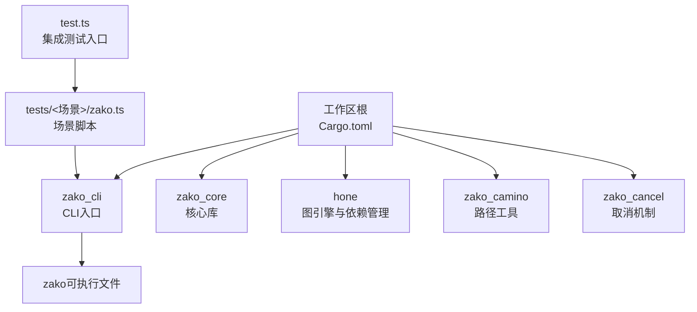
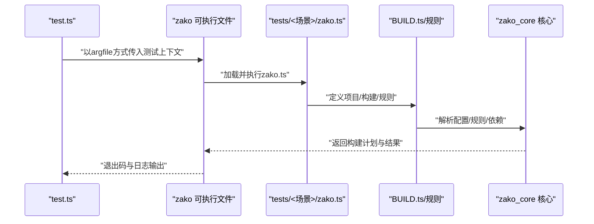
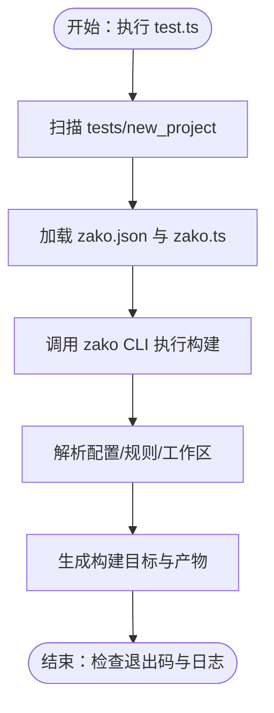
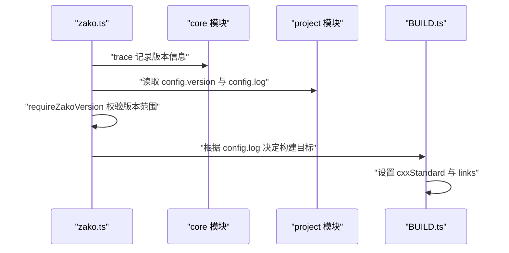
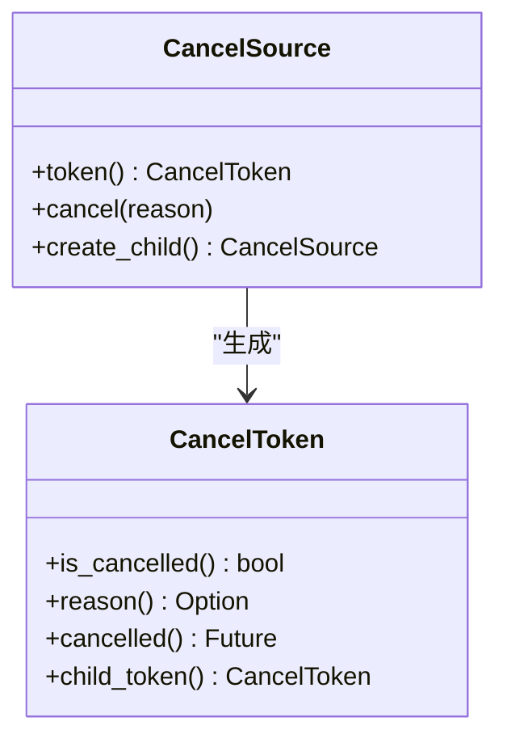
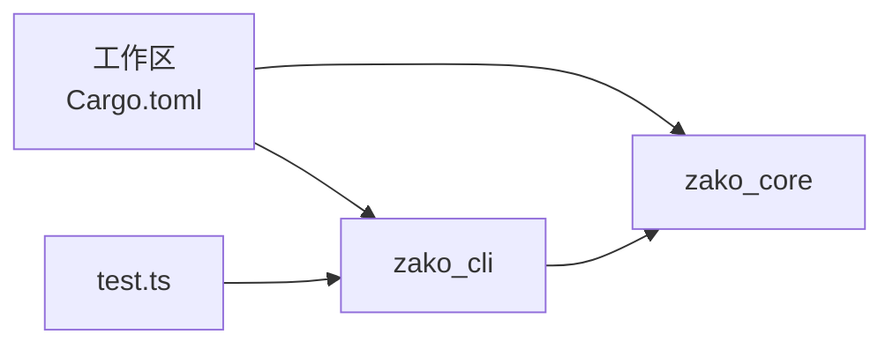

# 集成测试

<cite>
**本文引用的文件**
- [tests/new_project/zako.ts](file://tests/new_project/zako.ts)
- [tests/new_project/zako.json](file://tests/new_project/zako.json)
- [tests/log_version/zako.ts](file://tests/log_version/zako.ts)
- [tests/log_version/zako.jsonc](file://tests/log_version/zako.jsonc)
- [tests/log_version/BUILD.ts](file://tests/log_version/BUILD.ts)
- [test.ts](file://test.ts)
- [tests.ts](file://tests.ts)
- [tests_all.ts](file://tests_all.ts)
- [Cargo.toml（工作区）](file://Cargo.toml)
- [Cargo.toml（zako-cli）](file://zako_cli/Cargo.toml)
- [Cargo.toml（zako-core）](file://zako_core/Cargo.toml)
- [zako_core/src/lib.rs](file://zako_core/src/lib.rs)
- [hone/tests/engine_tests.rs](file://hone/tests/engine_tests.rs)
- [hone/tests/dependency_tests.rs](file://hone/tests/dependency_tests.rs)
- [zako_camino/tests/integration_tests.rs](file://zako_camino/tests/integration_tests.rs)
- [zako_cancel/tests/cancel_tests.rs](file://zako_cancel/tests/cancel_tests.rs)
</cite>

## 目录
1. [引言](#引言)
2. [项目结构](#项目结构)
3. [核心组件](#核心组件)
4. [架构总览](#架构总览)
5. [详细组件分析](#详细组件分析)
6. [依赖关系分析](#依赖关系分析)
7. [性能考虑](#性能考虑)
8. [故障排查指南](#故障排查指南)
9. [结论](#结论)
10. [附录](#附录)

## 引言
本文件面向Zako的集成测试体系，系统化阐述测试设计理念与策略，覆盖端到端测试流程与系统级测试方法。重点围绕两类测试场景展开：新项目初始化与构建流程验证、日志版本测试与配置文件生成；并提供测试环境搭建、测试脚本编写、执行流程、结果验证与失败案例分析，以及性能基准与负载测试的实施建议。目标是确保测试能完整覆盖用户工作流，从项目初始化、规则与构建定义、配置解析到最终产物产出与日志输出。

## 项目结构
Zako采用Rust工作区组织多crate，同时通过TypeScript脚本驱动构建与测试。测试相关的关键位置如下：
- tests/new_project：新项目初始化与构建流程验证场景
- tests/log_version：日志版本测试与配置继承场景
- test.ts：统一的集成测试入口，遍历tests目录下的测试用例并调用zako可执行文件执行
- tests.ts / tests_all.ts：Rust单元/集成测试入口脚本
- 各crate的Cargo.toml：定义工作区成员与依赖，支撑CLI与核心能力

图表来源
- [Cargo.toml（工作区）](file://Cargo.toml#L11-L22)
- [Cargo.toml（zako-cli）](file://zako_cli/Cargo.toml#L1-L77)
- [test.ts](file://test.ts#L21-L64)

章节来源
- [Cargo.toml（工作区）](file://Cargo.toml#L11-L22)
- [test.ts](file://test.ts#L1-L65)

## 核心组件
- 测试入口与执行编排
  - test.ts负责扫描tests目录，按名称排序依次执行每个测试上下文，并通过argfile参数传递给zako CLI。
- 场景脚本与配置
  - 新项目场景：通过zako.ts定义项目元数据、工作区、构建规则与规则集。
  - 日志版本场景：通过zako.ts读取项目配置、打印版本信息、校验Zako版本范围、根据配置决定是否启用日志构建。
- 构建与规则
  - 日志场景中的BUILD.ts定义ccLibrary与ccBinary目标，演示基于配置的条件链接与标准设置。
- Rust测试支撑
  - 工作区与各crate的Cargo.toml定义了测试运行所需的依赖与特性。
  - 相关crate的测试模块用于验证核心行为（如取消、依赖图、路径等）。

章节来源
- [test.ts](file://test.ts#L21-L64)
- [tests/new_project/zako.ts](file://tests/new_project/zako.ts#L1-L22)
- [tests/log_version/zako.ts](file://tests/log_version/zako.ts#L1-L13)
- [tests/log_version/BUILD.ts](file://tests/log_version/BUILD.ts#L1-L21)
- [Cargo.toml（工作区）](file://Cargo.toml#L11-L22)
- [Cargo.toml（zako-core）](file://zako_core/Cargo.toml#L1-L141)

## 架构总览
下图展示了从测试入口到CLI再到构建系统的端到端流程，以及场景脚本如何驱动构建目标与配置。

图表来源
- [test.ts](file://test.ts#L40-L52)
- [tests/new_project/zako.ts](file://tests/new_project/zako.ts#L1-L22)
- [tests/log_version/BUILD.ts](file://tests/log_version/BUILD.ts#L1-L21)
- [zako_core/src/lib.rs](file://zako_core/src/lib.rs#L1-L119)

## 详细组件分析

### 新项目测试场景：项目初始化、构建流程验证与配置文件生成
- 设计理念
  - 通过zako.ts集中声明项目元数据、工作区与构建规则，模拟真实用户从零开始创建项目的典型流程。
  - 使用zako.json定义基础配置项，验证配置解析与默认值处理。
- 关键步骤
  - 项目定义：在zako.ts中调用project(def)与自定义项目对象，设置group/artifact/version/description/license/authors/workspaces等。
  - 构建与规则：addBuild与addRule分别注册源码匹配与规则过滤，验证构建范围与规则应用。
  - 执行流程：test.ts遍历tests/new_project，以-C指定上下文目录，argfile作为参数载体调用zako CLI。
- 数据与配置
  - zako.json提供基础字段与选项定义，用于后续构建与规则解析。
- 复杂度与性能
  - 该场景主要验证配置解析与规则应用，复杂度与输入规模线性相关，适合在CI中快速反馈。

图表来源
- [test.ts](file://test.ts#L33-L52)
- [tests/new_project/zako.ts](file://tests/new_project/zako.ts#L1-L22)
- [tests/new_project/zako.json](file://tests/new_project/zako.json#L1-L18)

章节来源
- [tests/new_project/zako.ts](file://tests/new_project/zako.ts#L1-L22)
- [tests/new_project/zako.json](file://tests/new_project/zako.json#L1-L18)
- [test.ts](file://test.ts#L33-L52)

### 日志版本测试：版本信息记录、日志格式验证与输出分析
- 设计理念
  - 验证core.trace输出版本信息、project.config.version读取、requireZakoVersion版本约束校验。
  - 基于配置开关控制是否启用日志构建，展示配置继承与条件链接。
- 关键步骤
  - 版本追踪：在zako.ts中使用core.trace记录版本号，便于后续日志分析。
  - 版本约束：通过requireZakoVersion校验当前Zako版本范围，不符合则中断构建。
  - 条件构建：若project.config.log为真，则向构建目标追加日志模块链接。
  - 规则定义：BUILD.ts根据配置动态设置cxxStandard与links，体现配置对构建的影响。
- 输出分析
  - 通过CLI输出与日志内容验证版本号正确性、版本范围校验是否生效、日志模块是否被正确链接。

图表来源
- [tests/log_version/zako.ts](file://tests/log_version/zako.ts#L1-L13)
- [tests/log_version/zako.jsonc](file://tests/log_version/zako.jsonc#L1-L32)
- [tests/log_version/BUILD.ts](file://tests/log_version/BUILD.ts#L1-L21)

章节来源
- [tests/log_version/zako.ts](file://tests/log_version/zako.ts#L1-L13)
- [tests/log_version/zako.jsonc](file://tests/log_version/zako.jsonc#L1-L32)
- [tests/log_version/BUILD.ts](file://tests/log_version/BUILD.ts#L1-L21)

### Rust测试支撑：取消、依赖图与路径工具
- 取消机制测试（zako_cancel）
  - 验证父/子令牌的取消传播、等待取消、取消原因的唯一性等行为。
- 依赖图测试（hone）
  - 验证父子节点关系的添加与清理、环检测、计算过程中的取消。
- 路径工具测试（zako_camino）
  - 验证路径比较、排序与哈希一致性，覆盖跨平台路径差异。

图表来源
- [zako_cancel/tests/cancel_tests.rs](file://zako_cancel/tests/cancel_tests.rs#L1-L97)

章节来源
- [zako_cancel/tests/cancel_tests.rs](file://zako_cancel/tests/cancel_tests.rs#L1-L97)
- [hone/tests/dependency_tests.rs](file://hone/tests/dependency_tests.rs#L1-L62)
- [hone/tests/engine_tests.rs](file://hone/tests/engine_tests.rs#L1-L156)
- [zako_camino/tests/integration_tests.rs](file://zako_camino/tests/integration_tests.rs#L1-L116)

## 依赖关系分析
- 工作区与成员
  - 工作区通过Cargo.toml声明成员与默认成员，zako_cli提供CLI入口，zako_core提供核心能力。
- CLI与核心交互
  - zako_cli依赖zako-core，test.ts通过调用zako可执行文件间接使用zako_core的能力。
- 测试脚本与执行
  - test.ts使用Deno命令行执行外部进程，tests.ts/tests_all.ts分别针对单包或全工作区的Rust测试。

图表来源
- [Cargo.toml（工作区）](file://Cargo.toml#L11-L22)
- [Cargo.toml（zako-cli）](file://zako_cli/Cargo.toml#L1-L77)
- [test.ts](file://test.ts#L40-L52)

章节来源
- [Cargo.toml（工作区）](file://Cargo.toml#L11-L22)
- [Cargo.toml（zako-cli）](file://zako_cli/Cargo.toml#L1-L77)
- [test.ts](file://test.ts#L40-L52)

## 性能考虑
- 端到端测试的性能基线
  - 在CI中优先运行新项目与日志版本两个场景，确保关键路径快速反馈。
- 基准与负载测试建议
  - 基准：以不同规模的源码集合与规则数量为维度，测量构建时间与内存占用，记录在README或专用文档中。
  - 负载：模拟并发构建、大量规则与复杂依赖图，观察取消机制与资源限制下的稳定性。
- 结果归档
  - 将每次基准测试的指标（如平均/分位数、峰值内存）写入制品或报告，便于趋势分析。

## 故障排查指南
- 常见问题与定位
  - CLI不可执行或找不到：确认zako可执行文件路径与权限，检查test.ts传参是否正确。
  - 版本范围不满足：核对zako.ts中的requireZakoVersion与实际版本，必要时更新约束或升级Zako。
  - 配置未生效：检查zako.json与zako.jsonc中的字段类型与默认值，确认BUILD.ts是否正确读取配置。
  - 取消未触发：参考zako_cancel测试用例，验证父/子令牌的创建与传播逻辑。
- 日志与输出
  - 使用CLI的详细日志级别，结合core.trace输出定位问题；对比预期与实际构建目标列表。
- 回归建议
  - 将失败用例归档为最小复现，配合Rust测试用例进行隔离验证。

章节来源
- [tests/log_version/zako.ts](file://tests/log_version/zako.ts#L6-L10)
- [zako_cancel/tests/cancel_tests.rs](file://zako_cancel/tests/cancel_tests.rs#L1-L97)

## 结论
本文给出了Zako集成测试的整体设计与实施方法，覆盖新项目初始化、构建流程验证与日志版本测试三大场景，并提供了测试环境搭建、执行流程、结果验证与故障排查的实践指南。建议在CI中持续运行这些场景，结合基准与负载测试，形成稳定可靠的测试闭环，保障用户工作流的完整性与可靠性。

## 附录
- 测试环境搭建清单
  - 安装Rust工具链与Cargo（含nightly），安装Deno与Bun（用于测试脚本）。
  - 准备测试数据：在tests目录下按场景创建zako.ts、zako.json或zako.jsonc、BUILD.ts等文件。
  - 编写测试脚本：使用test.ts统一调度，tests.ts/tests_all.ts分别运行Rust测试。
  - 执行测试：先运行test.ts，再运行tests.ts或tests_all.ts，观察退出码与日志输出。
- 验证方法
  - 退出码：0表示成功，非0表示失败。
  - 日志输出：核对core.trace版本信息、requireZakoVersion校验结果、配置开关对构建目标的影响。
  - 产物校验：检查生成的目标文件与链接情况，确保符合BUILD.ts的条件逻辑。