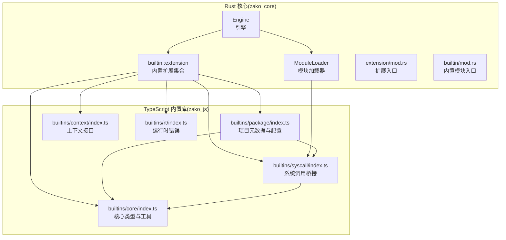
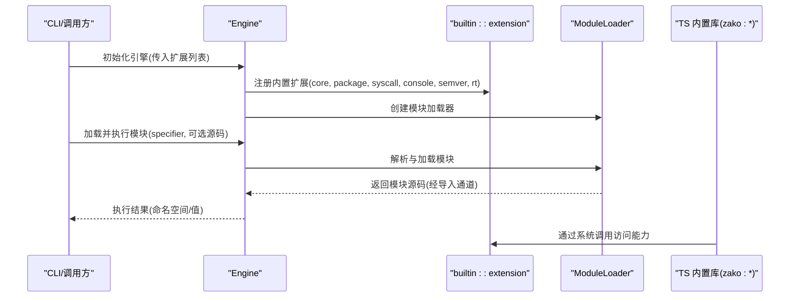
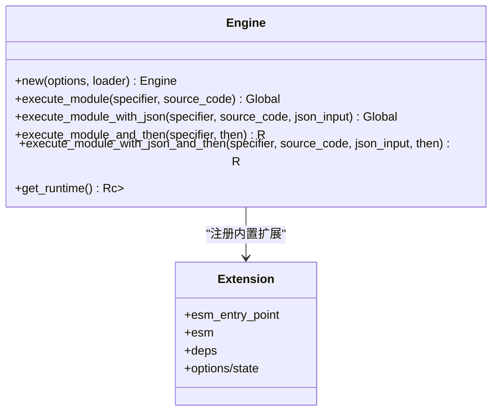
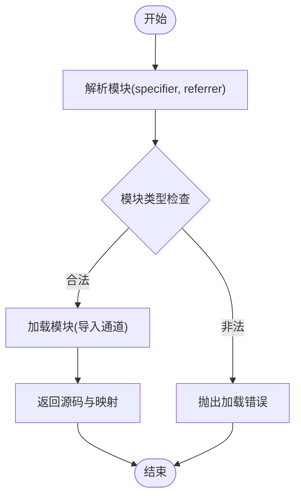
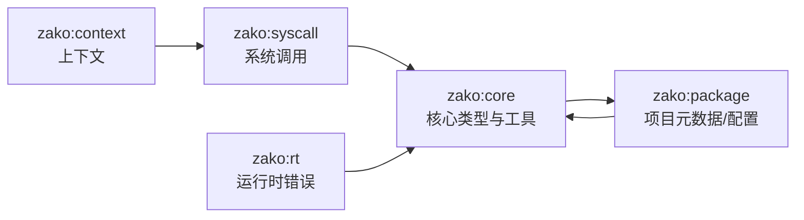
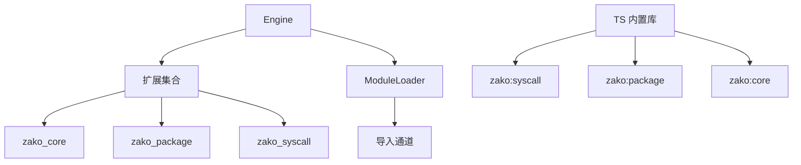

# 扩展机制

<cite>
**本文引用的文件**
- [zako_core/src/lib.rs](file://zako_core/src/lib.rs)
- [zako_core/src/extension/mod.rs](file://zako_core/src/extension/mod.rs)
- [zako_core/src/builtin/mod.rs](file://zako_core/src/builtin/mod.rs)
- [zako_core/src/builtin/extension/mod.rs](file://zako_core/src/builtin/extension/mod.rs)
- [zako_core/src/builtin/extension/core.rs](file://zako_core/src/builtin/extension/core.rs)
- [zako_core/src/builtin/extension/package.rs](file://zako_core/src/builtin/extension/package.rs)
- [zako_core/src/module_loader/mod.rs](file://zako_core/src/module_loader/mod.rs)
- [zako_core/src/engine.rs](file://zako_core/src/engine.rs)
- [zako_core/src/make_builtin.rs](file://zako_core/src/make_builtin.rs)
- [zako_js/src/builtins/core/index.ts](file://zako_js/src/builtins/core/index.ts)
- [zako_js/src/builtins/package/index.ts](file://zako_js/src/builtins/package/index.ts)
- [zako_js/src/builtins/syscall/index.ts](file://zako_js/src/builtins/syscall/index.ts)
- [zako_js/src/builtins/context/index.ts](file://zako_js/src/builtins/context/index.ts)
- [zako_js/src/builtins/rt/index.ts](file://zako_js/src/builtins/rt/index.ts)
</cite>

## 目录
1. [引言](#引言)
2. [项目结构](#项目结构)
3. [核心组件](#核心组件)
4. [架构总览](#架构总览)
5. [详细组件分析](#详细组件分析)
6. [依赖关系分析](#依赖关系分析)
7. [性能考量](#性能考量)
8. [故障排查指南](#故障排查指南)
9. [结论](#结论)
10. [附录](#附录)

## 引言
本文件系统性阐述 Zako 构建系统的扩展机制与扩展点设计，覆盖以下主题：
- 插件架构与扩展点：内置库扩展（规则、工具链、内置库）、TypeScript API 扩展（自定义规则与工具链集成）
- 注册、发现与加载机制：基于 V8/Deno 扩展与模块加载器的运行时装配
- 安全与权限控制：上下文隔离、系统调用白名单、沙箱策略
- 解耦与接口稳定性：通过模块化与类型声明保障扩展与核心的松耦合

## 项目结构
Zako 的扩展体系由“Rust 核心 + TypeScript 内置库”双层实现构成：
- Rust 层负责引擎初始化、扩展注册、模块加载与执行
- TypeScript 层提供面向用户的内置模块（如 zako:core、zako:package、zako:syscall 等），并通过系统调用桥接到 Rust 扩展



图表来源
- [zako_core/src/engine.rs](file://zako_core/src/engine.rs#L47-L79)
- [zako_core/src/module_loader/mod.rs](file://zako_core/src/module_loader/mod.rs#L61-L84)
- [zako_core/src/builtin/extension/mod.rs](file://zako_core/src/builtin/extension/mod.rs#L1-L17)
- [zako_js/src/builtins/core/index.ts](file://zako_js/src/builtins/core/index.ts#L1-L176)
- [zako_js/src/builtins/package/index.ts](file://zako_js/src/builtins/package/index.ts#L1-L98)
- [zako_js/src/builtins/syscall/index.ts](file://zako_js/src/builtins/syscall/index.ts#L1-L25)
- [zako_js/src/builtins/context/index.ts](file://zako_js/src/builtins/context/index.ts#L1-L16)
- [zako_js/src/builtins/rt/index.ts](file://zako_js/src/builtins/rt/index.ts#L1-L15)

章节来源
- [zako_core/src/lib.rs](file://zako_core/src/lib.rs#L1-L119)
- [zako_core/src/extension/mod.rs](file://zako_core/src/extension/mod.rs#L1-L2)
- [zako_core/src/builtin/mod.rs](file://zako_core/src/builtin/mod.rs#L1-L3)
- [zako_core/src/builtin/extension/mod.rs](file://zako_core/src/builtin/extension/mod.rs#L1-L17)

## 核心组件
- 引擎（Engine）：封装 V8 运行时，负责扩展注册、模块加载与执行；支持传入自定义扩展列表
- 模块加载器（ModuleLoader）：实现 Deno 模块加载协议，统一解析与加载 ES 模块，支持源码映射与导入通道
- 内置扩展（builtin::extension）：以 deno_core::extension! 声明的 Rust 扩展，暴露系统调用给 TS 层
- TypeScript 内置库（zako:*）：TS 层的内置模块，通过系统调用访问 Rust 能力，提供规则/工具链/项目元数据等抽象

章节来源
- [zako_core/src/engine.rs](file://zako_core/src/engine.rs#L19-L79)
- [zako_core/src/module_loader/mod.rs](file://zako_core/src/module_loader/mod.rs#L47-L84)
- [zako_core/src/builtin/extension/core.rs](file://zako_core/src/builtin/extension/core.rs#L1-L8)
- [zako_js/src/builtins/core/index.ts](file://zako_js/src/builtins/core/index.ts#L1-L176)

## 架构总览
Zako 的扩展机制采用“Rust 扩展 + TS 内置库”的双层架构：
- Rust 层通过 deno_core::extension! 定义扩展，注入到 V8 运行时，提供系统调用（如版本、日志、包信息、配置读取等）
- TS 层通过 zako:* 模块名访问这些系统调用，形成可扩展的 API 面
- 引擎在启动时合并内置扩展与外部扩展，构建模块加载器并执行用户脚本



图表来源
- [zako_core/src/engine.rs](file://zako_core/src/engine.rs#L47-L79)
- [zako_core/src/module_loader/mod.rs](file://zako_core/src/module_loader/mod.rs#L86-L219)
- [zako_core/src/builtin/extension/core.rs](file://zako_core/src/builtin/extension/core.rs#L1-L8)
- [zako_js/src/builtins/syscall/index.ts](file://zako_js/src/builtins/syscall/index.ts#L1-L25)

## 详细组件分析

### 组件一：引擎与扩展注册
- 引擎选项包含扩展列表，可在初始化时注入自定义扩展
- 内置扩展在引擎构造时被显式加入，确保核心能力可用
- 支持模块执行与回调执行两种模式，便于扩展在执行后进行二次处理



图表来源
- [zako_core/src/engine.rs](file://zako_core/src/engine.rs#L19-L79)
- [zako_core/src/builtin/extension/core.rs](file://zako_core/src/builtin/extension/core.rs#L1-L8)

章节来源
- [zako_core/src/engine.rs](file://zako_core/src/engine.rs#L47-L79)

### 组件二：模块加载与导入通道
- 模块加载器实现 Deno 的模块加载协议，支持 resolve/load
- 通过导入通道将模块请求转发至外部处理器，实现动态加载与缓存
- 支持源码映射存储与已加载源集合，提升调试与性能



图表来源
- [zako_core/src/module_loader/mod.rs](file://zako_core/src/module_loader/mod.rs#L86-L219)

章节来源
- [zako_core/src/module_loader/mod.rs](file://zako_core/src/module_loader/mod.rs#L61-L227)

### 组件三：内置扩展与系统调用
- 内置扩展集合包含 core、package、syscall、console、semver、rt 等
- 通过 deno_core::extension! 声明扩展入口与依赖，注入到 V8
- TS 层通过 zako:* 模块访问系统调用，例如版本查询、日志、包元信息、配置读取等

```mermaid
classDiagram
class Extension_Core {
+esm_entry_point : "zako : core"
+deps : [zako_rt, zako_global, zako_syscall, zako_semver]
}
class Extension_Package {
+esm_entry_point : "zako : package"
+options : info(PackageInformation)
+ops : syscall_package_*()
}
class Syscall_TS {
+log(level, msg)
+version
}
class Package_TS {
+project
+newProject(options)
}
Extension_Core <.. Syscall_TS : "TS 通过 zako : syscall 访问"
Extension_Package <.. Package_TS : "TS 通过 zako : package 访问"
```

图表来源
- [zako_core/src/builtin/extension/core.rs](file://zako_core/src/builtin/extension/core.rs#L1-L8)
- [zako_core/src/builtin/extension/package.rs](file://zako_core/src/builtin/extension/package.rs#L25-L37)
- [zako_js/src/builtins/syscall/index.ts](file://zako_js/src/builtins/syscall/index.ts#L1-L25)
- [zako_js/src/builtins/package/index.ts](file://zako_js/src/builtins/package/index.ts#L1-L98)

章节来源
- [zako_core/src/builtin/extension/mod.rs](file://zako_core/src/builtin/extension/mod.rs#L1-L17)
- [zako_core/src/builtin/extension/core.rs](file://zako_core/src/builtin/extension/core.rs#L1-L8)
- [zako_core/src/builtin/extension/package.rs](file://zako_core/src/builtin/extension/package.rs#L1-L92)
- [zako_js/src/builtins/syscall/index.ts](file://zako_js/src/builtins/syscall/index.ts#L1-L25)
- [zako_js/src/builtins/package/index.ts](file://zako_js/src/builtins/package/index.ts#L1-L98)

### 组件四：TypeScript API 扩展能力
- 核心 API：版本语义、日志、模式拼接、作者与可见性等
- 项目 API：项目元数据、构建/规则/工具链模式注册、只读选项声明
- 上下文 API：上下文名称、系统调用桥接
- 运行时错误：内部错误类，用于报告扩展或核心异常



图表来源
- [zako_js/src/builtins/core/index.ts](file://zako_js/src/builtins/core/index.ts#L1-L176)
- [zako_js/src/builtins/package/index.ts](file://zako_js/src/builtins/package/index.ts#L1-L98)
- [zako_js/src/builtins/syscall/index.ts](file://zako_js/src/builtins/syscall/index.ts#L1-L25)
- [zako_js/src/builtins/context/index.ts](file://zako_js/src/builtins/context/index.ts#L1-L16)
- [zako_js/src/builtins/rt/index.ts](file://zako_js/src/builtins/rt/index.ts#L1-L15)

章节来源
- [zako_js/src/builtins/core/index.ts](file://zako_js/src/builtins/core/index.ts#L1-L176)
- [zako_js/src/builtins/package/index.ts](file://zako_js/src/builtins/package/index.ts#L1-L98)
- [zako_js/src/builtins/context/index.ts](file://zako_js/src/builtins/context/index.ts#L1-L16)
- [zako_js/src/builtins/rt/index.ts](file://zako_js/src/builtins/rt/index.ts#L1-L15)

### 组件五：内置 ID 生成与类型导出（扩展点）
- make_builtin 宏框架预留了内置 ID 生成与 TypeScript 导出的扩展点，可用于新增内置标识符与类型映射
- 当前实现处于占位状态，便于未来扩展内置能力与类型系统

章节来源
- [zako_core/src/make_builtin.rs](file://zako_core/src/make_builtin.rs#L1-L85)

## 依赖关系分析
- 引擎依赖扩展集合与模块加载器，扩展依赖上下文与系统调用
- TS 内置库通过 zako:* 模块访问扩展提供的系统调用
- 模块加载器通过导入通道与外部系统交互，避免直接耦合



图表来源
- [zako_core/src/engine.rs](file://zako_core/src/engine.rs#L53-L62)
- [zako_core/src/module_loader/mod.rs](file://zako_core/src/module_loader/mod.rs#L180-L208)
- [zako_js/src/builtins/syscall/index.ts](file://zako_js/src/builtins/syscall/index.ts#L1-L25)
- [zako_js/src/builtins/package/index.ts](file://zako_js/src/builtins/package/index.ts#L1-L98)

章节来源
- [zako_core/src/engine.rs](file://zako_core/src/engine.rs#L47-L79)
- [zako_core/src/module_loader/mod.rs](file://zako_core/src/module_loader/mod.rs#L152-L219)

## 性能考量
- 并发容器与缓存：提供并发映射、集合与缓存类型，便于扩展实现高性能的数据结构
- 源码映射与已加载集合：减少重复解析与加载，提升模块加载效率
- 事件循环与异步加载：模块加载与执行通过异步任务与事件循环协调，避免阻塞

章节来源
- [zako_core/src/lib.rs](file://zako_core/src/lib.rs#L82-L96)
- [zako_core/src/module_loader/mod.rs](file://zako_core/src/module_loader/mod.rs#L37-L45)
- [zako_core/src/engine.rs](file://zako_core/src/engine.rs#L80-L109)

## 故障排查指南
- 模块加载错误：检查模块类型匹配（文件/内置/内存/映射），确认导入通道是否正确响应
- 版本不满足：使用核心版本校验函数，确保运行时版本满足要求
- 包配置读取：确认包信息已注入到扩展状态，键名大小写与类型匹配
- 日志定位：通过系统调用日志接口输出 trace/debug/info/warn/error 级别信息

章节来源
- [zako_core/src/module_loader/mod.rs](file://zako_core/src/module_loader/mod.rs#L28-L35)
- [zako_js/src/builtins/core/index.ts](file://zako_js/src/builtins/core/index.ts#L76-L82)
- [zako_core/src/builtin/extension/package.rs](file://zako_core/src/builtin/extension/package.rs#L63-L91)
- [zako_js/src/builtins/syscall/index.ts](file://zako_js/src/builtins/syscall/index.ts#L17-L22)

## 结论
Zako 的扩展机制通过“Rust 扩展 + TS 内置库”的双层架构实现了高内聚、低耦合的可扩展系统：
- 引擎与模块加载器提供稳定的运行时基础
- 内置扩展与 TS API 提供清晰的扩展点
- 通过系统调用与导入通道实现安全可控的能力暴露
- 接口与类型声明保障扩展与核心的解耦与稳定性

## 附录
- 扩展开发最佳实践
  - 使用 zako:* 模块访问系统能力，避免直接操作底层细节
  - 在引擎初始化阶段注入自定义扩展，确保依赖顺序正确
  - 利用模块加载器的导入通道实现按需加载与缓存
  - 通过版本校验与日志接口提升可观测性与兼容性
- 安全与权限控制
  - 严格限制扩展对系统资源的访问，仅通过系统调用桥接
  - 使用上下文隔离与只读配置，防止扩展修改核心状态
  - 对导入通道进行白名单与权限校验，避免任意模块加载
- 接口稳定性
  - 保持 TS 内置库的公共 API 稳定，避免破坏性变更
  - 通过类型声明与文档约束扩展行为，确保向后兼容