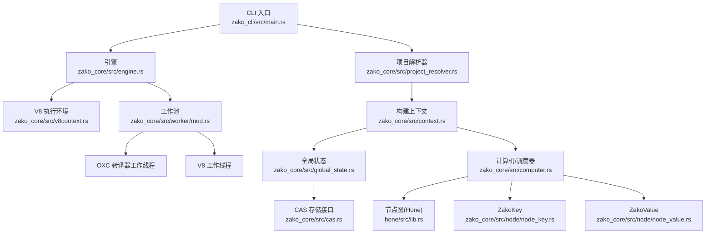
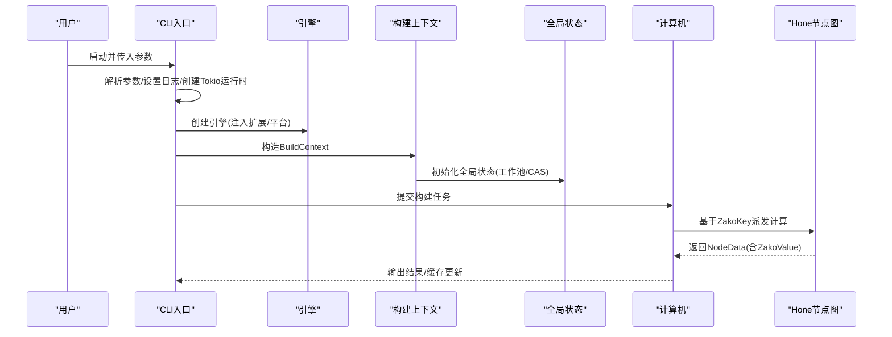
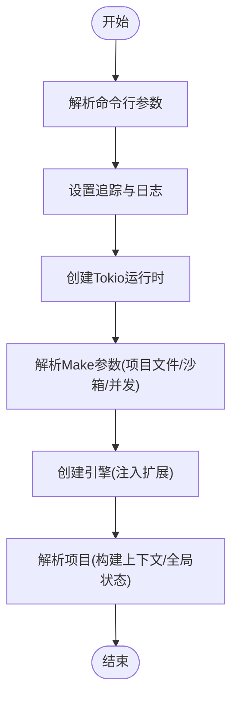
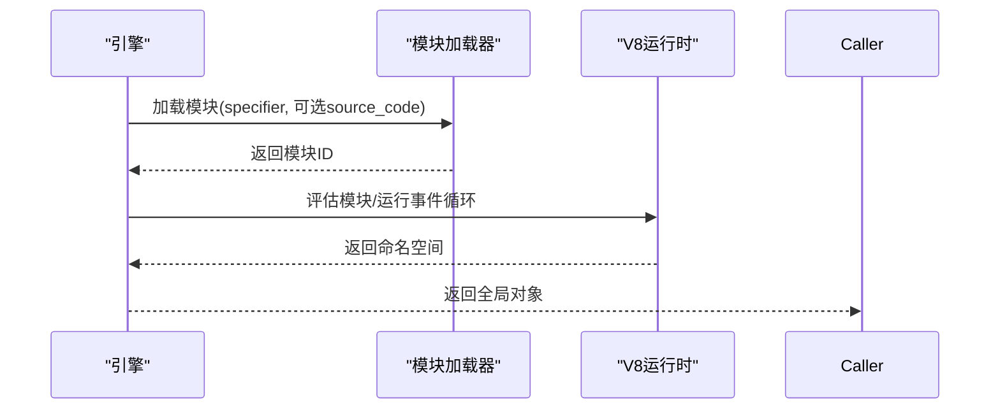
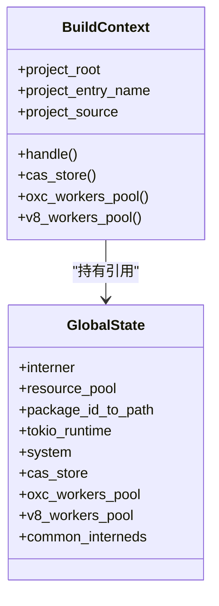
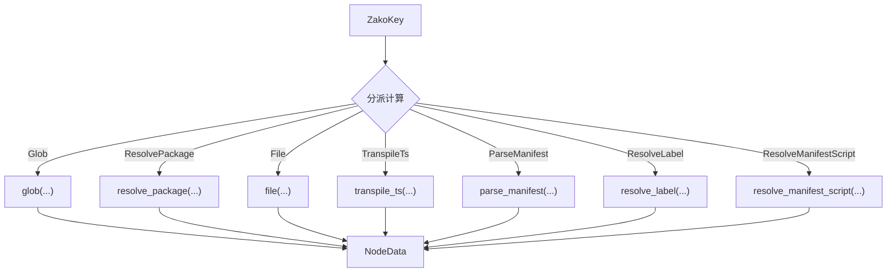
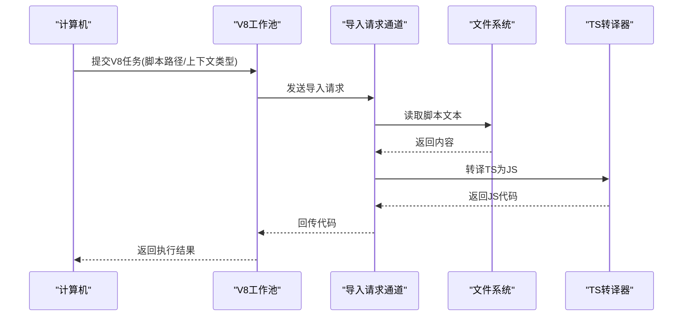
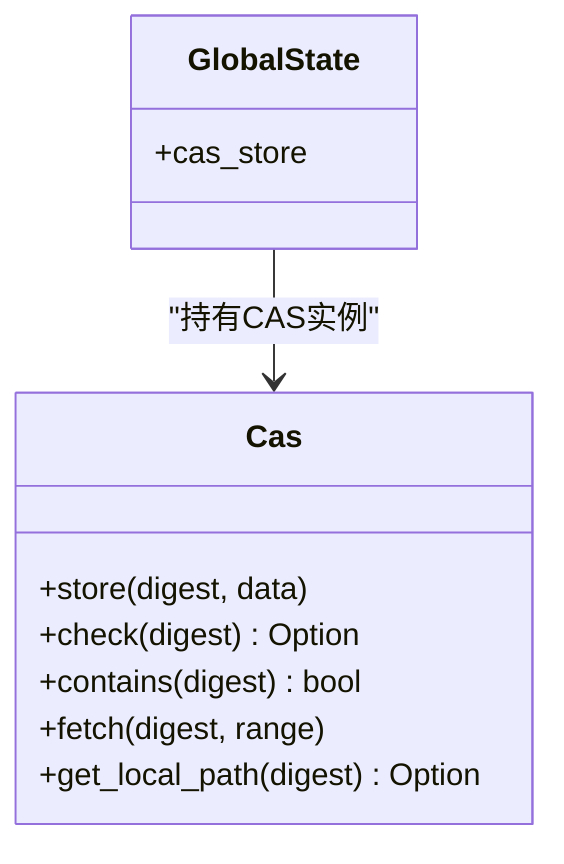
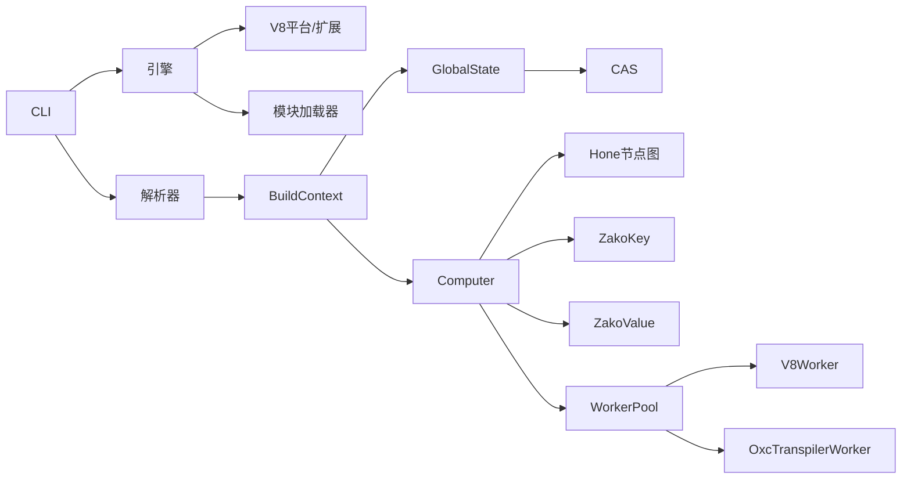

# 数据流分析

<cite>
**本文引用的文件**
- [zako_cli/src/main.rs](file://zako_cli/src/main.rs)
- [zako_core/src/lib.rs](file://zako_core/src/lib.rs)
- [zako_core/src/engine.rs](file://zako_core/src/engine.rs)
- [zako_core/src/context.rs](file://zako_core/src/context.rs)
- [zako_core/src/global_state.rs](file://zako_core/src/global_state.rs)
- [zako_core/src/node/mod.rs](file://zako_core/src/node/mod.rs)
- [zako_core/src/node/node_key.rs](file://zako_core/src/node/node_key.rs)
- [zako_core/src/node/node_value.rs](file://zako_core/src/node/node_value.rs)
- [zako_core/src/computer.rs](file://zako_core/src/computer.rs)
- [zako_core/src/compute/mod.rs](file://zako_core/src/compute/mod.rs)
- [zako_core/src/worker/mod.rs](file://zako_core/src/worker/mod.rs)
- [zako_core/src/v8context.rs](file://zako_core/src/v8context.rs)
- [zako_core/src/cas.rs](file://zako_core/src/cas.rs)
- [hone/src/lib.rs](file://hone/src/lib.rs)
</cite>

## 目录
1. [引言](#引言)
2. [项目结构](#项目结构)
3. [核心组件](#核心组件)
4. [架构总览](#架构总览)
5. [详细组件分析](#详细组件分析)
6. [依赖关系分析](#依赖关系分析)
7. [性能考量](#性能考量)
8. [故障排查指南](#故障排查指南)
9. [结论](#结论)
10. [附录](#附录)

## 引言
本文件面向Zako构建系统的数据流分析，围绕“从输入到输出”的完整数据路径进行追踪，覆盖CLI参数处理、项目文件解析、任务调度、V8执行、结果缓存与持久化等环节。重点描述关键数据结构的流转过程，包括Project（通过包源与构建上下文体现）、ZakoKey、ZakoValue、NodeData等；解释增量计算中的数据变化与缓存机制；分析并发执行时的数据共享与同步策略；并给出数据验证、转换与存储的具体流程，辅以数据流图与时序图帮助理解。

## 项目结构
Zako采用分层与模块化组织：CLI入口负责参数解析与运行时初始化；核心库提供引擎、上下文、全局状态、节点图与计算调度；工作池承载V8与TS转译等并行任务；CAS提供内容寻址存储能力；底层图引擎（hone）负责任务图的调度与持久化。

图表来源
- [zako_cli/src/main.rs](file://zako_cli/src/main.rs#L312-L333)
- [zako_core/src/engine.rs](file://zako_core/src/engine.rs#L48-L79)
- [zako_core/src/context.rs](file://zako_core/src/context.rs#L34-L86)
- [zako_core/src/global_state.rs](file://zako_core/src/global_state.rs#L54-L97)
- [zako_core/src/computer.rs](file://zako_core/src/computer.rs#L24-L76)
- [zako_core/src/node/node_key.rs](file://zako_core/src/node/node_key.rs#L26-L36)
- [zako_core/src/node/node_value.rs](file://zako_core/src/node/node_value.rs#L10-L22)
- [zako_core/src/worker/mod.rs](file://zako_core/src/worker/mod.rs#L10-L37)
- [zako_core/src/cas.rs](file://zako_core/src/cas.rs#L9-L44)
- [hone/src/lib.rs](file://hone/src/lib.rs#L5-L10)

章节来源
- [zako_cli/src/main.rs](file://zako_cli/src/main.rs#L312-L333)
- [zako_core/src/lib.rs](file://zako_core/src/lib.rs#L30-L80)

## 核心组件
- CLI参数与运行时初始化：解析命令行、设置日志与追踪、根据并发参数创建Tokio运行时、构造引擎与项目解析器。
- 引擎与V8执行：封装JsRuntime，加载模块、注入内置扩展、设置执行上下文、执行模块并返回命名空间。
- 构建上下文与全局状态：封装项目根、入口名、包源、全局资源池、CAS存储、工作池与系统信息。
- 计算机与节点图：基于ZakoKey/ZakoValue实现具体计算分支，产出NodeData并交由Hone调度。
- 并行工作池：OXC与V8工作线程池，支持取消令牌与请求通道，实现脚本导入与转译流水线。
- CAS内容寻址存储：统一的存储接口，支持检查、获取、本地路径查询等操作。

章节来源
- [zako_cli/src/main.rs](file://zako_cli/src/main.rs#L501-L622)
- [zako_core/src/engine.rs](file://zako_core/src/engine.rs#L48-L166)
- [zako_core/src/context.rs](file://zako_core/src/context.rs#L34-L183)
- [zako_core/src/global_state.rs](file://zako_core/src/global_state.rs#L41-L152)
- [zako_core/src/computer.rs](file://zako_core/src/computer.rs#L16-L76)
- [zako_core/src/worker/mod.rs](file://zako_core/src/worker/mod.rs#L10-L37)
- [zako_core/src/cas.rs](file://zako_core/src/cas.rs#L9-L62)

## 架构总览
Zako的数据流自上而下分为三层：
- 表层：CLI与引擎，负责参数解析、运行时初始化与模块执行。
- 中层：上下文与全局状态，负责资源管理、工作池启动与CAS配置。
- 底层：计算机与节点图，负责任务图构建、调度与增量计算。

图表来源
- [zako_cli/src/main.rs](file://zako_cli/src/main.rs#L312-L333)
- [zako_core/src/engine.rs](file://zako_core/src/engine.rs#L48-L79)
- [zako_core/src/context.rs](file://zako_core/src/context.rs#L59-L86)
- [zako_core/src/global_state.rs](file://zako_core/src/global_state.rs#L54-L97)
- [zako_core/src/computer.rs](file://zako_core/src/computer.rs#L24-L76)

## 详细组件分析

### CLI参数处理与项目解析
- 参数解析：支持子命令、颜色控制、静默模式、目录切换、版本与帮助信息等。
- 运行时初始化：创建Tokio多线程运行时，设置追踪与层级日志，按需解压嵌入二进制（如bun）。
- 项目解析：根据项目脚本文件名与沙箱目录创建引擎与解析器，解析项目并进入后续构建阶段。

图表来源
- [zako_cli/src/main.rs](file://zako_cli/src/main.rs#L501-L622)
- [zako_cli/src/main.rs](file://zako_cli/src/main.rs#L312-L333)

章节来源
- [zako_cli/src/main.rs](file://zako_cli/src/main.rs#L74-L121)
- [zako_cli/src/main.rs](file://zako_cli/src/main.rs#L501-L622)
- [zako_cli/src/main.rs](file://zako_cli/src/main.rs#L312-L333)

### 引擎与V8执行
- 引擎初始化：注册内置扩展（运行时、系统调用、全局、语义版本、核心、控制台），绑定模块加载器与V8平台。
- 模块执行：支持从代码或文件加载主ES模块，设置执行上下文对象，评估模块并返回命名空间。
- 错误处理：将V8异常转换为可传播的错误类型，便于上层捕获与记录。

图表来源
- [zako_core/src/engine.rs](file://zako_core/src/engine.rs#L81-L166)

章节来源
- [zako_core/src/engine.rs](file://zako_core/src/engine.rs#L48-L79)
- [zako_core/src/engine.rs](file://zako_core/src/engine.rs#L81-L166)

### 构建上下文与全局状态
- 构建上下文：封装项目根路径、入口名、包源、全局状态引用；提供资源池、内核、CAS存储、工作池访问器。
- 全局状态：集中管理Interner、资源池、包ID到路径映射、Tokio运行时、系统信息、CAS存储、工作池与公共内核字符串。

图表来源
- [zako_core/src/context.rs](file://zako_core/src/context.rs#L34-L183)
- [zako_core/src/global_state.rs](file://zako_core/src/global_state.rs#L41-L152)

章节来源
- [zako_core/src/context.rs](file://zako_core/src/context.rs#L34-L183)
- [zako_core/src/global_state.rs](file://zako_core/src/global_state.rs#L54-L97)

### 计算机与节点图（增量计算）
- 计算分派：根据ZakoKey匹配具体计算函数（如Glob、ResolvePackage、File、TranspileTs、ParseManifest、ResolveLabel、ResolveManifestScript），产出NodeData与ZakoValue。
- 节点值封装：ZakoValue对不同计算结果进行统一包装，便于持久化与缓存。
- 增量计算：基于Hone的任务图与持久化表，仅对变更节点重新计算，其余从缓存恢复。

图表来源
- [zako_core/src/computer.rs](file://zako_core/src/computer.rs#L24-L76)
- [zako_core/src/node/node_key.rs](file://zako_core/src/node/node_key.rs#L26-L36)
- [zako_core/src/node/node_value.rs](file://zako_core/src/node/node_value.rs#L10-L22)

章节来源
- [zako_core/src/computer.rs](file://zako_core/src/computer.rs#L24-L76)
- [zako_core/src/node/node_key.rs](file://zako_core/src/node/node_key.rs#L11-L39)
- [zako_core/src/node/node_value.rs](file://zako_core/src/node/node_value.rs#L10-L22)
- [hone/src/lib.rs](file://hone/src/lib.rs#L5-L10)

### V8执行与脚本导入流水线
- 执行入口：通过V8上下文类型（Package/Build/Rule/Toolchain/Config）限定权限范围。
- 导入与转译：工作池接收模块导入请求，读取文本、转译TS为JS，回传给请求方。
- 统一输出：返回V8上下文输出类型，供上层消费。

图表来源
- [zako_core/src/compute/mod.rs](file://zako_core/src/compute/mod.rs#L28-L74)
- [zako_core/src/v8context.rs](file://zako_core/src/v8context.rs#L12-L61)
- [zako_core/src/worker/mod.rs](file://zako_core/src/worker/mod.rs#L10-L37)

章节来源
- [zako_core/src/compute/mod.rs](file://zako_core/src/compute/mod.rs#L28-L74)
- [zako_core/src/v8context.rs](file://zako_core/src/v8context.rs#L12-L61)

### 内容寻址存储（CAS）
- 接口职责：存储、检查、获取、本地路径查询；支持范围读取与错误类型定义。
- 与全局状态集成：CASStore由GlobalState统一管理，支持本地CAS与远程CAS组合。

图表来源
- [zako_core/src/cas.rs](file://zako_core/src/cas.rs#L9-L62)
- [zako_core/src/global_state.rs](file://zako_core/src/global_state.rs#L81-L85)

章节来源
- [zako_core/src/cas.rs](file://zako_core/src/cas.rs#L9-L62)
- [zako_core/src/global_state.rs](file://zako_core/src/global_state.rs#L81-L85)

## 依赖关系分析
- CLI依赖引擎与解析器；引擎依赖V8平台与模块加载器；上下文依赖全局状态；计算机依赖Hone节点图与具体计算函数；工作池依赖取消令牌与协议通道；CAS作为存储抽象被全局状态持有。

图表来源
- [zako_cli/src/main.rs](file://zako_cli/src/main.rs#L312-L333)
- [zako_core/src/engine.rs](file://zako_core/src/engine.rs#L48-L79)
- [zako_core/src/context.rs](file://zako_core/src/context.rs#L34-L183)
- [zako_core/src/global_state.rs](file://zako_core/src/global_state.rs#L54-L97)
- [zako_core/src/computer.rs](file://zako_core/src/computer.rs#L24-L76)
- [zako_core/src/node/node_key.rs](file://zako_core/src/node/node_key.rs#L26-L36)
- [zako_core/src/node/node_value.rs](file://zako_core/src/node/node_value.rs#L10-L22)
- [zako_core/src/worker/mod.rs](file://zako_core/src/worker/mod.rs#L10-L37)
- [zako_core/src/cas.rs](file://zako_core/src/cas.rs#L9-L44)
- [hone/src/lib.rs](file://hone/src/lib.rs#L5-L10)

章节来源
- [zako_cli/src/main.rs](file://zako_cli/src/main.rs#L312-L333)
- [zako_core/src/engine.rs](file://zako_core/src/engine.rs#L48-L79)
- [zako_core/src/context.rs](file://zako_core/src/context.rs#L34-L183)
- [zako_core/src/global_state.rs](file://zako_core/src/global_state.rs#L54-L97)
- [zako_core/src/computer.rs](file://zako_core/src/computer.rs#L24-L76)
- [zako_core/src/worker/mod.rs](file://zako_core/src/worker/mod.rs#L10-L37)
- [zako_core/src/cas.rs](file://zako_core/src/cas.rs#L9-L44)
- [hone/src/lib.rs](file://hone/src/lib.rs#L5-L10)

## 性能考量
- 并发与线程：Tokio多线程运行时与CPU数绑定；工作池大小与线程栈大小由系统信息启发式确定。
- 缓存与持久化：Hone节点图与持久化表减少重复计算；ZakoValue统一包装便于缓存命中。
- I/O与存储：CAS支持本地路径直通与范围读取，降低拷贝成本；全局状态集中管理资源，避免重复初始化。
- V8执行：模块命名空间复用、事件循环异步驱动，减少阻塞。

章节来源
- [zako_core/src/global_state.rs](file://zako_core/src/global_state.rs#L75-L89)
- [zako_core/src/computer.rs](file://zako_core/src/computer.rs#L24-L76)
- [zako_core/src/cas.rs](file://zako_core/src/cas.rs#L33-L43)

## 故障排查指南
- 引擎错误：V8异常转换为可诊断的错误类型，包含消息与上下文；建议开启追踪与回溯以便定位。
- 上下文错误：项目根非绝对路径、包源解析失败、内核错误等；检查项目入口与包源配置。
- 计算错误：Hone错误封装IO与内部错误；关注节点分派与ZakoValue生成链路。
- 工作池错误：工作线程提交与执行失败；检查取消令牌与请求通道是否正常关闭。
- CAS错误：数据不存在、索引越界、IO错误；确认摘要与范围参数。

章节来源
- [zako_core/src/engine.rs](file://zako_core/src/engine.rs#L24-L31)
- [zako_core/src/context.rs](file://zako_core/src/context.rs#L18-L28)
- [zako_core/src/cas.rs](file://zako_core/src/cas.rs#L46-L62)

## 结论
Zako通过清晰的分层设计与强类型节点图，实现了从CLI到V8执行、从上下文到CAS存储的完整数据流闭环。ZakoKey与ZakoValue的统一抽象使增量计算与缓存机制得以高效落地；并发执行依托Tokio与工作池，结合Hone的任务图调度，确保了可扩展性与可靠性。建议在实际使用中关注参数校验、缓存命中率与I/O路径优化，以获得最佳性能。

## 附录
- 关键数据结构
  - ZakoKey：节点键，涵盖Glob、ResolvePackage、File、TranspileTs、ParseManifest、ResolveLabel、ResolveManifestScript等。
  - ZakoValue：节点值，与ZakoKey一一对应，统一包装计算结果。
  - NodeData：由Computer产出，携带依赖结果与当前节点值。
  - BuildContext/GlobalState：构建上下文与全局状态，贯穿整个数据流。
  - V8ContextInput/Output：限定脚本执行上下文的权限范围。
  - CAS接口：内容寻址存储抽象，支撑缓存与远端协作。

章节来源
- [zako_core/src/node/node_key.rs](file://zako_core/src/node/node_key.rs#L11-L39)
- [zako_core/src/node/node_value.rs](file://zako_core/src/node/node_value.rs#L10-L22)
- [zako_core/src/computer.rs](file://zako_core/src/computer.rs#L16-L21)
- [zako_core/src/context.rs](file://zako_core/src/context.rs#L34-L183)
- [zako_core/src/global_state.rs](file://zako_core/src/global_state.rs#L41-L152)
- [zako_core/src/v8context.rs](file://zako_core/src/v8context.rs#L12-L61)
- [zako_core/src/cas.rs](file://zako_core/src/cas.rs#L9-L44)