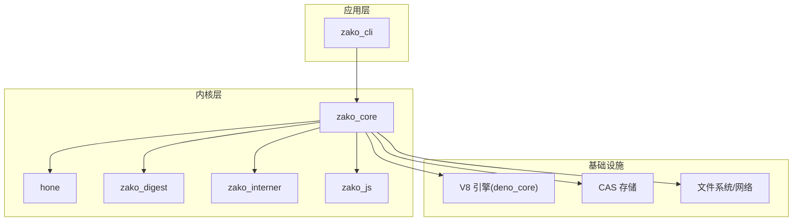
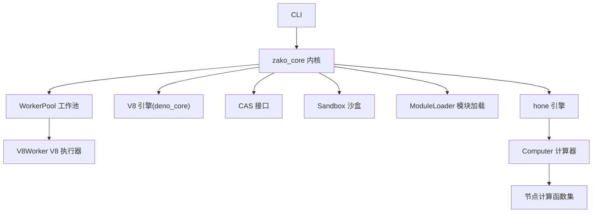
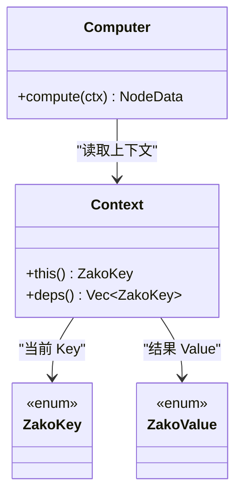
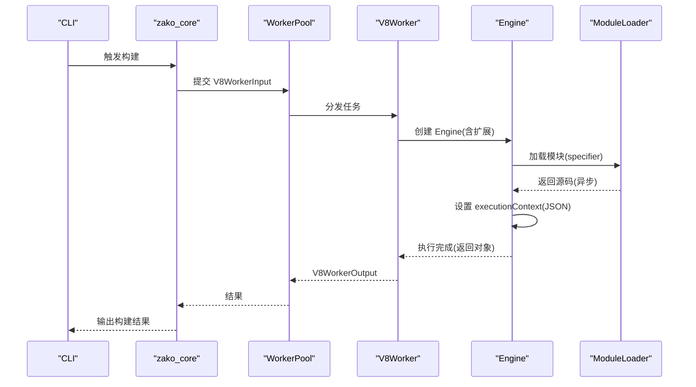
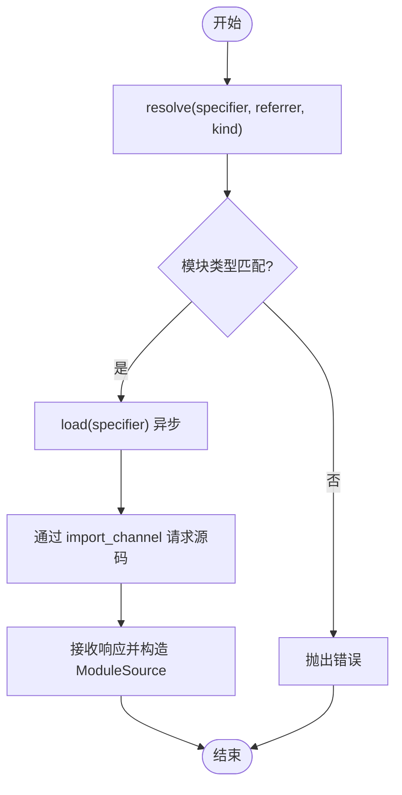
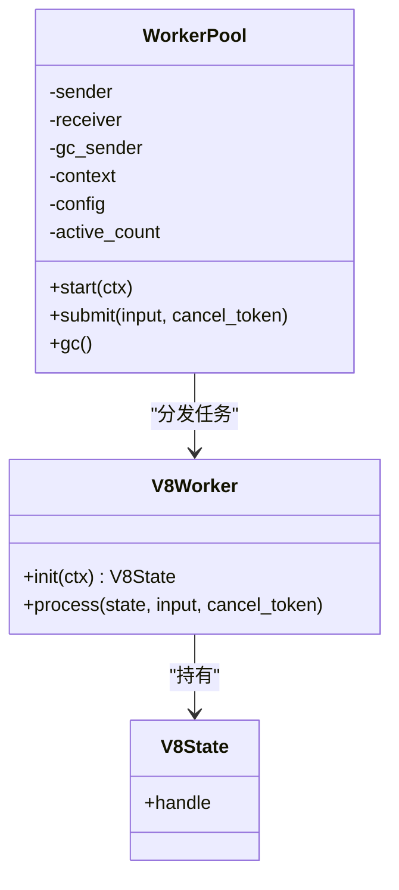
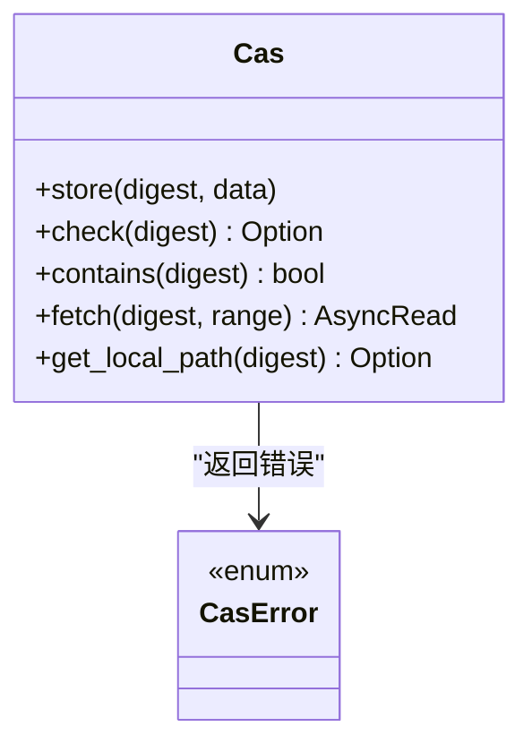
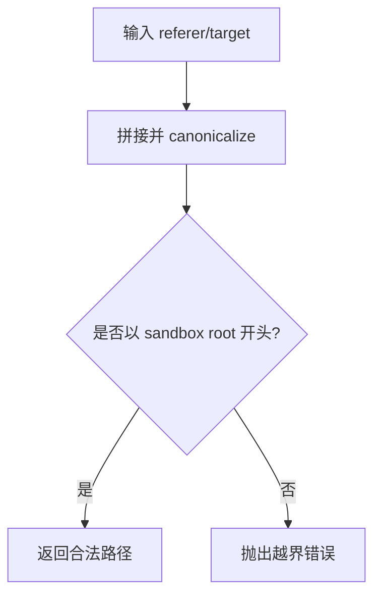
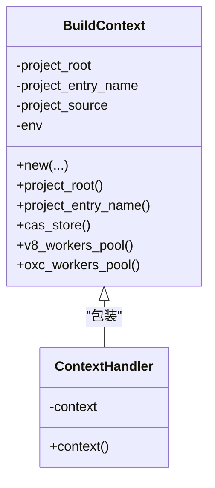
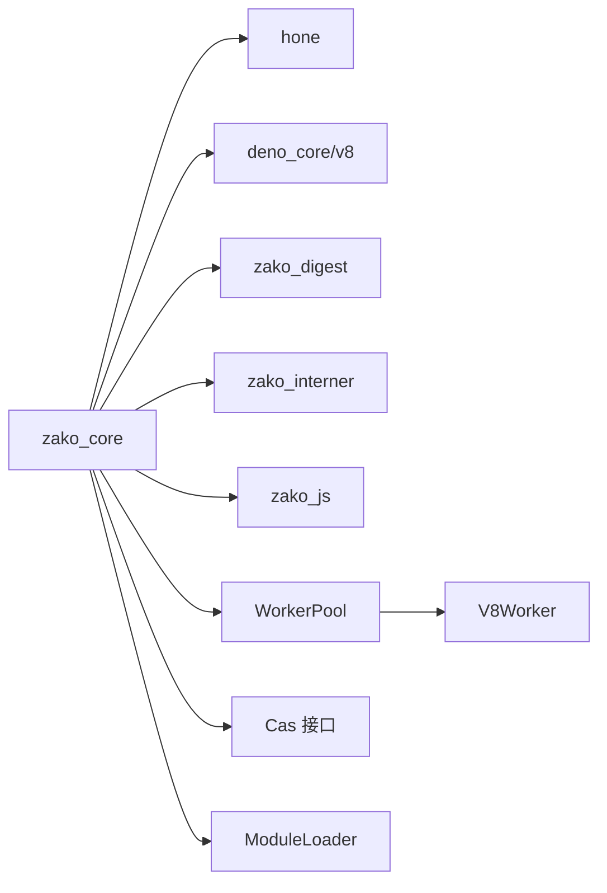

# 整体架构设计

<cite>
**本文引用的文件**
- [README.md](file://README.md)
- [ARCHITECTURE.md](file://ARCHITECTURE.md)
- [Cargo.toml](file://Cargo.toml)
- [zako_core/src/lib.rs](file://zako_core/src/lib.rs)
- [hone/src/lib.rs](file://hone/src/lib.rs)
- [zako_core/src/engine.rs](file://zako_core/src/engine.rs)
- [zako_core/src/v8context.rs](file://zako_core/src/v8context.rs)
- [zako_core/src/cas.rs](file://zako_core/src/cas.rs)
- [zako_core/src/sandbox.rs](file://zako_core/src/sandbox.rs)
- [zako_core/src/computer.rs](file://zako_core/src/computer.rs)
- [zako_core/src/worker/worker_pool.rs](file://zako_core/src/worker/worker_pool.rs)
- [zako_core/src/worker/v8worker.rs](file://zako_core/src/worker/v8worker.rs)
- [zako_core/src/module_loader/mod.rs](file://zako_core/src/module_loader/mod.rs)
- [zako_core/src/context.rs](file://zako_core/src/context.rs)
- [zako_core/src/node/mod.rs](file://zako_core/src/node/mod.rs)
</cite>

## 目录
1. [引言](#引言)
2. [项目结构](#项目结构)
3. [核心组件](#核心组件)
4. [架构总览](#架构总览)
5. [详细组件分析](#详细组件分析)
6. [依赖关系分析](#依赖关系分析)
7. [性能考量](#性能考量)
8. [故障排查指南](#故障排查指南)
9. [结论](#结论)
10. [附录](#附录)

## 引言
本设计文档面向希望理解 Zako 构建系统整体架构与设计思想的工程师与贡献者。Zako 以“现代、确定、可扩展”为目标，融合 Rust 内核与 TypeScript/V8 的脚本执行能力，形成混合执行模型；同时通过绝对确定性、封闭性与内容寻址存储（CAS）三大基石，支撑大规模、分布式构建场景。本文将系统阐述：
- 系统愿景与设计理念
- 分层架构与职责划分
- 混合执行模型（Rust 内核 + TypeScript/V8）
- 绝对确定性、封闭性、内容寻址存储的实现要点
- 关键组件与数据流
- 架构决策的技术背景与权衡

## 项目结构
Zako 采用多 Crate 工作区组织，围绕“内核 + 引擎 + 运行时 + 工具库”的分层思路展开：
- zako_core：系统内核，负责 V8 运行时管理、模块加载、CAS 协议、沙盒执行、项目解析与计算编排
- hone：任务调度引擎，将构建任务建模为 DAG，支持并行与记忆化
- zako_cli：命令行入口，负责初始化环境并触发计算
- zako_digest：哈希与 Protobuf 序列化协议
- zako_js：TypeScript 内置 API 与类型定义
- zako_interner：字符串驻留与标识符解析
- 其他辅助 Crate：取消令牌、工具链、测试等

图表来源
- [Cargo.toml](file://Cargo.toml#L11-L22)
- [zako_core/src/lib.rs](file://zako_core/src/lib.rs#L14-L28)
- [ARCHITECTURE.md](file://ARCHITECTURE.md#L18-L27)

章节来源
- [Cargo.toml](file://Cargo.toml#L11-L22)
- [zako_core/src/lib.rs](file://zako_core/src/lib.rs#L14-L28)
- [ARCHITECTURE.md](file://ARCHITECTURE.md#L18-L27)

## 核心组件
- 计算引擎（hone）：将构建步骤抽象为 Key/Value 映射，支持并行与记忆化，天然适配增量计算
- V8 引擎（zako_core + deno_core）：提供 TypeScript 执行环境，结合定制化的扩展与隔离策略，保障确定性
- 模块加载器（ModuleLoader）：统一处理 ES Module 解析与按需加载，支持内存源码注入与异步导入通道
- 工作池（WorkerPool）：通用线程池抽象，支持动态扩容、空闲回收与取消令牌
- V8 工作者（V8Worker）：封装 Engine 执行流程，桥接 Rust 上下文与 JS 运行时
- CAS 接口（Cas）：内容寻址存储接口，统一读写与远程同步
- 沙盒（Sandbox）：限制文件系统访问范围，确保构建过程的封闭性
- 构建上下文（BuildContext）：构建期状态容器，聚合全局资源与工作池

章节来源
- [hone/src/lib.rs](file://hone/src/lib.rs#L12-L25)
- [zako_core/src/engine.rs](file://zako_core/src/engine.rs#L34-L79)
- [zako_core/src/module_loader/mod.rs](file://zako_core/src/module_loader/mod.rs#L61-L84)
- [zako_core/src/worker/worker_pool.rs](file://zako_core/src/worker/worker_pool.rs#L35-L42)
- [zako_core/src/worker/v8worker.rs](file://zako_core/src/worker/v8worker.rs#L55-L75)
- [zako_core/src/cas.rs](file://zako_core/src/cas.rs#L10-L44)
- [zako_core/src/sandbox.rs](file://zako_core/src/sandbox.rs#L8-L11)
- [zako_core/src/context.rs](file://zako_core/src/context.rs#L34-L44)

## 架构总览
Zako 的整体架构由“分层解耦 + 混合执行 + 内容寻址”构成：
- 分层解耦：CLI → 内核 → 引擎 → 运行时/存储
- 混合执行：Rust 负责高性能内核与调度，TypeScript/V8 负责灵活可验证的构建逻辑
- 内容寻址：以内容哈希标识一切，原生支持远程缓存与一致性校验

图表来源
- [zako_core/src/context.rs](file://zako_core/src/context.rs#L138-L170)
- [zako_core/src/computer.rs](file://zako_core/src/computer.rs#L16-L21)
- [zako_core/src/engine.rs](file://zako_core/src/engine.rs#L48-L79)
- [zako_core/src/module_loader/mod.rs](file://zako_core/src/module_loader/mod.rs#L86-L150)
- [zako_core/src/worker/worker_pool.rs](file://zako_core/src/worker/worker_pool.rs#L56-L62)

章节来源
- [ARCHITECTURE.md](file://ARCHITECTURE.md#L30-L54)
- [zako_core/src/context.rs](file://zako_core/src/context.rs#L138-L170)
- [zako_core/src/computer.rs](file://zako_core/src/computer.rs#L24-L76)

## 详细组件分析

### 计算模型与调度（hone 引擎）
- 将构建任务抽象为 Key/Value 映射，Computer 在给定上下文中根据 Key 分派到具体计算函数
- 支持并行与记忆化，天然适配增量计算与去重
- 提供 FastMap/FastSet 与错误类型别名，便于高性能与一致的错误传播

图表来源
- [zako_core/src/computer.rs](file://zako_core/src/computer.rs#L24-L76)
- [hone/src/lib.rs](file://hone/src/lib.rs#L12-L25)

章节来源
- [ARCHITECTURE.md](file://ARCHITECTURE.md#L30-L41)
- [hone/src/lib.rs](file://hone/src/lib.rs#L12-L25)
- [zako_core/src/computer.rs](file://zako_core/src/computer.rs#L24-L76)

### V8 引擎与确定性执行
- 使用 deno_core 初始化 V8 平台与运行时，注入 zako 内置扩展（rt、syscall、global、semver、core、console 等）
- 通过 Engine::execute_module_with_json_and_then 设置 executionContext，实现可控的输入注入
- V8Worker 将 Rust 上下文转换为 JS 对象，执行后回传 V8ContextOutput

图表来源
- [zako_core/src/engine.rs](file://zako_core/src/engine.rs#L48-L79)
- [zako_core/src/engine.rs](file://zako_core/src/engine.rs#L111-L166)
- [zako_core/src/engine.rs](file://zako_core/src/engine.rs#L234-L300)
- [zako_core/src/module_loader/mod.rs](file://zako_core/src/module_loader/mod.rs#L152-L219)
- [zako_core/src/worker/v8worker.rs](file://zako_core/src/worker/v8worker.rs#L84-L144)

章节来源
- [ARCHITECTURE.md](file://ARCHITECTURE.md#L44-L54)
- [zako_core/src/engine.rs](file://zako_core/src/engine.rs#L48-L79)
- [zako_core/src/engine.rs](file://zako_core/src/engine.rs#L111-L166)
- [zako_core/src/engine.rs](file://zako_core/src/engine.rs#L234-L300)
- [zako_core/src/module_loader/mod.rs](file://zako_core/src/module_loader/mod.rs#L86-L150)
- [zako_core/src/worker/v8worker.rs](file://zako_core/src/worker/v8worker.rs#L84-L144)

### 模块加载与导入通道
- ModuleLoader 实现 DenoModuleLoader，支持 resolve/load 两大钩子
- 动态导入通过 import_channel 发送请求，等待响应后构造 ModuleSource 返回
- 支持 SourceMap 存储与已加载集合，减少重复开销

图表来源
- [zako_core/src/module_loader/mod.rs](file://zako_core/src/module_loader/mod.rs#L86-L150)
- [zako_core/src/module_loader/mod.rs](file://zako_core/src/module_loader/mod.rs#L152-L219)

章节来源
- [zako_core/src/module_loader/mod.rs](file://zako_core/src/module_loader/mod.rs#L86-L150)
- [zako_core/src/module_loader/mod.rs](file://zako_core/src/module_loader/mod.rs#L152-L219)

### 工作池与 V8 执行器
- WorkerPool 支持最小/最大并发、空闲超时、广播 GC、一次性结果通道
- V8Worker 在初始化时根据上下文类型决定扩展注入，并通过 Engine 执行模块
- 通过 CancelToken 支持任务取消，提升长耗时场景的可控性

图表来源
- [zako_core/src/worker/worker_pool.rs](file://zako_core/src/worker/worker_pool.rs#L35-L42)
- [zako_core/src/worker/worker_pool.rs](file://zako_core/src/worker/worker_pool.rs#L156-L178)
- [zako_core/src/worker/v8worker.rs](file://zako_core/src/worker/v8worker.rs#L71-L81)
- [zako_core/src/worker/v8worker.rs](file://zako_core/src/worker/v8worker.rs#L84-L144)

章节来源
- [zako_core/src/worker/worker_pool.rs](file://zako_core/src/worker/worker_pool.rs#L56-L62)
- [zako_core/src/worker/worker_pool.rs](file://zako_core/src/worker/worker_pool.rs#L156-L178)
- [zako_core/src/worker/v8worker.rs](file://zako_core/src/worker/v8worker.rs#L71-L81)
- [zako_core/src/worker/v8worker.rs](file://zako_core/src/worker/v8worker.rs#L84-L144)

### 内容寻址存储（CAS）
- Cas trait 抽象了存储的统一接口：store/check/contains/fetch/get_local_path
- 支持按 BlobRange 的分片读取，便于大文件传输与远程缓存
- 错误类型涵盖 IO、不存在、越界等，便于上层处理

图表来源
- [zako_core/src/cas.rs](file://zako_core/src/cas.rs#L10-L44)
- [zako_core/src/cas.rs](file://zako_core/src/cas.rs#L46-L62)

章节来源
- [ARCHITECTURE.md](file://ARCHITECTURE.md#L9-L12)
- [zako_core/src/cas.rs](file://zako_core/src/cas.rs#L10-L44)
- [zako_core/src/cas.rs](file://zako_core/src/cas.rs#L46-L62)

### 沙盒与封闭性
- Sandbox 通过 canonicalize 与 starts_with 限制路径访问，防止逃逸
- 提供 join_path_for/get_path_safe/is_in_sandbox 等方法，统一安全路径拼接与校验

图表来源
- [zako_core/src/sandbox.rs](file://zako_core/src/sandbox.rs#L34-L54)
- [zako_core/src/sandbox.rs](file://zako_core/src/sandbox.rs#L56-L72)

章节来源
- [ARCHITECTURE.md](file://ARCHITECTURE.md#L9-L12)
- [zako_core/src/sandbox.rs](file://zako_core/src/sandbox.rs#L27-L54)
- [zako_core/src/sandbox.rs](file://zako_core/src/sandbox.rs#L56-L72)

### 构建上下文与资源聚合
- BuildContext 聚合项目根、入口名、包源、全局状态等，提供统一访问入口
- 通过 ContextHandler 暴露只读引用，避免重复拷贝与共享状态问题

图表来源
- [zako_core/src/context.rs](file://zako_core/src/context.rs#L34-L44)
- [zako_core/src/context.rs](file://zako_core/src/context.rs#L185-L198)

章节来源
- [zako_core/src/context.rs](file://zako_core/src/context.rs#L46-L86)
- [zako_core/src/context.rs](file://zako_core/src/context.rs#L185-L198)

## 依赖关系分析
- 工作区成员：zako_core、zako_cli、zako_cancel、zako_digest、zako_interner、hone、zako_kgp
- 外部依赖：v8、deno_core、tokio、dashmap、moka、oxc_* 等
- 关键耦合点：
  - zako_core 依赖 deno_core/v8 与 hone
  - V8Worker 依赖 Engine 与 ModuleLoader
  - WorkerPool 作为通用执行载体被 V8Worker/OxcTranspilerWorker 使用
  - CAS 接口被全局状态与上下文共享

图表来源
- [Cargo.toml](file://Cargo.toml#L12-L22)
- [zako_core/src/context.rs](file://zako_core/src/context.rs#L162-L170)
- [zako_core/src/worker/v8worker.rs](file://zako_core/src/worker/v8worker.rs#L71-L81)

章节来源
- [Cargo.toml](file://Cargo.toml#L12-L22)
- [zako_core/src/context.rs](file://zako_core/src/context.rs#L162-L170)
- [zako_core/src/worker/v8worker.rs](file://zako_core/src/worker/v8worker.rs#L71-L81)

## 性能考量
- 并行与记忆化：hone 引擎的 DAG 与记忆化显著降低重复计算
- 字符串驻留：zako_interner 减少重复字符串分配与比较成本
- 高速缓存：moka Cache 用于热点数据快速命中
- I/O 优化：CAS 支持分片读取与本地路径直通，减少复制
- 线程池弹性：WorkerPool 动态扩容与空闲回收，平衡吞吐与资源占用

## 故障排查指南
- V8 执行异常：检查 Engine::execute_module_with_json_and_then 的异常捕获与转换
- 模块加载失败：确认 ModuleLoader::resolve/load 的模块类型匹配与 URL 解析
- CAS 读取越界：核对 BlobRange 与实际长度，避免 RequestedIndexOutOfRange
- 沙盒越界：确认路径 canonicalize 后是否仍位于 sandbox root 下
- 工作池阻塞：检查队列长度、空闲超时与广播 GC 是否正常触发

章节来源
- [zako_core/src/engine.rs](file://zako_core/src/engine.rs#L200-L232)
- [zako_core/src/engine.rs](file://zako_core/src/engine.rs#L248-L299)
- [zako_core/src/module_loader/mod.rs](file://zako_core/src/module_loader/mod.rs#L86-L150)
- [zako_core/src/module_loader/mod.rs](file://zako_core/src/module_loader/mod.rs#L152-L219)
- [zako_core/src/cas.rs](file://zako_core/src/cas.rs#L54-L62)
- [zako_core/src/sandbox.rs](file://zako_core/src/sandbox.rs#L46-L53)
- [zako_core/src/worker/worker_pool.rs](file://zako_core/src/worker/worker_pool.rs#L180-L183)

## 结论
Zako 通过“Rust 内核 + TypeScript/V8 + 分层架构 + 内容寻址”的组合，实现了高确定性、强封闭性与良好可扩展性的现代构建系统。未来可在内置规则完善、CAS 协议与远程同步、沙盒跨平台加固、IDE 支持等方面持续演进。

## 附录
- 设计理念与技术选型背景：参见 ARCHITECTURE.md 的“项目愿景与设计理念”与“当前项目状态”
- 文件类型与作用域：参见 zako_core/src/lib.rs 中对 *.ts 文件类型的说明

章节来源
- [ARCHITECTURE.md](file://ARCHITECTURE.md#L5-L14)
- [ARCHITECTURE.md](file://ARCHITECTURE.md#L123-L139)
- [zako_core/src/lib.rs](file://zako_core/src/lib.rs#L14-L28)