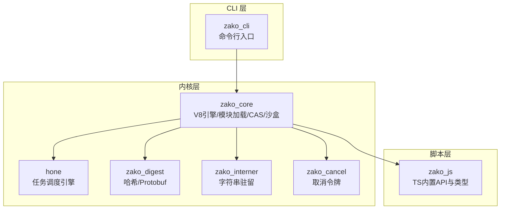
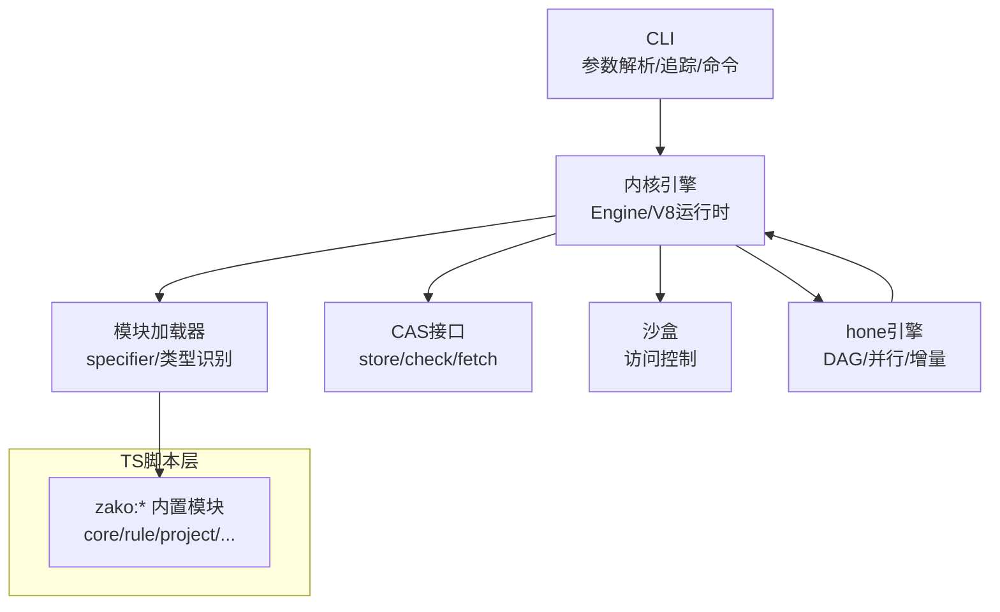
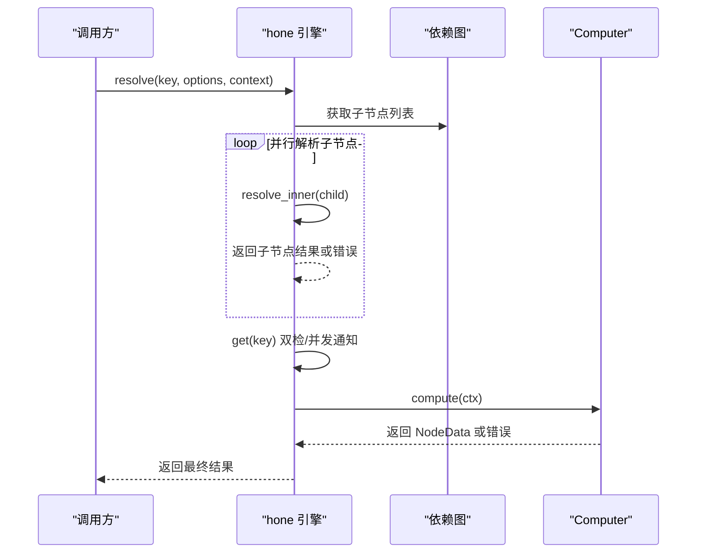
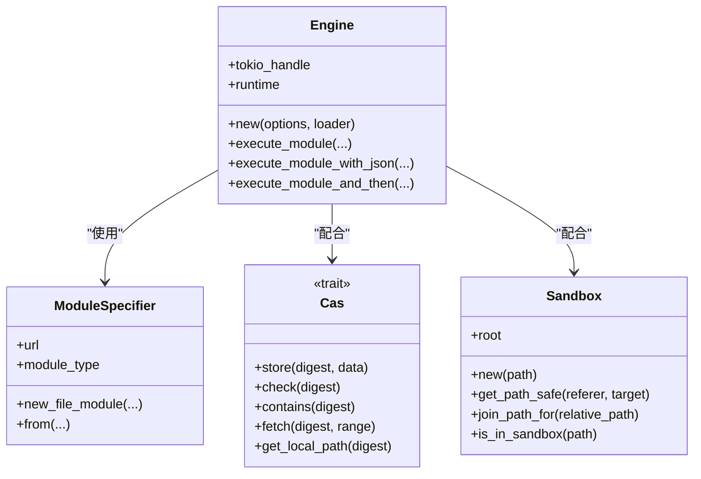
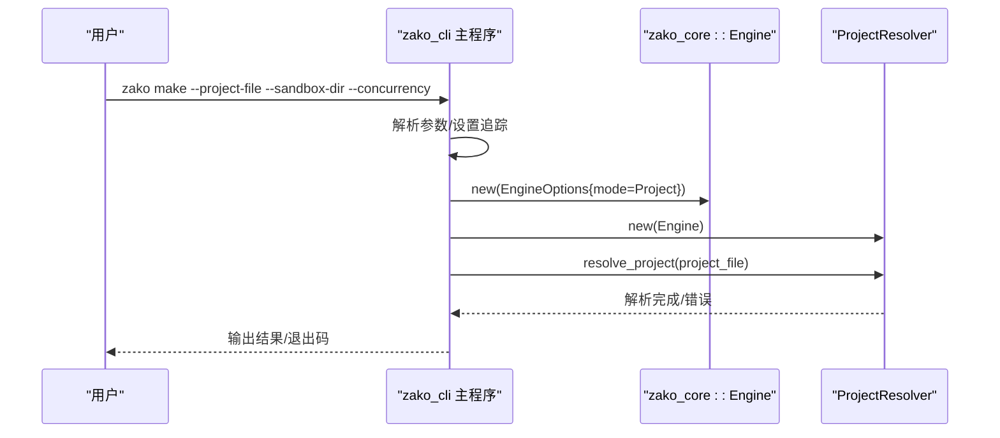
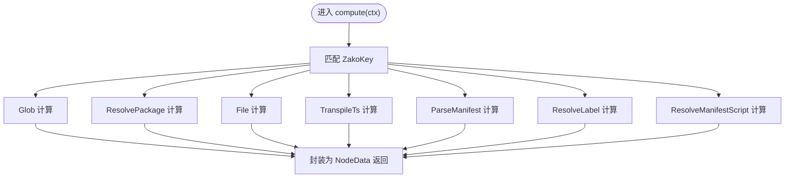
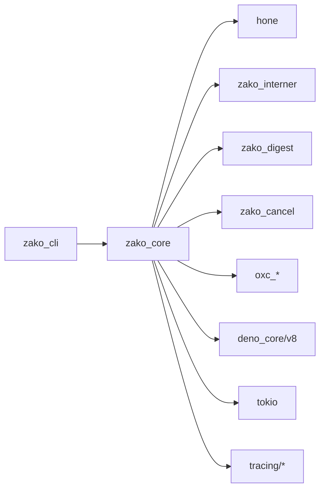
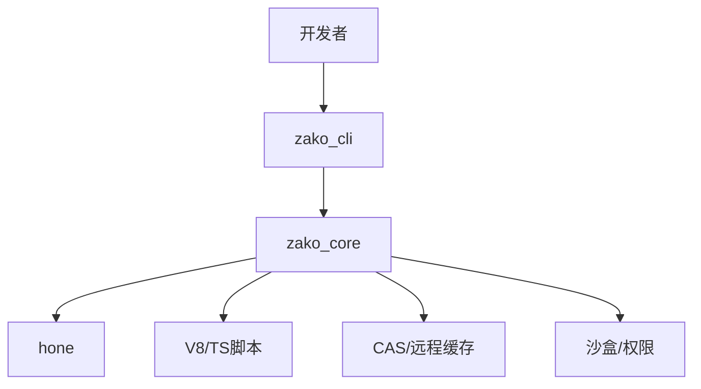

# 系统架构

<cite>
**本文引用的文件**
- [Cargo.toml](file://Cargo.toml)
- [ARCHITECTURE.md](file://ARCHITECTURE.md)
- [README.md](file://README.md)
- [zako_core/Cargo.toml](file://zako_core/Cargo.toml)
- [zako_cli/Cargo.toml](file://zako_cli/Cargo.toml)
- [zako_core/src/lib.rs](file://zako_core/src/lib.rs)
- [hone/src/lib.rs](file://hone/src/lib.rs)
- [zako_cli/src/main.rs](file://zako_cli/src/main.rs)
- [zako_core/src/engine.rs](file://zako_core/src/engine.rs)
- [hone/src/engine.rs](file://hone/src/engine.rs)
- [zako_core/src/computer.rs](file://zako_core/src/computer.rs)
- [zako_core/src/module_loader/specifier.rs](file://zako_core/src/module_loader/specifier.rs)
- [zako_core/src/v8platform.rs](file://zako_core/src/v8platform.rs)
- [zako_core/src/sandbox.rs](file://zako_core/src/sandbox.rs)
- [zako_core/src/cas.rs](file://zako_core/src/cas.rs)
</cite>

## 目录
1. [引言](#引言)
2. [项目结构](#项目结构)
3. [核心组件](#核心组件)
4. [架构总览](#架构总览)
5. [详细组件分析](#详细组件分析)
6. [依赖关系分析](#依赖关系分析)
7. [性能考量](#性能考量)
8. [故障排查指南](#故障排查指南)
9. [结论](#结论)
10. [附录](#附录)

## 引言
本架构文档面向希望深入理解 Zako 构建系统的开发者与运维人员。Zako 以“后现代”构建工具为目标，融合 Rust 高性能内核与 TypeScript/V8 可验证的构建脚本语言，强调绝对确定性、封闭性与内容寻址存储（CAS）。系统采用多 Crate 工作区组织，核心由“任务调度引擎（hone）+ 构建内核（zako_core）+ CLI（zako_cli）”构成，辅以哈希与序列化（zako_digest）、字符串驻留（zako_interner）等基础模块。

## 项目结构
Zako 采用工作区（workspace）多 Crate 组织方式，关键模块职责如下：
- zako_core：系统内核，负责 V8 运行时管理、模块加载、CAS 存储协议、沙盒执行、项目解析与类型导出。
- hone：通用递归式计算引擎，将构建任务建模为有向无环图（DAG），支持增量计算与并行化。
- zako_cli：命令行界面，负责初始化构建环境、触发引擎计算、生成补全与内置类型导出。
- zako_digest：定义通用 Protobuf 协议与高性能哈希逻辑。
- zako_js：为构建脚本提供 TypeScript 类型定义与内置 API（如 zako:core）。
- zako_cancel：取消令牌与中断机制。
- zako_kgp：可能用于特定工具链或协议处理（当前仓库中未启用）。

图表来源
- [Cargo.toml](file://Cargo.toml#L11-L22)
- [zako_core/src/lib.rs](file://zako_core/src/lib.rs#L29-L80)
- [zako_cli/src/main.rs](file://zako_cli/src/main.rs#L25-L27)

章节来源
- [Cargo.toml](file://Cargo.toml#L11-L22)
- [zako_core/src/lib.rs](file://zako_core/src/lib.rs#L29-L80)

## 核心组件
- 任务调度引擎（hone）
  - 以 Key/Value 映射为核心，将构建步骤抽象为计算节点，支持并行与记忆化。
  - 使用 redb 作为持久化存储，DashMap 作为并发状态表，Futures 流实现并行解析。
- 构建内核（zako_core）
  - V8 平台与运行时管理，内置模块加载器与模块类型识别（file/zako:/zako-memory:/zako-import-map）。
  - 提供 CAS 接口与沙盒访问控制，保障构建的封闭性与确定性。
- 命令行（zako_cli）
  - 解析参数、设置追踪与 OpenTelemetry、执行内置命令（make、export-builtin、generate-complete、bun/bunx）。
- 脚本与类型（zako_js）
  - 提供 zako:* 内置模块的类型定义与 API 实现，支撑构建脚本的类型安全与可验证性。

章节来源
- [hone/src/lib.rs](file://hone/src/lib.rs#L1-L34)
- [hone/src/engine.rs](file://hone/src/engine.rs#L32-L68)
- [zako_core/src/engine.rs](file://zako_core/src/engine.rs#L33-L79)
- [zako_core/src/module_loader/specifier.rs](file://zako_core/src/module_loader/specifier.rs#L27-L39)
- [zako_core/src/cas.rs](file://zako_core/src/cas.rs#L9-L44)
- [zako_core/src/sandbox.rs](file://zako_core/src/sandbox.rs#L8-L25)
- [zako_cli/src/main.rs](file://zako_cli/src/main.rs#L74-L131)

## 架构总览
Zako 的高层设计遵循“分层 + 插件 + 任务调度”的组合模式：
- 分层架构：CLI → 内核 → 引擎 → 执行层（V8/TS）。
- 插件架构：通过内置模块（zako:*）与扩展（Extension）注入能力；模块加载器支持多种模块类型。
- 任务调度模式：hone 引擎以 DAG 驱动，支持并行解析与增量计算，结合取消令牌与错误传播。

图表来源
- [zako_cli/src/main.rs](file://zako_cli/src/main.rs#L25-L27)
- [zako_core/src/engine.rs](file://zako_core/src/engine.rs#L48-L79)
- [zako_core/src/module_loader/specifier.rs](file://zako_core/src/module_loader/specifier.rs#L35-L40)
- [zako_core/src/cas.rs](file://zako_core/src/cas.rs#L9-L44)
- [zako_core/src/sandbox.rs](file://zako_core/src/sandbox.rs#L27-L54)
- [hone/src/engine.rs](file://hone/src/engine.rs#L32-L68)

## 详细组件分析

### 任务调度引擎（hone）
- 设计要点
  - 使用 DashMap 维护节点状态（Verified/Dirty/Computing/Failed/Unreachable），通过 redb 进行持久化（预留）。
  - 依赖图（DependencyGraph）维护父子关系，支持并行解析与循环依赖检测。
  - get(resolve) 流程：双检状态、并发通知、调用 Computer 执行、提交结果。
- 关键流程（resolve）

图表来源
- [hone/src/engine.rs](file://hone/src/engine.rs#L411-L554)

章节来源
- [hone/src/engine.rs](file://hone/src/engine.rs#L32-L68)
- [hone/src/engine.rs](file://hone/src/engine.rs#L306-L409)
- [hone/src/engine.rs](file://hone/src/engine.rs#L411-L554)

### 构建内核（zako_core）
- V8 引擎与运行时
  - 初始化 V8 平台，注入内置扩展（rt/syscall/global/semver/core/console），支持模块加载与事件循环。
- 模块加载器
  - 识别模块类型：file、zako:（内置）、zako-memory:（内存）、zako-import-map:（导入映射）。
- CAS 接口
  - 统一的存储/查询/读取/本地路径获取接口，支持范围读取与权限检查。
- 沙盒
  - 限制文件系统访问，防止越权访问，保障构建的封闭性。

图表来源
- [zako_core/src/engine.rs](file://zako_core/src/engine.rs#L19-L79)
- [zako_core/src/module_loader/specifier.rs](file://zako_core/src/module_loader/specifier.rs#L35-L107)
- [zako_core/src/cas.rs](file://zako_core/src/cas.rs#L9-L44)
- [zako_core/src/sandbox.rs](file://zako_core/src/sandbox.rs#L27-L81)

章节来源
- [zako_core/src/engine.rs](file://zako_core/src/engine.rs#L33-L79)
- [zako_core/src/module_loader/specifier.rs](file://zako_core/src/module_loader/specifier.rs#L27-L107)
- [zako_core/src/cas.rs](file://zako_core/src/cas.rs#L9-L44)
- [zako_core/src/sandbox.rs](file://zako_core/src/sandbox.rs#L8-L81)

### 命令行（zako_cli）
- 功能概览
  - make：解析项目脚本，初始化引擎与解析器，触发构建。
  - export-builtin：导出内置 TypeScript 类型到文件或标准输出。
  - generate-complete：生成不同 Shell 的补全文件。
  - bun/bunx：嵌入并解压 bun 二进制，转发参数执行。
- 追踪与可观测性
  - 使用 tracing 与 HierarchicalLayer 输出层次化日志；OpenTelemetry 注入追踪。
- 错误处理
  - 使用 color-eyre 与 panic hook，统一错误输出与崩溃报告。

图表来源
- [zako_cli/src/main.rs](file://zako_cli/src/main.rs#L296-L333)
- [zako_cli/src/main.rs](file://zako_cli/src/main.rs#L501-L622)

章节来源
- [zako_cli/src/main.rs](file://zako_cli/src/main.rs#L74-L131)
- [zako_cli/src/main.rs](file://zako_cli/src/main.rs#L296-L333)
- [zako_cli/src/main.rs](file://zako_cli/src/main.rs#L501-L622)

### 计算与分发（Computer）
- Computer 将 ZakoKey 映射到具体计算逻辑（如 Glob、ResolvePackage、File、TranspileTs、ParseManifest、ResolveLabel、ResolveManifestScript）。
- 通过 Instrument 注解与 tracing，实现细粒度的计算追踪。

图表来源
- [zako_core/src/computer.rs](file://zako_core/src/computer.rs#L24-L76)

章节来源
- [zako_core/src/computer.rs](file://zako_core/src/computer.rs#L16-L76)

## 依赖关系分析
- 工作区与成员
  - workspace.members 指定 zako_core、zako_cli、zako_cancel、zako_digest、zako_interner、hone、zako_kgp 等。
- 内部依赖
  - zako_cli 依赖 zako-core；zako_core 依赖 hone、zako-interner、zako-digest、zako-cancel 等。
- 外部依赖
  - tracing/tracing-subscriber/tracing-opentelemetry、tokio、dashmap、moka、oxc_*、deno_core、v8、prost/tonic 等。

图表来源
- [Cargo.toml](file://Cargo.toml#L11-L22)
- [zako_core/Cargo.toml](file://zako_core/Cargo.toml#L16-L138)
- [zako_cli/Cargo.toml](file://zako_cli/Cargo.toml#L21-L77)

章节来源
- [Cargo.toml](file://Cargo.toml#L11-L22)
- [zako_core/Cargo.toml](file://zako_core/Cargo.toml#L16-L138)
- [zako_cli/Cargo.toml](file://zako_cli/Cargo.toml#L21-L77)

## 性能考量
- 并行与异步
  - 使用 tokio 多线程运行时与 Futures 流（buffer_unordered）实现并行解析与增量计算。
- 内存与缓存
  - moka Cache 作为快速缓存；DashMap 提供高并发状态表；V8 平台线程池大小按 CPU 数调整。
- I/O 与压缩
  - zstd 压缩嵌入二进制（如 bun），减少下载与解压开销；CAS 支持范围读取与本地路径直通。
- 确定性与沙盒
  - 通过 V8 禁止非确定性 API、Isolate 隔离与沙盒访问控制，降低构建不确定性带来的重算成本。

## 故障排查指南
- 日志与追踪
  - 设置 backtrace 与颜色输出，开启 HierarchicalLayer 与 OpenTelemetry，定位 span 与调用链。
- 崩溃与错误
  - 使用 color-eyre hook 与自定义 panic hook，统一输出错误信息与崩溃提示。
- 常见问题
  - 沙盒越界：检查 Sandbox::get_path_safe 的返回错误，确认目标路径是否在沙盒根目录内。
  - 模块加载失败：检查 ModuleSpecifier 的类型与 URL 解析，确保使用正确的 schema（file/zako:/zako-memory:/zako-import-map）。
  - CAS 不存在：确认 digest 是否正确，fetch 返回 NotFound 时检查存储与权限。

章节来源
- [zako_cli/src/main.rs](file://zako_cli/src/main.rs#L501-L712)
- [zako_core/src/sandbox.rs](file://zako_core/src/sandbox.rs#L19-L25)
- [zako_core/src/module_loader/specifier.rs](file://zako_core/src/module_loader/specifier.rs#L57-L107)
- [zako_core/src/cas.rs](file://zako_core/src/cas.rs#L46-L62)

## 结论
Zako 通过“任务调度 + 内核 + CLI”的清晰分层，结合 V8 确定性运行时与 CAS/沙盒等工程化能力，形成可扩展、可验证且具备分布式潜力的现代构建系统。未来可在内置规则完善、CAS 远程同步协议、跨平台沙盒加固等方面持续演进。

## 附录
- 系统上下文图（概念性）

- 部署拓扑（概念性）
  - 单机：CLI 在本地执行，内核与引擎在本地运行，CAS 可本地或远程。
  - 分布式：CLI 与内核可分离，通过 CAS/传输协议与远端节点协作；任务调度由 hone 引擎协调。

- 横切关注点
  - 安全性：沙盒访问控制、内置模块权限分级、禁用非确定性 API。
  - 监控：tracing + HierarchicalLayer + OpenTelemetry，支持结构化日志与追踪。
  - 灾难恢复：CAS 与 redb（预留）持久化，结合取消令牌与错误传播，支持重试与回滚。