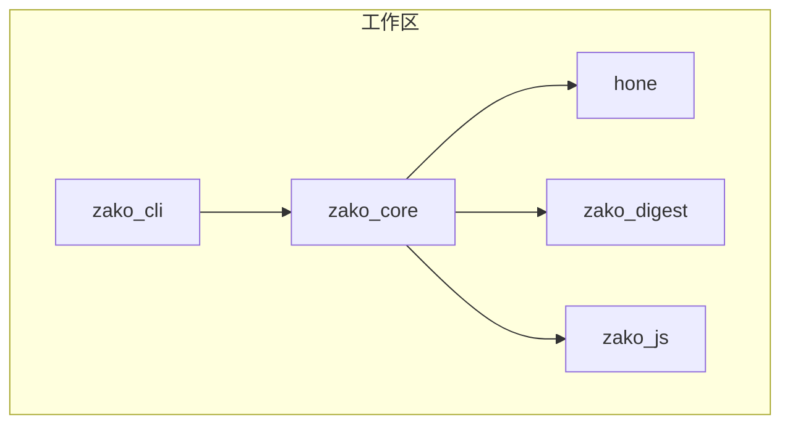
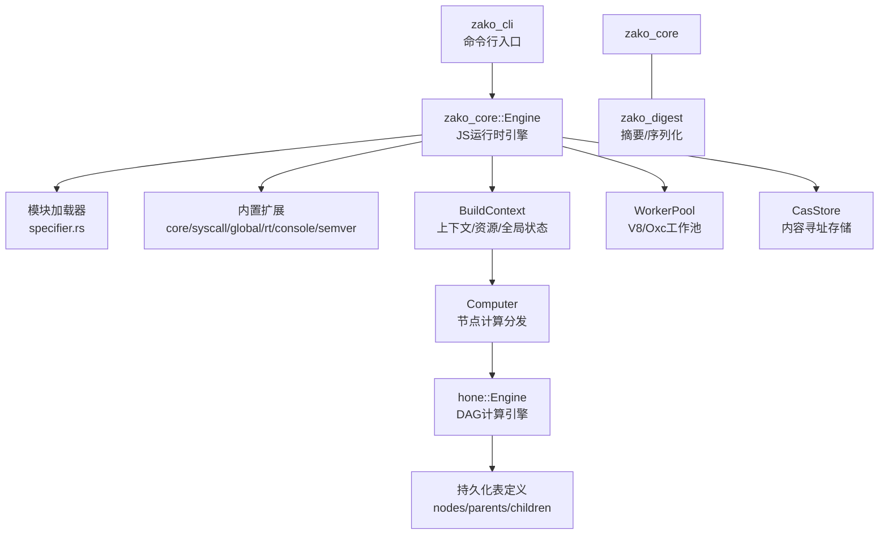
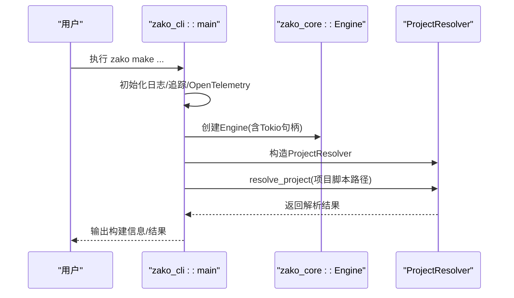
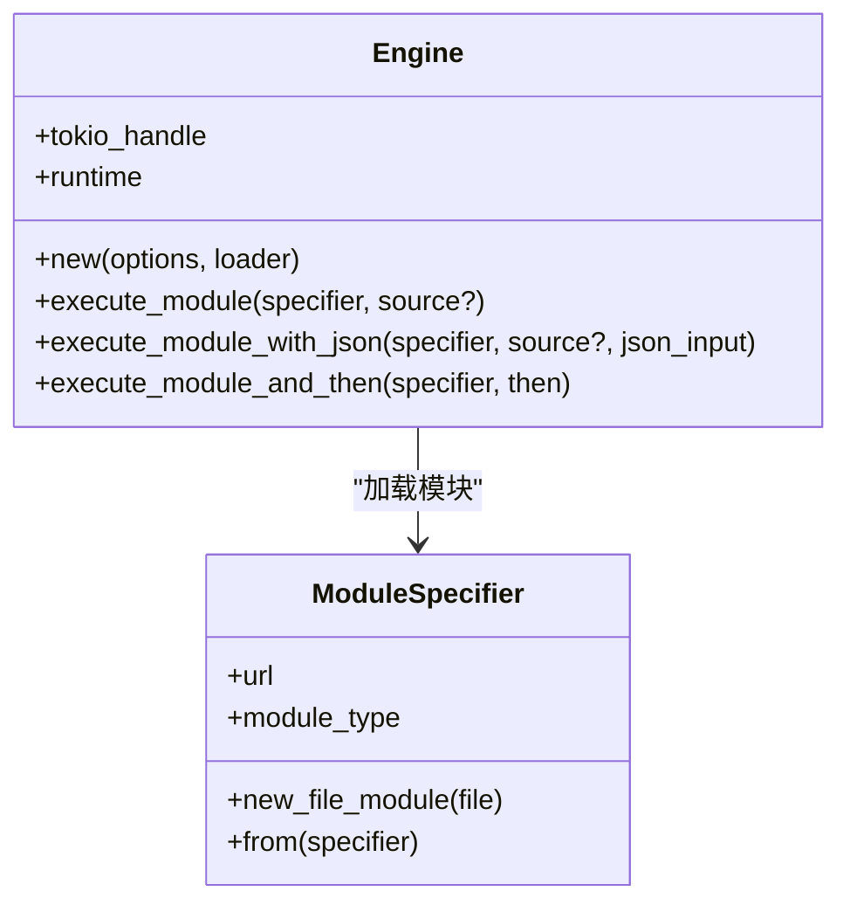
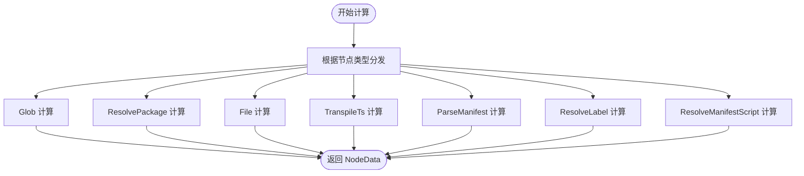
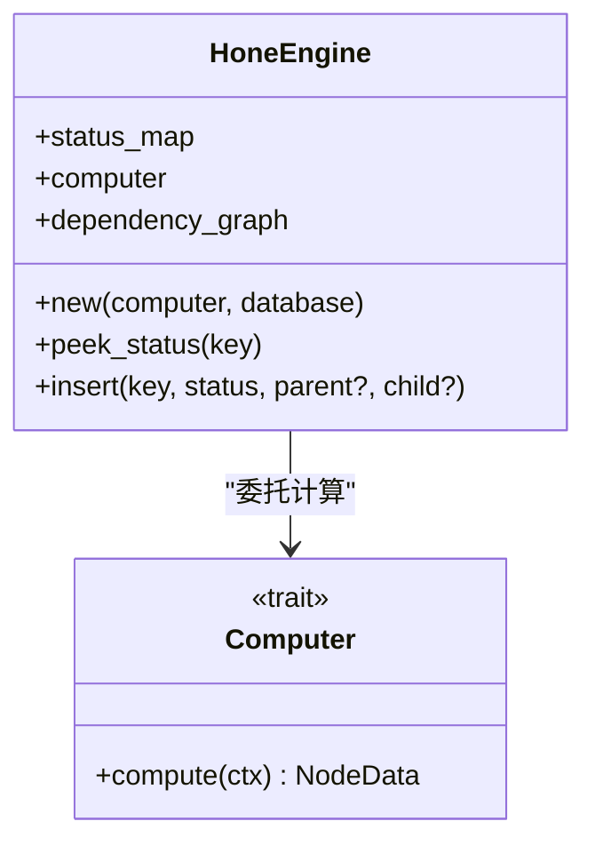
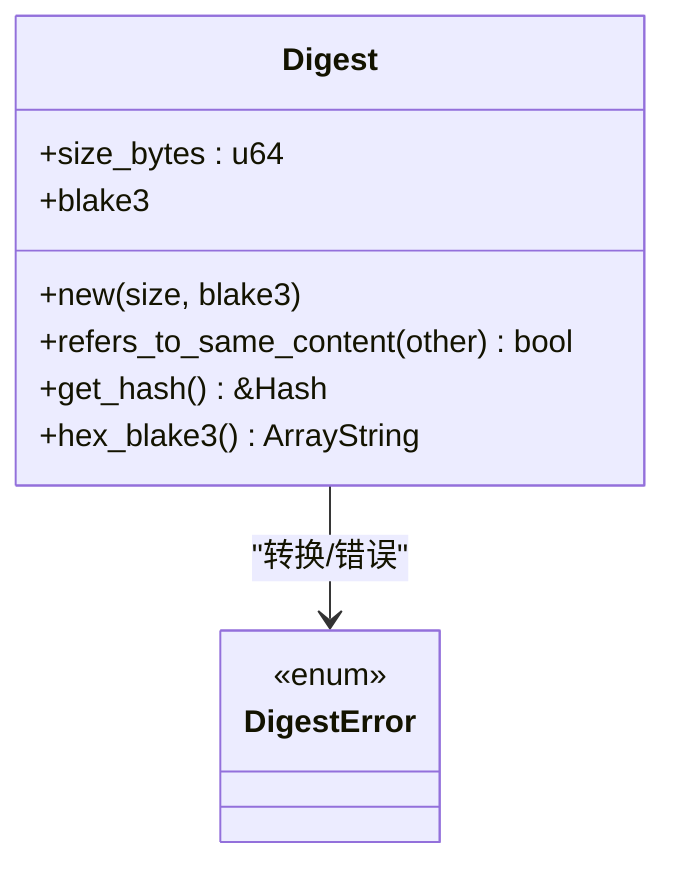
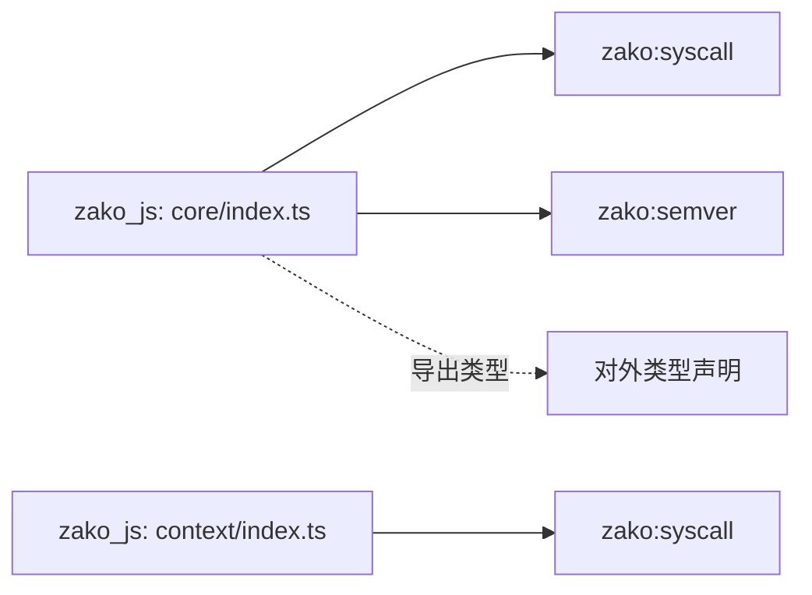
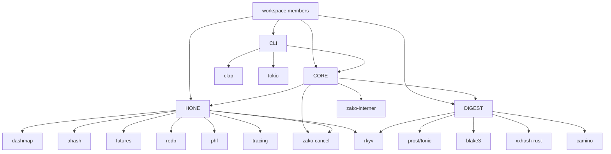

# 组件关系图

<cite>
**本文引用的文件**
- [Cargo.toml](file://Cargo.toml)
- [zako_core/Cargo.toml](file://zako_core/Cargo.toml)
- [zako_cli/Cargo.toml](file://zako_cli/Cargo.toml)
- [hone/Cargo.toml](file://hone/Cargo.toml)
- [zako_digest/Cargo.toml](file://zako_digest/Cargo.toml)
- [zako_core/src/lib.rs](file://zako_core/src/lib.rs)
- [zako_cli/src/main.rs](file://zako_cli/src/main.rs)
- [hone/src/lib.rs](file://hone/src/lib.rs)
- [zako_digest/src/lib.rs](file://zako_digest/src/lib.rs)
- [zako_core/src/engine.rs](file://zako_core/src/engine.rs)
- [hone/src/engine.rs](file://hone/src/engine.rs)
- [zako_core/src/context.rs](file://zako_core/src/context.rs)
- [zako_core/src/computer.rs](file://zako_core/src/computer.rs)
- [zako_core/src/module_loader/specifier.rs](file://zako_core/src/module_loader/specifier.rs)
- [zako_core/src/worker/mod.rs](file://zako_core/src/worker/mod.rs)
- [zako_js/src/builtins/core/index.ts](file://zako_js/src/builtins/core/index.ts)
- [zako_js/src/builtins/context/index.ts](file://zako_js/src/builtins/context/index.ts)
</cite>

## 目录
1. [简介](#简介)
2. [项目结构](#项目结构)
3. [核心组件](#核心组件)
4. [架构总览](#架构总览)
5. [详细组件分析](#详细组件分析)
6. [依赖关系分析](#依赖关系分析)
7. [性能考量](#性能考量)
8. [故障排查指南](#故障排查指南)
9. [结论](#结论)

## 简介
本文件面向Zako构建系统的组件关系与交互，聚焦于zako_core、hone、zako_cli、zako_digest、zako_js等核心模块，绘制系统内各组件之间的依赖关系、数据流与控制流，解释接口契约与通信协议，阐述模块化架构下的职责分离与耦合控制，并给出组件生命周期与启动顺序的说明。文档以可视化图表与文字说明相结合的方式呈现，帮助读者快速理解整体架构。

## 项目结构
Zako采用工作区（workspace）组织，核心模块通过Cargo.toml统一管理依赖与成员。zako_core作为核心库，zako_cli提供命令行入口，hone负责有向无环图（DAG）计算引擎，zako_digest提供摘要与序列化能力，zako_js提供TypeScript内置模块与类型定义。

**图表来源**
- [Cargo.toml](file://Cargo.toml#L11-L22)
- [zako_core/Cargo.toml](file://zako_core/Cargo.toml#L16-L129)
- [zako_cli/Cargo.toml](file://zako_cli/Cargo.toml#L21-L60)
- [hone/Cargo.toml](file://hone/Cargo.toml#L12-L29)
- [zako_digest/Cargo.toml](file://zako_digest/Cargo.toml#L12-L25)

**章节来源**
- [Cargo.toml](file://Cargo.toml#L11-L22)

## 核心组件
- zako_cli：命令行入口，解析参数、初始化日志与追踪、调用zako_core执行构建。
- zako_core：核心库，提供引擎（Engine）、上下文（Context）、计算机（Computer）、模块加载器、工作池、CAS存储等。
- hone：通用DAG计算引擎，抽象节点键值、状态与计算策略，支持并发与持久化表定义。
- zako_digest：摘要与序列化模块，提供Blake3/xxHash等摘要类型及Protobuf桥接。
- zako_js：TypeScript内置模块与类型导出，提供版本、语义化版本、作者、模式匹配等运行时能力。

**章节来源**
- [zako_cli/src/main.rs](file://zako_cli/src/main.rs#L25-L27)
- [zako_core/src/lib.rs](file://zako_core/src/lib.rs#L30-L80)
- [hone/src/lib.rs](file://hone/src/lib.rs#L5-L10)
- [zako_digest/src/lib.rs](file://zako_digest/src/lib.rs#L7-L37)
- [zako_js/src/builtins/core/index.ts](file://zako_js/src/builtins/core/index.ts#L1-L176)

## 架构总览
Zako采用“CLI → 核心引擎 → 计算机/上下文 → 模块加载/工作池”的分层架构。CLI负责用户交互与环境初始化；核心引擎承载JS运行时扩展与模块加载；计算机实现具体节点计算；上下文提供资源与全局状态；模块加载器解析模块类型与URL；工作池提供并行任务处理；摘要模块提供内容寻址与一致性保障。

**图表来源**
- [zako_cli/src/main.rs](file://zako_cli/src/main.rs#L312-L333)
- [zako_core/src/engine.rs](file://zako_core/src/engine.rs#L48-L79)
- [zako_core/src/module_loader/specifier.rs](file://zako_core/src/module_loader/specifier.rs#L27-L39)
- [zako_core/src/context.rs](file://zako_core/src/context.rs#L34-L86)
- [zako_core/src/computer.rs](file://zako_core/src/computer.rs#L24-L76)
- [hone/src/engine.rs](file://hone/src/engine.rs#L33-L68)
- [zako_core/src/worker/mod.rs](file://zako_core/src/worker/mod.rs#L11-L37)
- [zako_core/src/lib.rs](file://zako_core/src/lib.rs#L36-L38)

## 详细组件分析

### 命令行入口与启动流程
- CLI解析参数、设置颜色与回溯、初始化OpenTelemetry与层级化日志。
- 解析到“make”子命令后，创建Tokio句柄与Engine，构造ProjectResolver并解析项目。
- 支持静默模式、目录切换、Argfile与Shabang转发至Bun。

**图表来源**
- [zako_cli/src/main.rs](file://zako_cli/src/main.rs#L501-L622)
- [zako_cli/src/main.rs](file://zako_cli/src/main.rs#L312-L333)

**章节来源**
- [zako_cli/src/main.rs](file://zako_cli/src/main.rs#L501-L622)

### 引擎与模块加载
- zako_core::Engine基于Deno Core/V8，注入内置扩展（rt/syscall/global/semver/core/console），支持从源码或文件加载ES模块。
- 模块加载器根据URL前缀识别模块类型：zako:（内置）、zako-memory:（内存）、zako-import-map:（映射）、file://（文件）。
- 支持在执行前注入executionContext JSON上下文。

**图表来源**
- [zako_core/src/engine.rs](file://zako_core/src/engine.rs#L34-L79)
- [zako_core/src/engine.rs](file://zako_core/src/engine.rs#L81-L166)
- [zako_core/src/module_loader/specifier.rs](file://zako_core/src/module_loader/specifier.rs#L27-L107)

**章节来源**
- [zako_core/src/engine.rs](file://zako_core/src/engine.rs#L48-L79)
- [zako_core/src/module_loader/specifier.rs](file://zako_core/src/module_loader/specifier.rs#L27-L107)

### 计算机与上下文
- Computer实现对不同节点类型的计算分发：Glob、ResolvePackage、File、TranspileTs、ParseManifest、ResolveLabel、ResolveManifestScript。
- BuildContext封装项目根、入口名、包源、全局状态、资源池、Interner、Tokio句柄、CAS存储、工作池等。
- ContextHandler提供上下文持有与访问。

**图表来源**
- [zako_core/src/computer.rs](file://zako_core/src/computer.rs#L24-L76)

**章节来源**
- [zako_core/src/computer.rs](file://zako_core/src/computer.rs#L24-L76)
- [zako_core/src/context.rs](file://zako_core/src/context.rs#L34-L183)

### DAG计算引擎（hone）
- 通用DAG引擎，维护节点状态映射、依赖图、计算机策略与数据库（redb）。
- 提供节点状态查询、插入、解析选项（缓冲数量、继续执行）等。
- 表定义预留nodes、parents、children三张表，用于持久化节点关系与状态。

**图表来源**
- [hone/src/engine.rs](file://hone/src/engine.rs#L33-L68)
- [hone/src/lib.rs](file://hone/src/lib.rs#L12-L27)

**章节来源**
- [hone/src/engine.rs](file://hone/src/engine.rs#L33-L68)
- [hone/src/lib.rs](file://hone/src/lib.rs#L12-L27)

### 摘要与序列化（zako_digest）
- 提供Digest结构体（size_bytes、blake3），支持与Protobuf互转、错误类型、Blake3哈希接口。
- 提供Protobuf命名空间与gRPC/tonic集成入口。

**图表来源**
- [zako_digest/src/lib.rs](file://zako_digest/src/lib.rs#L7-L37)
- [zako_digest/src/lib.rs](file://zako_digest/src/lib.rs#L45-L65)

**章节来源**
- [zako_digest/src/lib.rs](file://zako_digest/src/lib.rs#L7-L37)

### TypeScript内置模块（zako_js）
- 提供版本解析、语义化版本、作者签名、模式匹配、日志等核心能力。
- 通过zako:syscall、zako:semver等内置模块与核心系统交互。

**图表来源**
- [zako_js/src/builtins/core/index.ts](file://zako_js/src/builtins/core/index.ts#L3-L31)
- [zako_js/src/builtins/context/index.ts](file://zako_js/src/builtins/context/index.ts#L7-L15)

**章节来源**
- [zako_js/src/builtins/core/index.ts](file://zako_js/src/builtins/core/index.ts#L1-L176)
- [zako_js/src/builtins/context/index.ts](file://zako_js/src/builtins/context/index.ts#L1-L16)

## 依赖关系分析
- 工作区成员与默认成员：zako_core、zako_cli为默认成员，其他模块按需启用。
- zako_core依赖hone、zako-interner、zako-digest、zako-cancel、tokio、deno_core、oxc_*、blake3、dashmap、moka等。
- zako_cli依赖zako-core、clap、tokio、tracing、opentelemetry等。
- hone依赖dashmap、ahash、futures、zako-digest、redb、phf、tracing、zako-cancel、rkyv等。
- zako_digest依赖prost、tonic、blake3、xxhash-rust、rkyv、camino等。

**图表来源**
- [Cargo.toml](file://Cargo.toml#L12-L21)
- [zako_core/Cargo.toml](file://zako_core/Cargo.toml#L16-L129)
- [zako_cli/Cargo.toml](file://zako_cli/Cargo.toml#L21-L60)
- [hone/Cargo.toml](file://hone/Cargo.toml#L12-L29)
- [zako_digest/Cargo.toml](file://zako_digest/Cargo.toml#L12-L25)

**章节来源**
- [Cargo.toml](file://Cargo.toml#L12-L21)
- [zako_core/Cargo.toml](file://zako_core/Cargo.toml#L16-L129)
- [zako_cli/Cargo.toml](file://zako_cli/Cargo.toml#L21-L60)
- [hone/Cargo.toml](file://hone/Cargo.toml#L12-L29)
- [zako_digest/Cargo.toml](file://zako_digest/Cargo.toml#L12-L25)

## 性能考量
- 并发与调度：CLI使用Tokio多线程运行时；Computer与WorkerPool支持异步并行；DAG引擎使用DashMap保证高并发读写。
- 内存与缓存：moka缓存、DashMap集合、rkyv归档序列化减少拷贝；jemalloc/mimalloc分配器优化内存。
- I/O与压缩：zstd压缩嵌入二进制，Blake3/xxHash加速内容寻址与去重。
- 日志与追踪：OpenTelemetry + tracing-tree提供结构化可观测性，便于定位热点与瓶颈。

## 故障排查指南
- CLI异常：安装color-eyre钩子，捕获未处理panic并输出span与位置信息；检查backtrace与silent模式。
- 引擎错误：EngineError包含CoreError与V8Error，关注模块加载失败、JSON转换失败、事件循环执行问题。
- DAG引擎错误：TransactionError/CommitError/TableError/StorageError提示数据库事务与表操作异常，检查redb存储与表定义。
- 摘要错误：DigestError提示Blake3长度不正确，确认输入字节数组长度与序列化格式。

**章节来源**
- [zako_cli/src/main.rs](file://zako_cli/src/main.rs#L634-L712)
- [zako_core/src/engine.rs](file://zako_core/src/engine.rs#L24-L31)
- [hone/src/engine.rs](file://hone/src/engine.rs#L16-L30)
- [zako_digest/src/lib.rs](file://zako_digest/src/lib.rs#L39-L43)

## 结论
Zako通过清晰的模块边界与分层设计实现了高内聚低耦合：CLI专注用户交互，zako_core承载核心逻辑与运行时，hone提供可扩展的DAG计算框架，zako_digest保障内容寻址一致性，zako_js提供类型安全的构建脚本生态。该架构在保证可维护性的同时，兼顾了性能与可观测性，适合复杂构建场景的演进与扩展。