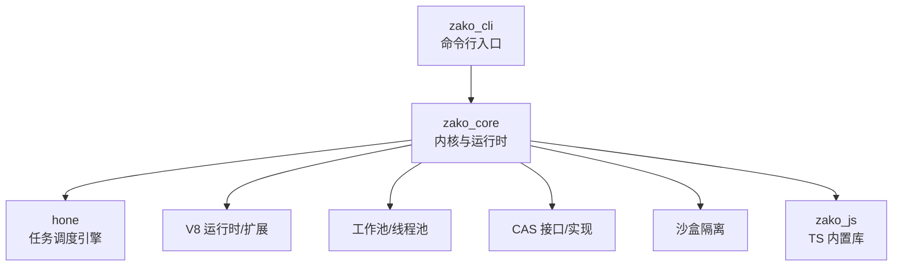
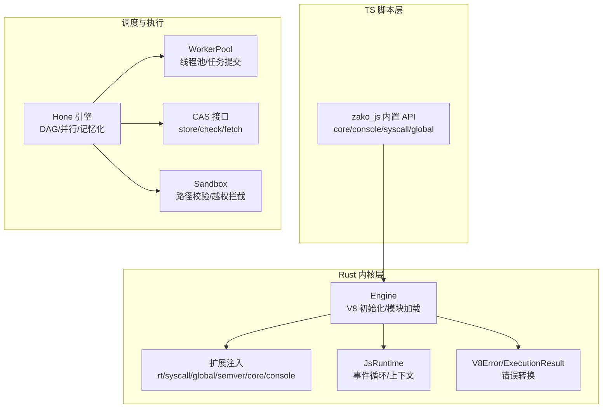
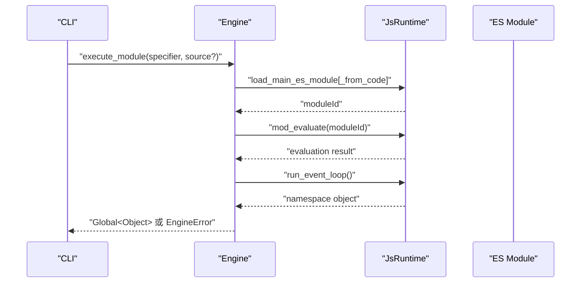
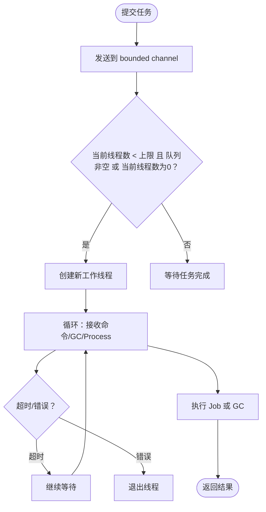
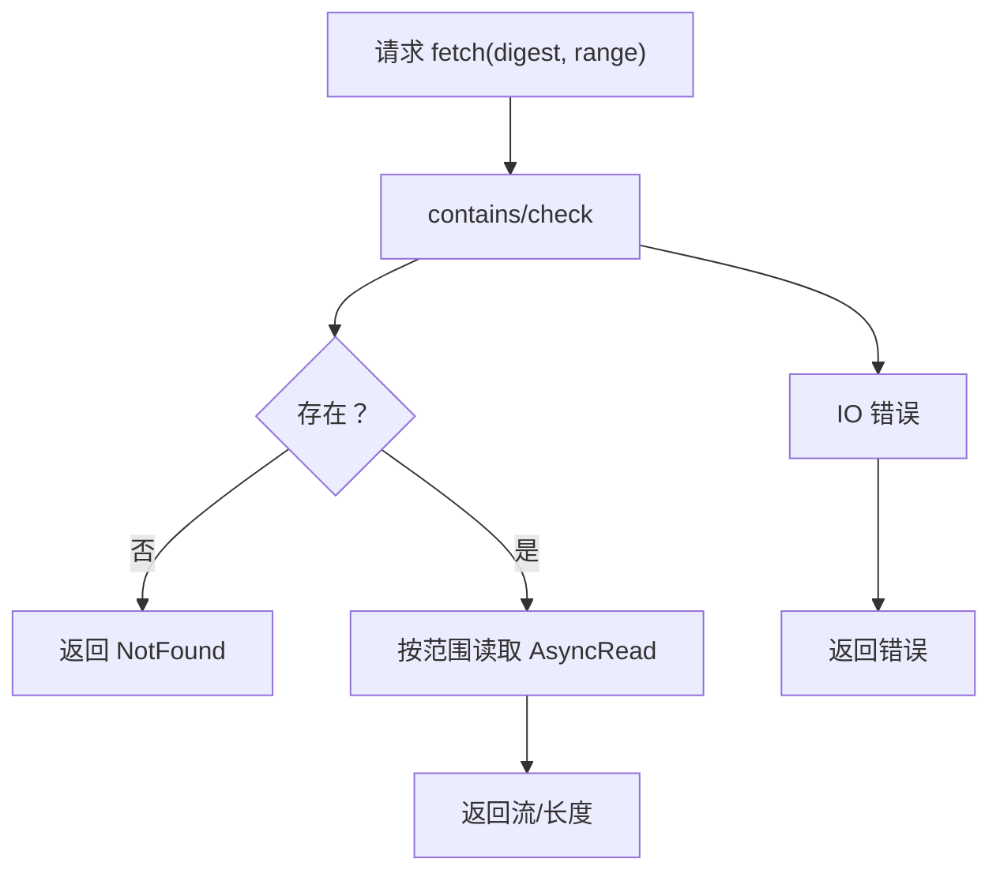
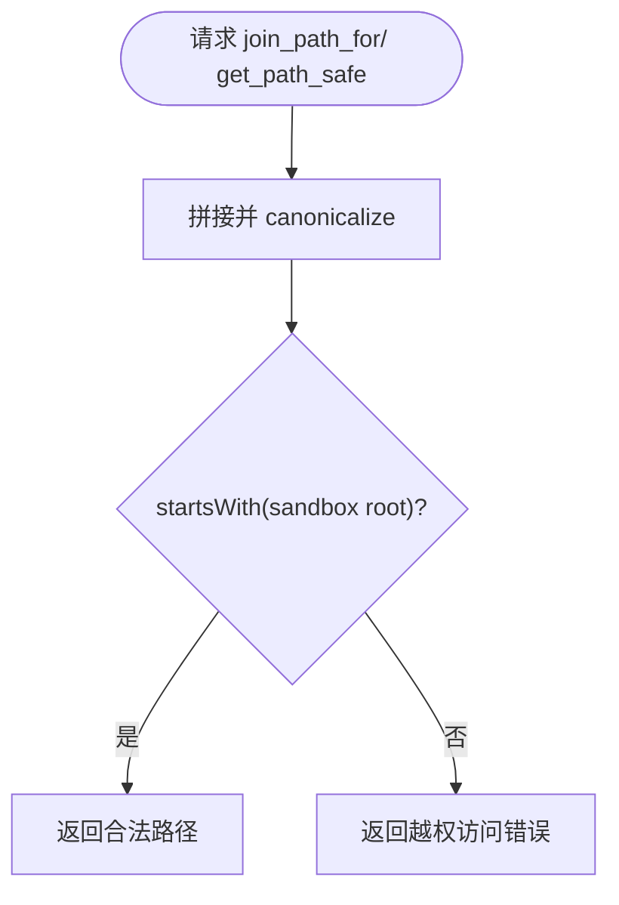
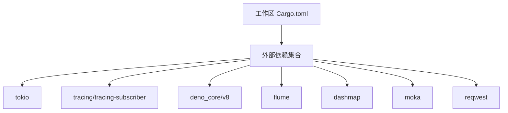

# 故障排除

<cite>
**本文引用的文件**
- [README.md](file://README.md)
- [ARCHITECTURE.md](file://ARCHITECTURE.md)
- [Cargo.toml](file://Cargo.toml)
- [zako_core/src/lib.rs](file://zako_core/src/lib.rs)
- [zako_core/src/engine.rs](file://zako_core/src/engine.rs)
- [zako_core/src/v8error.rs](file://zako_core/src/v8error.rs)
- [zako_core/src/cas.rs](file://zako_core/src/cas.rs)
- [zako_core/src/worker/worker_pool.rs](file://zako_core/src/worker/worker_pool.rs)
- [zako_core/src/sandbox.rs](file://zako_core/src/sandbox.rs)
- [hone/src/error.rs](file://hone/src/error.rs)
- [zako_cli/src/main.rs](file://zako_cli/src/main.rs)
- [zako_js/src/builtins/core/index.ts](file://zako_js/src/builtins/core/index.ts)
- [zako_js/src/builtins/global/index.ts](file://zako_js/src/builtins/global/index.ts)
- [zako_js/src/builtins/console/index.ts](file://zako_js/src/builtins/console/index.ts)
- [zako_js/src/builtins/syscall/index.ts](file://zako_js/src/builtins/syscall/index.ts)
</cite>

## 目录
1. [简介](#简介)
2. [项目结构](#项目结构)
3. [核心组件](#核心组件)
4. [架构总览](#架构总览)
5. [详细组件分析](#详细组件分析)
6. [依赖分析](#依赖分析)
7. [性能考虑](#性能考虑)
8. [故障排除指南](#故障排除指南)
9. [结论](#结论)
10. [附录](#附录)

## 简介
本指南面向技术支持与运维团队，围绕 Zako 构建系统在实际使用中可能遇到的各类问题，提供系统化的诊断流程、错误类型与代码级定位方法、调试与性能分析手段，以及针对复杂分布式场景（如 CAS 同步、工作池崩溃、权限验证）的排障策略。文档同时给出常见问题的快速修复步骤、预防措施与最佳实践。

## 项目结构
Zako 采用多 Crate 工作区组织，核心由内核、调度引擎、CLI、JS 内置库等组成；同时包含哈希与序列化、内容寻址存储（CAS）、V8 运行时、工作池、沙盒等关键子系统。整体结构清晰，便于按模块定位问题。

图表来源
- [Cargo.toml](file://Cargo.toml#L11-L22)
- [zako_core/src/lib.rs](file://zako_core/src/lib.rs#L29-L80)

章节来源
- [Cargo.toml](file://Cargo.toml#L11-L22)
- [ARCHITECTURE.md](file://ARCHITECTURE.md#L16-L27)

## 核心组件
- 内核与运行时：负责 V8 初始化、模块加载、扩展注入、事件循环与错误转换。
- 任务调度引擎（Hone）：将构建任务建模为 DAG，支持并行与记忆化。
- 工作池：基于线程池的任务提交与生命周期管理，支持 GC 回收与取消令牌。
- CAS：内容寻址存储接口，统一远程/本地缓存访问。
- 沙盒：限制文件系统访问范围，避免越权操作。
- CLI：命令行入口，负责日志、追踪、颜色输出与回溯环境变量设置。

章节来源
- [zako_core/src/engine.rs](file://zako_core/src/engine.rs#L34-L79)
- [hone/src/error.rs](file://hone/src/error.rs#L4-L30)
- [zako_core/src/worker/worker_pool.rs](file://zako_core/src/worker/worker_pool.rs#L35-L54)
- [zako_core/src/cas.rs](file://zako_core/src/cas.rs#L10-L44)
- [zako_core/src/sandbox.rs](file://zako_core/src/sandbox.rs#L28-L54)
- [zako_cli/src/main.rs](file://zako_cli/src/main.rs#L501-L517)

## 架构总览
Zako 的计算模型以“键到值”的映射为核心，结合 Hone 引擎实现并行与记忆化；TS 脚本在确定性 V8 环境中执行，通过扩展注入与沙盒约束保障安全与可重复性。

图表来源
- [ARCHITECTURE.md](file://ARCHITECTURE.md#L30-L54)
- [zako_core/src/engine.rs](file://zako_core/src/engine.rs#L48-L79)
- [zako_core/src/v8error.rs](file://zako_core/src/v8error.rs#L12-L30)
- [zako_core/src/worker/worker_pool.rs](file://zako_core/src/worker/worker_pool.rs#L56-L62)
- [zako_core/src/cas.rs](file://zako_core/src/cas.rs#L10-L44)
- [zako_core/src/sandbox.rs](file://zako_core/src/sandbox.rs#L28-L54)

## 详细组件分析

### 组件一：V8 引擎与错误处理（Engine/V8Error）
- 关键职责：初始化 V8 平台与运行时、注入扩展、加载并求值 ES 模块、将 JS 异常转换为可恢复的错误对象。
- 典型问题：模块加载失败、JSON 序列化失败、JS 抛错导致的执行中断。
- 诊断要点：检查模块规范 URL、全局上下文注入、异常对象到 Rust 错误的转换链路。

图表来源
- [zako_core/src/engine.rs](file://zako_core/src/engine.rs#L81-L109)
- [zako_core/src/engine.rs](file://zako_core/src/engine.rs#L111-L166)
- [zako_core/src/engine.rs](file://zako_core/src/engine.rs#L168-L300)

章节来源
- [zako_core/src/engine.rs](file://zako_core/src/engine.rs#L24-L31)
- [zako_core/src/engine.rs](file://zako_core/src/engine.rs#L81-L109)
- [zako_core/src/engine.rs](file://zako_core/src/engine.rs#L111-L166)
- [zako_core/src/engine.rs](file://zako_core/src/engine.rs#L168-L300)
- [zako_core/src/v8error.rs](file://zako_core/src/v8error.rs#L12-L30)

### 组件二：工作池（WorkerPool）
- 关键职责：根据队列长度与活跃度动态扩容/回收线程，提交任务并等待一次性结果，支持取消令牌。
- 典型问题：任务长时间无响应、线程池未启动、多次启动、任务被取消或线程恐慌。
- 诊断要点：检查池配置、活跃线程计数、接收超时、广播 GC 是否生效。

图表来源
- [zako_core/src/worker/worker_pool.rs](file://zako_core/src/worker/worker_pool.rs#L156-L178)
- [zako_core/src/worker/worker_pool.rs](file://zako_core/src/worker/worker_pool.rs#L180-L183)

章节来源
- [zako_core/src/worker/worker_pool.rs](file://zako_core/src/worker/worker_pool.rs#L17-L25)
- [zako_core/src/worker/worker_pool.rs](file://zako_core/src/worker/worker_pool.rs#L56-L62)
- [zako_core/src/worker/worker_pool.rs](file://zako_core/src/worker/worker_pool.rs#L121-L138)
- [zako_core/src/worker/worker_pool.rs](file://zako_core/src/worker/worker_pool.rs#L156-L178)
- [zako_core/src/worker/worker_pool.rs](file://zako_core/src/worker/worker_pool.rs#L180-L183)

### 组件三：内容寻址存储（CAS）
- 关键职责：统一的存储接口，支持存储、存在性检查、范围读取、本地路径查询。
- 典型问题：请求索引越界、数据不存在、IO 错误、权限不足。
- 诊断要点：核对摘要、范围参数、返回长度与期望一致，确认访问权限与存储后端状态。

图表来源
- [zako_core/src/cas.rs](file://zako_core/src/cas.rs#L13-L44)
- [zako_core/src/cas.rs](file://zako_core/src/cas.rs#L46-L62)

章节来源
- [zako_core/src/cas.rs](file://zako_core/src/cas.rs#L10-L44)
- [zako_core/src/cas.rs](file://zako_core/src/cas.rs#L46-L62)

### 组件四：沙盒（Sandbox）
- 关键职责：限制文件系统访问，仅允许在根目录内解析与拼接路径，越权访问即报错。
- 典型问题：相对路径穿越、目标路径不在沙盒根下。
- 诊断要点：对比 canonicalize 后路径是否以沙盒根开头。

图表来源
- [zako_core/src/sandbox.rs](file://zako_core/src/sandbox.rs#L34-L54)
- [zako_core/src/sandbox.rs](file://zako_core/src/sandbox.rs#L56-L72)

章节来源
- [zako_core/src/sandbox.rs](file://zako_core/src/sandbox.rs#L28-L54)
- [zako_core/src/sandbox.rs](file://zako_core/src/sandbox.rs#L74-L81)

### 组件五：Hone 引擎错误
- 关键职责：定义调度与数据库状态相关的错误类型，包含环检测、缺失依赖、IO 错误、取消等。
- 典型问题：循环依赖导致计算无法推进、数据库状态不一致、IO 失败影响缓存一致性。
- 诊断要点：检查调用栈与当前节点，定位具体缺失依赖或数据库异常。

章节来源
- [hone/src/error.rs](file://hone/src/error.rs#L4-L30)

### 组件六：CLI 日志与回溯
- 关键职责：设置层级化日志、OpenTelemetry 追踪、颜色输出、缓冲写入、回溯环境变量、panic 钩子。
- 典型问题：静默模式导致日志缺失、颜色输出异常、回溯信息不足。
- 诊断要点：启用 backtrace 参数、设置颜色选项、检查缓冲写入释放与静默模式分支。

章节来源
- [zako_cli/src/main.rs](file://zako_cli/src/main.rs#L501-L517)
- [zako_cli/src/main.rs](file://zako_cli/src/main.rs#L567-L586)
- [zako_cli/src/main.rs](file://zako_cli/src/main.rs#L452-L499)
- [zako_cli/src/main.rs](file://zako_cli/src/main.rs#L634-L670)
- [zako_cli/src/main.rs](file://zako_cli/src/main.rs#L714-L738)

### 组件七：TS 内置日志与系统调用
- 关键职责：提供 trace/debug/info/warn/error 日志 API，封装 console 输出，syscall 与核心日志桥接。
- 典型问题：日志格式化异常、对象不可序列化导致输出为空。
- 诊断要点：检查 safeFormat 的降级处理、console 属性定义、syscall 版本与核心日志接口匹配。

章节来源
- [zako_js/src/builtins/core/index.ts](file://zako_js/src/builtins/core/index.ts#L121-L138)
- [zako_js/src/builtins/global/index.ts](file://zako_js/src/builtins/global/index.ts#L30-L44)
- [zako_js/src/builtins/console/index.ts](file://zako_js/src/builtins/console/index.ts#L2-L9)
- [zako_js/src/builtins/syscall/index.ts](file://zako_js/src/builtins/syscall/index.ts#L17-L22)

## 依赖分析
- 工作区采用统一的 lint 与安全策略，依赖版本集中管理，便于排查兼容性问题。
- 关键外部依赖：tokio、tracing、deno_core、v8、flume、dashmap、moka、reqwest 等，分别用于并发、追踪、JS 运行时、通道通信、缓存与网络。

图表来源
- [Cargo.toml](file://Cargo.toml#L38-L280)

章节来源
- [Cargo.toml](file://Cargo.toml#L38-L280)

## 性能考虑
- 使用 mimalloc 作为全局分配器，降低碎片与提升吞吐。
- 通过 moka 缓存与 dashmap 并发容器提升热点数据访问效率。
- 使用 rayon 与 tokio 并行化 CPU 与 IO 密集任务。
- 在 CLI 中启用层级化日志与 OpenTelemetry 追踪，便于性能瓶颈定位。

章节来源
- [zako_cli/src/main.rs](file://zako_cli/src/main.rs#L29-L31)
- [zako_core/src/lib.rs](file://zako_core/src/lib.rs#L96-L96)
- [Cargo.toml](file://Cargo.toml#L219-L219)
- [Cargo.toml](file://Cargo.toml#L218-L218)

## 故障排除指南

### 一、构建失败排查
- 模块加载失败
  - 现象：Engine 抛出 CoreError 或 V8Error。
  - 排查：检查模块规范 URL、源码注入路径、是否存在循环依赖。
  - 参考
    - [zako_core/src/engine.rs](file://zako_core/src/engine.rs#L48-L79)
    - [zako_core/src/engine.rs](file://zako_core/src/engine.rs#L81-L109)
- JSON 输入转换失败
  - 现象：执行带 JSON 的模块时报错，提示转换失败。
  - 排查：确认 serde_json::Value 结构与 V8 对象映射关系。
  - 参考
    - [zako_core/src/engine.rs](file://zako_core/src/engine.rs#L111-L166)
- JS 抛错导致中断
  - 现象：模块评估后抛出异常，转换为 V8Error。
  - 排查：查看异常对象到错误的转换链路，定位脚本中的具体错误位置。
  - 参考
    - [zako_core/src/engine.rs](file://zako_core/src/engine.rs#L200-L232)
    - [zako_core/src/v8error.rs](file://zako_core/src/v8error.rs#L12-L30)

快速修复步骤
- 确认模块 URL 正确且可访问。
- 在 TS 层打印关键变量，使用 safeFormat 避免不可序列化对象。
  - [zako_js/src/builtins/global/index.ts](file://zako_js/src/builtins/global/index.ts#L12-L28)
- 启用 backtrace 与颜色输出，复现并收集日志。
  - [zako_cli/src/main.rs](file://zako_cli/src/main.rs#L452-L499)

### 二、性能问题诊断
- 症状：构建时间过长、CPU/IO 利用率异常。
- 排查：
  - 检查工作池配置与活跃线程数，确认是否频繁扩容/回收。
    - [zako_core/src/worker/worker_pool.rs](file://zako_core/src/worker/worker_pool.rs#L121-L138)
  - 查看缓存命中率与热点数据分布。
    - [zako_core/src/lib.rs](file://zako_core/src/lib.rs#L96-L96)
  - 使用层级化日志与 OpenTelemetry 追踪定位慢点。
    - [zako_cli/src/main.rs](file://zako_cli/src/main.rs#L501-L517)

预防措施
- 合理设置并发度，避免过度并行导致资源争用。
- 对热点数据使用缓存，减少重复计算与 IO。

### 三、网络连接问题处理（CAS/远程缓存）
- 症状：fetch 返回 NotFound、RequestedIndexOutOfRange、IO 错误。
- 排查：
  - 确认摘要与范围参数，核对 blob 长度与请求范围。
    - [zako_core/src/cas.rs](file://zako_core/src/cas.rs#L46-L62)
  - 检查权限与存储后端状态，确认应用具备访问权限。
    - [zako_core/src/cas.rs](file://zako_core/src/cas.rs#L22-L44)
- 快速修复：
  - 重新生成摘要并核对范围。
  - 检查远端 CAS 服务可用性与鉴权配置。

### 四、分布式问题：CAS 同步失败
- 症状：远端 CAS 数据不一致、范围读取越界。
- 排查：
  - 对比本地与远端摘要，确认一致性。
  - 检查网络传输与压缩/解压链路。
- 预防：
  - 在写入后进行二次校验，确保摘要正确。
  - 对大文件采用分片上传与断点续传策略。

### 五、工作池崩溃与卡死
- 症状：任务长时间无响应、线程池未启动、多次启动报错。
- 排查：
  - 检查 start 是否被调用且只调用一次。
    - [zako_core/src/worker/worker_pool.rs](file://zako_core/src/worker/worker_pool.rs#L57-L62)
  - 查看队列长度与活跃线程计数，确认是否因超时退出。
    - [zako_core/src/worker/worker_pool.rs](file://zako_core/src/worker/worker_pool.rs#L84-L114)
  - 确认取消令牌是否正确传递与消费。
    - [zako_core/src/worker/worker_pool.rs](file://zako_core/src/worker/worker_pool.rs#L96-L105)
- 快速修复：
  - 重置池状态并重新启动。
  - 调整 idle_timeout 与队列容量。

### 六、权限验证错误（沙盒越权）
- 症状：Sandbox 报错“尝试访问沙盒外文件”。
- 排查：
  - 检查路径拼接与 canonicalize 结果，确认最终路径仍在沙盒根下。
    - [zako_core/src/sandbox.rs](file://zako_core/src/sandbox.rs#L34-L54)
- 快速修复：
  - 使用沙盒提供的 join_path_for/get_path_safe 接口进行路径解析。
    - [zako_core/src/sandbox.rs](file://zako_core/src/sandbox.rs#L56-L72)

### 七、Hone 引擎错误
- 症状：环检测、缺失依赖、数据库状态无效、IO 错误、取消。
- 排查：
  - 核对调用链与当前节点，定位具体缺失依赖。
    - [hone/src/error.rs](file://hone/src/error.rs#L4-L30)
- 快速修复：
  - 补全缺失依赖或修正循环依赖。
  - 修复数据库状态或重置缓存。

### 八、调试模式与日志分析
- 启用回溯与颜色输出
  - 设置 backtrace 参数，确保 RUST_BACKTRACE/RUST_LIB_BACKTRACE 环境变量生效。
    - [zako_cli/src/main.rs](file://zako_cli/src/main.rs#L452-L499)
- 日志与追踪
  - 使用 HierarchicalLayer 输出层级化日志，结合 OpenTelemetry 追踪。
    - [zako_cli/src/main.rs](file://zako_cli/src/main.rs#L501-L517)
- JS 日志
  - 使用 zako:core 的日志 API，确保 safeFormat 与 console 定义正确。
    - [zako_js/src/builtins/core/index.ts](file://zako_js/src/builtins/core/index.ts#L121-L138)
    - [zako_js/src/builtins/global/index.ts](file://zako_js/src/builtins/global/index.ts#L30-L44)
    - [zako_js/src/builtins/console/index.ts](file://zako_js/src/builtins/console/index.ts#L2-L9)
    - [zako_js/src/builtins/syscall/index.ts](file://zako_js/src/builtins/syscall/index.ts#L17-L22)

### 九、常见问题快速修复清单
- 模块加载失败
  - 检查 URL 与源码注入路径
  - 参考：[zako_core/src/engine.rs](file://zako_core/src/engine.rs#L81-L109)
- JSON 转换失败
  - 校验 serde_json::Value 结构
  - 参考：[zako_core/src/engine.rs](file://zako_core/src/engine.rs#L111-L166)
- JS 抛错
  - 捕获异常并转换为 V8Error
  - 参考：[zako_core/src/engine.rs](file://zako_core/src/engine.rs#L200-L232), [zako_core/src/v8error.rs](file://zako_core/src/v8error.rs#L12-L30)
- CAS 读取越界
  - 核对摘要与范围，确认 blob 长度
  - 参考：[zako_core/src/cas.rs](file://zako_core/src/cas.rs#L46-L62)
- 沙盒越权
  - 使用沙盒接口进行路径解析
  - 参考：[zako_core/src/sandbox.rs](file://zako_core/src/sandbox.rs#L34-L54)
- 工作池卡死
  - 检查 start 与队列状态，调整 idle_timeout
  - 参考：[zako_core/src/worker/worker_pool.rs](file://zako_core/src/worker/worker_pool.rs#L57-L62), [zako_core/src/worker/worker_pool.rs](file://zako_core/src/worker/worker_pool.rs#L84-L114)

## 结论
通过对 Zako 的引擎、运行时、工作池、CAS、沙盒与 CLI 的系统化分析，可以建立从模块加载到分布式缓存的一体化故障排除流程。建议在日常运维中结合层级化日志、OpenTelemetry 追踪与回溯环境变量，配合 TS 内置日志与沙盒路径校验，快速定位并解决问题。

## 附录
- 项目愿景与设计理念概述
  - [ARCHITECTURE.md](file://ARCHITECTURE.md#L5-L14)
- 开发者指南与阅读顺序
  - [ARCHITECTURE.md](file://ARCHITECTURE.md#L142-L151)
- 项目简介与功能概览
  - [README.md](file://README.md#L5-L14)