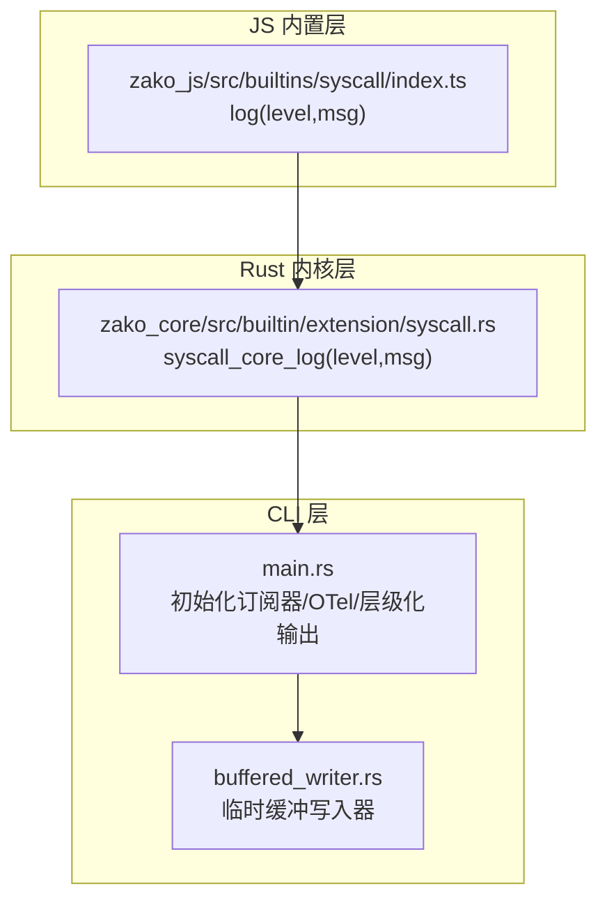
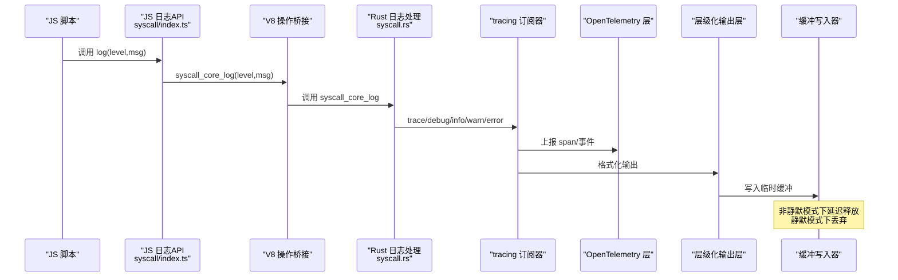
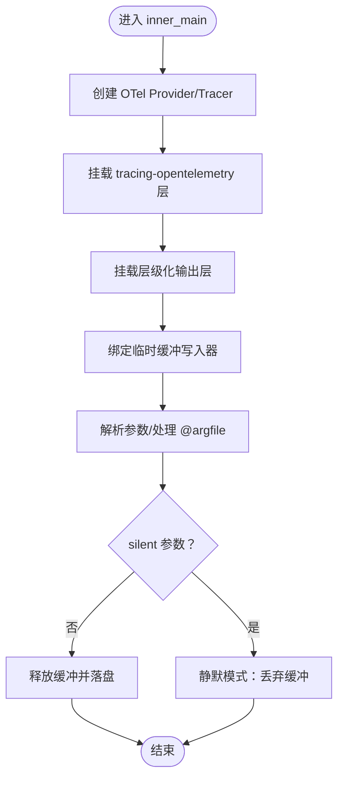
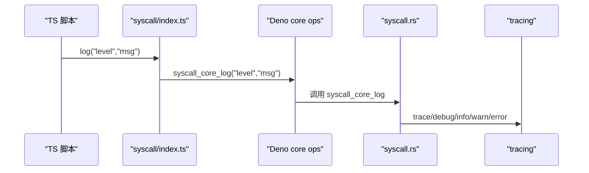
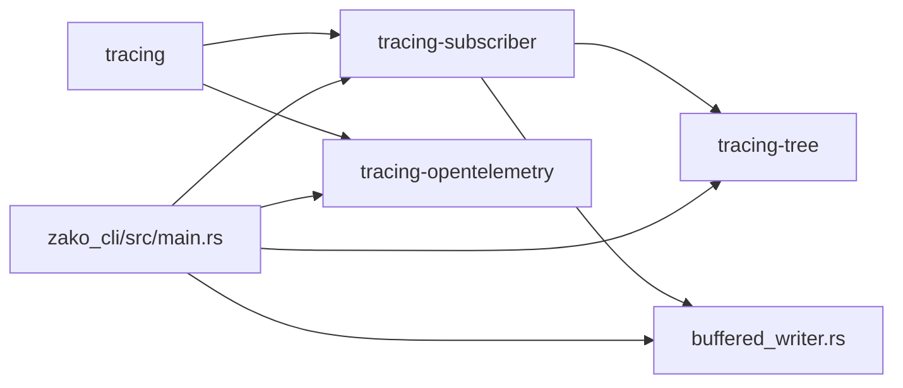

# 日志管理

<cite>
**本文引用的文件**   
- [zako_cli/src/main.rs](file://zako_cli/src/main.rs)
- [zako_cli/src/buffered_writer.rs](file://zako_cli/src/buffered_writer.rs)
- [zako_core/src/builtin/extension/syscall.rs](file://zako_core/src/builtin/extension/syscall.rs)
- [zako_js/src/builtins/syscall/index.ts](file://zako_js/src/builtins/syscall/index.ts)
- [Cargo.toml](file://Cargo.toml)
- [ARCHITECTURE.md](file://ARCHITECTURE.md)
</cite>

## 目录
1. [简介](#简介)
2. [项目结构](#项目结构)
3. [核心组件](#核心组件)
4. [架构总览](#架构总览)
5. [详细组件分析](#详细组件分析)
6. [依赖关系分析](#依赖关系分析)
7. [性能考量](#性能考量)
8. [故障排查指南](#故障排查指南)
9. [结论](#结论)
10. [附录](#附录)

## 简介
本指南面向运维与开发人员，系统阐述 Zako 日志管理方案，覆盖日志级别配置、输出格式、日志轮转策略、日志聚合与 ELK 集成、实时监控、日志保留策略、存储优化与检索查询等主题。通过对 CLI、JS 内置日志接口与 Rust tracing/opentelemetry 集成的深入分析，帮助读者建立一套可落地、可扩展的日志体系。

## 项目结构
Zako 的日志能力由三层协同构成：
- CLI 层：负责初始化全局日志订阅器、注入 OpenTelemetry 层、配置层级化输出与缓冲写入器。
- JS 内置层：提供统一的日志 API（trace/debug/info/warn/error），通过 V8 操作桥接到 Rust。
- Rust 内核层：接收来自 JS 的日志消息，按级别写入 tracing 订阅器，支持 OpenTelemetry 上报。

图表来源
- [zako_cli/src/main.rs](file://zako_cli/src/main.rs#L501-L517)
- [zako_cli/src/buffered_writer.rs](file://zako_cli/src/buffered_writer.rs#L1-L99)
- [zako_js/src/builtins/syscall/index.ts](file://zako_js/src/builtins/syscall/index.ts#L17-L22)
- [zako_core/src/builtin/extension/syscall.rs](file://zako_core/src/builtin/extension/syscall.rs#L33-L61)

章节来源
- [ARCHITECTURE.md](file://ARCHITECTURE.md#L1-L152)

## 核心组件
- 全局日志订阅器与 OTel 集成：CLI 在启动时创建 tracing 订阅器，挂载 OpenTelemetry 层与层级化输出层，统一接收来自 JS 的日志消息。
- 临时缓冲写入器：在非静默模式下延迟释放输出缓冲，避免早期阶段的噪声输出；静默模式下丢弃缓冲内容，减少内存占用。
- JS 日志 API：提供 trace/debug/info/warn/error 五级日志，内部通过 V8 操作调用 Rust，最终落入 tracing 订阅器。
- 日志级别与语义：JS 层面与 Rust tracing 使用一致的五级语义，便于后续接入 ELK/OTel 生态。

章节来源
- [zako_cli/src/main.rs](file://zako_cli/src/main.rs#L501-L517)
- [zako_cli/src/buffered_writer.rs](file://zako_cli/src/buffered_writer.rs#L1-L99)
- [zako_js/src/builtins/syscall/index.ts](file://zako_js/src/builtins/syscall/index.ts#L17-L22)
- [zako_core/src/builtin/extension/syscall.rs](file://zako_core/src/builtin/extension/syscall.rs#L33-L61)

## 架构总览
下图展示从 JS 调用到日志落盘的关键流程，以及 OTel 与层级化输出的协作方式。

图表来源
- [zako_js/src/builtins/syscall/index.ts](file://zako_js/src/builtins/syscall/index.ts#L17-L22)
- [zako_core/src/builtin/extension/syscall.rs](file://zako_core/src/builtin/extension/syscall.rs#L33-L61)
- [zako_cli/src/main.rs](file://zako_cli/src/main.rs#L501-L517)
- [zako_cli/src/buffered_writer.rs](file://zako_cli/src/buffered_writer.rs#L69-L98)

## 详细组件分析

### 组件A：CLI 日志初始化与缓冲输出
- 初始化流程：创建 OTel Provider 与 Tracer，挂载 tracing-opentelemetry 层；创建层级化输出层（HierarchicalLayer），启用 ANSI 与缩进；将输出绑定到临时缓冲写入器。
- 缓冲策略：在非静默模式下，延迟释放缓冲，使早期阶段的输出一次性落盘；在静默模式下，丢弃缓冲内容，避免内存泄漏。
- 关键行为：根据参数 silent 控制缓冲释放或静默丢弃；同时设置回溯相关环境变量以增强调试信息。

图表来源
- [zako_cli/src/main.rs](file://zako_cli/src/main.rs#L501-L517)
- [zako_cli/src/main.rs](file://zako_cli/src/main.rs#L567-L586)
- [zako_cli/src/buffered_writer.rs](file://zako_cli/src/buffered_writer.rs#L31-L46)

章节来源
- [zako_cli/src/main.rs](file://zako_cli/src/main.rs#L501-L517)
- [zako_cli/src/main.rs](file://zako_cli/src/main.rs#L567-L586)
- [zako_cli/src/buffered_writer.rs](file://zako_cli/src/buffered_writer.rs#L1-L99)

### 组件B：JS 日志 API 到 Rust 的桥接
- JS 层：提供统一的 log(level,msg) 接口，level 限定为 trace/debug/info/warn/error。
- V8 桥接：通过 Deno core ops 调用 Rust 暴露的 syscall_core_log。
- Rust 层：根据 level 调用 tracing 的对应宏，最终落入全局订阅器。

图表来源
- [zako_js/src/builtins/syscall/index.ts](file://zako_js/src/builtins/syscall/index.ts#L17-L22)
- [zako_core/src/builtin/extension/syscall.rs](file://zako_core/src/builtin/extension/syscall.rs#L33-L61)

章节来源
- [zako_js/src/builtins/syscall/index.ts](file://zako_js/src/builtins/syscall/index.ts#L1-L25)
- [zako_core/src/builtin/extension/syscall.rs](file://zako_core/src/builtin/extension/syscall.rs#L1-L62)

### 组件C：日志级别与输出格式
- 日志级别：trace < debug < info < warn < error，JS 与 Rust 保持一致。
- 输出格式：层级化输出层默认启用 ANSI 与缩进，便于人类可读；OTel 层负责结构化观测数据采集。
- 日志字段：JS 日志仅包含 level 与 message 字段；OTel 层可补充 trace/span 等上下文信息。

章节来源
- [zako_js/src/builtins/syscall/index.ts](file://zako_js/src/builtins/syscall/index.ts#L17-L22)
- [zako_core/src/builtin/extension/syscall.rs](file://zako_core/src/builtin/extension/syscall.rs#L33-L61)
- [zako_cli/src/main.rs](file://zako_cli/src/main.rs#L510-L515)

## 依赖关系分析
- tracing 与 tracing-subscriber：提供日志收集与格式化能力。
- tracing-opentelemetry：将日志事件转换为 OTel span/事件，便于集中观测。
- tracing-tree：层级化输出，提升可读性。
- buffered_writer：与 tracing-subscriber 的 MakeWriter 协作，实现缓冲与延迟落盘。

图表来源
- [Cargo.toml](file://Cargo.toml#L63-L91)
- [zako_cli/src/main.rs](file://zako_cli/src/main.rs#L20-L24)
- [zako_cli/src/buffered_writer.rs](file://zako_cli/src/buffered_writer.rs#L1-L3)

章节来源
- [Cargo.toml](file://Cargo.toml#L63-L91)
- [zako_cli/src/main.rs](file://zako_cli/src/main.rs#L20-L24)

## 性能考量
- 缓冲与延迟落盘：在非静默模式下，通过临时缓冲写入器减少频繁 I/O；静默模式下丢弃缓冲，避免额外内存占用。
- OTel 上报开销：OTel 层会引入少量 CPU/内存开销，建议在生产环境按需开启采样与批处理。
- 层级化输出：缩进与 ANSI 格式化在大量日志场景下可能增加 CPU 消耗，建议在 CI/自动化场景关闭 ANSI 或降低层级深度。
- 日志级别控制：通过合理设置日志级别，避免在生产环境输出过多 debug/trace 日志。

章节来源
- [zako_cli/src/buffered_writer.rs](file://zako_cli/src/buffered_writer.rs#L31-L46)
- [zako_cli/src/main.rs](file://zako_cli/src/main.rs#L510-L515)

## 故障排查指南
- JS 日志无效：确认脚本是否通过 zako:syscall 的 log(level,msg) 调用；检查 V8 操作桥接是否可用。
- 日志级别异常：JS 传入非法级别将触发错误；请确保 level 为 trace/debug/info/warn/error 之一。
- 回溯信息缺失：若需要更详细的堆栈与 span 信息，请在启动时启用 backtrace 参数，或设置相关环境变量。
- 输出被吞：静默模式下所有输出将被丢弃；请检查 silent 参数与缓冲释放逻辑。

章节来源
- [zako_core/src/builtin/extension/syscall.rs](file://zako_core/src/builtin/extension/syscall.rs#L10-L16)
- [zako_core/src/builtin/extension/syscall.rs](file://zako_core/src/builtin/extension/syscall.rs#L54-L58)
- [zako_cli/src/main.rs](file://zako_cli/src/main.rs#L452-L499)
- [zako_cli/src/buffered_writer.rs](file://zako_cli/src/buffered_writer.rs#L42-L46)

## 结论
Zako 的日志体系以 tracing 为核心，结合 OTel 与层级化输出，既满足开发调试需求，又具备可观测性基础。通过 JS/TS 与 Rust 的桥接，实现了统一的日志级别与简洁的 API。建议在生产环境中配合 ELK/OTel 进行集中采集与可视化，并依据业务场景调整日志级别、缓冲策略与输出格式，以获得最佳的性能与可观测性平衡。

## 附录

### 日志级别配置与使用建议
- 开发调试：使用 trace/debug 获取详细执行轨迹；必要时开启 backtrace。
- 正常运行：使用 info/warn 记录关键事件与潜在问题；error 仅记录严重错误。
- 生产环境：建议将默认级别设为 info，避免输出过多 debug/trace。

章节来源
- [zako_js/src/builtins/syscall/index.ts](file://zako_js/src/builtins/syscall/index.ts#L17-L22)
- [zako_core/src/builtin/extension/syscall.rs](file://zako_core/src/builtin/extension/syscall.rs#L33-L61)

### 日志输出格式与位置
- 输出格式：层级化缩进 + ANSI 高亮，便于终端阅读。
- 输出位置：标准输出；在静默模式下被丢弃。
- OTel 上报：通过 tracing-opentelemetry 层自动上报，便于集中观测。

章节来源
- [zako_cli/src/main.rs](file://zako_cli/src/main.rs#L510-L515)
- [zako_cli/src/buffered_writer.rs](file://zako_cli/src/buffered_writer.rs#L69-L98)

### 日志轮转与保留策略（实践建议）
- 文件轮转：建议在部署层使用系统级轮转工具（如 logrotate/rsyslog）对标准输出重定向到文件后进行轮转。
- 保留周期：按合规要求设定保留天数/大小上限；对历史数据进行归档。
- 压缩策略：对归档日志启用压缩，降低存储成本。
- 清理策略：定期清理过期日志，避免磁盘空间不足。

说明：以上为通用实践建议，具体配置需结合部署环境与合规要求制定。

### 日志聚合与 ELK 集成（实践建议）
- 数据采集：将标准输出重定向到文件，或通过容器/服务框架的标准日志采集机制接入 ELK。
- 结构化解析：OTel 层已提供结构化上下文，建议在 ELK 中保留 trace_id/ span_id 等字段。
- 可视化：在 Kibana 中创建仪表板，聚焦构建失败、缓存未命中、性能警告等关键事件。
- 告警：基于日志中的错误级别与关键词（如 error、fail、timeout）设置告警规则。

说明：以上为通用实践建议，具体集成需结合部署架构与 ELK 版本进行配置。

### 实时日志监控设置（实践建议）
- 终端实时查看：在本地开发时，直接运行 CLI 并观察层级化输出。
- 远程实时查看：将日志输出到文件并通过 tail/实时采集工具接入监控系统。
- 告警联动：将日志中的错误事件与告警系统联动，实现快速响应。

说明：以上为通用实践建议，具体实现需结合运维工具链。

### 关键日志事件识别
- 构建失败：关注 error 级别日志与 OTel span 的错误标记。
- 缓存未命中：可通过性能指标与日志中的缓存相关事件进行关联分析。
- 性能警告：结合 OTel 指标与日志中的耗时信息，定位热点路径。

说明：以上为通用实践建议，具体识别规则需结合业务日志模式与指标体系。

### 存储优化、压缩与检索查询
- 存储优化：优先使用结构化日志与 OTel 指标，减少冗余文本；按天/周切分索引。
- 压缩策略：对冷数据启用压缩；热数据保持可读性以便快速排查。
- 检索查询：在 ELK 中使用字段过滤与时间范围查询；结合模板与别名管理索引生命周期。

说明：以上为通用实践建议，具体实现需结合存储与查询需求。