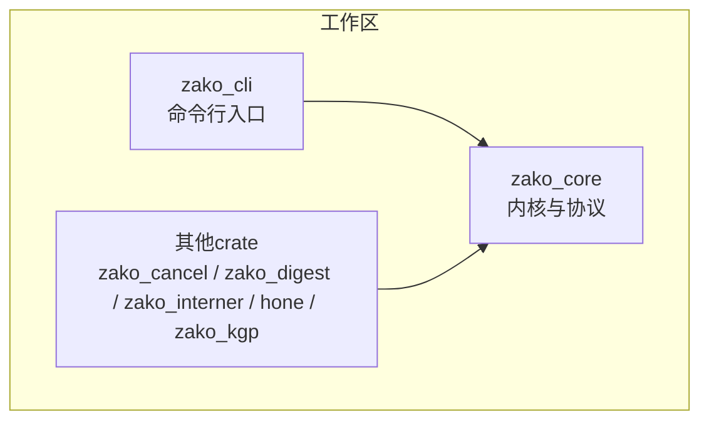
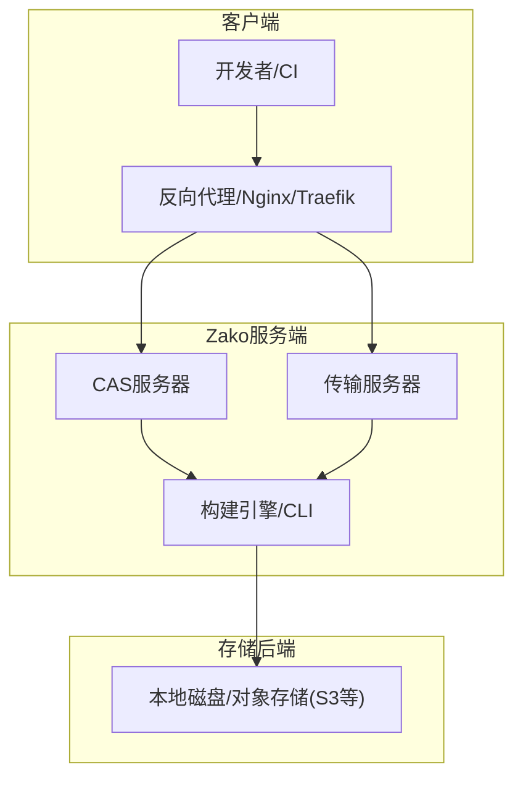
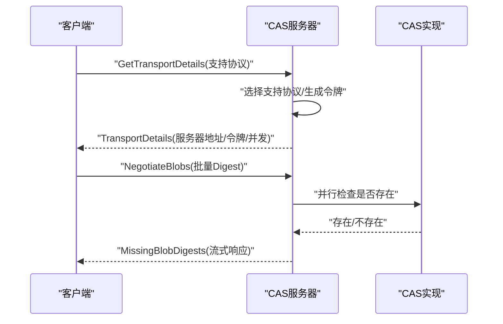
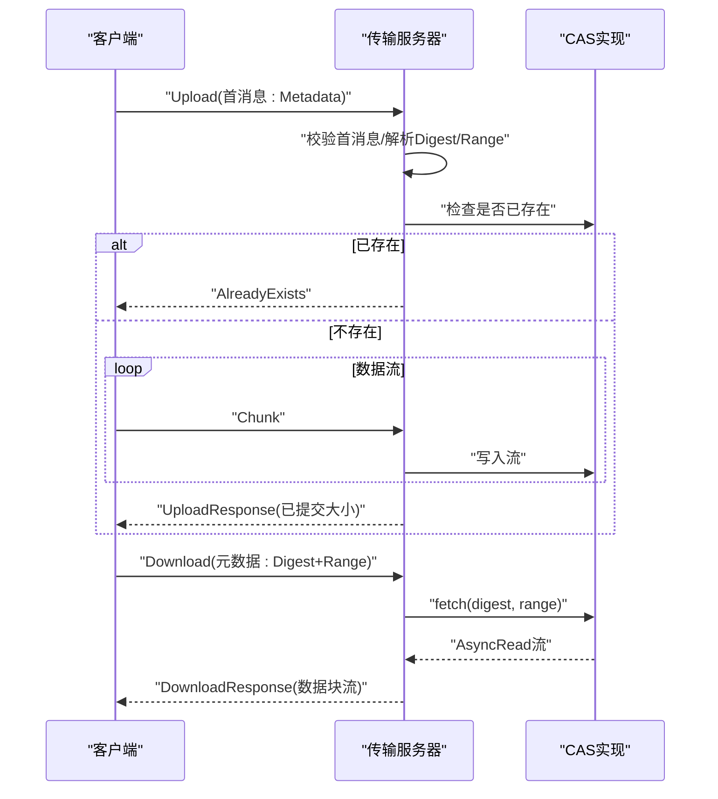
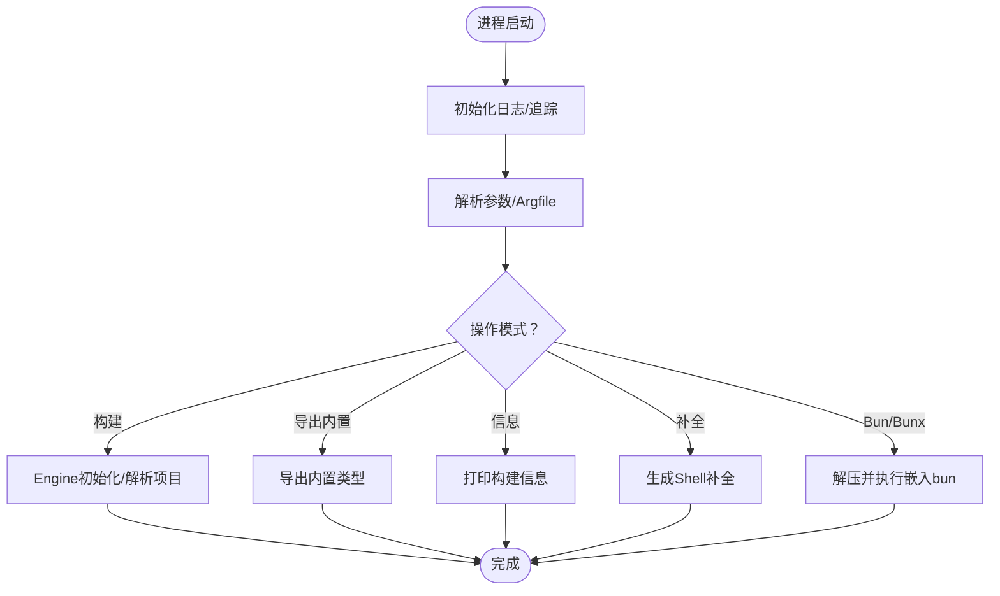
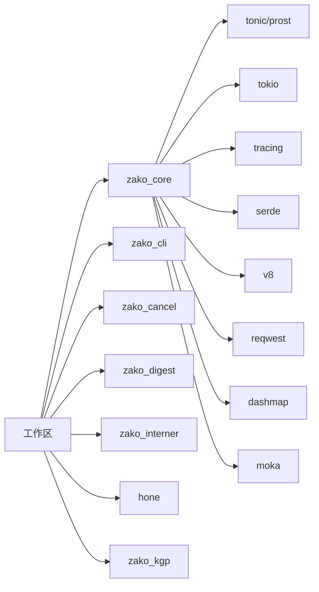

# 生产部署

<cite>
**本文引用的文件**
- [Cargo.toml](file://Cargo.toml)
- [README.md](file://README.md)
- [ARCHITECTURE.md](file://ARCHITECTURE.md)
- [zako_cli/src/main.rs](file://zako_cli/src/main.rs)
- [zako_core/src/lib.rs](file://zako_core/src/lib.rs)
- [zako_core/src/cas.rs](file://zako_core/src/cas.rs)
- [zako_core/src/cas_server.rs](file://zako_core/src/cas_server.rs)
- [zako_core/src/transport_server.rs](file://zako_core/src/transport_server.rs)
- [zako_core/src/socket_address.rs](file://zako_core/src/socket_address.rs)
- [zako_core/src/config.rs](file://zako_core/src/config.rs)
- [build.json](file://build.json)
</cite>

## 目录
1. [简介](#简介)
2. [项目结构](#项目结构)
3. [核心组件](#核心组件)
4. [架构总览](#架构总览)
5. [详细组件分析](#详细组件分析)
6. [依赖关系分析](#依赖关系分析)
7. [性能考量](#性能考量)
8. [故障排查指南](#故障排查指南)
9. [结论](#结论)
10. [附录](#附录)

## 简介
本指南面向系统管理员与DevOps工程师，提供Zako在生产环境中的完整部署方案。内容涵盖服务器环境准备、依赖安装、配置文件设置、启动流程、CAS服务器与传输服务器配置、网络拓扑设计、负载均衡与SSL、反向代理、以及常见问题排查。同时给出Linux发行版兼容性、Docker容器化与Kubernetes集群部署思路，帮助您安全、稳定地交付Zako构建系统。

## 项目结构
Zako采用多crate工作区，核心能力集中在zako_core，CLI入口在zako_cli。CAS与传输服务由zako_core提供，CLI负责解析参数、初始化运行时并触发引擎计算。

图表来源
- [Cargo.toml](file://Cargo.toml#L11-L22)
- [zako_cli/src/main.rs](file://zako_cli/src/main.rs#L25-L27)

章节来源
- [Cargo.toml](file://Cargo.toml#L11-L22)
- [zako_cli/src/main.rs](file://zako_cli/src/main.rs#L25-L27)

## 核心组件
- CAS接口与错误类型：定义内容寻址存储的统一接口与错误语义，支撑远程缓存与一致性。
- CAS服务器：基于gRPC提供协商与传输细节，生成认证令牌与推荐并发。
- 传输服务器：提供上传/下载流式传输，支持范围读取与错误映射。
- CLI主程序：解析参数、设置日志与追踪、按需解压嵌入二进制、执行构建或导出内置类型等。

章节来源
- [zako_core/src/cas.rs](file://zako_core/src/cas.rs#L9-L44)
- [zako_core/src/cas_server.rs](file://zako_core/src/cas_server.rs#L15-L56)
- [zako_core/src/transport_server.rs](file://zako_core/src/transport_server.rs#L13-L22)
- [zako_cli/src/main.rs](file://zako_cli/src/main.rs#L29-L32)

## 架构总览
Zako的生产部署围绕“内容寻址存储(CAS)”与“传输协议”展开。CAS服务器负责协商与鉴权，传输服务器负责数据的上传/下载流式传输。CLI作为入口，负责初始化运行时与触发构建。

图表来源
- [zako_core/src/cas_server.rs](file://zako_core/src/cas_server.rs#L59-L148)
- [zako_core/src/transport_server.rs](file://zako_core/src/transport_server.rs#L24-L137)
- [zako_core/src/cas.rs](file://zako_core/src/cas.rs#L9-L44)

## 详细组件分析

### CAS服务器
- 功能要点
  - 协商缺失的blob列表，支持流式请求。
  - 返回传输详情（支持协议、服务器地址、认证令牌、推荐并发）。
  - 使用UUID生成一次性令牌，便于鉴权与审计。
- 并发与I/O
  - 通过buffered_io_count与recommended_concurrency控制并发度，适配CPU核心数。
- 错误处理
  - 对不支持的传输协议返回预条件失败；对Digest转换错误映射为gRPC状态码。

图表来源
- [zako_core/src/cas_server.rs](file://zako_core/src/cas_server.rs#L64-L147)

章节来源
- [zako_core/src/cas_server.rs](file://zako_core/src/cas_server.rs#L15-L56)
- [zako_core/src/cas_server.rs](file://zako_core/src/cas_server.rs#L64-L147)

### 传输服务器
- 功能要点
  - 下载：根据Digest+Range返回流式数据。
  - 上传：首消息必须为Metadata，后续为Chunk流，内部累计提交大小。
- 错误处理
  - 对缺失必需字段、Digest/Range解析失败、已存在、索引越界等情况映射为gRPC状态码。
- 性能特性
  - 使用tokio流与ReaderStream，支持大文件分块传输。

图表来源
- [zako_core/src/transport_server.rs](file://zako_core/src/transport_server.rs#L70-L136)

章节来源
- [zako_core/src/transport_server.rs](file://zako_core/src/transport_server.rs#L24-L137)

### CLI与运行时
- 启动流程
  - 初始化日志与OpenTelemetry追踪。
  - 解析参数与argfile，支持静默模式与颜色控制。
  - 按需解压嵌入的bun二进制并执行。
  - 提供信息打印、补全生成、导出内置类型等功能。
- 并发与资源
  - 支持通过参数设置并发度，默认使用CPU核心数。
- 错误与回溯
  - 统一panic钩子与color-eyre错误报告，支持RUST_BACKTRACE等环境变量。

图表来源
- [zako_cli/src/main.rs](file://zako_cli/src/main.rs#L501-L622)

章节来源
- [zako_cli/src/main.rs](file://zako_cli/src/main.rs#L501-L622)

### 配置与环境
- 配置模型
  - Configuration为不可变原始配置，ResolvedConfiguration为intern后的构建图可用配置。
  - 支持模板代码生成与键解析。
- 环境变量
  - 构建常量包含环境变量映射结构，可用于注入平台/工具链信息。
- 配置文件
  - 仓库未提供默认配置文件，建议在项目根目录按约定放置配置文件，并通过CLI或引擎解析。

章节来源
- [zako_core/src/config.rs](file://zako_core/src/config.rs#L14-L72)
- [zako_core/src/lib.rs](file://zako_core/src/lib.rs#L34-L78)

## 依赖关系分析
- 工作区与成员
  - 工作区包含zako_core、zako_cli、zako_cancel、zako_digest、zako_interner、hone、zako_kgp等成员crate。
- 关键外部依赖
  - gRPC/tonic、tokio、tracing、serde、v8、reqwest、dashmap、moka、prost等。
- 构建选项
  - 通过build.json传递编译器选项，如启用标准库构建等。

图表来源
- [Cargo.toml](file://Cargo.toml#L11-L22)
- [Cargo.toml](file://Cargo.toml#L38-L280)
- [build.json](file://build.json#L1-L9)

章节来源
- [Cargo.toml](file://Cargo.toml#L11-L22)
- [build.json](file://build.json#L1-L9)

## 性能考量
- 并发与I/O
  - CAS服务器的buffered_io_count与recommended_concurrency应与CPU核心数匹配，避免过度并发导致上下文切换开销。
  - 传输服务器使用流式读写，适合大文件；建议结合网络带宽与磁盘吞吐调优。
- 内存与分配
  - 全局使用mimalloc分配器，有助于降低碎片与提升多线程场景下的吞吐。
- 日志与追踪
  - 启用层级化日志与OpenTelemetry追踪，便于定位热点与异常。
- 构建配置
  - 发布配置开启LTO与单代码生成单元，有利于减小体积与提升运行时性能。

章节来源
- [zako_core/src/cas_server.rs](file://zako_core/src/cas_server.rs#L23-L34)
- [zako_cli/src/main.rs](file://zako_cli/src/main.rs#L29-L31)
- [Cargo.toml](file://Cargo.toml#L301-L312)

## 故障排查指南
- 端口冲突
  - CAS与传输服务监听地址需与系统占用隔离；建议使用非特权端口并在反向代理后暴露。
- 权限问题
  - 传输服务器在上传时需要写入CAS后端；确保服务账户对存储路径具备读写权限。
- 依赖版本不匹配
  - gRPC/tonic、tokio、v8等版本需与工程约束一致；发布构建时遵循工作区锁定版本。
- 认证与令牌
  - CAS服务器生成的令牌用于鉴权；若出现“无支持传输协议”错误，请确认客户端仅请求受支持协议。
- 下载/上传错误
  - 上传首消息必须为Metadata；Digest/Range解析失败会返回无效参数；已存在与索引越界有明确的错误码映射。
- 日志与回溯
  - 设置RUST_BACKTRACE/RUST_LIB_BACKTRACE/RUST_SPANTRACE以增强诊断；CLI提供信息打印命令输出构建元数据。

章节来源
- [zako_core/src/cas_server.rs](file://zako_core/src/cas_server.rs#L114-L147)
- [zako_core/src/transport_server.rs](file://zako_core/src/transport_server.rs#L70-L136)
- [zako_cli/src/main.rs](file://zako_cli/src/main.rs#L452-L499)
- [zako_cli/src/main.rs](file://zako_cli/src/main.rs#L395-L450)

## 结论
Zako的生产部署以内容寻址存储为核心，通过CAS与传输服务器提供高效的远程缓存与数据传输能力。配合CLI的参数化与日志追踪，可在多平台与云环境中实现稳定、可观测的构建交付。建议在生产中结合反向代理、负载均衡与SSL终止，确保安全性与高可用。

## 附录

### 服务器环境准备与依赖安装
- 操作系统与发行版
  - Linux发行版兼容性取决于Rust工具链与系统库；建议使用较新的稳定版。
- 必备依赖
  - Rust工具链（稳定通道）、构建工具（如cargo）、网络栈与TLS支持。
- 可选依赖
  - 反向代理（Nginx/Traefik）、负载均衡器、对象存储SDK（如S3）。

章节来源
- [README.md](file://README.md#L15-L17)
- [Cargo.toml](file://Cargo.toml#L38-L280)

### 配置文件与环境变量
- 配置文件位置与命名
  - 仓库未提供默认配置文件；建议在项目根目录按约定放置配置文件并通过CLI或引擎解析。
- 环境变量
  - 构建常量包含环境变量映射结构；可通过环境注入平台/工具链信息。
- 配置模板
  - 可使用配置生成模板代码功能输出初始配置样例。

章节来源
- [zako_core/src/config.rs](file://zako_core/src/config.rs#L31-L39)
- [zako_core/src/config.rs](file://zako_core/src/config.rs#L101-L117)
- [zako_core/src/lib.rs](file://zako_core/src/lib.rs#L34-L78)

### 启动流程与参数
- CLI主要子命令
  - make：构建项目，支持指定项目文件与沙箱目录，可设置并发度。
  - export-builtin：导出内置TypeScript变量到文件或标准输出。
  - information：打印构建信息（版本、分支、提交、构建时间等）。
  - generate-complete：生成Shell补全文件。
  - bun/bunx：执行bun命令，CLI会解压嵌入的bun二进制。
- 关键参数
  - --directory：变更工作目录。
  - --silent：静默输出。
  - --backtrace：启用详细回溯。
  - make --concurrency：设置并发度（默认使用CPU核心数）。

章节来源
- [zako_cli/src/main.rs](file://zako_cli/src/main.rs#L123-L131)
- [zako_cli/src/main.rs](file://zako_cli/src/main.rs#L295-L310)
- [zako_cli/src/main.rs](file://zako_cli/src/main.rs#L270-L293)
- [zako_cli/src/main.rs](file://zako_cli/src/main.rs#L392-L450)
- [zako_cli/src/main.rs](file://zako_cli/src/main.rs#L344-L388)
- [zako_cli/src/main.rs](file://zako_cli/src/main.rs#L223-L246)

### CAS与传输服务器配置
- CAS服务器
  - 通过CasServerOptions配置CAS实例、监听地址、缓冲I/O数量与推荐并发。
  - 协商缺失blob时使用并行流式检查，提高吞吐。
- 传输服务器
  - 上传：首消息Metadata必填；后续Chunk流写入CAS；返回已提交大小。
  - 下载：按Digest+Range返回流式数据；错误映射清晰。
- 地址与协议
  - SocketAddress支持IPv4/IPv6；当前仅支持gRPC协议。

章节来源
- [zako_core/src/cas_server.rs](file://zako_core/src/cas_server.rs#L15-L56)
- [zako_core/src/cas_server.rs](file://zako_core/src/cas_server.rs#L64-L147)
- [zako_core/src/transport_server.rs](file://zako_core/src/transport_server.rs#L24-L137)
- [zako_core/src/socket_address.rs](file://zako_core/src/socket_address.rs#L1-L26)

### 网络拓扑与负载均衡
- 推荐拓扑
  - 反向代理（Nginx/Traefik）负责SSL终止、健康检查与路由。
  - CAS与传输服务后端可横向扩展，使用共享存储或对象存储。
- 负载均衡
  - 建议使用四层/七层负载均衡器，结合健康检查与会话亲和策略。
- SSL证书
  - 在反向代理层配置证书与TLS策略，确保gRPC/HTTP流量加密。

章节来源
- [zako_core/src/cas_server.rs](file://zako_core/src/cas_server.rs#L114-L147)
- [zako_core/src/transport_server.rs](file://zako_core/src/transport_server.rs#L24-L68)

### Docker容器化部署
- 构建镜像
  - 基于Rust官方镜像构建二进制，复制至精简基础镜像（如Alpine）。
- 容器参数
  - 暴露CAS与传输服务端口，挂载持久化卷用于CAS存储。
  - 设置环境变量（如RUST_BACKTRACE、RUST_SPANTRACE）以便调试。
- 健康检查
  - 通过反向代理或容器探针进行健康检查，确保服务可用。

章节来源
- [zako_cli/src/main.rs](file://zako_cli/src/main.rs#L133-L221)
- [Cargo.toml](file://Cargo.toml#L301-L312)

### Kubernetes集群部署
- Deployment/Service
  - 使用Deployment运行CAS与传输服务Pod，Service暴露ClusterIP或LoadBalancer。
- 存储
  - 使用PersistentVolume（本地或云盘）挂载CAS存储目录。
- Ingress/网关
  - 通过Ingress或Service Mesh（如Istio）配置TLS与路由规则。
- 可观测性
  - 集成OpenTelemetry与日志收集，采集tracing与指标。

章节来源
- [zako_core/src/cas_server.rs](file://zako_core/src/cas_server.rs#L59-L148)
- [zako_core/src/transport_server.rs](file://zako_core/src/transport_server.rs#L24-L137)

### 构建与发布
- 构建选项
  - 通过build.json传递编译器选项，如启用标准库构建。
- 发布配置
  - 发布配置启用LTO与单代码生成单元，利于运行时性能与包体大小。

章节来源
- [build.json](file://build.json#L1-L9)
- [Cargo.toml](file://Cargo.toml#L301-L312)