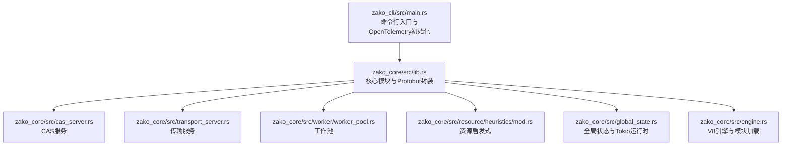
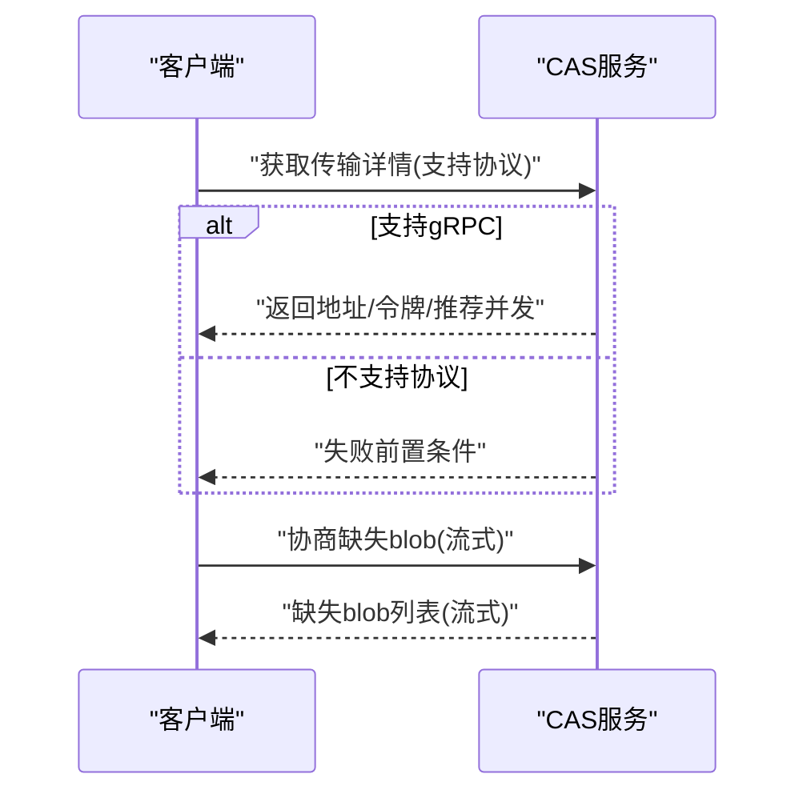
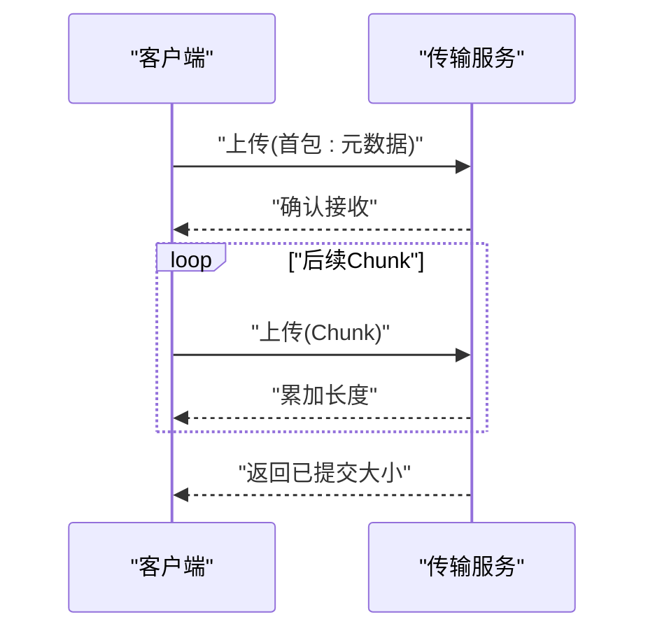
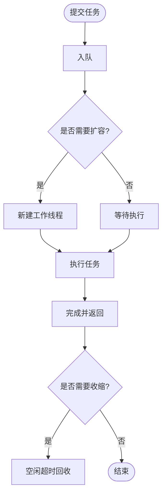
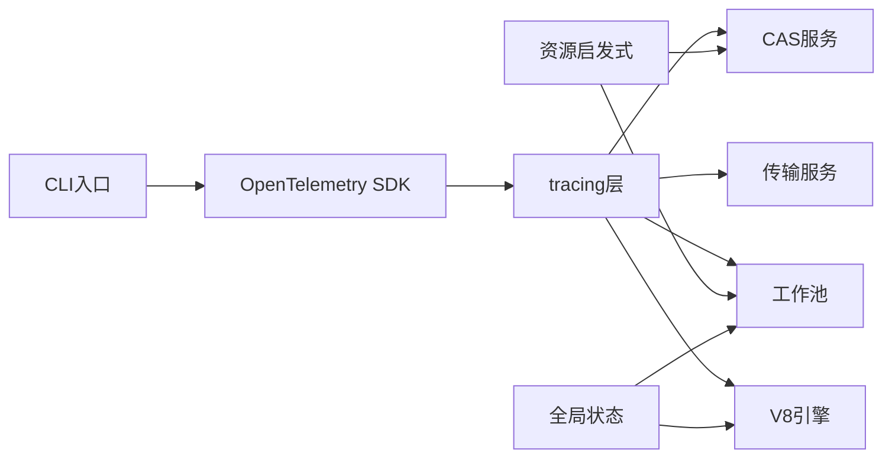

# 监控配置

<cite>
**本文引用的文件**
- [Cargo.toml](file://Cargo.toml)
- [ARCHITECTURE.md](file://ARCHITECTURE.md)
- [zako_core/src/lib.rs](file://zako_core/src/lib.rs)
- [zako_core/src/cas_server.rs](file://zako_core/src/cas_server.rs)
- [zako_core/src/transport_server.rs](file://zako_core/src/transport_server.rs)
- [zako_core/src/worker/worker_pool.rs](file://zako_core/src/worker/worker_pool.rs)
- [zako_core/src/resource/heuristics/mod.rs](file://zako_core/src/resource/heuristics/mod.rs)
- [zako_core/src/global_state.rs](file://zako_core/src/global_state.rs)
- [zako_core/src/engine.rs](file://zako_core/src/engine.rs)
- [zako_cli/src/main.rs](file://zako_cli/src/main.rs)
</cite>

## 目录
1. [简介](#简介)
2. [项目结构](#项目结构)
3. [核心组件](#核心组件)
4. [架构总览](#架构总览)
5. [详细组件分析](#详细组件分析)
6. [依赖关系分析](#依赖关系分析)
7. [性能考量](#性能考量)
8. [故障排查指南](#故障排查指南)
9. [结论](#结论)
10. [附录](#附录)

## 简介
本指南面向SRE与运维团队，围绕Zako监控系统提供一套可落地的配置方案，涵盖性能指标监控、健康检查、告警规则、CAS服务器监控、传输服务器性能监控、工作池状态监控，并结合OpenTelemetry与Prometheus/Grafana生态给出集成思路与最佳实践。文档同时解释关键指标（构建时间、缓存命中率、内存使用、CPU利用率）的采集与观测方法，帮助团队建立稳定、可观测的构建基础设施。

## 项目结构
Zako采用多crate架构，核心能力集中在zako_core，CLI入口在zako_cli，监控与可观测性通过tracing与OpenTelemetry集成。关键模块包括：
- CAS服务与传输服务：提供内容寻址存储与上传下载能力
- 工作池：管理V8与OXC等任务执行线程池
- 资源启发式：根据系统资源自动推导并发与缓存参数
- 全局状态：初始化Tokio运行时、工作池与资源池
- 引擎：V8运行时与模块加载，支持执行脚本与可观测性追踪



**图表来源**
- [zako_cli/src/main.rs](file://zako_cli/src/main.rs#L501-L519)
- [zako_core/src/lib.rs](file://zako_core/src/lib.rs#L98-L118)
- [zako_core/src/cas_server.rs](file://zako_core/src/cas_server.rs#L1-L149)
- [zako_core/src/transport_server.rs](file://zako_core/src/transport_server.rs#L1-L138)
- [zako_core/src/worker/worker_pool.rs](file://zako_core/src/worker/worker_pool.rs#L1-L185)
- [zako_core/src/resource/heuristics/mod.rs](file://zako_core/src/resource/heuristics/mod.rs#L1-L66)
- [zako_core/src/global_state.rs](file://zako_core/src/global_state.rs#L1-L38)
- [zako_core/src/engine.rs](file://zako_core/src/engine.rs#L1-L306)

**章节来源**
- [Cargo.toml](file://Cargo.toml#L11-L22)
- [ARCHITECTURE.md](file://ARCHITECTURE.md#L16-L27)
- [zako_core/src/lib.rs](file://zako_core/src/lib.rs#L98-L118)

## 核心组件
- CAS服务：提供协商缺失blob、获取传输详情等gRPC接口，支持认证令牌与并发推荐
- 传输服务：提供上传/下载流式接口，支持按范围读取与错误映射
- 工作池：基于线程池的任务提交与生命周期管理，支持空闲回收与GC广播
- 资源启发式：根据系统内存/CPU推导CAS缓存大小、TTL、并发线程数等
- 全局状态：初始化Tokio运行时、工作池与资源池，统一管理全局对象
- 引擎：V8运行时与模块加载，支持执行脚本与可观测性追踪

**章节来源**
- [zako_core/src/cas_server.rs](file://zako_core/src/cas_server.rs#L15-L56)
- [zako_core/src/transport_server.rs](file://zako_core/src/transport_server.rs#L13-L22)
- [zako_core/src/worker/worker_pool.rs](file://zako_core/src/worker/worker_pool.rs#L27-L42)
- [zako_core/src/resource/heuristics/mod.rs](file://zako_core/src/resource/heuristics/mod.rs#L11-L49)
- [zako_core/src/global_state.rs](file://zako_core/src/global_state.rs#L6-L21)
- [zako_core/src/engine.rs](file://zako_core/src/engine.rs#L34-L45)

## 架构总览
下图展示Zako监控相关组件的交互关系，以及与外部可观测性栈的对接点。

```mermaid
graph TB
subgraph "Zako内核"
CAS["CAS服务"]
TRANS["传输服务"]
WORKER["工作池"]
HEUR["资源启发式"]
GS["全局状态"]
ENG["V8引擎"]
end
subgraph "可观测性"
OT["OpenTelemetry SDK"]
TR["tracing层"]
PROM["Prometheus 抓取端点"]
GRAF["Grafana 仪表板"]
end
CLI["CLI入口"] --> OT
OT --> TR
TR --> CAS
TR --> TRANS
TR --> WORKER
TR --> ENG
PROM <- --> OT
GRAF --> PROM
```

**图表来源**
- [zako_cli/src/main.rs](file://zako_cli/src/main.rs#L501-L519)
- [zako_core/src/cas_server.rs](file://zako_core/src/cas_server.rs#L59-L148)
- [zako_core/src/transport_server.rs](file://zako_core/src/transport_server.rs#L24-L137)
- [zako_core/src/worker/worker_pool.rs](file://zako_core/src/worker/worker_pool.rs#L56-L184)
- [zako_core/src/engine.rs](file://zako_core/src/engine.rs#L81-L300)

## 详细组件分析

### CAS服务器监控
- 监控要点
  - 传输协议协商成功率与错误类型
  - 并发连接数与令牌发放情况
  - Blob协商缺失率（用于评估缓存命中）
- 关键指标建议
  - gRPC请求计数与错误码分布
  - 协商缺失比例 = 缺失blob数 / 请求总blob数
  - 推荐并发度与实际并发度对比
- 健康检查
  - 对外暴露健康探针，定期调用获取传输详情接口
  - 检查支持协议列表是否包含gRPC
- 告警规则模板
  - 协商缺失比例持续高于阈值
  - 传输详情接口错误率上升
  - 并发连接数异常波动



**图表来源**
- [zako_core/src/cas_server.rs](file://zako_core/src/cas_server.rs#L114-L148)
- [zako_core/src/cas_server.rs](file://zako_core/src/cas_server.rs#L64-L112)

**章节来源**
- [zako_core/src/cas_server.rs](file://zako_core/src/cas_server.rs#L114-L148)
- [zako_core/src/cas_server.rs](file://zako_core/src/cas_server.rs#L64-L112)

### 传输服务器性能监控
- 监控要点
  - 下载/上传吞吐量与延迟
  - 流式传输的背压与错误
  - 范围读取与完整性校验
- 关键指标建议
  - 上传/下载字节数、速率、P95/P99延迟
  - Chunk大小分布与错误类型统计
  - 已存在Blob拒绝率
- 健康检查
  - 下载指定digest的片段，验证完整性
  - 上传小文件并立即校验
- 告警规则模板
  - 上传/下载失败率升高
  - 延迟P95/P99超阈值
  - Chunk错误占比异常



**图表来源**
- [zako_core/src/transport_server.rs](file://zako_core/src/transport_server.rs#L70-L136)

**章节来源**
- [zako_core/src/transport_server.rs](file://zako_core/src/transport_server.rs#L70-L136)

### 工作池状态监控
- 监控要点
  - 活跃线程数、队列积压、空闲回收
  - GC广播频率与执行耗时
  - 任务提交与完成耗时
- 关键指标建议
  - 当前活跃线程数、最小/最大线程数
  - 队列长度、等待时间
  - 空闲超时触发次数、GC执行次数
- 健康检查
  - 提交简单任务并等待完成，观察耗时
  - 触发GC广播，检查清理效果
- 告警规则模板
  - 队列积压持续增长
  - 空闲超时频繁触发
  - GC执行耗时异常



**图表来源**
- [zako_core/src/worker/worker_pool.rs](file://zako_core/src/worker/worker_pool.rs#L121-L138)
- [zako_core/src/worker/worker_pool.rs](file://zako_core/src/worker/worker_pool.rs#L156-L178)

**章节来源**
- [zako_core/src/worker/worker_pool.rs](file://zako_core/src/worker/worker_pool.rs#L56-L184)

### 资源启发式与并发策略
- 监控要点
  - 内存缓存容量、TTL/TTI
  - V8/OXC工作线程数与栈大小
  - 本地CAS路径与磁盘空间
- 关键指标建议
  - CAS内存缓存命中率（需结合存储后端指标）
  - 线程池利用率、上下文切换开销
  - 磁盘IO与缓存目录占用
- 健康检查
  - 读取系统内存/CPU核数，验证推导值合理
  - 启动后检查工作池配置是否生效
- 告警规则模板
  - 内存缓存容量过小导致命中率低
  - 线程数不足导致队列积压
  - 磁盘空间不足

**章节来源**
- [zako_core/src/resource/heuristics/mod.rs](file://zako_core/src/resource/heuristics/mod.rs#L11-L65)
- [zako_core/src/global_state.rs](file://zako_core/src/global_state.rs#L6-L21)

### V8引擎与执行追踪
- 监控要点
  - 模块加载与执行耗时
  - 上下文执行JSON输入转换开销
  - 异常捕获与错误传播
- 关键指标建议
  - 模块执行P95/P99耗时
  - JSON输入转换耗时分布
  - 异常发生率与类型分布
- 健康检查
  - 执行简单模块并验证返回
  - 注入executionContext并验证转换
- 告警规则模板
  - 模块执行耗时异常升高
  - JSON转换失败率上升
  - 异常数量激增

**章节来源**
- [zako_core/src/engine.rs](file://zako_core/src/engine.rs#L81-L300)

## 依赖关系分析
- 组件耦合
  - CLI通过OpenTelemetry初始化tracing，贯穿CAS/传输/工作池/引擎
  - 资源启发式为工作池与CAS缓存提供配置依据
  - 全局状态统一初始化Tokio运行时与资源池
- 外部依赖
  - OpenTelemetry SDK与tracing-opentelemetry用于链路追踪与日志
  - sysinfo用于系统资源检测
  - tokio、tonic、dashmap等支撑异步与gRPC



**图表来源**
- [zako_cli/src/main.rs](file://zako_cli/src/main.rs#L501-L519)
- [zako_core/src/resource/heuristics/mod.rs](file://zako_core/src/resource/heuristics/mod.rs#L11-L49)
- [zako_core/src/global_state.rs](file://zako_core/src/global_state.rs#L6-L21)

**章节来源**
- [Cargo.toml](file://Cargo.toml#L88-L91)
- [Cargo.toml](file://Cargo.toml#L274)

## 性能考量
- CPU与内存
  - 使用sysinfo推导V8线程数，避免过度并发导致上下文切换开销
  - CAS内存缓存按总内存的固定比例分配，并限制上下限
- I/O与并发
  - 传输服务使用流式读写，结合原子计数统计已提交大小
  - CAS协商使用并行检查，缓冲数量与CPU核数匹配
- 资源回收
  - 工作池基于空闲超时回收线程，减少闲置资源占用
  - GC广播用于清理长生命周期对象

**章节来源**
- [zako_core/src/resource/heuristics/mod.rs](file://zako_core/src/resource/heuristics/mod.rs#L11-L49)
- [zako_core/src/transport_server.rs](file://zako_core/src/transport_server.rs#L107-L135)
- [zako_core/src/cas_server.rs](file://zako_core/src/cas_server.rs#L72-L95)
- [zako_core/src/worker/worker_pool.rs](file://zako_core/src/worker/worker_pool.rs#L84-L118)

## 故障排查指南
- 常见问题定位
  - gRPC协议不匹配：检查传输详情接口返回的支持协议列表
  - 上传失败：确认首包为元数据、范围不支持、目标已存在等情况
  - 工作池无响应：检查队列积压、空闲超时、GC广播是否正常
  - V8执行异常：查看模块加载与JSON转换错误
- 日志与追踪
  - CLI已启用OpenTelemetry与tracing，便于端到端追踪
  - 使用trace_span标注关键执行点，便于定位瓶颈
- 建议操作
  - 在问题复现时开启全量回溯变量，收集更详细的堆栈
  - 对比历史指标曲线，识别异常拐点

**章节来源**
- [zako_core/src/transport_server.rs](file://zako_core/src/transport_server.rs#L78-L101)
- [zako_core/src/cas_server.rs](file://zako_core/src/cas_server.rs#L120-L137)
- [zako_core/src/worker/worker_pool.rs](file://zako_core/src/worker/worker_pool.rs#L18-L25)
- [zako_core/src/engine.rs](file://zako_core/src/engine.rs#L86-L108)
- [zako_cli/src/main.rs](file://zako_cli/src/main.rs#L470-L499)

## 结论
通过将tracing与OpenTelemetry集成到Zako核心组件，结合Prometheus抓取与Grafana可视化，可以实现对CAS、传输、工作池与引擎的全链路可观测。配合资源启发式与并发策略，既能保障性能，又能维持稳定性。建议优先覆盖关键指标与告警，逐步完善仪表板与自动化运维流程。

## 附录

### Prometheus集成与Grafana仪表板配置
- 抓取端点
  - 将OpenTelemetry导出器配置为Prometheus格式，暴露HTTP端点供Prometheus抓取
- 指标命名建议
  - 命名空间遵循zako_v1，如zako_v1_cas_negotiate_missing_ratio、zako_v1_transport_upload_bytes_total
- Grafana仪表板
  - 创建面板展示关键指标趋势、P95/P99延迟、错误率与并发度
  - 添加告警规则面板，联动告警通道

[本节为概念性说明，无需“章节来源”]

### 自定义监控指标定义
- CAS相关
  - 协商缺失比例、传输详情成功率、并发连接数
- 传输相关
  - 上传/下载速率、延迟分布、Chunk错误率
- 工作池相关
  - 队列长度、活跃线程数、空闲超时次数、GC执行次数
- 引擎相关
  - 模块执行耗时、JSON转换耗时、异常发生率

[本节为概念性说明，无需“章节来源”]

### 告警规则模板
- 协商缺失比例持续高于阈值
- 传输详情接口错误率上升
- 上传/下载失败率升高
- 延迟P95/P99超阈值
- 队列积压持续增长
- 空闲超时频繁触发
- 模块执行耗时异常升高
- JSON转换失败率上升
- 异常数量激增

[本节为概念性说明，无需“章节来源”]

### 通知渠道配置
- 建议接入Slack、邮件、PagerDuty等通道
- 为不同严重级别设置不同静默窗口与升级策略

[本节为概念性说明，无需“章节来源”]