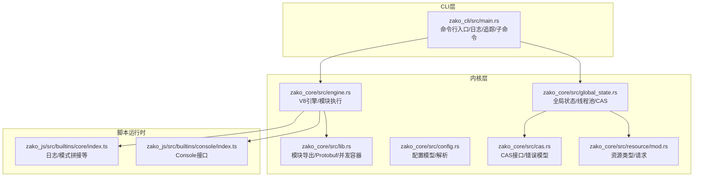
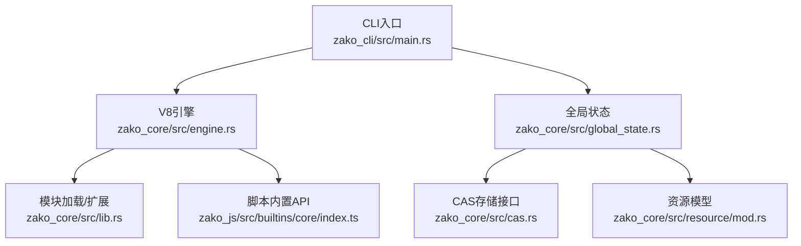
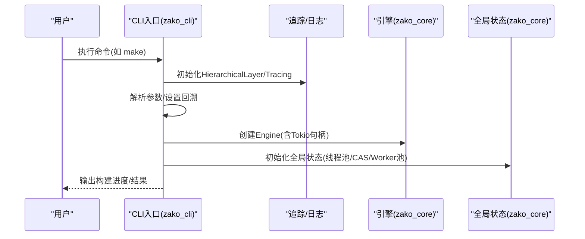
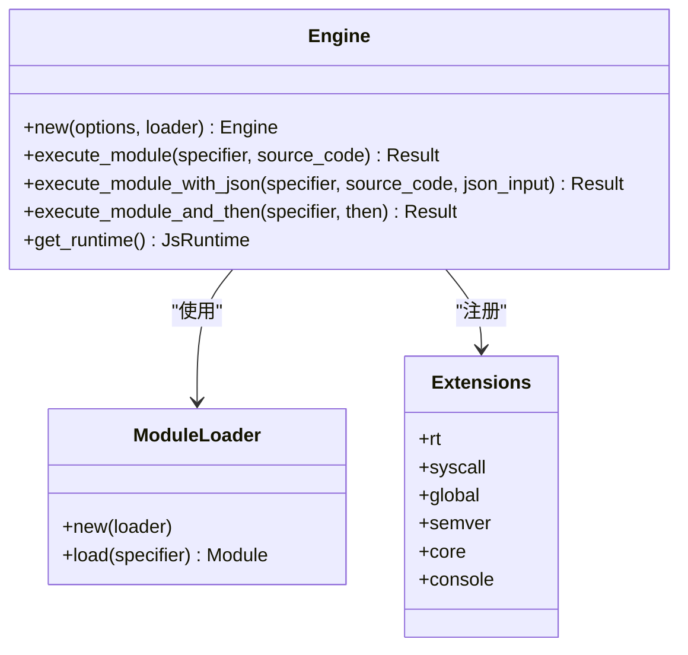
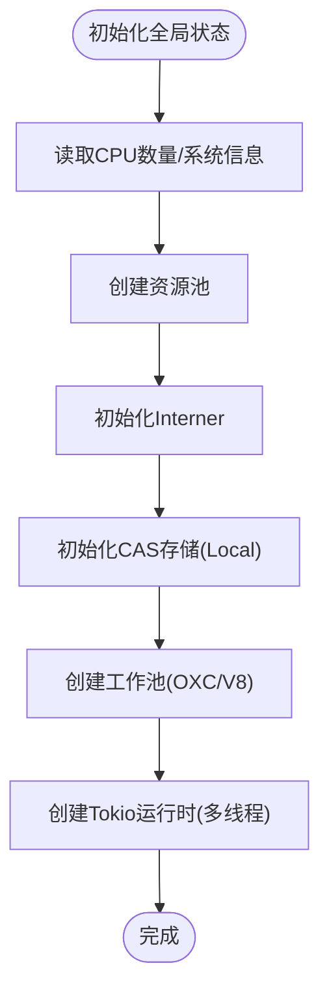
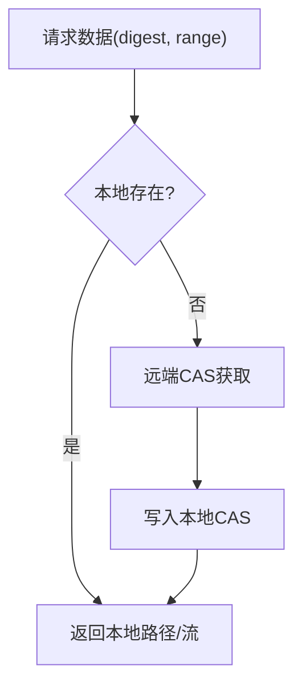
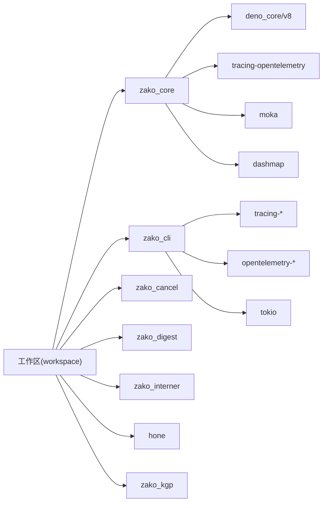

# 部署与运维

<cite>
**本文引用的文件**   
- [README.md](file://README.md)
- [ARCHITECTURE.md](file://ARCHITECTURE.md)
- [Cargo.toml](file://Cargo.toml)
- [build.json](file://build.json)
- [zako_cli/src/main.rs](file://zako_cli/src/main.rs)
- [zako_core/src/lib.rs](file://zako_core/src/lib.rs)
- [zako_core/src/engine.rs](file://zako_core/src/engine.rs)
- [zako_core/src/cas.rs](file://zako_core/src/cas.rs)
- [zako_core/src/config.rs](file://zako_core/src/config.rs)
- [zako_core/src/global_state.rs](file://zako_core/src/global_state.rs)
- [zako_core/src/resource/mod.rs](file://zako_core/src/resource/mod.rs)
- [zako_js/src/builtins/core/index.ts](file://zako_js/src/builtins/core/index.ts)
- [zako_js/src/builtins/console/index.ts](file://zako_js/src/builtins/console/index.ts)
- [tests/log_version/BUILD.ts](file://tests/log_version/BUILD.ts)
</cite>

## 目录
1. [简介](#简介)
2. [项目结构](#项目结构)
3. [核心组件](#核心组件)
4. [架构总览](#架构总览)
5. [详细组件分析](#详细组件分析)
6. [依赖关系分析](#依赖关系分析)
7. [性能考量](#性能考量)
8. [故障排除指南](#故障排除指南)
9. [结论](#结论)
10. [附录](#附录)

## 简介
本指南面向DevOps工程师与系统管理员，围绕Zako构建系统的生产部署与运维展开，覆盖生产部署流程、监控与日志、高可用与灾难恢复、容器化与Kubernetes集成、云平台适配、常见问题排查、性能调优与安全加固等主题。文档基于仓库中的源码与架构说明，提供可落地的实践建议与可视化图示。

## 项目结构
Zako采用多Crate工作区组织，核心由CLI、内核、调度引擎、脚本运行时、内容寻址存储（CAS）、类型绑定与资源管理等模块构成。CLI负责命令行交互与日志/追踪初始化；内核负责V8运行时、模块加载、CAS协议与沙盒执行；调度引擎负责任务建模与增量计算；JS内置库提供构建脚本API；资源模块提供系统资源估算与线程栈大小等启发式配置。

图表来源
- [zako_cli/src/main.rs](file://zako_cli/src/main.rs#L501-L519)
- [zako_core/src/lib.rs](file://zako_core/src/lib.rs#L98-L118)
- [zako_core/src/engine.rs](file://zako_core/src/engine.rs#L47-L79)
- [zako_core/src/global_state.rs](file://zako_core/src/global_state.rs#L54-L97)
- [zako_core/src/cas.rs](file://zako_core/src/cas.rs#L9-L44)
- [zako_core/src/config.rs](file://zako_core/src/config.rs#L14-L72)
- [zako_core/src/resource/mod.rs](file://zako_core/src/resource/mod.rs#L11-L24)
- [zako_js/src/builtins/core/index.ts](file://zako_js/src/builtins/core/index.ts#L121-L138)
- [zako_js/src/builtins/console/index.ts](file://zako_js/src/builtins/console/index.ts#L2-L9)

章节来源
- [Cargo.toml](file://Cargo.toml#L11-L22)
- [ARCHITECTURE.md](file://ARCHITECTURE.md#L18-L27)

## 核心组件
- CLI与运行时初始化
  - CLI负责参数解析、颜色输出、缓冲日志、OpenTelemetry追踪层注入、Backtrace环境变量设置、子命令分发与执行。
  - 关键点：多线程Tokio运行时、Hierarchical日志层、OpenTelemetry追踪、panic钩子与color-eyre错误展示。
- 内核与V8引擎
  - 内核导出Protobuf命名空间与并发容器类型；引擎封装JsRuntime、模块加载器、扩展初始化、模块执行与JSON上下文注入。
- 全局状态与资源
  - 全局状态聚合Interner、资源池、CAS存储、Worker池（OXC/V8）、系统信息；根据CPU与系统信息推导线程栈大小。
- CAS与配置
  - CAS接口定义存储/检查/获取/本地路径查询；配置模型支持默认值、标签解析与序列化归档。
- 资源模型
  - 定义资源类型（磁盘IO/内存/处理器/网络/GPU/Other）与资源请求结构，支撑调度与资源估算。

章节来源
- [zako_cli/src/main.rs](file://zako_cli/src/main.rs#L501-L519)
- [zako_core/src/lib.rs](file://zako_core/src/lib.rs#L98-L118)
- [zako_core/src/engine.rs](file://zako_core/src/engine.rs#L47-L79)
- [zako_core/src/global_state.rs](file://zako_core/src/global_state.rs#L54-L97)
- [zako_core/src/cas.rs](file://zako_core/src/cas.rs#L9-L44)
- [zako_core/src/config.rs](file://zako_core/src/config.rs#L14-L72)
- [zako_core/src/resource/mod.rs](file://zako_core/src/resource/mod.rs#L11-L24)

## 架构总览
Zako采用“CLI入口 + 内核引擎 + 脚本运行时 + CAS存储”的分层架构。CLI负责用户交互与可观测性初始化；内核负责V8执行与模块加载；脚本运行时提供构建API；CAS提供内容寻址存储能力；全局状态协调资源与工作池。

图表来源
- [zako_cli/src/main.rs](file://zako_cli/src/main.rs#L501-L519)
- [zako_core/src/engine.rs](file://zako_core/src/engine.rs#L47-L79)
- [zako_core/src/lib.rs](file://zako_core/src/lib.rs#L98-L118)
- [zako_core/src/global_state.rs](file://zako_core/src/global_state.rs#L54-L97)
- [zako_core/src/cas.rs](file://zako_core/src/cas.rs#L9-L44)
- [zako_core/src/resource/mod.rs](file://zako_core/src/resource/mod.rs#L11-L24)
- [zako_js/src/builtins/core/index.ts](file://zako_js/src/builtins/core/index.ts#L121-L138)

## 详细组件分析

### CLI与运行时初始化（生产部署关键）
- 日志与追踪
  - 初始化OpenTelemetry TracerProvider与tracing-opentelemetry层，结合HierarchicalLayer输出到缓冲Writer，支持静默模式与彩色输出。
  - 后端可替换为其他tracing Subscriber或接入外部遥测系统。
- 错误与回溯
  - 设置RUST_BACKTRACE/RUST_LIB_BACKTRACE/RUST_SPANTRACE/COLORBT_SHOW_HIDDEN；安装color-eyre与panic钩子，统一错误输出与崩溃报告。
- 子命令与执行
  - 解析子命令（如make、export-builtin、generate-complete、bun/bunx），并按需启动Tokio运行时与工程解析流程。
- 并发与沙箱
  - make命令支持并发度参数，默认使用CPU核心数；支持指定沙箱目录与项目脚本文件。

图表来源
- [zako_cli/src/main.rs](file://zako_cli/src/main.rs#L501-L519)
- [zako_core/src/engine.rs](file://zako_core/src/engine.rs#L47-L79)
- [zako_core/src/global_state.rs](file://zako_core/src/global_state.rs#L54-L97)

章节来源
- [zako_cli/src/main.rs](file://zako_cli/src/main.rs#L501-L519)
- [zako_cli/src/main.rs](file://zako_cli/src/main.rs#L610-L622)

### V8引擎与模块执行（脚本运行时）
- 引擎初始化
  - 注入扩展（rt/syscall/global/semver/core/console），设置V8平台与模块加载器，支持从代码或文件加载主模块。
- 模块执行
  - 支持执行模块并返回命名空间对象；支持注入executionContext JSON上下文；提供异常转换与错误处理。
- 与脚本API协作
  - 脚本内置API提供trace/debug/info/warn/error等日志方法，底层通过syscall.log转发至运行时。

图表来源
- [zako_core/src/engine.rs](file://zako_core/src/engine.rs#L47-L79)
- [zako_core/src/engine.rs](file://zako_core/src/engine.rs#L81-L109)
- [zako_core/src/engine.rs](file://zako_core/src/engine.rs#L111-L166)
- [zako_core/src/engine.rs](file://zako_core/src/engine.rs#L168-L300)

章节来源
- [zako_core/src/engine.rs](file://zako_core/src/engine.rs#L47-L79)
- [zako_core/src/engine.rs](file://zako_core/src/engine.rs#L81-L109)
- [zako_core/src/engine.rs](file://zako_core/src/engine.rs#L111-L166)
- [zako_core/src/engine.rs](file://zako_core/src/engine.rs#L168-L300)
- [zako_js/src/builtins/core/index.ts](file://zako_js/src/builtins/core/index.ts#L121-L138)

### 全局状态与资源（高可用与性能基础）
- 全局状态
  - 统一管理Interner、资源池、包ID到路径映射、Tokio运行时、CAS存储、OXC/V8工作池；根据系统信息推导线程栈大小。
- 资源模型
  - 定义资源类型与请求结构，便于后续调度与资源估算。

图表来源
- [zako_core/src/global_state.rs](file://zako_core/src/global_state.rs#L54-L97)
- [zako_core/src/resource/mod.rs](file://zako_core/src/resource/mod.rs#L11-L24)

章节来源
- [zako_core/src/global_state.rs](file://zako_core/src/global_state.rs#L54-L97)
- [zako_core/src/resource/mod.rs](file://zako_core/src/resource/mod.rs#L11-L24)

### CAS接口（内容寻址存储与远端缓存）
- 接口职责
  - 存储、检查、获取、本地路径查询；支持范围读取与错误模型（IO/NotFound/Internal/索引越界）。
- 生产建议
  - 本地CAS配合远端CAS（如S3）实现热/冷分层；结合内容哈希实现去重与缓存命中率优化。

图表来源
- [zako_core/src/cas.rs](file://zako_core/src/cas.rs#L9-L44)

章节来源
- [zako_core/src/cas.rs](file://zako_core/src/cas.rs#L9-L44)

### 配置模型（模板生成与解析）
- 配置结构
  - 原始不可变配置与已解析内部配置；支持生成模板代码、标签解析与序列化归档。
- 使用场景
  - 在CI/CD中生成默认配置模板，结合项目脚本动态注入。

章节来源
- [zako_core/src/config.rs](file://zako_core/src/config.rs#L14-L72)
- [zako_core/src/config.rs](file://zako_core/src/config.rs#L80-L119)

### 脚本内置API（日志与模式拼接）
- 日志API
  - 提供trace/debug/info/warn/error等方法，底层通过syscall.log实现。
- 模式拼接
  - 提供appendPattern等工具函数，便于在构建脚本中拼接路径模式。

章节来源
- [zako_js/src/builtins/core/index.ts](file://zako_js/src/builtins/core/index.ts#L121-L138)
- [zako_js/src/builtins/console/index.ts](file://zako_js/src/builtins/console/index.ts#L2-L9)

## 依赖关系分析
- 工作区与成员
  - 工作区包含zako_core、zako_cli、zako_cancel、zako_digest、zako_interner、hone、zako_kgp等成员；默认成员为zako_core与zako_cli。
- 关键依赖
  - tracing/tracing-subscriber/tracing-opentelemetry用于日志与追踪；tokio用于异步运行时；deno_core/v8用于脚本执行；opentelemetry用于可观测性；moka/dashmap用于缓存与并发容器。
- 构建选项
  - dev/release/profile配置；构建选项包含颜色输出与标准库构建参数。

图表来源
- [Cargo.toml](file://Cargo.toml#L11-L22)
- [Cargo.toml](file://Cargo.toml#L38-L127)
- [Cargo.toml](file://Cargo.toml#L101-L106)
- [Cargo.toml](file://Cargo.toml#L301-L312)

章节来源
- [Cargo.toml](file://Cargo.toml#L11-L22)
- [Cargo.toml](file://Cargo.toml#L38-L127)
- [Cargo.toml](file://Cargo.toml#L301-L312)

## 性能考量
- 并发与线程
  - CLI默认并发度使用CPU核心数；全局状态根据CPU与系统信息设置Tokio线程栈大小，避免栈溢出。
- 内存分配
  - 使用mimalloc作为全局分配器，提升多线程下的内存吞吐。
- 缓存与去重
  - moka缓存与内容寻址存储结合，减少重复计算与I/O。
- I/O与网络
  - 资源模型区分磁盘IO/网络等资源类型，便于后续调度与限流。

章节来源
- [zako_cli/src/main.rs](file://zako_cli/src/main.rs#L313-L332)
- [zako_core/src/global_state.rs](file://zako_core/src/global_state.rs#L75-L79)
- [Cargo.toml](file://Cargo.toml#L29-L37)
- [Cargo.toml](file://Cargo.toml#L245-L245)

## 故障排除指南
- 日志与追踪
  - 启用RUST_BACKTRACE/RUST_LIB_BACKTRACE/RUST_SPANTRACE/COLORBT_SHOW_HIDDEN；通过color-eyre与panic钩子输出统一错误与崩溃信息。
- 常见问题定位
  - 参数解析失败：检查argfile与@响应文件格式；确认子命令与参数组合。
  - V8执行异常：查看executionContext注入与模块命名空间；检查异常转换与错误上下文。
  - CAS访问失败：确认digest合法性、范围越界与本地路径不可用场景。
- 调试技巧
  - 使用silent模式静默输出，结合缓冲日志定位问题；在CI中开启详细回溯以便复现。

章节来源
- [zako_cli/src/main.rs](file://zako_cli/src/main.rs#L452-L499)
- [zako_cli/src/main.rs](file://zako_cli/src/main.rs#L634-L712)
- [zako_core/src/engine.rs](file://zako_core/src/engine.rs#L111-L166)
- [zako_core/src/cas.rs](file://zako_core/src/cas.rs#L46-L62)

## 结论
Zako通过清晰的分层架构与强大的脚本运行时，为构建系统的生产部署提供了坚实基础。结合本文的部署流程、监控与日志、高可用与灾难恢复策略、容器化与Kubernetes集成建议以及故障排除与性能调优要点，可帮助团队在不同环境中稳定交付高质量的构建产物。

## 附录

### 生产部署流程（建议步骤）
- 环境准备
  - 安装Rust工具链与Cargo；准备Tokio运行时与系统资源（CPU/内存/磁盘）。
- 构建与发布
  - 使用工作区构建release二进制；打包CLI与嵌入的bun二进制（zstd压缩）。
- 配置与模板
  - 使用配置模块生成默认模板；在CI中注入项目脚本与规则文件。
- 运行与观测
  - 启动CLI并启用tracing与OpenTelemetry；观察日志与追踪数据。
- 高可用与灾备
  - 本地CAS配合远端CAS；定期备份CAS与配置；监控资源使用与线程栈大小。

章节来源
- [build.json](file://build.json#L1-L9)
- [zako_core/src/config.rs](file://zako_core/src/config.rs#L31-L39)
- [zako_core/src/global_state.rs](file://zako_core/src/global_state.rs#L75-L79)

### 监控与日志管理
- 日志
  - 使用tracing-subscriber的HierarchicalLayer输出；支持彩色与静默模式；可替换为其他Subscriber。
- 追踪
  - OpenTelemetry TracerProvider与tracing-opentelemetry层；可接入Jaeger/Zipkin等后端。
- 健康检查
  - CLI提供information子命令输出构建信息与版本；可用于健康探针输出。
- 告警
  - 结合日志与追踪指标（如执行耗时、错误率、CAS命中率）设置阈值告警。

章节来源
- [zako_cli/src/main.rs](file://zako_cli/src/main.rs#L501-L519)
- [zako_cli/src/main.rs](file://zako_cli/src/main.rs#L394-L450)

### 容器化与Kubernetes集成
- 容器镜像
  - 基于精简Linux发行版，复制CLI二进制与必要的共享库；挂载CAS目录与项目源码卷。
- Kubernetes
  - 使用Deployment/StatefulSet部署；持久化CAS存储；配置HPA基于CPU/内存；使用ConfigMap注入默认配置模板。
- 云平台适配
  - 在AWS/GCP/Azure上使用EBS/EFS/S3作为远端CAS；结合平台服务网格与日志收集。

（本节为概念性指导，不直接对应具体源码文件）

### 安全加固与合规
- 确定性与沙盒
  - V8隔离与权限分层（定义层/逻辑层/工具链层）；限制随机/时间等非确定性API。
- 权限最小化
  - 仅在工具链层开放受限IO；避免在逻辑层进行文件/网络操作。
- 供应链安全
  - 固定依赖版本；启用Cargo.lock；镜像扫描与漏洞检测。

章节来源
- [ARCHITECTURE.md](file://ARCHITECTURE.md#L44-L54)

### 配置文件示例与脚本参考
- 配置模板生成
  - 使用配置模块生成模板代码，便于在CI中注入默认值。
- 构建脚本示例
  - 参考测试脚本中的规则与条件逻辑，结合项目脚本动态调整编译参数与链接库。

章节来源
- [zako_core/src/config.rs](file://zako_core/src/config.rs#L31-L39)
- [tests/log_version/BUILD.ts](file://tests/log_version/BUILD.ts#L1-L20)