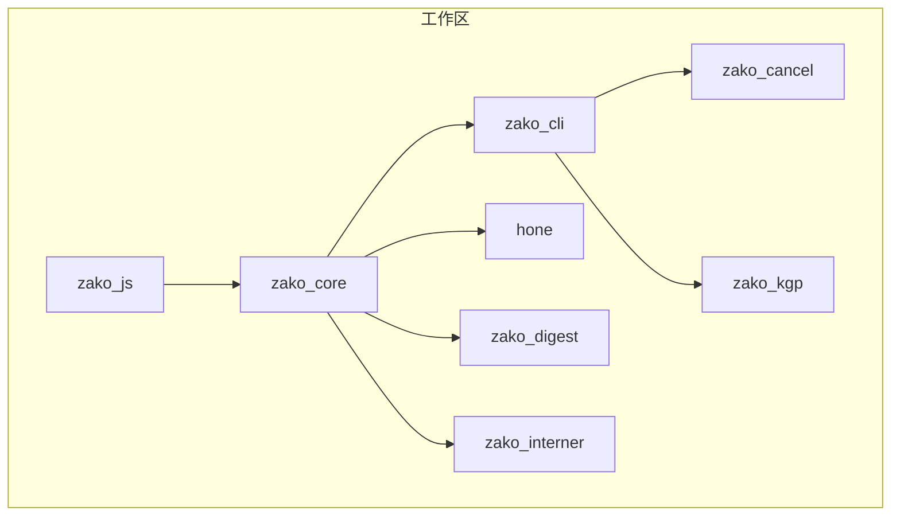
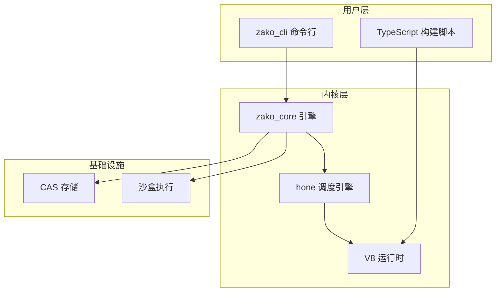
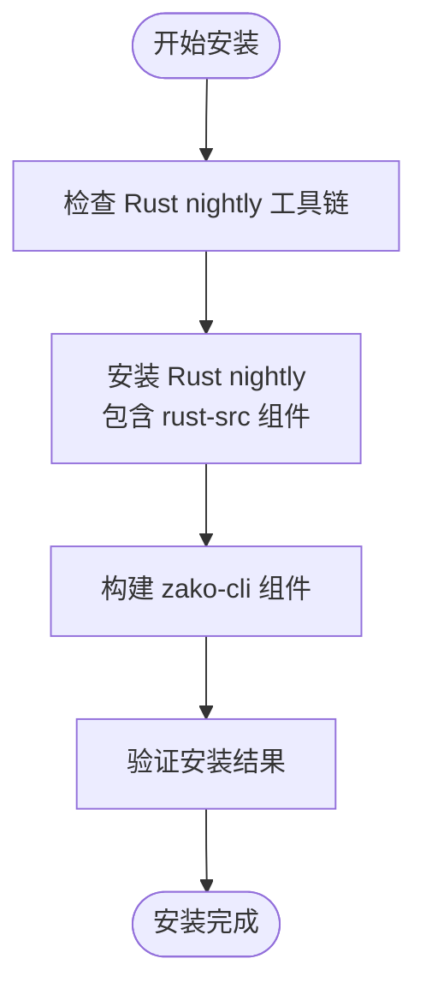
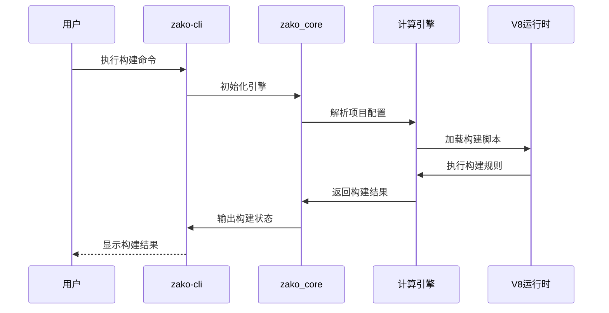
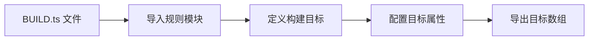
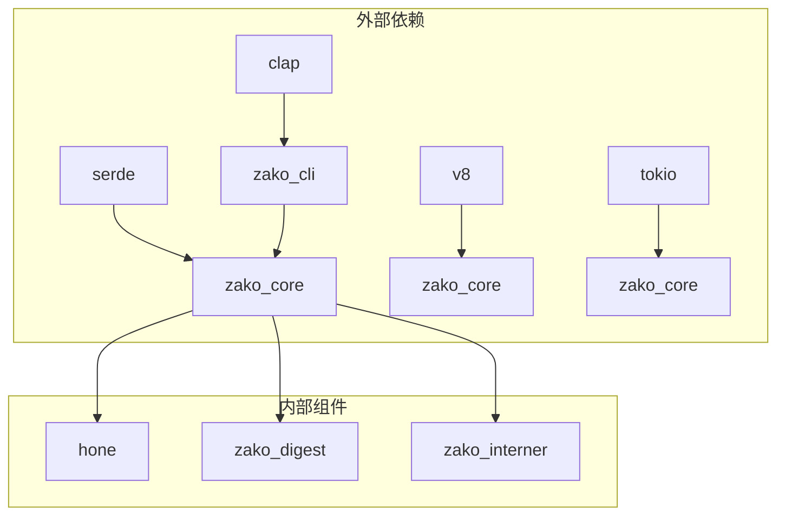

# 快速开始指南

<cite>
**本文引用的文件**
- [README.md](file://README.md)
- [Cargo.toml](file://Cargo.toml)
- [rust-toolchain.toml](file://rust-toolchain.toml)
- [cli.ts](file://cli.ts)
- [build.json](file://build.json)
- [zako_cli/src/main.rs](file://zako_cli/src/main.rs)
- [ARCHITECTURE.md](file://ARCHITECTURE.md)
- [zako_js/package.json](file://zako_js/package.json)
- [tests/new_project/zako.json](file://tests/new_project/zako.json)
- [tests/new_project/zako.ts](file://tests/new_project/zako.ts)
- [tests/log_version/BUILD.ts](file://tests/log_version/BUILD.ts)
- [zako_js/src/builtins/core/index.ts](file://zako_js/src/builtins/core/index.ts)
</cite>

## 目录
1. [简介](#简介)
2. [项目结构](#项目结构)
3. [核心组件](#核心组件)
4. [架构概览](#架构概览)
5. [详细组件分析](#详细组件分析)
6. [依赖关系分析](#依赖关系分析)
7. [性能考虑](#性能考虑)
8. [故障排除指南](#故障排除指南)
9. [结论](#结论)
10. [附录](#附录)

## 简介
Zako 是一个现代化的构建工具，具备以下特性：
- 支持远程构建与构建集群
- 支持远程缓存（二进制或源码）
- 强大的项目/目标/工具名称体系，便于定制和清晰识别
- 可将构建脚本抓取并发布到 esm.sh 或 unpkg 进行分享

本快速开始指南将帮助您在最短时间内完成安装、配置并创建第一个项目，体验 Zako 的核心功能。

## 项目结构
该项目采用多 Crate 工作区结构，主要模块包括：
- zako_core：系统内核，负责 V8 运行时管理、模块加载、CAS 存储协议、沙盒执行及项目解析
- zako_cli：命令行界面，用户交互入口
- zako_cancel：取消机制
- zako_digest：哈希与序列化
- zako_interner：字符串驻留
- hone：任务调度引擎
- zako_kgp：Kotlin/Gradle 插件
- zako_js：脚本内置库（TypeScript 类型定义与 API）

**图表来源**
- [Cargo.toml](file://Cargo.toml#L11-L22)

**章节来源**
- [Cargo.toml](file://Cargo.toml#L11-L22)

## 核心组件
- zako_cli：提供命令行接口，支持 make、bun、bunx、information、generate-complete、export-builtin 等子命令
- zako_core：提供引擎、项目解析、V8 运行时管理等核心能力
- zako_js：提供 TypeScript 内置库，包括 core、project、rule 等命名空间

**章节来源**
- [zako_cli/src/main.rs](file://zako_cli/src/main.rs#L123-L131)
- [ARCHITECTURE.md](file://ARCHITECTURE.md#L18-L27)

## 架构概览
Zako 采用混合执行模型：使用 Rust 编写高性能内核，使用 TypeScript/V8 编写灵活且可验证的构建逻辑。计算核心由 hone 引擎提供，支持并行化和记忆化。

**图表来源**
- [ARCHITECTURE.md](file://ARCHITECTURE.md#L44-L54)
- [zako_cli/src/main.rs](file://zako_cli/src/main.rs#L25-L27)

## 详细组件分析

### 系统要求
- Rust 工具链：nightly 版本，包含 rust-src 组件
- Node.js/Bun：用于 TypeScript 脚本执行
- Git：用于版本控制和依赖管理

**章节来源**
- [rust-toolchain.toml](file://rust-toolchain.toml#L1-L5)

### 安装步骤
1. 克隆仓库并进入目录
2. 确保已安装 Rust nightly 工具链
3. 使用 cargo 构建 zako-cli 组件

**图表来源**
- [rust-toolchain.toml](file://rust-toolchain.toml#L1-L5)
- [cli.ts](file://cli.ts#L6-L12)

**章节来源**
- [cli.ts](file://cli.ts#L1-L15)
- [build.json](file://build.json#L1-L9)

### 环境配置
- 设置项目根目录
- 配置 TypeScript 编译选项
- 验证 V8 运行时可用性

**章节来源**
- [zako_js/package.json](file://zako_js/package.json#L27-L32)

### 第一个项目创建流程
1. 创建项目元数据文件
2. 定义项目配置
3. 添加构建规则
4. 执行构建命令

**图表来源**
- [zako_cli/src/main.rs](file://zako_cli/src/main.rs#L312-L333)
- [tests/new_project/zako.ts](file://tests/new_project/zako.ts#L1-L22)

**章节来源**
- [tests/new_project/zako.json](file://tests/new_project/zako.json#L1-L18)
- [tests/new_project/zako.ts](file://tests/new_project/zako.ts#L1-L22)

### 基本配置示例
项目配置包含以下关键字段：
- group：包组名
- artifact：项目名称
- version：版本号
- description：项目描述
- license：许可证
- authors：作者列表
- workspaces：工作空间模式
- options：自定义选项

**章节来源**
- [tests/new_project/zako.json](file://tests/new_project/zako.json#L1-L18)

### 创建 BUILD.ts 文件
在构建脚本中，您可以使用内置规则创建目标：

**图表来源**
- [tests/log_version/BUILD.ts](file://tests/log_version/BUILD.ts#L1-L21)

**章节来源**
- [tests/log_version/BUILD.ts](file://tests/log_version/BUILD.ts#L1-L21)

### 执行构建命令
使用 zako-cli 执行构建：
- make：构建项目
- information：显示调试信息
- generate-complete：生成 shell 补全
- export-builtin：导出内置类型

**章节来源**
- [zako_cli/src/main.rs](file://zako_cli/src/main.rs#L123-L131)

## 依赖关系分析
Zako 采用工作区管理模式，各组件间存在明确的依赖关系：

**图表来源**
- [Cargo.toml](file://Cargo.toml#L38-L48)
- [Cargo.toml](file://Cargo.toml#L50-L101)

**章节来源**
- [Cargo.toml](file://Cargo.toml#L38-L101)

## 性能考虑
- 并行构建：默认使用 CPU 核心数进行并行计算
- 记忆化：重复计算会被缓存，提高构建效率
- 确定性：严格的沙盒执行确保构建结果的一致性
- 远程缓存：支持二进制和源码缓存，加速分布式构建

## 故障排除指南

### 常见问题及解决方案

#### 1. Rust 工具链相关问题
**问题**：编译失败，提示缺少 nightly 组件
**解决方案**：
- 安装 Rust nightly 工具链
- 确保包含 rust-src 组件
- 验证工具链版本

**章节来源**
- [rust-toolchain.toml](file://rust-toolchain.toml#L1-L5)

#### 2. TypeScript 编译错误
**问题**：构建脚本编译失败
**解决方案**：
- 检查 TypeScript 版本兼容性
- 验证模块导入路径
- 确认类型定义文件存在

**章节来源**
- [zako_js/package.json](file://zako_js/package.json#L27-L32)

#### 3. V8 运行时问题
**问题**：脚本执行异常
**解决方案**：
- 检查 V8 版本兼容性
- 验证内置 API 可用性
- 查看运行时日志

**章节来源**
- [zako_cli/src/main.rs](file://zako_cli/src/main.rs#L133-L221)

#### 4. 构建配置错误
**问题**：项目配置无效
**解决方案**：
- 验证 JSON 配置格式
- 检查必填字段完整性
- 确认路径模式正确

**章节来源**
- [tests/new_project/zako.json](file://tests/new_project/zako.json#L1-L18)

### 调试技巧
- 使用 `information` 子命令查看详细信息
- 启用详细日志输出
- 检查缓存状态
- 验证网络连接（远程缓存）

**章节来源**
- [zako_cli/src/main.rs](file://zako_cli/src/main.rs#L392-L450)

## 结论
通过本快速开始指南，您已经完成了 Zako 的安装配置，并成功创建了第一个项目。Zako 的核心优势在于其现代化的设计理念、强大的并行构建能力和灵活的 TypeScript 脚本系统。建议继续探索内置规则、远程缓存和分布式构建等高级功能，以充分发挥 Zako 的潜力。

## 附录

### 快速参考命令
- `zako make`：构建项目
- `zako information`：显示调试信息
- `zako generate-complete --shell bash`：生成 shell 补全
- `zako export-builtin`：导出内置类型

### 支持的构建规则
- C++ 库和二进制目标
- 自定义规则扩展
- 工具链集成

**章节来源**
- [tests/log_version/BUILD.ts](file://tests/log_version/BUILD.ts#L1-L21)
- [zako_js/src/builtins/core/index.ts](file://zako_js/src/builtins/core/index.ts#L103-L120)