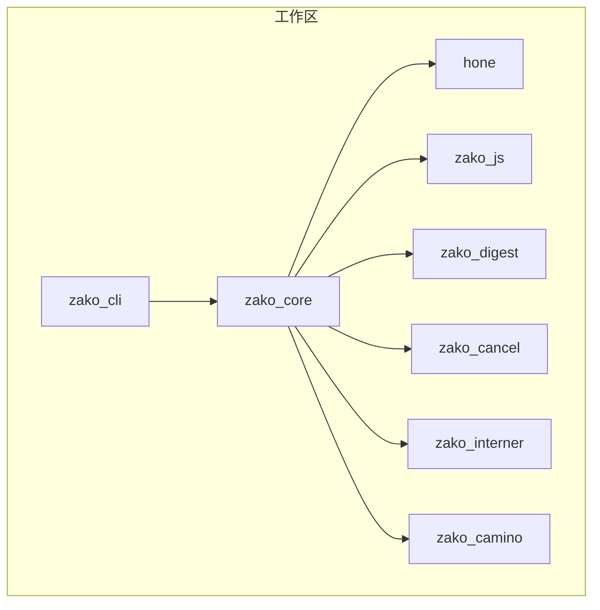
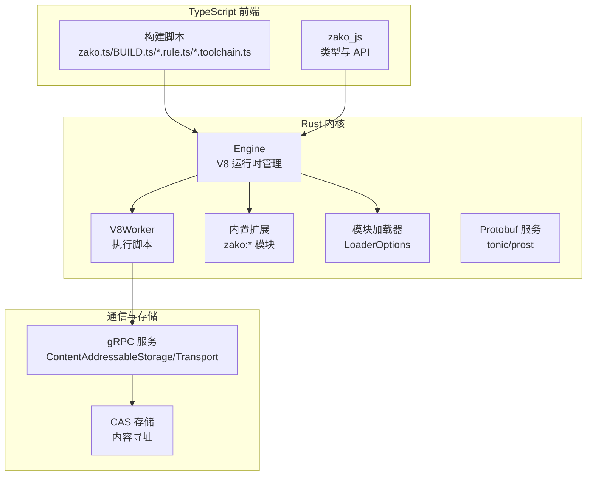
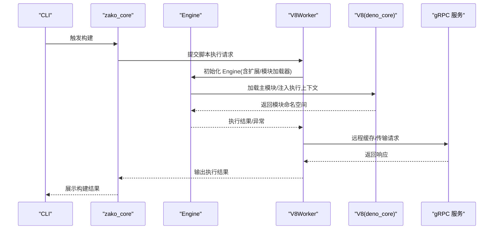
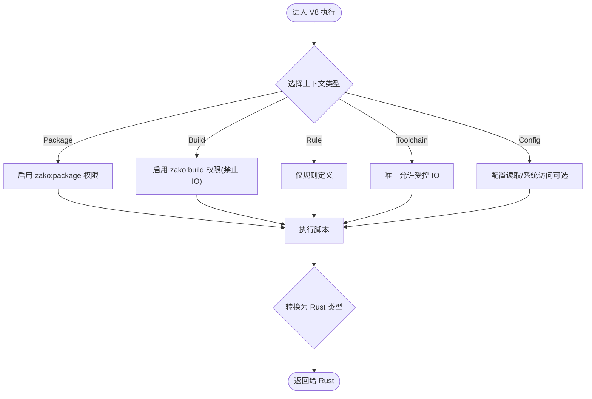
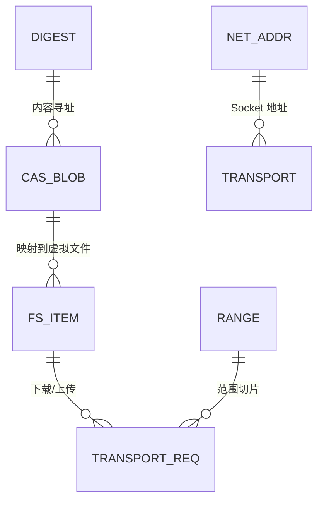
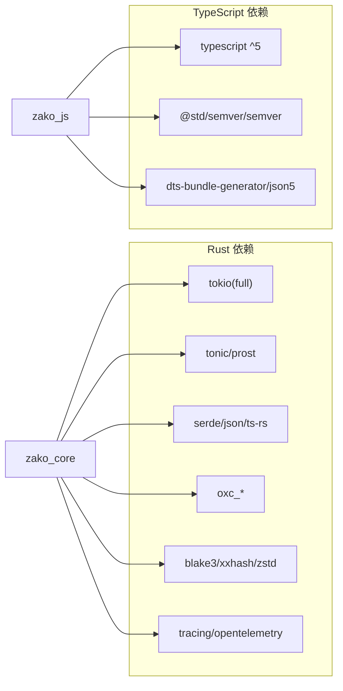

# 技术栈说明

<cite>
**本文引用的文件**
- [Cargo.toml](file://Cargo.toml)
- [rust-toolchain.toml](file://rust-toolchain.toml)
- [zako_core/Cargo.toml](file://zako_core/Cargo.toml)
- [zako_core/src/lib.rs](file://zako_core/src/lib.rs)
- [zako_core/src/engine.rs](file://zako_core/src/engine.rs)
- [zako_core/src/v8context.rs](file://zako_core/src/v8context.rs)
- [zako_core/src/worker/v8worker.rs](file://zako_core/src/worker/v8worker.rs)
- [zako_core/src/protobuf/cas.proto](file://zako_core/src/protobuf/cas.proto)
- [zako_core/src/protobuf/fs.proto](file://zako_core/src/protobuf/fs.proto)
- [zako_core/src/protobuf/net.proto](file://zako_core/src/protobuf/net.proto)
- [zako_core/src/protobuf/transport.proto](file://zako_core/src/protobuf/transport.proto)
- [zako_core/src/protobuf/range.proto](file://zako_core/src/protobuf/range.proto)
- [zako_js/package.json](file://zako_js/package.json)
- [ARCHITECTURE.md](file://ARCHITECTURE.md)
- [README.md](file://README.md)
</cite>

## 目录
1. [简介](#简介)
2. [项目结构](#项目结构)
3. [核心组件](#核心组件)
4. [架构总览](#架构总览)
5. [详细组件分析](#详细组件分析)
6. [依赖关系分析](#依赖关系分析)
7. [性能考量](#性能考量)
8. [故障排查指南](#故障排查指南)
9. [结论](#结论)
10. [附录](#附录)

## 简介
本文件面向开发者与技术评估人员，系统梳理 Zako 构建系统的“技术栈”与“技术选型”。Zako 采用“Rust 系统内核 + TypeScript 前端 + V8 JavaScript 引擎 + Tokio 异步运行时 + gRPC 通信协议”的组合，既追求高性能与确定性，又保持构建脚本的灵活性与可验证性。文档将从技术选型动机、优势、在项目中的职责、版本兼容与升级策略、演进历史与未来规划等方面展开，并提供可视化图示与排障建议。

## 项目结构
Zako 采用多 Crate 工作区组织，核心模块划分如下：
- zako_core：系统内核，负责 V8 运行时管理、模块加载、CAS 存储协议、沙盒执行与项目解析。
- hone：任务调度引擎，将构建任务建模为 DAG，支持增量计算。
- zako_cli：命令行界面，负责初始化构建环境并触发引擎计算。
- zako_digest：哈希与序列化，定义通用 Protobuf 协议与高性能哈希逻辑。
- zako_js：脚本内置库，提供 TypeScript 类型定义与 API 实现（如 zako:core）。
- 其他子 crate：如 zako_cancel、zako_interner、zako_camino 等，支撑取消、字符串驻留、路径处理等能力。

图表来源
- [Cargo.toml](file://Cargo.toml#L11-L22)
- [zako_core/src/lib.rs](file://zako_core/src/lib.rs#L30-L80)

章节来源
- [Cargo.toml](file://Cargo.toml#L11-L22)
- [ARCHITECTURE.md](file://ARCHITECTURE.md#L18-L27)

## 核心组件
本节聚焦“技术栈”的关键构件及其在系统中的角色与价值。

- Rust 系统内核（zako_core）
  - 职责：V8 运行时管理、模块加载、CAS 协议、沙盒执行、项目解析与类型导出。
  - 关键点：通过 deno_core 驱动 V8，结合自研扩展与模块加载器；提供 Protobuf 服务接口（tonic/prost）。
  - 代码参考：运行时初始化、模块执行、上下文类型与 Worker 行为。

- TypeScript 前端（zako_js）
  - 职责：为构建脚本提供 TypeScript 类型定义与 API 实现，支撑用户侧脚本生态。
  - 版本约束：peerDependencies 指定 typescript ^5，确保类型检查一致性。
  - 代码参考：package.json 中的 exports、peerDependencies 与脚本。

- V8 JavaScript 引擎（基于 deno_core）
  - 职责：在 Rust 内核中嵌入 V8，执行 TypeScript/JavaScript 构建脚本，提供确定性隔离与权限控制。
  - 关键点：多 Isolate 隔离、分层权限体系（定义层、逻辑层、工具链层）、禁用非确定性 API。
  - 代码参考：Engine 初始化与模块执行、V8 上下文类型、Worker 执行流程。

- Tokio 异步运行时
  - 职责：统一异步调度，支撑 V8 执行、gRPC 服务、并发任务与通道通信。
  - 关键点：full 特性启用，配合 flume、tokio-stream、tokio-util 等生态。
  - 代码参考：工作线程持有 Tokio Handle 并驱动 V8 异步事件循环。

- gRPC 通信协议（tonic + prost）
  - 职责：定义 CAS 与传输协议，支持远程缓存与分布式传输。
  - 关键点：Protobuf 定义（cas.proto、fs.proto、net.proto、transport.proto、range.proto），tonic 生成服务桩。
  - 代码参考：服务接口与消息类型定义。

章节来源
- [zako_core/src/lib.rs](file://zako_core/src/lib.rs#L30-L80)
- [zako_core/src/engine.rs](file://zako_core/src/engine.rs#L48-L79)
- [zako_core/src/v8context.rs](file://zako_core/src/v8context.rs#L12-L37)
- [zako_core/src/worker/v8worker.rs](file://zako_core/src/worker/v8worker.rs#L71-L146)
- [zako_js/package.json](file://zako_js/package.json#L27-L32)
- [Cargo.toml](file://Cargo.toml#L101-L101)
- [Cargo.toml](file://Cargo.toml#L209-L214)
- [zako_core/src/protobuf/cas.proto](file://zako_core/src/protobuf/cas.proto#L28-L31)
- [zako_core/src/protobuf/transport.proto](file://zako_core/src/protobuf/transport.proto#L33-L37)

## 架构总览
Zako 的整体架构由“Rust 内核 + TypeScript/V8 执行 + gRPC 协议”构成，强调确定性、可验证性与可扩展性。

图表来源
- [ARCHITECTURE.md](file://ARCHITECTURE.md#L44-L54)
- [zako_core/src/engine.rs](file://zako_core/src/engine.rs#L48-L79)
- [zako_core/src/worker/v8worker.rs](file://zako_core/src/worker/v8worker.rs#L71-L146)
- [zako_core/src/protobuf/cas.proto](file://zako_core/src/protobuf/cas.proto#L28-L31)
- [zako_core/src/protobuf/transport.proto](file://zako_core/src/protobuf/transport.proto#L33-L37)

章节来源
- [ARCHITECTURE.md](file://ARCHITECTURE.md#L1-L152)

## 详细组件分析

### V8 引擎与执行流程
- 设计要点
  - 使用 deno_core 创建 JsRuntime，注入自定义扩展（zako:* 模块），并启用模块加载器。
  - 通过 Engine::execute_module 与 execute_module_with_json 系列方法加载与执行模块，支持传入 JSON 上下文。
  - 在 Worker 中以 V8State 持有 Tokio Handle，驱动 V8 异步事件循环，实现与 Rust 的协作执行。

图表来源
- [zako_core/src/engine.rs](file://zako_core/src/engine.rs#L48-L79)
- [zako_core/src/engine.rs](file://zako_core/src/engine.rs#L81-L166)
- [zako_core/src/worker/v8worker.rs](file://zako_core/src/worker/v8worker.rs#L83-L146)

章节来源
- [zako_core/src/engine.rs](file://zako_core/src/engine.rs#L19-L31)
- [zako_core/src/engine.rs](file://zako_core/src/engine.rs#L48-L79)
- [zako_core/src/engine.rs](file://zako_core/src/engine.rs#L81-L166)
- [zako_core/src/worker/v8worker.rs](file://zako_core/src/worker/v8worker.rs#L71-L146)

### V8 上下文与权限模型
- 上下文类型
  - Package/Build/Rule/Toolchain/Config：不同文件类型对应不同权限与能力，限制 IO 与系统访问，保障确定性。
- 输出类型
  - 对应输入上下文，限定返回值结构，便于 Rust 侧安全消费。

图表来源
- [zako_core/src/v8context.rs](file://zako_core/src/v8context.rs#L12-L37)
- [zako_core/src/v8context.rs](file://zako_core/src/v8context.rs#L39-L61)

章节来源
- [zako_core/src/v8context.rs](file://zako_core/src/v8context.rs#L12-L37)
- [zako_core/src/v8context.rs](file://zako_core/src/v8context.rs#L39-L61)
- [ARCHITECTURE.md](file://ARCHITECTURE.md#L44-L54)

### gRPC 协议与 CAS 传输
- 协议定义
  - cas.proto：内容寻址存储服务，NegotiateBlobs、GetTransportDetails。
  - transport.proto：下载/上传流式传输，支持范围请求。
  - fs.proto：虚拟文件系统条目，支持 digest/symlink/目录标记。
  - net.proto：地址与协议枚举（当前支持 grpc）。
  - range.proto：Blob 范围请求。
- 生成与使用
  - 通过 tonic + prost 生成服务桩，zako_core/src/lib.rs 中 include_proto 引入命名空间。

图表来源
- [zako_core/src/protobuf/cas.proto](file://zako_core/src/protobuf/cas.proto#L8-L31)
- [zako_core/src/protobuf/transport.proto](file://zako_core/src/protobuf/transport.proto#L8-L37)
- [zako_core/src/protobuf/fs.proto](file://zako_core/src/protobuf/fs.proto#L7-L18)
- [zako_core/src/protobuf/net.proto](file://zako_core/src/protobuf/net.proto#L12-L19)
- [zako_core/src/protobuf/range.proto](file://zako_core/src/protobuf/range.proto#L5-L8)

章节来源
- [zako_core/src/protobuf/cas.proto](file://zako_core/src/protobuf/cas.proto#L1-L32)
- [zako_core/src/protobuf/transport.proto](file://zako_core/src/protobuf/transport.proto#L1-L38)
- [zako_core/src/protobuf/fs.proto](file://zako_core/src/protobuf/fs.proto#L1-L19)
- [zako_core/src/protobuf/net.proto](file://zako_core/src/protobuf/net.proto#L1-L20)
- [zako_core/src/protobuf/range.proto](file://zako_core/src/protobuf/range.proto#L1-L9)
- [zako_core/src/lib.rs](file://zako_core/src/lib.rs#L98-L118)

## 依赖关系分析
- 工作区与成员
  - 工作区统一 lint 与依赖版本，成员包含 zako_core、zako_cli、hone、zako_digest、zako_interner 等。
- Rust 生态
  - 异步：tokio(full)、futures、tokio-stream、flume、async-stream。
  - 序列化：serde、serde_json、ts-rs、postcard、rkyv、serde_bytes。
  - 并发与集合：dashmap、moka、parking_lot、crossbeam。
  - 网络与 RPC：tonic、prost、tonic-prost-build、reqwest。
  - 解析与编译：oxc_* 系列（parser、semantic、transformer、codegen 等）。
  - 哈希与压缩：blake3、xxhash-rust、zstd。
  - 日志与可观测：tracing、tracing-subscriber、opentelemetry。
- TypeScript 生态
  - 类型与工具：typescript ^5（peer），@std/semver、semver、json5、dts-bundle-generator。
  - 运行时：bun（脚本构建与类型生成）。

图表来源
- [Cargo.toml](file://Cargo.toml#L38-L280)
- [zako_js/package.json](file://zako_js/package.json#L27-L38)
- [zako_core/Cargo.toml](file://zako_core/Cargo.toml#L16-L141)

章节来源
- [Cargo.toml](file://Cargo.toml#L38-L280)
- [zako_js/package.json](file://zako_js/package.json#L27-L38)
- [zako_core/Cargo.toml](file://zako_core/Cargo.toml#L16-L141)

## 性能考量
- 异步与并发
  - 使用 tokio full 特性与 flume 通道，结合 dashmap、moka 等并发容器，提升高负载下的吞吐与低延迟。
- V8 执行
  - 多 Isolate 隔离与模块命名空间缓存，减少重复加载开销；通过 bytecode 缓存与字节码复用降低启动时间。
- 序列化与哈希
  - rkyv、postcard 用于零拷贝序列化；blake3、xxhash 用于高性能内容寻址与缓存键生成。
- 网络与传输
  - gRPC 流式上传/下载与范围请求，结合推荐并发度参数，优化大文件传输效率。
- 编译与类型
  - oxc_* 用于快速解析与转换 TypeScript，减少构建链路中的编译瓶颈。

## 故障排查指南
- V8 执行异常
  - 症状：模块加载失败、JSON 上下文转换错误、异常抛出。
  - 排查：检查 Engine::execute_module_with_json 的上下文注入与 serde_v8 转换；确认模块加载器与扩展初始化顺序。
  - 参考：Engine 错误类型与异常转换逻辑。
- gRPC 服务问题
  - 症状：NegotiateBlobs/Transport 请求失败、连接中断。
  - 排查：确认 Protobuf 服务实现、tonic 生成代码与网络配置；检查服务端口与认证令牌。
- TypeScript 类型不匹配
  - 症状：类型检查报错、API 不可用。
  - 排查：确保 typescript ^5 peer 依赖一致；检查 zako_js 的 exports 与 d.ts 生成流程。
- 并发与内存
  - 症状：高并发下内存增长、死锁或阻塞。
  - 排查：检查 tokio 任务调度、通道背压与并发池大小；使用 tracing 观察热点路径。

章节来源
- [zako_core/src/engine.rs](file://zako_core/src/engine.rs#L24-L31)
- [zako_core/src/engine.rs](file://zako_core/src/engine.rs#L140-L147)
- [zako_core/src/worker/v8worker.rs](file://zako_core/src/worker/v8worker.rs#L44-L52)
- [zako_js/package.json](file://zako_js/package.json#L27-L32)

## 结论
Zako 的技术栈在“高性能内核 + 灵活脚本 + 确定性执行 + 分布式协议”之间取得平衡：Rust 提供确定性与性能，TypeScript/V8 提供易用性与可验证性，Tokio 统一异步，gRPC 支撑远程缓存与传输。该组合适合需要强确定性与可扩展性的现代构建场景。后续建议持续关注 V8 版本与 deno_core 的兼容性、Protobuf 协议的稳定性与性能优化，以及 TypeScript 生态的版本演进。

## 附录

### 版本兼容性与升级策略
- Rust 工具链
  - channel 为 nightly，启用 rust-src，便于底层调试与特性实验。
  - 建议：在 CI 中固定 nightly 版本，避免上游 breaking；对关键依赖（如 V8、deno_core）制定灰度升级策略。
- V8 与 deno_core
  - v8 版本与 deno_core 版本需匹配，遵循官方兼容矩阵；升级时优先在 dev 环境验证模块加载与扩展行为。
- gRPC 与 Protobuf
  - 保持 prost/tonic 版本一致；新增字段遵循向后兼容原则，避免破坏性变更。
- TypeScript
  - 严格锁定 typescript ^5；对 zako_js 的类型导出与 d.ts 生成流程进行回归测试。

章节来源
- [rust-toolchain.toml](file://rust-toolchain.toml#L1-L5)
- [Cargo.toml](file://Cargo.toml#L136-L162)
- [Cargo.toml](file://Cargo.toml#L209-L214)
- [zako_js/package.json](file://zako_js/package.json#L30-L32)

### 技术栈演进与未来规划
- 已完成
  - Rust 内核与 V8 集成、基础 Hone 引擎、TypeScript 实时转译（oxc）、内容寻址路径实习。
- 进行中
  - 完善内置规则（C++、Rust、JS 等）、实现完整 CAS 远程同步协议、跨平台沙盒加固。
- 计划中
  - IDE 支持（BSP 协议）、分布式集群调度算法优化。

章节来源
- [ARCHITECTURE.md](file://ARCHITECTURE.md#L127-L139)