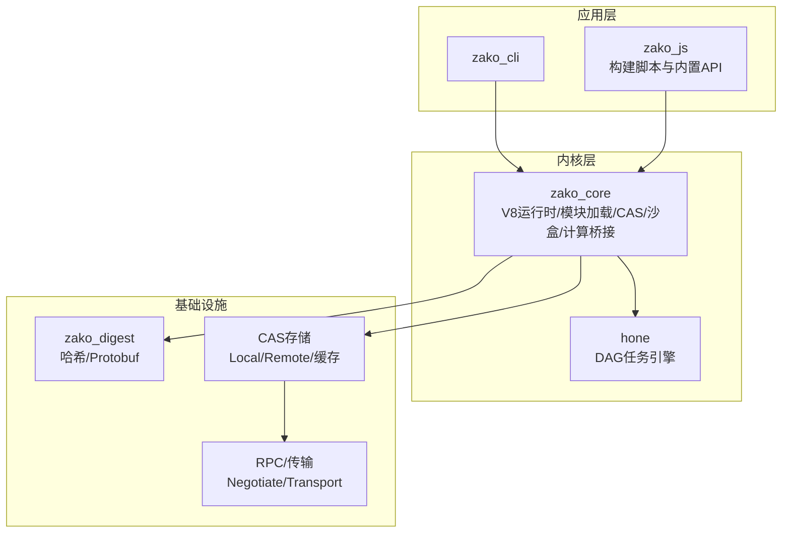
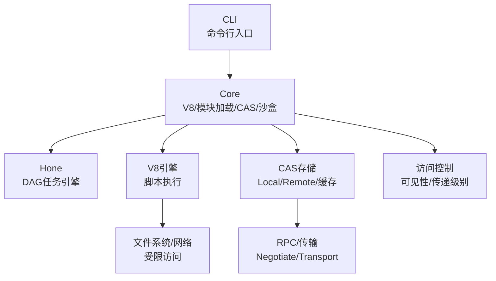
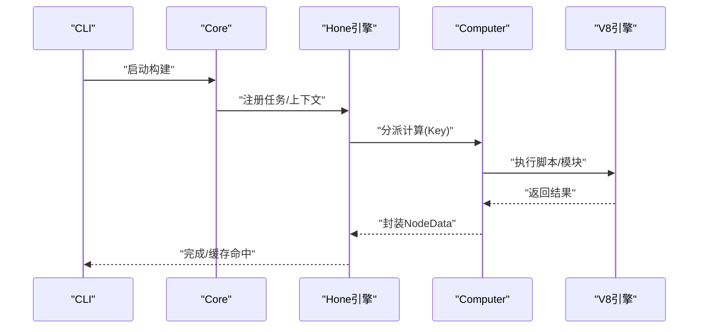
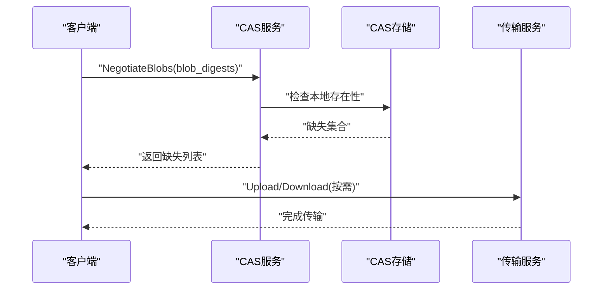
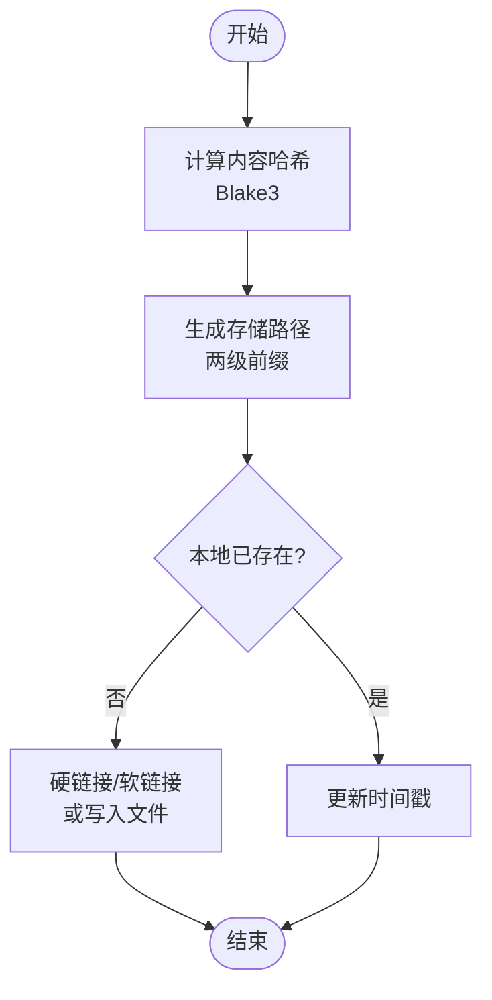
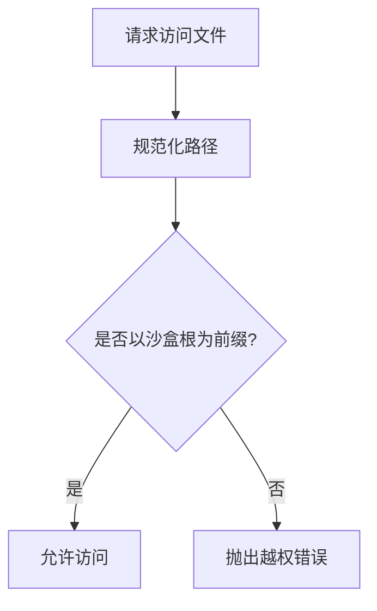
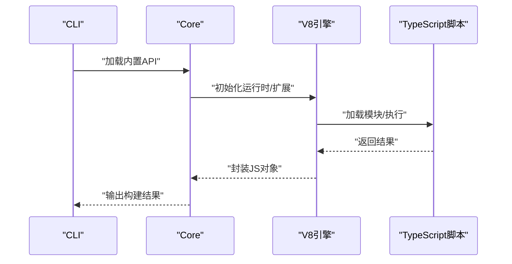
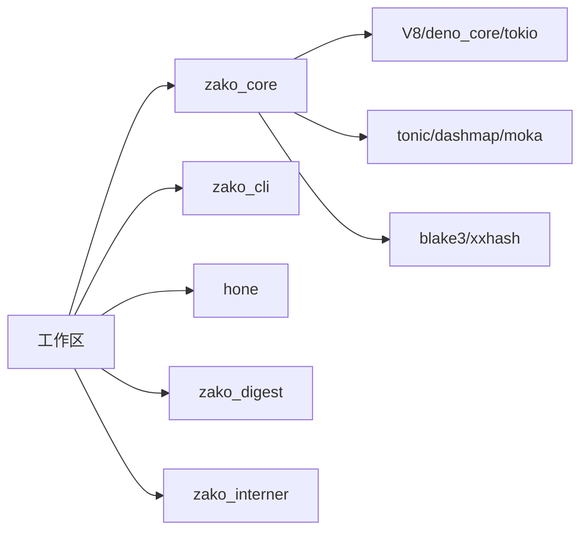

# 核心特性概览

<cite>
**本文引用的文件**
- [README.md](file://README.md)
- [ARCHITECTURE.md](file://ARCHITECTURE.md)
- [Cargo.toml](file://Cargo.toml)
- [zako_core/src/lib.rs](file://zako_core/src/lib.rs)
- [zako_core/src/engine.rs](file://zako_core/src/engine.rs)
- [zako_core/src/computer.rs](file://zako_core/src/computer.rs)
- [zako_core/src/cas.rs](file://zako_core/src/cas.rs)
- [zako_core/src/local_cas.rs](file://zako_core/src/local_cas.rs)
- [zako_core/src/cas_server.rs](file://zako_core/src/cas_server.rs)
- [zako_core/src/cas_store.rs](file://zako_core/src/cas_store.rs)
- [zako_core/src/transport_server.rs](file://zako_core/src/transport_server.rs)
- [zako_core/src/sandbox.rs](file://zako_core/src/sandbox.rs)
- [zako_core/src/access_control.rs](file://zako_core/src/access_control.rs)
- [zako_core/src/worker/mod.rs](file://zako_core/src/worker/mod.rs)
- [hone/src/lib.rs](file://hone/src/lib.rs)
- [zako_js/src/builtins/core/index.ts](file://zako_js/src/builtins/core/index.ts)
- [tests/new_project/zako.json](file://tests/new_project/zako.json)
- [tests/log_version/BUILD.ts](file://tests/log_version/BUILD.ts)
</cite>

## 目录
1. [简介](#简介)
2. [项目结构](#项目结构)
3. [核心组件](#核心组件)
4. [架构总览](#架构总览)
5. [详细组件分析](#详细组件分析)
6. [依赖分析](#依赖分析)
7. [性能考量](#性能考量)
8. [故障排查指南](#故障排查指南)
9. [结论](#结论)
10. [附录](#附录)

## 简介
本文件面向希望采用现代构建系统的团队与个人，系统梳理 Zako 的核心能力与技术特色，重点覆盖以下方面：
- 确定性构建：通过确定性计算模型与隔离执行，确保相同输入产生一致输出
- 分布式构建：基于内容寻址存储与远程传输协议，实现跨机器复用与并行加速
- 内容寻址存储（CAS）：以内容哈希标识数据，天然支持远程缓存与位置无关性
- 远程缓存：通过标准 RPC 协议协商缺失 blob 并进行高效传输
- 沙盒执行：限制文件系统与网络访问，提升安全性与可重复性
- 多语言支持：以 TypeScript 作为构建脚本语言，结合高性能 Rust 内核与 V8 运行时

对比传统构建工具，Zako 的差异化优势体现在：
- 将“确定性”与“可重复性”作为设计基石，贯穿计算模型、执行环境与存储协议
- 以内容寻址为核心的数据模型，使远程缓存与分布式复用成为原生能力
- 通过分层权限与沙盒机制，兼顾灵活性与安全性
- 使用 Hone 引擎与 Rust/V8 混合架构，在性能与可扩展性之间取得平衡

## 项目结构
Zako 采用多 Crate 工作区组织，围绕“内核 + 引擎 + 运行时 + 存储 + 协议”的分层设计展开：
- zako_core：系统内核，包含 V8 运行时集成、模块加载、CAS 存储协议、沙盒执行、项目解析与计算调度桥接
- hone：通用任务调度引擎，将构建任务建模为 DAG，支持并行化与记忆化
- zako_cli：命令行入口，负责初始化环境并触发计算
- zako_digest：哈希与 Protobuf 协议定义
- zako_js：构建脚本的 TypeScript 类型与内置 API
- 其他子 crate：取消令牌、路径处理、内存池等支撑模块

图表来源
- [Cargo.toml](file://Cargo.toml#L11-L22)
- [zako_core/src/lib.rs](file://zako_core/src/lib.rs#L14-L28)

章节来源
- [Cargo.toml](file://Cargo.toml#L11-L22)
- [zako_core/src/lib.rs](file://zako_core/src/lib.rs#L14-L28)

## 核心组件
本节概述 Zako 的关键能力与其在代码中的落点，便于快速定位实现细节。

- 确定性构建
  - 计算模型：Hone 引擎将任务抽象为 Key/Value 映射，支持并行与记忆化，天然满足“相同输入产生相同输出”
  - 执行模型：V8 环境经定制以消除非确定性副作用，并按层级权限约束脚本行为
  - 代码落点：[zako_core/src/computer.rs](file://zako_core/src/computer.rs#L24-L76)、[zako_core/src/engine.rs](file://zako_core/src/engine.rs#L47-L79)

- 分布式构建
  - 通过 CAS 与 RPC 协议，实现跨节点的 blob 协商与传输
  - 代码落点：[zako_core/src/cas_server.rs](file://zako_core/src/cas_server.rs#L59-L84)、[zako_core/src/transport_server.rs](file://zako_core/src/transport_server.rs#L24-L42)

- 内容寻址存储（CAS）
  - 以内容哈希标识数据，支持本地存储、远程存储与内存缓存
  - 代码落点：[zako_core/src/cas.rs](file://zako_core/src/cas.rs#L10-L44)、[zako_core/src/local_cas.rs](file://zako_core/src/local_cas.rs#L105-L212)、[zako_core/src/cas_store.rs](file://zako_core/src/cas_store.rs#L35-L57)

- 远程缓存
  - 通过 NegotiateBlobs 协商缺失 blob，再通过 Transport 服务进行下载/上传
  - 代码落点：[zako_core/src/protobuf/cas.proto](file://zako_core/src/protobuf/cas.proto#L8-L31)、[zako_core/src/cas_server.rs](file://zako_core/src/cas_server.rs#L64-L84)

- 沙盒执行
  - 限定文件系统访问范围，防止越权读写
  - 代码落点：[zako_core/src/sandbox.rs](file://zako_core/src/sandbox.rs#L27-L81)

- 多语言支持
  - TypeScript 作为构建脚本语言，提供类型安全与良好生态；Rust 提供高性能内核与底层能力
  - 代码落点：[zako_js/src/builtins/core/index.ts](file://zako_js/src/builtins/core/index.ts#L121-L135)、[zako_core/src/engine.rs](file://zako_core/src/engine.rs#L81-L109)

章节来源
- [zako_core/src/computer.rs](file://zako_core/src/computer.rs#L24-L76)
- [zako_core/src/engine.rs](file://zako_core/src/engine.rs#L47-L79)
- [zako_core/src/cas.rs](file://zako_core/src/cas.rs#L10-L44)
- [zako_core/src/local_cas.rs](file://zako_core/src/local_cas.rs#L105-L212)
- [zako_core/src/cas_server.rs](file://zako_core/src/cas_server.rs#L59-L84)
- [zako_core/src/transport_server.rs](file://zako_core/src/transport_server.rs#L24-L42)
- [zako_core/src/sandbox.rs](file://zako_core/src/sandbox.rs#L27-L81)
- [zako_js/src/builtins/core/index.ts](file://zako_js/src/builtins/core/index.ts#L121-L135)

## 架构总览
下图展示了 Zako 的整体架构：CLI 触发内核，内核通过 Hone 引擎调度计算，V8 执行脚本，CAS 提供内容寻址存储，RPC 协议实现远程缓存与传输。

图表来源
- [zako_core/src/engine.rs](file://zako_core/src/engine.rs#L47-L79)
- [zako_core/src/computer.rs](file://zako_core/src/computer.rs#L24-L76)
- [zako_core/src/cas_store.rs](file://zako_core/src/cas_store.rs#L35-L57)
- [zako_core/src/cas_server.rs](file://zako_core/src/cas_server.rs#L59-L84)
- [zako_core/src/transport_server.rs](file://zako_core/src/transport_server.rs#L24-L42)
- [zako_core/src/access_control.rs](file://zako_core/src/access_control.rs#L6-L18)

章节来源
- [zako_core/src/engine.rs](file://zako_core/src/engine.rs#L47-L79)
- [zako_core/src/computer.rs](file://zako_core/src/computer.rs#L24-L76)
- [zako_core/src/cas_store.rs](file://zako_core/src/cas_store.rs#L35-L57)
- [zako_core/src/cas_server.rs](file://zako_core/src/cas_server.rs#L59-L84)
- [zako_core/src/transport_server.rs](file://zako_core/src/transport_server.rs#L24-L42)
- [zako_core/src/access_control.rs](file://zako_core/src/access_control.rs#L6-L18)

## 详细组件分析

### 确定性构建（Hone 引擎与 V8 定制）
- 设计要点
  - 将构建步骤抽象为 Key/Value 映射，支持并行与记忆化
  - V8 环境禁用非确定性 API，按层级权限约束脚本行为
- 关键流程
  - CLI 初始化后调用内核，内核加载 Hone 引擎并注册 Computer
  - Computer 根据 Key 分派到具体计算函数（如 Glob、ResolvePackage、TranspileTs 等）
  - V8 执行脚本，注入执行上下文，保证输入与环境稳定
- 应用价值
  - 降低构建不确定性，提升可重复性与可审计性
  - 便于并行与缓存命中，缩短构建时间

图表来源
- [zako_core/src/engine.rs](file://zako_core/src/engine.rs#L81-L109)
- [zako_core/src/computer.rs](file://zako_core/src/computer.rs#L24-L76)
- [hone/src/lib.rs](file://hone/src/lib.rs#L12-L23)

章节来源
- [zako_core/src/engine.rs](file://zako_core/src/engine.rs#L81-L109)
- [zako_core/src/computer.rs](file://zako_core/src/computer.rs#L24-L76)
- [hone/src/lib.rs](file://hone/src/lib.rs#L12-L23)

### 分布式构建（CAS 与 RPC）
- 设计要点
  - 以内容哈希标识数据，支持本地与远程 CAS
  - 通过 NegotiateBlobs 协商缺失 blob，使用 Transport 服务进行高效传输
- 关键流程
  - 客户端向 CAS Server 发送 blob 摘要列表，服务器返回缺失集合
  - 客户端根据缺失集合上传或下载对应 blob
  - 传输过程中支持并发与缓冲，提高吞吐

图表来源
- [zako_core/src/cas_server.rs](file://zako_core/src/cas_server.rs#L64-L84)
- [zako_core/src/transport_server.rs](file://zako_core/src/transport_server.rs#L28-L42)
- [zako_core/src/protobuf/cas.proto](file://zako_core/src/protobuf/cas.proto#L8-L31)

章节来源
- [zako_core/src/cas_server.rs](file://zako_core/src/cas_server.rs#L64-L84)
- [zako_core/src/transport_server.rs](file://zako_core/src/transport_server.rs#L28-L42)
- [zako_core/src/protobuf/cas.proto](file://zako_core/src/protobuf/cas.proto#L8-L31)

### 内容寻址存储（CAS）
- 设计要点
  - 以 Blake3 哈希标识数据，路径采用两级目录前缀，避免单目录文件过多
  - 支持本地存储、远程存储与内存缓存三层结构
- 关键流程
  - 输入文件或数据流经哈希计算，生成 Digest
  - 本地 CAS 通过硬链接/软链接进行高效存储
  - 远程 CAS 通过 RPC 协议进行协商与传输
- 性能特性
  - 大文件采用内存映射，小文件采用流式复制
  - 哈希计算与存储路径分离，便于缓存与去重

图表来源
- [zako_core/src/local_cas.rs](file://zako_core/src/local_cas.rs#L31-L102)

章节来源
- [zako_core/src/cas.rs](file://zako_core/src/cas.rs#L10-L44)
- [zako_core/src/local_cas.rs](file://zako_core/src/local_cas.rs#L105-L212)
- [zako_core/src/cas_store.rs](file://zako_core/src/cas_store.rs#L35-L57)

### 沙盒执行（Sandbox）
- 设计要点
  - 限定文件系统访问根路径，防止越权访问
  - 对相对路径进行规范化与校验，确保始终处于沙盒内
- 关键流程
  - 初始化 Sandbox，记录根路径
  - 访问文件时进行路径规范化与前缀校验
  - 越权访问抛出错误，阻止异常行为

图表来源
- [zako_core/src/sandbox.rs](file://zako_core/src/sandbox.rs#L34-L54)

章节来源
- [zako_core/src/sandbox.rs](file://zako_core/src/sandbox.rs#L27-L81)

### 多语言支持（TypeScript + Rust）
- 设计要点
  - TypeScript 作为构建脚本语言，提供类型安全与良好生态
  - Rust 提供高性能内核、V8 运行时与底层能力
- 关键流程
  - CLI 加载 zako_js 内置 API，构建脚本通过模块加载器导入
  - V8 引擎执行脚本，注入执行上下文，保证确定性
- 应用价值
  - 降低脚本编写门槛，提升可维护性
  - 通过 Rust 内核保障性能与稳定性

图表来源
- [zako_core/src/engine.rs](file://zako_core/src/engine.rs#L64-L69)
- [zako_js/src/builtins/core/index.ts](file://zako_js/src/builtins/core/index.ts#L121-L135)

章节来源
- [zako_core/src/engine.rs](file://zako_core/src/engine.rs#L64-L69)
- [zako_js/src/builtins/core/index.ts](file://zako_js/src/builtins/core/index.ts#L121-L135)

## 依赖分析
Zako 的依赖关系体现为“工作区多 Crate + 外部依赖”的组合：
- 工作区成员：zako_core、zako_cli、zako_cancel、zako_digest、zako_interner、hone、zako_kgp 等
- 外部依赖：V8、deno_core、tokio、tonic、dashmap、moka、blake3 等

图表来源
- [Cargo.toml](file://Cargo.toml#L11-L22)
- [Cargo.toml](file://Cargo.toml#L136-L172)

章节来源
- [Cargo.toml](file://Cargo.toml#L11-L22)
- [Cargo.toml](file://Cargo.toml#L136-L172)

## 性能考量
- 并行与记忆化：Hone 引擎支持并行计算与记忆化，减少重复计算
- I/O 优化：本地 CAS 对大文件采用内存映射，小文件采用流式复制；硬链接/软链接降低磁盘占用
- 缓存策略：内存缓存结合 TTL/TTI，兼顾命中率与内存占用
- 传输并发：RPC 层支持并发与缓冲，提升远程缓存效率

## 故障排查指南
- V8 执行异常
  - 症状：脚本执行报错或异常退出
  - 排查：检查执行上下文注入、模块加载与权限设置
  - 参考：[zako_core/src/engine.rs](file://zako_core/src/engine.rs#L111-L166)
- CAS 访问错误
  - 症状：找不到 blob、索引越界、IO 错误
  - 排查：确认 Digest 是否正确、范围参数是否合法、本地路径是否存在
  - 参考：[zako_core/src/cas.rs](file://zako_core/src/cas.rs#L46-L62)、[zako_core/src/local_cas.rs](file://zako_core/src/local_cas.rs#L163-L201)
- 沙盒越权
  - 症状：尝试访问沙盒外文件
  - 排查：检查路径规范化与前缀校验逻辑
  - 参考：[zako_core/src/sandbox.rs](file://zako_core/src/sandbox.rs#L34-L54)
- 权限与可见性
  - 症状：依赖可见性/传递级别导致不可达
  - 排查：核对可见性枚举与传递级别配置
  - 参考：[zako_core/src/access_control.rs](file://zako_core/src/access_control.rs#L6-L18)

章节来源
- [zako_core/src/engine.rs](file://zako_core/src/engine.rs#L111-L166)
- [zako_core/src/cas.rs](file://zako_core/src/cas.rs#L46-L62)
- [zako_core/src/local_cas.rs](file://zako_core/src/local_cas.rs#L163-L201)
- [zako_core/src/sandbox.rs](file://zako_core/src/sandbox.rs#L34-L54)
- [zako_core/src/access_control.rs](file://zako_core/src/access_control.rs#L6-L18)

## 结论
Zako 以“确定性 + 内容寻址 + 沙盒执行 + 分布式缓存”为核心，结合 Hone 引擎与 Rust/V8 混合架构，提供了现代化、可扩展且高性能的构建体验。对于追求可重复性、跨机复用与多语言生态的团队，Zako 具备显著差异化优势。建议从小型项目起步，逐步引入远程缓存与分布式执行，以获得最佳收益。

## 附录
- 使用场景与案例
  - 日志版本开关：通过项目配置动态调整编译选项，体现“确定性 + 配置驱动”的优势
    - 参考：[tests/log_version/BUILD.ts](file://tests/log_version/BUILD.ts#L12-L19)
  - 工作区与选项：通过 zako.json 定义工作区与可选配置，便于规模化管理
    - 参考：[tests/new_project/zako.json](file://tests/new_project/zako.json#L8-L16)

章节来源
- [tests/log_version/BUILD.ts](file://tests/log_version/BUILD.ts#L12-L19)
- [tests/new_project/zako.json](file://tests/new_project/zako.json#L8-L16)