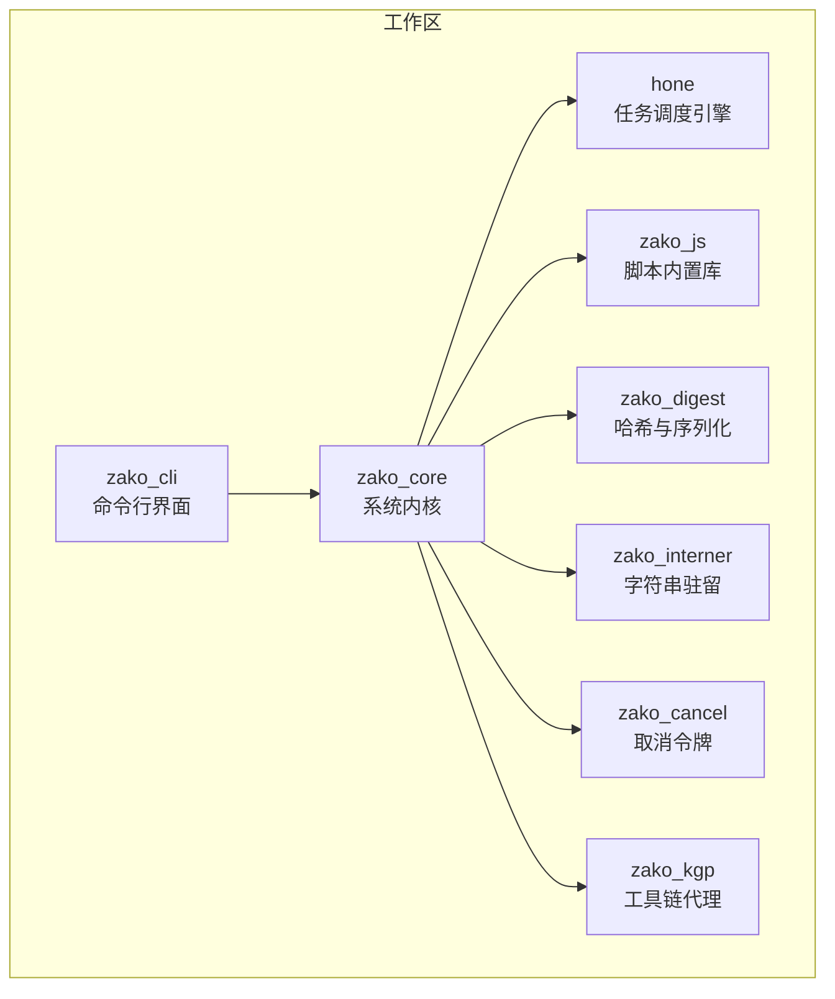
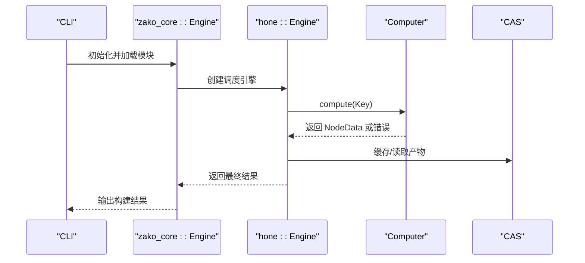
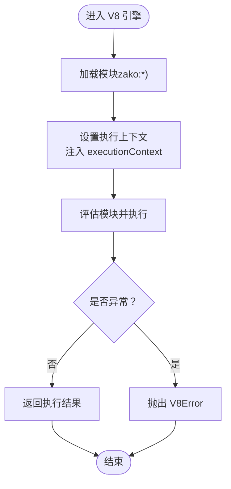
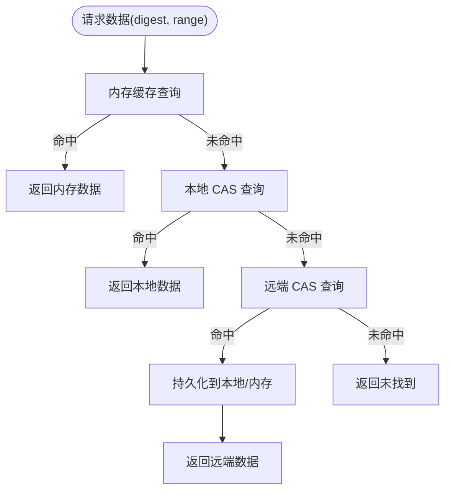
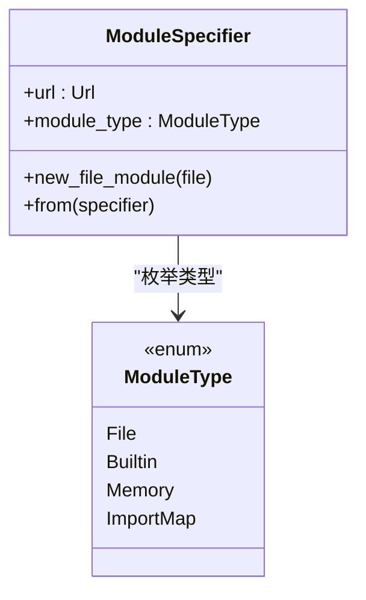
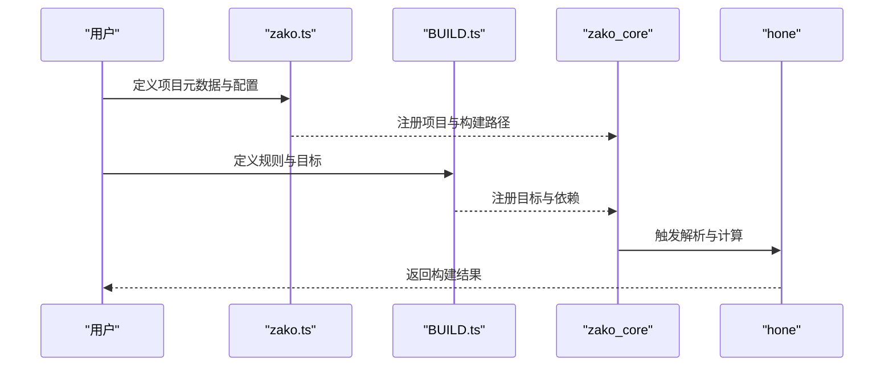
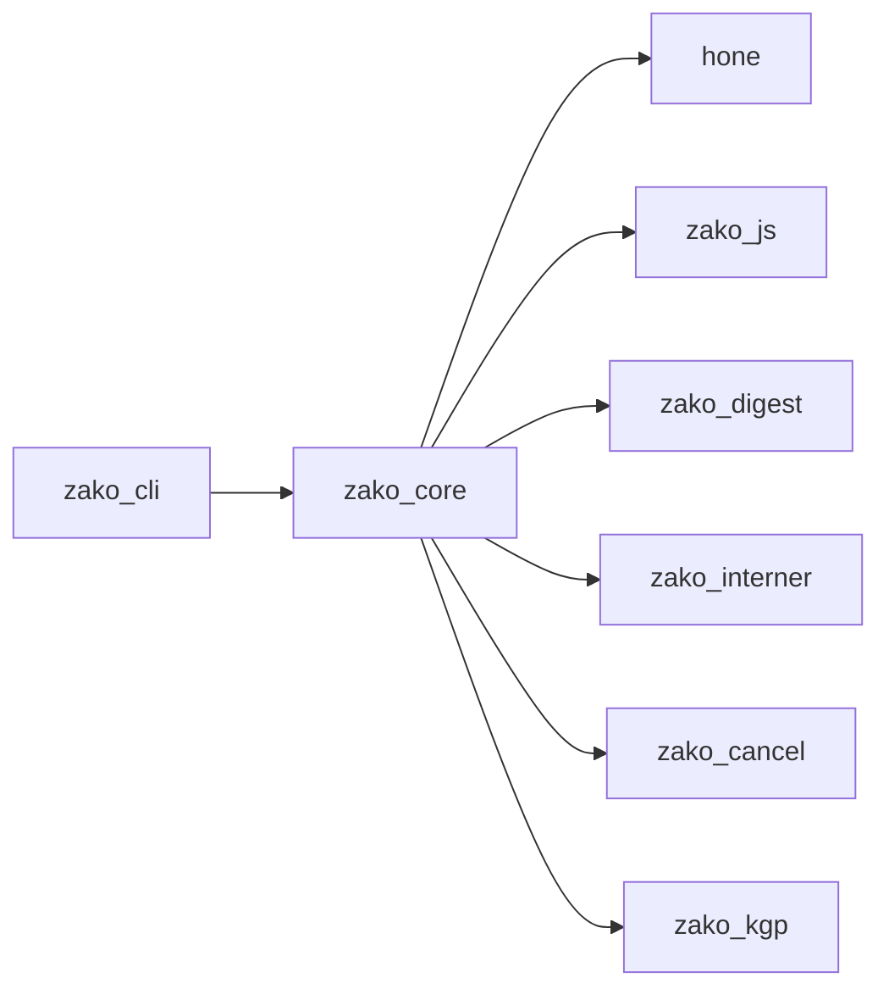

# 项目介绍与愿景

<cite>
**本文引用的文件**
- [README.md](file://README.md)
- [ARCHITECTURE.md](file://ARCHITECTURE.md)
- [Cargo.toml](file://Cargo.toml)
- [zako_core/src/lib.rs](file://zako_core/src/lib.rs)
- [zako_core/src/engine.rs](file://zako_core/src/engine.rs)
- [hone/src/lib.rs](file://hone/src/lib.rs)
- [hone/src/engine.rs](file://hone/src/engine.rs)
- [zako_js/package.json](file://zako_js/package.json)
- [zako_core/src/compute/mod.rs](file://zako_core/src/compute/mod.rs)
- [zako_core/src/module_loader/specifier.rs](file://zako_core/src/module_loader/specifier.rs)
- [zako_core/src/cas.rs](file://zako_core/src/cas.rs)
- [zako_core/src/cas_store.rs](file://zako_core/src/cas_store.rs)
- [zako_core/src/cas_server.rs](file://zako_core/src/cas_server.rs)
- [tests/new_project/zako.ts](file://tests/new_project/zako.ts)
- [tests/log_version/BUILD.ts](file://tests/log_version/BUILD.ts)
- [CONTRIBUTING.md](file://CONTRIBUTING.md)
</cite>

## 目录
1. [引言](#引言)
2. [项目结构](#项目结构)
3. [核心组件](#核心组件)
4. [架构总览](#架构总览)
5. [详细组件分析](#详细组件分析)
6. [依赖分析](#依赖分析)
7. [性能考量](#性能考量)
8. [故障排查指南](#故障排查指南)
9. [结论](#结论)
10. [附录](#附录)

## 引言
Zako 是一个面向多语言、大规模与分布式场景的现代化构建系统。它以“绝对确定性、封闭性、内容寻址存储（CAS）与混合执行模型”为核心理念，结合 Rust 高性能内核与 TypeScript/V8 的灵活脚本能力，提供可扩展、可验证、可远程复用的构建体验。Zako 致力于解决传统构建工具在确定性、可移植性、缓存复用与跨团队协作方面的痛点，为工程效率与质量提供系统级保障。

- 项目愿景与使命
  - 绝对确定性：同样的输入在同样环境下产出同样输出，消除“唯独在我机器上能跑”的问题。
  - 封闭性：构建在受控沙盒中进行，严格限制对外部环境的访问，提升可重复性与安全性。
  - 内容寻址存储：以内容哈希标识一切，原生支持本地与远程缓存，显著提升跨机复用与加速能力。
  - 混合执行模型：Rust 负责高性能内核与协议，TypeScript/V8 负责可读性强、易验证的构建逻辑，二者协同实现高吞吐与高可维护性的平衡。

- 解决的核心问题
  - 传统构建工具常因随机 API、平台差异、路径硬编码导致构建非确定；Zako 通过禁用副作用 API、隔离执行与相对路径寻址，从根本上降低不确定性。
  - 传统工具缓存粒度粗、跨机复用困难；Zako 以 CAS 为基础，结合内容哈希与内存/本地/远程三层缓存，最大化命中率。
  - 多语言项目规则分散、依赖混乱；Zako 以“项目定义 + 目标定义 + 规则 + 工具链”的分层模型，让复杂工程的依赖与流程清晰可见。

- 带来的价值
  - 更快的增量构建与远程缓存复用，缩短开发反馈周期。
  - 更强的一致性与可审计性，便于规模化团队协作与合规要求。
  - 更高的可扩展性：内置规则持续完善，生态可通过共享脚本与工具链扩展。

- 历史背景与开发动机
  - Zako 的设计受到 Bazel、Buck2 与智能合约引擎的启发，强调工程化与可验证性。项目在积极开发中，逐步完善规则、CAS 协议与跨平台沙盒能力，并规划 IDE 支持与分布式调度优化。

- 社区定位
  - 面向追求确定性与可扩展性的工程团队，既适合个人项目快速上手，也适合企业级多语言大型工程的统一构建平台。

**章节来源**
- [ARCHITECTURE.md](file://ARCHITECTURE.md#L5-L14)
- [README.md](file://README.md#L1-L30)

## 项目结构
Zako 采用多 Crate 工作区组织，围绕“内核 + 引擎 + CLI + JS 库 + 工具链”划分职责，形成清晰的层次化架构：

- zako_core：系统内核，负责 V8 运行时管理、模块加载、CAS 协议、沙盒执行与项目解析。
- hone：任务调度引擎，将构建任务建模为 DAG，支持并行与记忆化。
- zako_cli：命令行界面，负责初始化构建环境并触发引擎计算。
- zako_digest：哈希与序列化，定义通用 Protobuf 协议与高性能哈希逻辑。
- zako_js：脚本内置库，提供 TypeScript 类型定义与 API 实现（如 zako:core）。
- zako_interner：字符串驻留池，支撑内容寻址与相对路径的稳定表示。
- zako_cancel：取消令牌，为长耗时任务提供可中断能力。
- zako_kgp：可能用于语言/工具链代理（根据 Cargo.toml）。



**图表来源**
- [Cargo.toml](file://Cargo.toml#L11-L22)

**章节来源**
- [Cargo.toml](file://Cargo.toml#L11-L22)

## 核心组件
- 计算模型与调度引擎（hone）
  - 将构建步骤抽象为 Key 到 Value 的映射，支持并行化与记忆化，天然适配 DAG 依赖图。
  - 提供状态管理、依赖图维护、并发控制与错误传播机制，具备失败快速返回与保持继续等策略。

- V8 脚本运行时与权限分层
  - 通过定制化的 V8 环境，禁用非确定性 API，按“定义层/逻辑层/工具链层”分层限制 IO 权限，确保构建脚本的可验证性与可重复性。

- 内容寻址存储（CAS）与缓存
  - 以内容哈希标识一切，支持本地、内存与远程三层缓存；提供服务端与客户端协议，支撑跨机复用与加速。

- 模块加载与脚本规范
  - 通过“zako:”前缀内置模块与文件模块区分，配合 TypeScript 类型系统，提供清晰的脚本边界与可组合性。

**章节来源**
- [ARCHITECTURE.md](file://ARCHITECTURE.md#L30-L54)
- [hone/src/lib.rs](file://hone/src/lib.rs#L1-L34)
- [zako_core/src/engine.rs](file://zako_core/src/engine.rs#L19-L80)
- [zako_core/src/module_loader/specifier.rs](file://zako_core/src/module_loader/specifier.rs#L5-L26)
- [zako_core/src/cas.rs](file://zako_core/src/cas.rs#L9-L44)

## 架构总览
Zako 的整体架构由“Rust 内核 + TypeScript 脚本 + Hone 引擎 + CAS 缓存 + CLI 交互”构成，形成“确定性执行 + 内容寻址 + 并行调度”的闭环。

```mermaid
graph TB
subgraph "用户层"
CLI["CLI 命令行"]
SCRIPTS["TypeScript 构建脚本<br/>zako.ts / BUILD.ts / *.rule.ts / *.toolchain.ts"]
end
subgraph "执行层"
ENGINE["zako_core::Engine<br/>V8 运行时与模块加载"]
HONE["hone::Engine<br/>DAG 调度与记忆化"]
WORKERS["V8 Worker 池<br/>脚本执行"]
end
subgraph "存储层"
CAS["CAS 接口"]
LOCAL["LocalCas 本地存储"]
REMOTE["远端 CAS 服务"]
MEM["内存缓存"]
end
CLI --> ENGINE
SCRIPTS --> ENGINE
ENGINE --> HONE
ENGINE --> WORKERS
ENGINE --> CAS
CAS <- --> LOCAL
CAS <- --> REMOTE
CAS <- --> MEM
```

**图表来源**
- [ARCHITECTURE.md](file://ARCHITECTURE.md#L16-L27)
- [zako_core/src/engine.rs](file://zako_core/src/engine.rs#L47-L79)
- [hone/src/engine.rs](file://hone/src/engine.rs#L32-L68)
- [zako_core/src/cas.rs](file://zako_core/src/cas.rs#L9-L44)

## 详细组件分析

### Hone 引擎：DAG 调度与记忆化
Hone 引擎将构建任务建模为 Key/Value 映射，通过状态机与依赖图实现并行与记忆化。其核心流程如下：



**图表来源**
- [hone/src/engine.rs](file://hone/src/engine.rs#L306-L409)
- [zako_core/src/engine.rs](file://zako_core/src/engine.rs#L81-L166)

**章节来源**
- [hone/src/engine.rs](file://hone/src/engine.rs#L32-L68)
- [hone/src/engine.rs](file://hone/src/engine.rs#L306-L409)

### V8 引擎：确定性脚本执行
Zako 在 Rust 内核中集成 V8，通过扩展与隔离机制实现确定性执行。关键点包括：
- 禁用非确定性 API，确保时间/随机等副作用可控。
- 多 Isolate 隔离，支持并行与互不影响。
- 分层权限：定义层仅能访问项目元信息；逻辑层禁止 IO；工具链层唯一允许受控 IO。



**图表来源**
- [zako_core/src/engine.rs](file://zako_core/src/engine.rs#L81-L166)

**章节来源**
- [ARCHITECTURE.md](file://ARCHITECTURE.md#L44-L54)
- [zako_core/src/engine.rs](file://zako_core/src/engine.rs#L47-L79)

### CAS 与缓存：内容寻址与远程复用
CAS 以内容哈希标识一切，支持本地、内存与远程三层缓存，提升命中率与跨机复用能力。典型流程如下：



**图表来源**
- [zako_core/src/cas.rs](file://zako_core/src/cas.rs#L9-L44)
- [zako_core/src/cas_store.rs](file://zako_core/src/cas_store.rs#L35-L134)
- [zako_core/src/cas_server.rs](file://zako_core/src/cas_server.rs#L47-L84)

**章节来源**
- [zako_core/src/cas.rs](file://zako_core/src/cas.rs#L9-L44)
- [zako_core/src/cas_store.rs](file://zako_core/src/cas_store.rs#L35-L134)
- [zako_core/src/cas_server.rs](file://zako_core/src/cas_server.rs#L47-L84)

### 模块加载与脚本规范
Zako 通过“zako:”前缀内置模块与文件模块区分，配合 TypeScript 类型系统，提供清晰的脚本边界与可组合性。模块类型包括：
- 文件模块（file://）
- 内置模块（zako:）
- 内存模块（__zako_memory:）
- 导入映射模块（@）



**图表来源**
- [zako_core/src/module_loader/specifier.rs](file://zako_core/src/module_loader/specifier.rs#L27-L39)

**章节来源**
- [zako_core/src/module_loader/specifier.rs](file://zako_core/src/module_loader/specifier.rs#L5-L26)
- [zako_core/src/module_loader/specifier.rs](file://zako_core/src/module_loader/specifier.rs#L41-L107)

### 脚本示例与用法
- 项目定义（zako.ts）：导出项目元信息与配置，支持动态添加构建路径与规则。
- 目标定义（BUILD.ts）：通过规则创建具体构建目标，支持条件配置与依赖管理。



**图表来源**
- [tests/new_project/zako.ts](file://tests/new_project/zako.ts#L7-L22)
- [tests/log_version/BUILD.ts](file://tests/log_version/BUILD.ts#L1-L21)

**章节来源**
- [tests/new_project/zako.ts](file://tests/new_project/zako.ts#L7-L22)
- [tests/log_version/BUILD.ts](file://tests/log_version/BUILD.ts#L1-L21)

## 依赖分析
Zako 的依赖关系围绕“内核能力 + 引擎调度 + 脚本执行 + 缓存协议 + 工具链”展开，耦合度低、内聚性强，便于演进与替换。



**图表来源**
- [Cargo.toml](file://Cargo.toml#L12-L22)

**章节来源**
- [Cargo.toml](file://Cargo.toml#L12-L22)

## 性能考量
- 并行与记忆化：Hone 引擎通过 DAG 与状态机实现并行与记忆化，减少重复计算。
- 缓存分层：内存缓存（小对象）、本地 CAS（大对象）、远程 CAS（跨机复用），按大小与热度选择最优策略。
- I/O 优化：CAS 服务端流式协商与缓冲 I/O，提升吞吐与带宽利用率。
- 确定性执行：禁用非确定性 API 与隔离执行，避免因环境差异导致的回退与重算。

[本节为通用性能讨论，无需列出章节来源]

## 故障排查指南
- V8 执行异常
  - 症状：脚本执行抛出 V8Error。
  - 排查：检查脚本上下文注入与模块加载路径，确认权限分层是否正确。
  - 参考：V8 上下文设置与异常转换逻辑。

- Hone 引擎错误
  - 症状：循环依赖、取消、数据库错误。
  - 排查：检查依赖图构建与状态机流转，确认取消令牌与数据库事务。
  - 参考：引擎状态管理与错误类型。

- CAS 未命中
  - 症状：缓存未命中导致重复下载/计算。
  - 排查：确认 digest 生成与范围参数，检查本地/远程 CAS 配置。
  - 参考：CAS 接口与缓存策略。

**章节来源**
- [zako_core/src/engine.rs](file://zako_core/src/engine.rs#L24-L31)
- [hone/src/engine.rs](file://hone/src/engine.rs#L16-L30)
- [zako_core/src/cas.rs](file://zako_core/src/cas.rs#L9-L44)

## 结论
Zako 以“确定性 + 内容寻址 + 并行调度 + 分层权限”为核心，构建了一个现代化、可扩展、可远程复用的构建系统。它不仅解决了传统工具在一致性与缓存复用上的短板，还通过 TypeScript 脚本与 Rust 内核的协同，兼顾了灵活性与工程化。随着内置规则与分布式能力的完善，Zako 将成为多语言、大规模工程的理想构建平台。

[本节为总结性内容，无需列出章节来源]

## 附录
- 社区贡献
  - 社区贡献指南与图片资源待完善，欢迎参与共建。
- 项目状态
  - Rust 内核与 V8 集成、基础 Hone 引擎、TS 实时转译、内容寻址与标识符解析已完成；内置规则、完整 CAS 协议与跨平台沙盒加固仍在进行中；IDE 支持与分布式调度优化列入未来计划。

**章节来源**
- [CONTRIBUTING.md](file://CONTRIBUTING.md#L1-L6)
- [ARCHITECTURE.md](file://ARCHITECTURE.md#L123-L139)