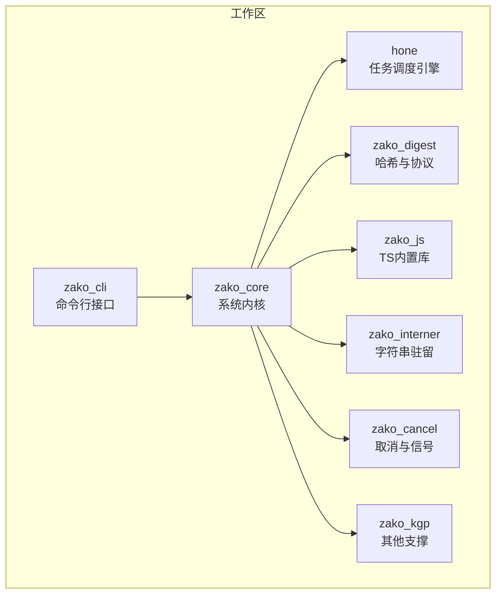
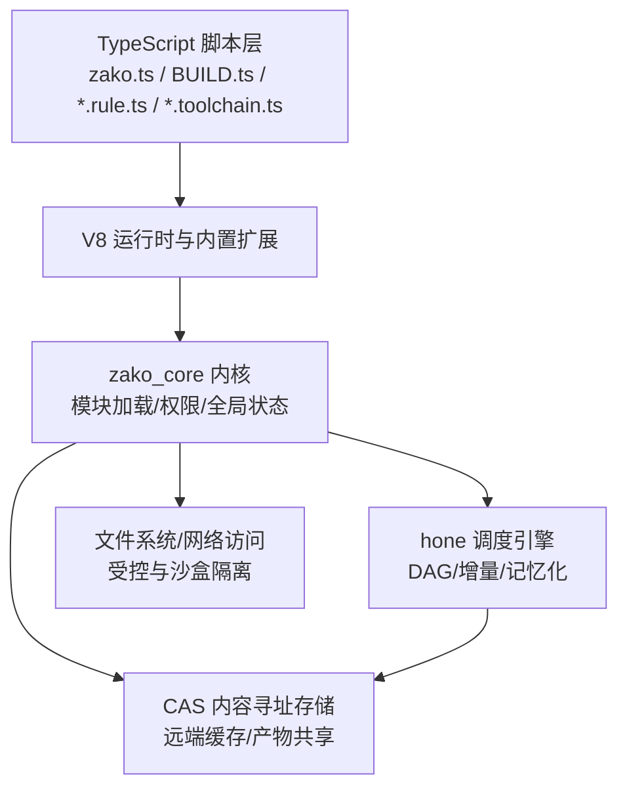
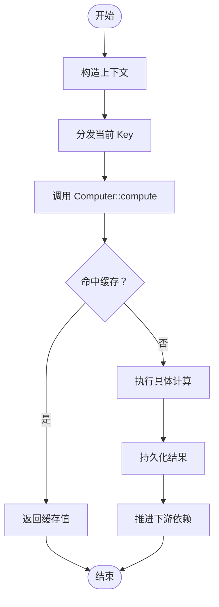
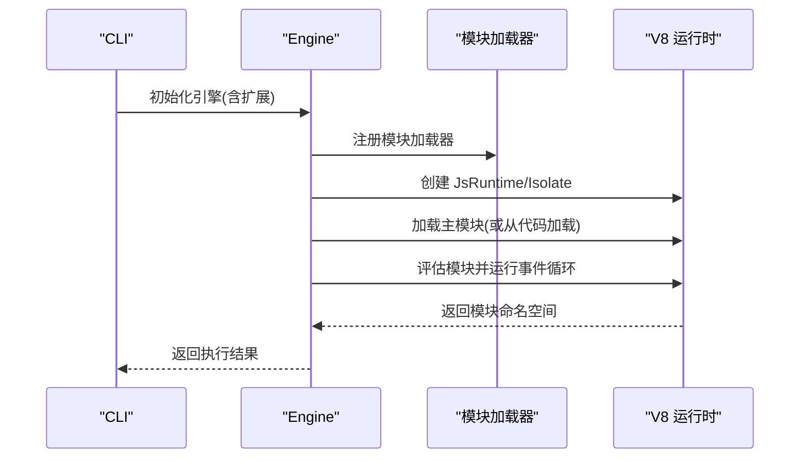
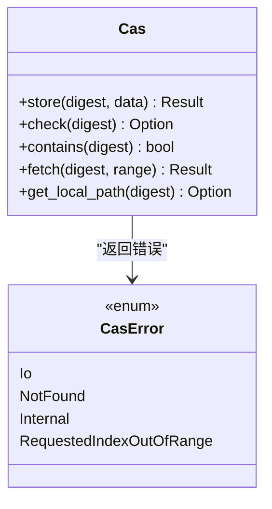
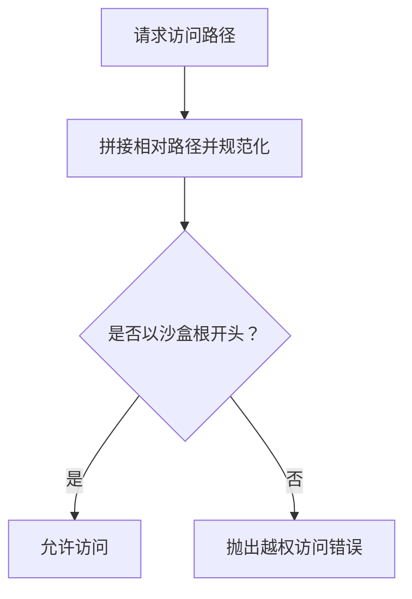
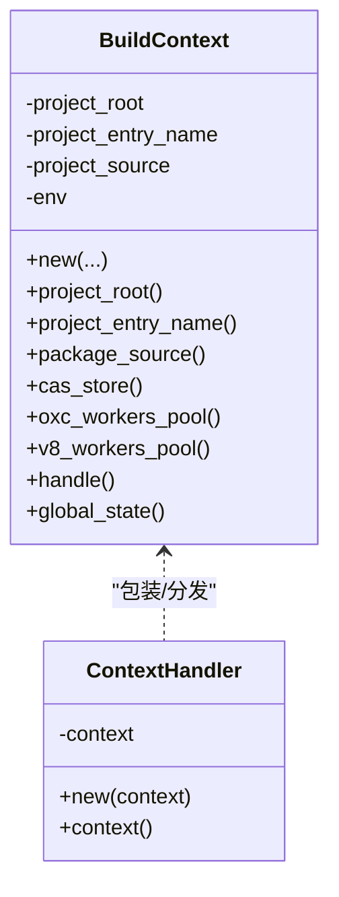
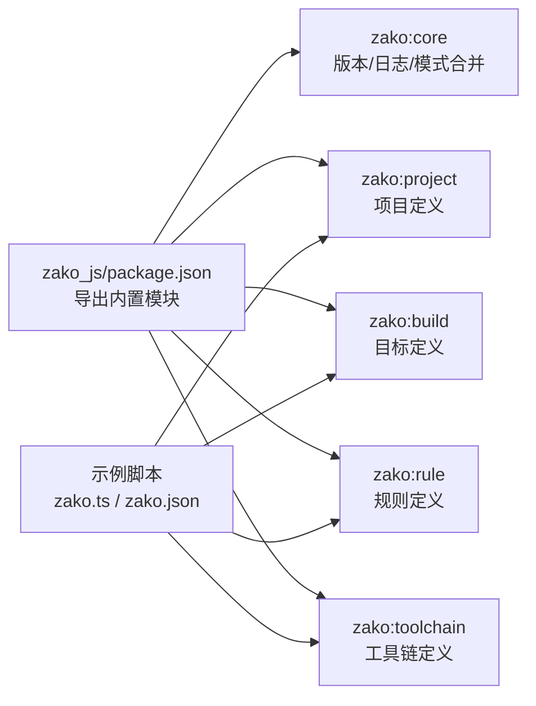
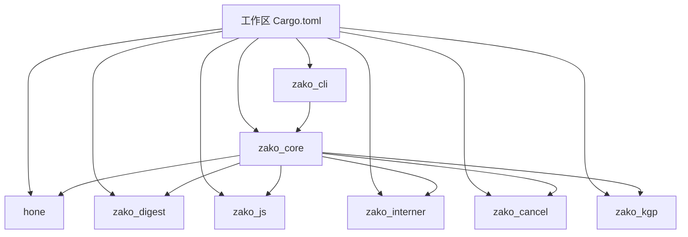

# 项目概述

<cite>
**本文引用的文件**
- [README.md](file://README.md)
- [ARCHITECTURE.md](file://ARCHITECTURE.md)
- [Cargo.toml](file://Cargo.toml)
- [zako_core/src/lib.rs](file://zako_core/src/lib.rs)
- [hone/src/lib.rs](file://hone/src/lib.rs)
- [zako_core/src/engine.rs](file://zako_core/src/engine.rs)
- [zako_core/src/computer.rs](file://zako_core/src/computer.rs)
- [zako_core/src/context.rs](file://zako_core/src/context.rs)
- [zako_core/src/cas.rs](file://zako_core/src/cas.rs)
- [zako_core/src/sandbox.rs](file://zako_core/src/sandbox.rs)
- [tests/new_project/zako.json](file://tests/new_project/zako.json)
- [tests/new_project/zako.ts](file://tests/new_project/zako.ts)
- [zako_js/package.json](file://zako_js/package.json)
- [zako_js/src/builtins/core/index.ts](file://zako_js/src/builtins/core/index.ts)
</cite>

## 目录
1. [引言](#引言)
2. [项目结构](#项目结构)
3. [核心组件](#核心组件)
4. [架构总览](#架构总览)
5. [详细组件分析](#详细组件分析)
6. [依赖关系分析](#依赖关系分析)
7. [性能考量](#性能考量)
8. [故障排查指南](#故障排查指南)
9. [结论](#结论)
10. [附录](#附录)

## 引言
Zako 是一个面向多语言、大规模与分布式场景的现代构建系统。它以“绝对确定性、封闭性、内容寻址存储（CAS）与混合执行模型”为核心理念，结合 Rust 的高性能内核与 TypeScript/V8 的灵活脚本能力，提供可扩展、可复用、可远端缓存与可分布式执行的构建体验。其目标是让团队在复杂工程中也能获得稳定、可重复、可共享的构建结果。

- 项目愿景与定位：面向现代软件工程的下一代构建工具，强调确定性、可移植性与可扩展性。
- 主要特性：远程构建与构建集群、远程缓存（二进制与源码）、强命名体系（项目/目标/工具链）、内容寻址存储（CAS）、混合执行模型（Rust + V8）。
- 差异化优势：以内容寻址与确定性为核心的设计，使远端缓存与分布式执行具备天然基础；通过分层权限与沙盒隔离保障构建过程的封闭性与安全性。

章节来源
- file://README.md#L5-L14
- file://ARCHITECTURE.md#L5-L13

## 项目结构
Zako 采用多 Crate 的工作区组织方式，围绕“内核（zako_core）+ 调度引擎（hone）+ CLI + 语言与协议绑定”的分层架构展开。核心模块职责如下：
- zako_core：系统内核，负责 V8 运行时管理、模块加载、CAS 存储协议、沙盒执行、项目解析与全局状态管理。
- hone：任务调度引擎，将构建任务抽象为 Key/Value 映射，支持 DAG 递归计算与增量记忆化。
- zako_cli：命令行界面，负责初始化构建环境并触发引擎计算。
- zako_digest：哈希与序列化，定义通用 Protobuf 协议与高性能哈希逻辑。
- zako_js：脚本内置库，提供 TypeScript 类型定义与 API 实现（如 zako:core）。
- 其他：zako_interner、zako_cancel、zako_kgp 等支撑模块。

图表来源
- [Cargo.toml](file://Cargo.toml#L11-L22)
- [zako_core/src/lib.rs](file://zako_core/src/lib.rs#L29-L80)

章节来源
- file://Cargo.toml#L11-L22
- file://zako_core/src/lib.rs#L29-L80

## 核心组件
- 任务调度引擎（hone）：以 Key/Value 映射建模构建步骤，支持并行与记忆化，天然适配 DAG。
- 计算器（Computer）：将具体计算逻辑（如文件匹配、包解析、TS 转译、清单解析等）委派给 Hone 上下文执行。
- 引擎（Engine）：封装 V8 运行时与模块加载，提供确定性的脚本执行环境，并注入内置扩展。
- 内容寻址存储（CAS）：以内容哈希标识数据，支持检查、获取、存储与本地路径查询，为远端缓存提供基础。
- 沙盒（Sandbox）：限制文件系统访问边界，防止构建过程越权访问外部资源。
- 构建上下文（BuildContext）：携带项目根、入口名、包来源与全局状态，贯穿整个构建生命周期。

章节来源
- file://hone/src/lib.rs#L12-L34
- file://zako_core/src/computer.rs#L19-L77
- file://zako_core/src/engine.rs#L34-L80
- file://zako_core/src/cas.rs#L9-L44
- file://zako_core/src/sandbox.rs#L8-L26
- file://zako_core/src/context.rs#L30-L44

## 架构总览
Zako 的整体架构由“脚本层（TypeScript/V8）+ 内核层（Rust）+ 存储层（CAS）+ 调度层（Hone）”构成。脚本层负责声明项目元数据、定义构建目标与规则、以及受限的工具链层执行；内核层提供确定性运行时、模块加载、权限控制与全局状态；调度层将任务建模为 DAG 并进行增量计算；存储层以内容寻址提供远端缓存与产物共享。

图表来源
- [ARCHITECTURE.md](file://ARCHITECTURE.md#L44-L54)
- [zako_core/src/engine.rs#L48-L79]
- [zako_core/src/computer.rs#L24-L77]
- [zako_core/src/cas.rs#L9-L44]

章节来源
- file://ARCHITECTURE.md#L44-L54
- file://zako_core/src/engine.rs#L48-L79
- file://zako_core/src/computer.rs#L24-L77
- file://zako_core/src/cas.rs#L9-L44

## 详细组件分析

### 组件一：任务调度引擎（Hone）
- 设计要点：将构建任务抽象为 Key/Value 映射，支持并行与记忆化；通过 DAG 表达依赖关系，天然支持增量计算。
- 数据结构：KeyId、FastMap/FastSet、节点表（nodes/parents/children）等。
- 关键流程：上下文构造 → 任务分发 → 计算器执行 → 结果缓存 → 后续依赖推进。

图表来源
- [hone/src/lib.rs](file://hone/src/lib.rs#L12-L34)
- [zako_core/src/computer.rs](file://zako_core/src/computer.rs#L24-L77)

章节来源
- file://hone/src/lib.rs#L12-L34
- file://zako_core/src/computer.rs#L24-L77

### 组件二：脚本运行时与确定性 V8
- 设计要点：通过内置扩展与权限分层，限制非确定性 API；多 Isolate 隔离，支持并行与安全。
- 执行流程：初始化平台与扩展 → 加载模块 → 设置执行上下文 → 评估模块 → 获取命名空间 → 返回结果。

图表来源
- [zako_core/src/engine.rs#L48-L79]
- [zako_core/src/engine.rs#L81-L109]
- [zako_core/src/engine.rs#L111-L166]

章节来源
- file://zako_core/src/engine.rs#L48-L79
- file://zako_core/src/engine.rs#L81-L109
- file://zako_core/src/engine.rs#L111-L166

### 组件三：内容寻址存储（CAS）
- 接口职责：存储、检查、获取、本地路径查询；错误类型覆盖 IO、未找到、索引越界等。
- 使用场景：构建产物与输入统一以内容哈希标识，支持远端缓存与跨机器共享。

图表来源
- [zako_core/src/cas.rs](file://zako_core/src/cas.rs#L9-L63)

章节来源
- file://zako_core/src/cas.rs#L9-L63

### 组件四：沙盒与访问控制
- 设计要点：通过规范化的路径拼接与 canonicalize，确保访问限定在沙盒根目录之内；提供安全的 join 与访问判断。
- 错误处理：越权访问与 IO 错误均有明确错误类型。

图表来源
- [zako_core/src/sandbox.rs](file://zako_core/src/sandbox.rs#L34-L54)

章节来源
- file://zako_core/src/sandbox.rs#L34-L54

### 组件五：构建上下文与全局状态
- 职责：承载项目根、入口名、包来源与全局状态（Interner、资源池、Tokio 句柄、CAS 存储、工作池等）。
- 设计：BuildContext 与 ContextHandler 提供不可变与可分发的上下文视图，便于并发与跨模块共享。

图表来源
- [zako_core/src/context.rs](file://zako_core/src/context.rs#L30-L44)
- [zako_core/src/context.rs](file://zako_core/src/context.rs#L185-L199)

章节来源
- file://zako_core/src/context.rs#L30-L44
- file://zako_core/src/context.rs#L185-L199

### 组件六：脚本 API 与示例
- zako.js 提供内置模块导出（如 project/build/rule/toolchain），并与 TypeScript 类型系统配合。
- TypeScript 示例展示如何定义项目元数据、添加构建路径与规则。

图表来源
- [zako_js/package.json](file://zako_js/package.json#L8-L24)
- [zako_js/src/builtins/core/index.ts](file://zako_js/src/builtins/core/index.ts#L103-L120)
- [tests/new_project/zako.ts](file://tests/new_project/zako.ts#L7-L22)
- [tests/new_project/zako.json](file://tests/new_project/zako.json#L1-L18)

章节来源
- file://zako_js/package.json#L8-L24
- file://zako_js/src/builtins/core/index.ts#L103-L120
- file://tests/new_project/zako.ts#L7-L22
- file://tests/new_project/zako.json#L1-L18

## 依赖关系分析
- 工作区成员：zako_core、zako_cli、zako_cancel、zako_digest、zako_interner、hone、zako_kgp 等。
- 关键外部依赖：V8、deno_core、tokio、dashmap、moka、tonic/prost 等，分别用于运行时、并发、缓存与 RPC 协议。
- 依赖耦合：内核（zako_core）对调度（hone）、哈希（zako_digest）、JS 内置（zako_js）形成高层依赖；CLI 仅通过内核暴露的接口进行编排。

图表来源
- [Cargo.toml](file://Cargo.toml#L11-L22)

章节来源
- file://Cargo.toml#L11-L22

## 性能考量
- 并行与增量：Hone 的 DAG 与记忆化天然支持并行与增量，减少重复计算。
- 内存与缓存：使用 moka 的并发缓存与 dashmap 的无锁容器，降低锁竞争。
- I/O 优化：CAS 的内容寻址与本地路径查询减少不必要的拷贝与网络往返。
- 运行时：V8 多 Isolate 与确定性 API 限制，避免非确定性带来的重算与缓存污染。
- 线程与事件循环：通过 Tokio 句柄与事件循环协调异步任务，提升吞吐。

## 故障排查指南
- V8/模块加载异常：检查模块加载器配置与内置扩展注册，确认执行上下文设置正确。
- CAS 未命中或越界：确认内容哈希与范围参数，检查 BlobRange 与对象长度一致性。
- 沙盒越权：核对路径拼接与 canonicalize 流程，确保访问限定在沙盒根内。
- 权限与日志：通过 zako:core 的日志 API 输出 trace/debug/info/warn/error，辅助定位问题。

章节来源
- file://zako_core/src/engine.rs#L24-L31
- file://zako_core/src/cas.rs#L46-L63
- file://zako_core/src/sandbox.rs#L19-L25
- file://zako_js/src/builtins/core/index.ts#L121-L135

## 结论
Zako 以“内容寻址 + 确定性 + 混合执行 + 分布式缓存”为核心，构建起一套现代、可扩展、可复用的构建体系。通过 Hone 的任务建模与 zako_core 的内核能力，Zako 在保证构建确定性的同时，提供了强大的远端缓存与分布式执行潜力。对于初学者，建议从脚本 API 与示例入手；对于资深开发者，可深入内核与调度模块，结合 CAS 与沙盒机制实现企业级构建平台。

## 附录
- 使用场景示例（概念性说明）：
  - 多语言项目：通过规则与工具链层定义 C++/Rust/JS 的构建流程，统一由 BUILD.ts 声明目标。
  - 远端缓存：在 CI/CD 中启用 CAS，加速重复构建；在团队内共享产物，降低带宽与时间成本。
  - 分布式构建：结合 Hone 的 DAG 与 CAS，将不同节点的计算任务并行化，按依赖关系推进。
- 技术栈选择动机：
  - Rust：高性能、内存安全、生态丰富（tokio、dashmap、tonic 等）。
  - V8/deno_core：灵活脚本与类型系统，通过内置扩展与权限控制实现确定性。
  - Protobuf/Tonic：标准化传输协议，便于远端缓存与集群通信。
- 应用场景与适用范围：
  - 适用于大型多仓库、多语言混合、CI/CD 集成、跨团队共享的构建需求。
  - 对确定性与可复现性要求高的项目尤为适合。